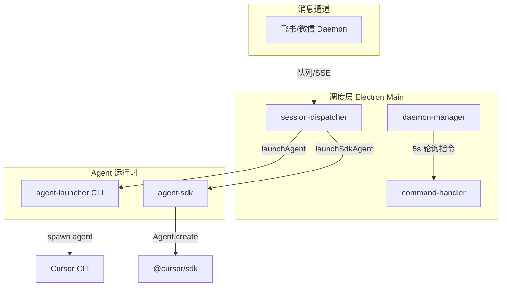
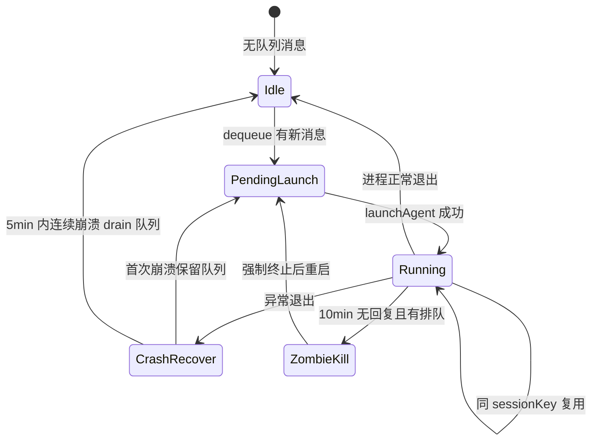
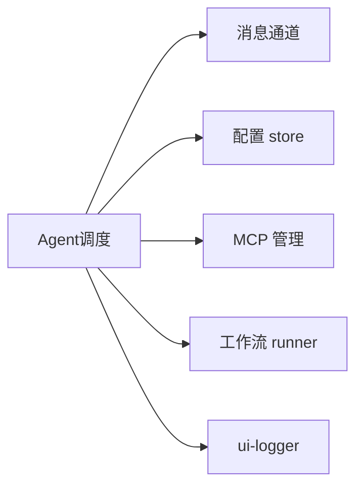

# Agent 调度 · 概览

## 一、模块定位与边界

Agent 调度层连接 Daemon 消息队列与 Cursor Agent（CLI/SDK），实现多会话并行、按需拉起与远程管控。依赖消息通道、配置 store；编排 launcher/sdk/injector。

## 二、整体架构

## 三、核心状态机/主流程

## 四、子模块清单

| 子模块 | 文档 |
|--------|------|
| 多会话模型 | [02](./02-多会话模型.md) |
| 启动与重连 | [03](./03-启动与自动重连.md) |
| 远程指令 | [04](./04-远程指令.md) |
| 定时任务 | [05](./05-定时任务.md) |

## 五、关键约束

同 sessionKey 仅一 Agent；p2p/group（CLI）可 resume；非主用户需 allowOthers；他人/群聊工作目录可在通道配置页选 isolated（按会话隔离）或 specified（指定目录，留空回退主目录）；指令不依赖 Agent 运行。

## 六、术语表

| 术语 | 含义 |
|------|------|
| sessionKey | 主私聊 `chatId::workspaceDir` |
| ChatType | p2p/group/task/temp/workflow |
| resumeScope | `channelId:workspaceDir` → CLI chatId |
| 主用户 | mainUserChatId 匹配的 p2p 发送者 |
| 独立 Agent | 定时任务单独 sessionKey 运行 |
| othersWorkspaceMode | 他人/群聊目录策略：`isolated` 临时隔离 / `specified` 指定路径 |

## 七、依赖关系

## 八、全局非功能与可观测

SSE + 5s 轮询触发调度；Daemon 60s 内最多重启 5 次；SDK 失败 30s 冷却。

## 九、全局已知限制

SDK 无 resume；临时 Agent 用 `/chat new`（可选 `-dir` 指定工作目录，非 README `/run`）；定时任务需应用保持运行。

## 十、文档入口

1. [02-多会话模型](./02-多会话模型.md)
2. [03-启动与自动重连](./03-启动与自动重连.md)
3. [04-远程指令](./04-远程指令.md)
4. [05-定时任务](./05-定时任务.md)

## 十一、变更记录

2026-06-27：通道配置他人/群聊工作目录模式（isolated / specified）。
2026-06-27：补充 temp 会话可选 `-dir` 工作目录。
2026-06-27：kb-sync 初始建立。
