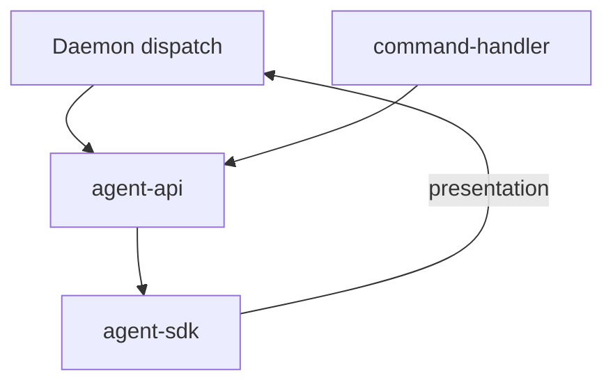

# Agent 调度 · 概览

## 一、模块定位与边界

连接 Daemon 队列与 Cursor Agent（**IM 路径 SDK-only**）。Daemon 编排 claim 并转发 Electron `agent-api`；Electron 负责任务/工作流/斜杠 launch。

## 二、整体架构

## 三、核心状态机/主流程

Idle → claim → launch（首条）→ processing → resident idle → dispatch（连发）→ idle/close。

## 四、子模块清单

[02 多会话](./02-多会话模型.md) · [03 启动](./03-启动与自动重连.md) · [04 指令](./04-远程指令.md) · [05 定时](./05-定时任务.md)

## 五、关键约束

IM **SDK-only**；无 poll；launch 不写盘 inject；`SDK_RESIDENT_AGENT` 默认开。

## 六、术语表

agent-api、residentMode、dispatch、f41Eligible — 见各子模块。

## 七、依赖关系

Agent 调度 → Daemon + config-store + agent-api。

## 八、全局非功能与可观测

dispatch 300ms 防抖；`dispatch_failed` 可检索。

## 九、全局已知限制

合并按钮 T8；admin MCP 待 T10 废弃；T11/T12 未交付。

## 十、文档入口

02 → 03 → 04 → 05

## 十一、变更记录

2026-06-27：Daemon IM 编排、SDK-only（archive 20260627162620）。
