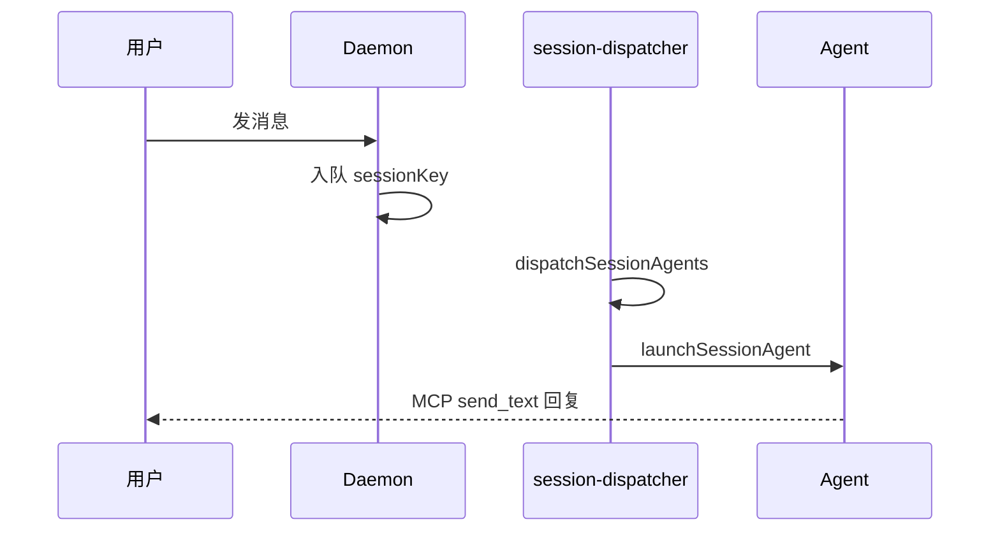

# 多会话模型

## 一、能力范围

定义五类 `ChatType` 会话、sessionKey 规则、工作目录隔离、活跃会话切换与消息路由。不负责 Daemon 入队格式与通道 WebSocket 连接。

## 二、设计决策与取舍

- **sessionKey 含工作目录**：主私聊为 `{chatKey}::{workspaceDir}`，同 chat 换目录即新会话（`makeMainP2pSessionKey`，`agent-launcher.ts`）。
- **主用户判定**：p2p 且 rawChatId 等于通道 `mainUserChatId`（`isMainUser`，`session-dispatcher.ts`）。
- **双运行时并存**：通道绑定 `agentResourceId` 决定 CLI 或 SDK；调度层统一 `isSessionAgentRunning`/`stopSessionAgent`。
- **活跃会话栈**：`/chat new` 创建临时会话时，`previousActiveSessionMap` 记录回退目标，临时结束自动 sync 回主会话。

## 三、服务端规则

| ChatType | 工作目录 | resume | 身份注入 |
|----------|----------|--------|----------|
| p2p（主用户） | 通道/全局主目录 | CLI 是 | digital-identity |
| p2p（他人） | `userData/workspaces/{safeKey}` | CLI 是 | 有 |
| group | 隔离临时目录 | CLI 是 | 有 |
| task | 主目录 | 否 | 有 |
| temp | 主目录 | 否 | 有 |
| workflow | 节点指定目录 | 否 | 跳过 identity |

- 非主用户/非 task/temp/workflow 需 `channel.allowOthers`。
- 模型：`primary`（主/独立任务）或 `others` 场景，可被 `modelOverride` 覆盖。

## 四、客户端流程

**临时会话**：管理员 `/chat new <描述>` → `launchIndependentAgent(temp_*)` → `syncActiveSession` 切换路由 → 结束回退。

**工作流**：`launchWorkflowAgent`，sessionKey=`{chatId}::wf_{instanceId}_{nodeId}`，chatType=`workflow`。

## 五、接口

`launchSessionAgent` / `launchIndependentAgent` / `launchWorkflowAgent` → `{ok, error?}`；`handleChatCommand` 管理 `/chat`；`getSessionAgentList` 合并 CLI+SDK。

## 六、数据

- **配置**：`AppConfig.mainChatIds`（scope→chatId）、通道 `mainUserChatId`/`mainUserNewSession`/`allowOthers`。
- **内存**：`sessionAgents`（CLI）、`sdkSessions`（SDK）、`chatNameCache`、`previousActiveSessionMap`。
- **chatKey 格式**：`channelId|rawChatId`（`parseChatKey`）。

## 七、非功能与可观测

群名/用户名异步拉取；启动前推送等待提示；启动失败 drain 排队消息。

## 八、推送

无（回复经 Daemon MCP `send_text`）。

## 九、已知限制与 TODO

- SDK 会话 pid 恒为 0，UI 仅展示 agentId。
- 群聊 sessionKey 通常不含 `::` 后缀（与主私聊不同）。
- README `/run` 与实现 `/chat new` 不一致。

## 十、变更记录

2026-06-27：kb-sync 初始建立。
