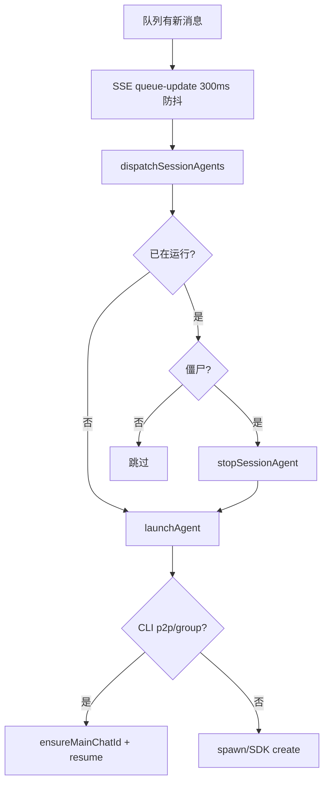

# 启动与自动重连

## 一、能力范围

Agent 进程拉起（CLI spawn / SDK `Agent.create`）、Prompt 构建、工作区注入、`--resume` 上下文、队列驱动调度、崩溃自愈与僵尸检测。不负责 Cursor CLI 安装与 OAuth 登录 UI。

## 二、设计决策与取舍

- **CLI 优先 resume**：仅 p2p/group 且绑定 `resumeScope`；`create-chat` 懒创建 chatId 写入 `mainChatIds`（`agent-launcher.ts`）。
- **newSession 模式**：通道 `mainUserNewSession` 清空 scope 映射，每次不 resume。
- **Prompt 前缀**：主/工作流用「工作流规则 cursor-claw」；他人会话附加 digital-identity（`buildPrompt`）。
- **CLI 参数**：`--print --force [--resume id] --approve-mcps --workspace DIR --trust [--model M] prompt`。
- **SDK 默认模型**：空/auto → `composer-2`；需通道 API Key，sandbox 关闭。
- **保活策略分流**：SDK 路径依赖工作区规则 `cursor-claw.mdc` 阶段 4 — 非阻塞 `poll-message?wait=false` + `sleep 5` 循环，避免单次 blocking poll 挂起导致 Run 超时；CLI 路径仍可使用默认 blocking poll（25min SYSTEM OVERRIDE）。

## 三、服务端规则

1. `dispatchSessionAgents`：遍历队列 session，已运行则跳过（或僵尸 kill）。
2. 主用户 p2p 传 `useMainWorkspace=true`。
3. 启动前 `injectWorkspaceToDir`（rules/skills/identity）。
4. 进程 close 回调 `handleSessionClosed`：异常退出通知主用户；5min 内连续崩溃 drain 队列。
5. CLI gRPC `[unavailable]` 时提示登录/网络/代理问题。

## 四、客户端流程

**自动重连**：Agent 退出后队列消息保留（首次崩溃）；调度循环/SSE 再次拉起。主用户收到退出通知。

## 五、接口

| 入口 | 说明 |
|------|------|
| `launchAgent(opts)` | CLI 核心启动 |
| `launchSdkAgent(opts)` | SDK 启动 + stream |
| `checkAgentLoggedIn()` | CLI whoami 缓存 |
| `loginCli()` | agent login 浏览器授权 |
| `ensureAgentBinary()` | PATH 刷新 + 二进制发现 |
| `initSessionDispatcher()` | 注册 closeHandler |

**CLI 发现**：macOS/Linux 用 `agent` 命令；Windows 读 `%LOCALAPPDATA%/cursor-agent/versions`（`agent-cli.ts`）。

## 六、数据

- `mainChatIds[channelId:workspaceDir] = chatId`
- `LaunchAgentOptions`：sessionKey, chatType, workspaceDir, resumeScope, model, newSession
- 环境变量：`CURSOR_INVOKED_AS=agent`、`LARK_WORKSPACE_DIR`、代理键

## 七、非功能与可观测

pendingLaunches 防双启；SDK 日志 400 字符聚合；僵尸判定 >10min 无回复；会话状态区分 cli/sdk。

## 八、推送

无。

## 九、已知限制与 TODO

- SDK 无 resume，每次 `agent.send` 新 Run。
- Windows spawn 需 `quoteArg` 与 shell 模式。
- CLI 登录超时 120s。

## 十、变更记录

- 2026-06-27：SDK 非阻塞保活 vs CLI blocking poll 策略差异
- 2026-06-27：kb-sync 初始建立
