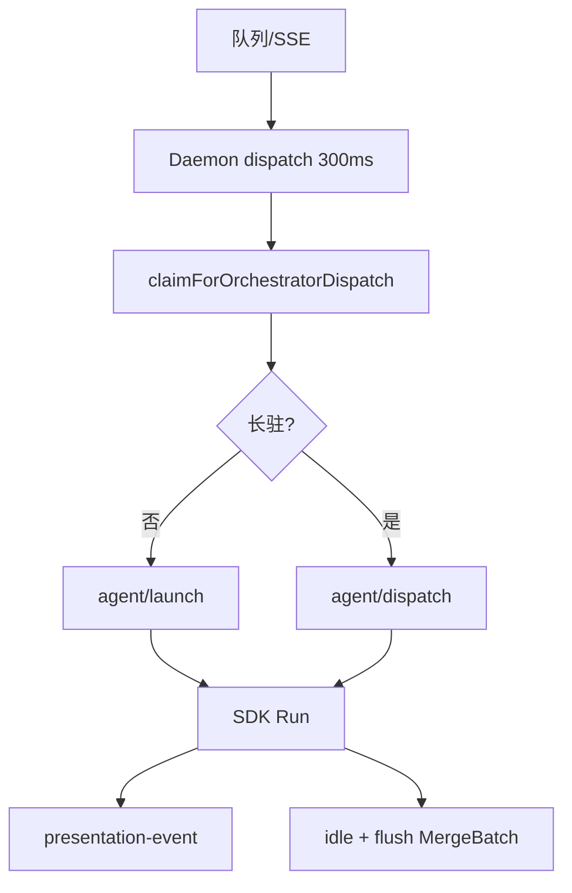

# 启动与自动重连

## 一、能力范围

Agent 进程拉起（**IM 路径 SDK `Agent.create`**、任务路径 CLI/SDK）、Prompt 构建、队列驱动调度（**Daemon 编排**）、崩溃自愈。不负责 Cursor CLI 安装 UI。

## 二、设计决策与取舍

- **IM SDK-only（T7）**：Daemon `runAgentDispatchLoop` claim 后 `POST /api/agent/launch`；无 CLI IM spawn、**无 poll-message 保活**。
- **长驻 Agent（T6）**：`SDK_RESIDENT_AGENT` 默认开；`completeSdkRun` resident 模式保留实例并 `reportSessionAgentPhase(idle)`；二次任务 `dispatchToSdkAgent`。
- **无 launch 注入（T1）**：`injectWorkspaceToDir` no-op；launch 路径禁止写 `~/.cursor`/项目 rules。
- **Presentation 出站（T3）**：SDK `handleSdkEvent` → `postPresentationEvent`（tool/thinking/assistant）；非 eligible 仍 `appendSdkLog`。
- **任务/工作流**：`session-dispatcher.launchAgent` 仍可用 CLI；`dispatchSessionAgents` 空实现（IM 已迁 Daemon）。

## 三、服务端规则

1. Daemon：distinct sessions → `dispatchSessionToAgent` → claim → launch（首条）或 dispatch（长驻）。
2. launch 失败：notify 用户 + ack claimed（R3）。
3. SDK 默认模型空/auto → `composer-2`；需通道 API Key。
4. 进程 close：`handleSessionClosed` 异常退出通知；5min 内连续崩溃 drain 队列（任务路径）。

## 四、客户端流程

## 五、接口

| 入口 | 说明 |
|------|------|
| Daemon `POST /api/agent/launch` | 转发 Electron agent-api |
| Daemon `POST /api/agent/dispatch` | 长驻二次 send |
| `launchSdkAgent(opts)` | SDK 首次 create + send |
| `dispatchToSdkAgent(sessionKey, text)` | 长驻 dispatch |
| `launchAgent(opts)` | 任务/CLI 路径 |
| `dispatchSessionAgents()` | **空实现**（兼容） |

## 六、数据

- `agent-api-port.json`：`{ port }` 于 userData。
- `LaunchAgentOptions` / `SdkSessionAgent`：sessionKey、chatType、residentMode 等。

## 七、非功能与可观测

- pendingLaunches 防双启；SDK 日志聚合。
- `dispatch_failed` / `agent_failed` 可检索。
- `SDK_RESIDENT_AGENT=0` 回退 Run 结束 close。

## 八、推送

无。

## 九、已知限制与 TODO

- SDK 无 resume；长驻靠同实例连续 send（行为须 spike 验证）。
- CLI 路径仍可用于定时/工作流；IM 不再 spawn CLI。
- Windows spawn 需 `quoteArg`。

## 十、变更记录

2026-06-27：SDK-only IM、长驻 Agent、废弃 poll 保活、无 inject（archive 20260627162620）。
2026-06-27：SDK 非阻塞保活 vs CLI blocking poll（后者 IM 路径已移除）。
2026-06-27：kb-sync 初始建立。
