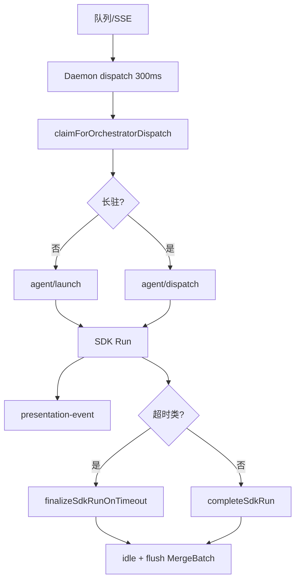

# 启动与自动重连

## 一、能力范围

Agent 进程拉起（**IM 路径 SDK `Agent.create`**、任务路径 CLI/SDK）、Prompt 构建、队列驱动调度（**Daemon 编排**）、崩溃自愈。不负责 Cursor CLI 安装 UI。

## 二、设计决策与取舍

- **IM SDK-only（T7）**：Daemon `runAgentDispatchLoop` claim 后 `POST /api/agent/launch`；无 CLI IM spawn、**无 poll-message 保活**。
- **长驻 Agent（T6）**：`SDK_RESIDENT_AGENT` 默认开；非超时 Run 结束 `completeSdkRun` 保留实例 + idle；二次 `dispatchToSdkAgent`。**超时类**走 `finalizeSdkRunOnTimeout`（cancel/abort→清 run→一次 notify→idle），长驻删 session 后 launch 重建；**不写** `failedCooldowns`。Daemon M7 claim 须 processing→idle。
- **多轮 Run 上下文（resident）**：同 Agent 实例跨 Run 累积上下文；接近上限由 harness 默认压缩。`launchSdkAgent`/`dispatchToSdkAgent` send 前 `evaluatePreSendContextPressure` 只读打 `[compression] pre-send usage`（≥85% limit，不阻断 send）；turn-ended 同阈值打 `high-watermark`（`context-usage-pressure.ts`）。
- **多轮稳定性降故障（v1.8.8 增量）**：`launchSdkAgent` 与 `dispatchToSdkAgent` 均先 `acquireRunGuard`，保证同一 `sessionKey` 单飞；`sendWithRetry` 仅对 retryable 错误退避重试，`agent_busy` 透传 `retry_after` 交由 Daemon 延后重排。
- **ContextRotation-lite**：`usageRatio >= 90%` 且连续 2 次命中时触发，冷却 3 分钟；轮转采用“先建新 Agent 成功后再切换并 best-effort 关闭旧实例”，新建失败保持旧会话可继续 dispatch。
- **失败可读 notify**：非超时 Run error 经 `sdk-failure-messages.formatUserSdkFailureMessage`（超时→上下文→会话→安全 message→带建议兜底；禁止仅「请稍后重试」）；见 `electron/AGENTS.md`。
- **无 launch 注入（T1）**：`injectWorkspaceToDir` no-op；launch 路径禁止写 `~/.cursor`/项目 rules。
- **Presentation 出站（T3）**：SDK `handleSdkEvent` → `postPresentationEvent`（tool/thinking/assistant）；非 eligible 仍 `appendSdkLog`。
- **任务/工作流**：`session-dispatcher.launchAgent` 仍可用 CLI；`dispatchSessionAgents` 空实现（IM 已迁 Daemon）。

## 三、服务端规则

1. Daemon：distinct sessions → `dispatchSessionToAgent` → claim → launch（首条）或 dispatch（长驻）。
2. launch 失败：命中 `agent_busy` 时按 `retry_after` 延后重排且不 ack；非 busy 失败才 notify 用户 + ack claimed。
3. SDK 默认模型空/auto → `composer-2`；需通道 API Key。
4. 进程 close：`handleSessionClosed` 异常退出通知；5min 内连续崩溃 drain 队列（任务路径）。
5. Run 超时：ERROR/EXPIRED 或 `isRunTimeoutFailure` → `finalizeSdkRunOnTimeout`；`completeSdkRun` 对已 finalizing session 幂等跳过。
6. 非超时 error：仍写 `failedCooldowns`、长驻保留实例。
7. watchdog 统一超时收敛：`watchRunGuard` 超时后执行 `run.cancel + run.wait`，再进入 `finalizeSdkRunOnTimeout`，避免悬挂 Run 长时间占用会话。

## 四、客户端流程

## 五、接口

| 入口 | 说明 |
|------|------|
| Daemon `POST /api/agent/launch` | 转发 Electron agent-api |
| Daemon `POST /api/agent/dispatch` | 长驻二次 send |
| `launchSdkAgent(opts)` | SDK 首次 create + send |
| `dispatchToSdkAgent(sessionKey, text)` | 长驻 dispatch |
| `launchAgent(opts)` | 任务/CLI 路径 |
| `dispatchSessionAgents()` | **空实现**（兼容） |

## 六、数据

- `agent-api-port.json`：`{ port }` 于 userData。
- `LaunchAgentOptions` / `SdkSessionAgent`：sessionKey、chatType、residentMode 等。

## 七、非功能与可观测

- pendingLaunches 防双启；SDK 日志聚合；`finalizeSdkRunOnTimeout` WARN 含 trigger/durationMs。
- 压缩可观测：`[compression] pre-send usage` / `high-watermark`（UI 日志）；失败 notify 组装 peak/limit 与 `errorCode`/`run.result` 归因。
- 多轮调度可观测：`dispatch_retry`（attempt/reason/delay）、`watchdog`（heldMs/结束态）、`context_rotation`（skipped/rotated）统一写 SDK UI 日志。
- `dispatch_failed` / `agent_failed` 可检索；`SDK_RESIDENT_AGENT=0` 回退 Run 结束 close。

## 八、推送

无。

## 九、已知限制与 TODO

- SDK 无 resume；长驻靠同实例连续 send（行为须 spike 验证）。
- CLI 路径仍可用于定时/工作流；IM 不再 spawn CLI。
- Windows spawn 需 `quoteArg`。
- `SDK_RESIDENT_AGENT=0`（非默认）仍走非长驻分支，稳定性策略覆盖以默认长驻模式为主。
- ContextRotation-lite 当前使用固定摘要模板，后续可接入真实摘要生成以降低语义丢失风险。

## 十、变更记录

2026-06-27：SDK-only IM、长驻 Agent、废弃 poll 保活、无 inject（archive 20260627162620）。
2026-06-27：SDK 非阻塞保活 vs CLI blocking poll（后者 IM 路径已移除）。
2026-06-27：kb-sync 初始建立。
2026-06-28：Run 超时 finalizer 自动收尾、长驻超时删 session、跳过 cooldown（archive 20260628163149）。
2026-06-28：多轮 Run pre-send/高水位压缩可观测、失败 notify 可读归因（archive 20260628165558）。
2026-06-28：RunGuard 单飞、retryable 退避、ContextRotation-lite 与 launch/dispatch busy 延后重排（archive 20260628184232）。
