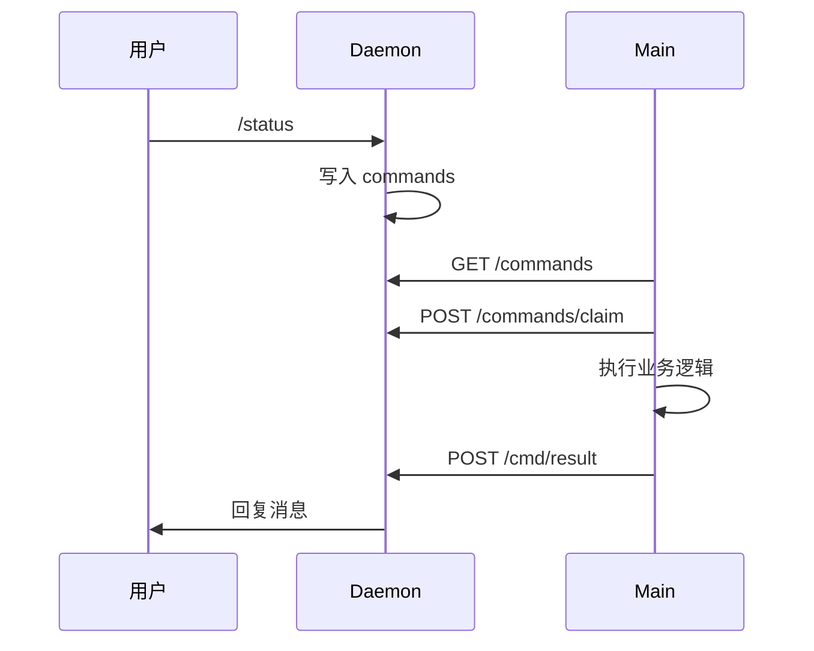

# 远程指令

## 一、能力范围

飞书/微信 `/` 指令：Daemon 写命令文件，Main 5s 轮询 claim 执行并回报。

## 二、设计决策与取舍

- **与 Agent 解耦**：`checkAndExecutePendingCommands` 在 `daemon-manager` 状态轮询中运行，Agent 未运行也可执行。
- **权限二分**：`isMainUser` 为管理员；非管理员仅 `/status` `/stop`(本会话) `/reset` `/help`。
- **结果回报**：`POST /cmd/result`。
- **通道上下文**：`/model` 等按 chatId 解析所属通道。

## 三、服务端规则

指令 claim 后按首 token 路由（不区分大小写）。管理员指令拒绝对非主用户返回「🔒 该指令仅管理员可用」。

| 指令 | 权限 | 行为摘要 |
|------|------|----------|
| `/stop` | 全部 | 管理员停全部 Agent；他人停本会话 |
| `/status` | 全部 | Daemon/Agent/队列/定时任务统计 |
| `/reset` | 全部 | 停会话 Agent + 清空 resume chatId |
| `/help` | 全部 | 列出可用指令 |
| `/list` | 管理员 | 队列消息（他人仅本 chat） |
| `/clean` | 管理员 | 清空队列 |
| `/restart` | 管理员 | 停 Agent、清队列、重启 Daemon |
| `/workspace` | 管理员 | info / set 切换工作目录 |
| `/model` | 管理员 | ls/info/set（CLI 或 SDK 列表） |
| `/mcp` | 管理员 | ls/info/enable/disable/add/delete |
| `/task` | 管理员 | CRUD + run/stop/start |
| `/workflow` `/wf` | 管理员 | ls/info/run/status/delete |
| `/chat` | 管理员 | ls/序号切换/stop/new 临时会话 |

## 四、客户端流程

## 五、接口

- **Daemon HTTP**：`/commands`、`/commands/claim`、`/cmd/result`
- **子处理器**：`handleFeishuModelCommand`、`handleFeishuMcpCommand`、`handleFeishuTaskCommand`、`handleFeishuWorkflowCommand`、`handleChatCommand`
- **/model set**：`updateChannel(id, {model, modelParams})`，下次启动生效
- `/task run`：`independent!==false` → 独立 Agent，否则入主队列。

## 六、数据

- 命令文件结构：`FileCommand { id, command, messageId, chatId?, chatType? }`
- `/reset` 清空 `mainChatIds[mainChatScopeKey(channelId, wsDir)]`
- MCP 操作读写全局/项目 `mcp.json`（`mcp-manager`）

## 七、非功能与可观测

指令执行写日志；异常仍尝试 reply；`/model ls` 调 CLI `--list-models` 或 SDK API。

## 八、推送

无。

## 九、已知限制与 TODO

- 未知指令返回「😅 未知指令」。
- README 写 `/task trigger`，实现为 `/task run <序号>`。
- `/run` 未实现，临时 Agent 用 `/chat new`。

## 十、变更记录

2026-06-27：kb-sync 初始建立。
