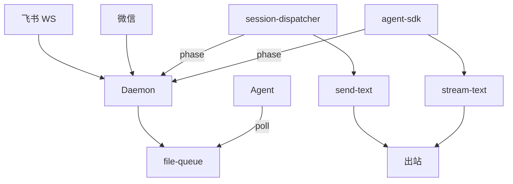
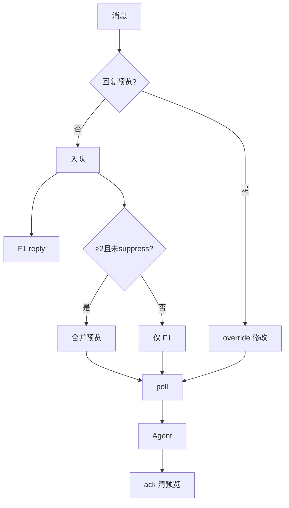

# 消息桥接 · 概览

## 一、模块定位与边界

消息桥接是 Daemon 的**外部消息入口与出口**：飞书/微信收消息，经 file-queue 投递 Agent；Agent 经 `send-*`/`stream-text` 回写。飞书私聊额外提供 **F1 阶段反馈**、**F2 合并预览**、**F3 回复修改**。

**边界**：凭据在 Electron；指令在入队前拦截（`.fcmd`），见 Agent 调度域。

## 二、整体架构

## 三、核心状态机/主流程

三态：**已收到**（F1）→ **处理中**（启动/Agent + Get/typing）→ **完成**（ack + DONE）。飞书私聊多条待领取可发合并预览；回复预览可改待领取全文。

## 四、子模块清单

| 子模块 | 文档 | 职责 |
|--------|------|------|
| 飞书通道 | [02-飞书通道.md](./02-飞书通道.md) | CardKit、合并预览、F3 |
| 微信通道 | [03-微信通道.md](./03-微信通道.md) | iLink、typing |
| 队列与路由 | [04-消息队列与路由.md](./04-消息队列与路由.md) | F1、phase API、override |

## 五、关键约束

- `sessionKey = chatKey` 或 `chatKey::workspaceDir`；poll 必填 sessionKey。
- F1 按 Agent 阶段 + pending 组合文案。
- 预览仅飞书私聊 SDK；≥2 条待领取；processing/claimed/流式时抑制。
- 流式仅主用户私聊 SDK；三态 notify 不 ack/stop。

## 六、术语表

| 术语 | 含义 |
|------|------|
| AgentPhase | starting/processing/idle；electron phase POST |
| MergePreviewState | mergeId、mergedText、previewMessageIds |
| MG-id | `MG-{profile}-{YYYYMMDDHHmmss}`，批次标识 |
| getSessionUnclaimedCount | 仅 `.qmsg` |
| f41Eligible | 主用户 p2p + SDK |
| sessionGetReactedIds | 已打 Get 的 inbound id |

## 七、依赖关系

## 八、全局非功能与可观测

- 流式节流 daemon 500–1500ms；SDK 400ms。
- 预览 debounce 500ms；phase 丢失 F1 靠 `.claimed` 兜底。
- SSE `/api/queue-events`。

## 九、全局已知限制

- Get/DONE 仅飞书。
- 预览/F3 仅飞书私聊；端到端联调待补。
- CardKit 需权限与客户端 7.20+。

## 十、文档入口

1. [02-飞书通道.md](./02-飞书通道.md) 2. [03-微信通道.md](./03-微信通道.md) 3. [04-消息队列与路由.md](./04-消息队列与路由.md)

## 十一、变更记录

2026-06-27：F1/合并预览/F3（archive 20260627150041）。
2026-06-27 Rev1：CardKit 流式；streamPostChain。
2026-06-28：三态进度、stream-text（archive 20260627113111）。
