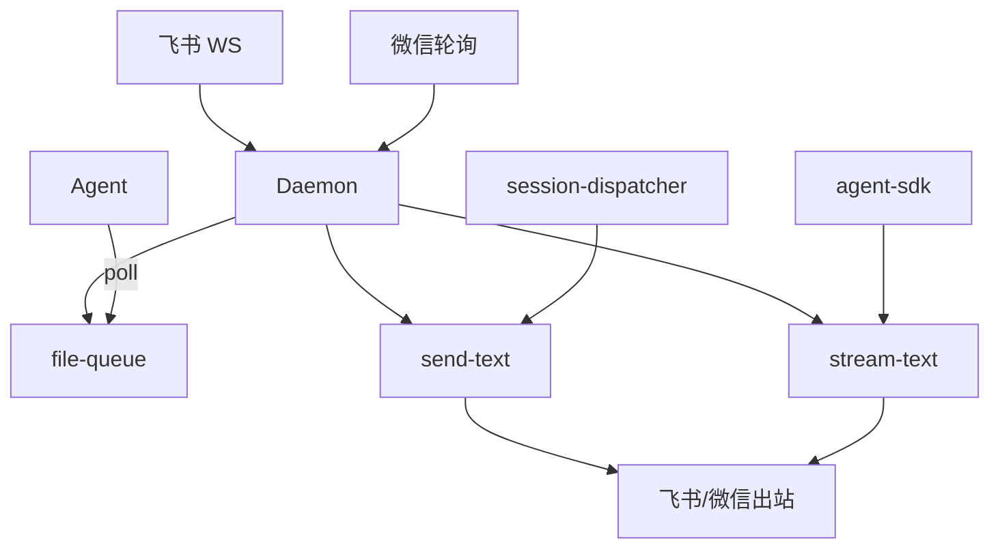
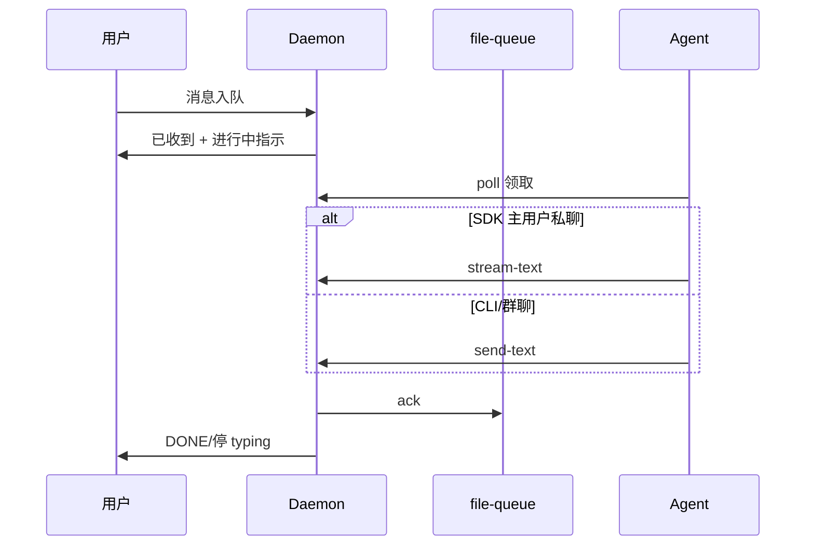

# 消息桥接 · 概览

## 一、模块定位与边界

消息桥接是 Daemon 的**外部消息入口与出口**：飞书 WebSocket、微信 iLink 长轮询收消息，经 file-queue 投递 Agent；Agent 经 `send-*` / `stream-text` 回写通道。

**边界**：凭据在 Electron `MessageChannel`；指令/工作流在入队前拦截（`.fcmd`），见 Agent 调度域。

## 二、整体架构

## 三、核心状态机/主流程

三态：**已收到**（入队 reply）→ **处理中**（冷启动/Agent 处理中 + Get 或 typing）→ **完成**（ack + DONE/停 typing）。主用户私聊 SDK 可走 stream-text 单条 outbound 持续更新。

## 四、子模块清单

| 子模块 | 文档 | 职责 |
|--------|------|------|
| 飞书通道 | [02-飞书通道.md](./02-飞书通道.md) | WS、LarkSender、表情与流式 PATCH |
| 微信通道 | [03-微信通道.md](./03-微信通道.md) | iLink、进度 typing |
| 队列与路由 | [04-消息队列与路由.md](./04-消息队列与路由.md) | 入队确认、stream-text、路由 |

## 五、关键约束

- `sessionKey = chatKey` 或 `chatKey::workspaceDir`；`poll-message` 必填 sessionKey。
- 入队确认：`pushToFileQueue` 成功且 messageId 非 `internal_*` 时 reply「已收到，正在处理」。
- 流式仅**主用户私聊 SDK**；群聊/CLI 用一次性 send-text。
- 三态 notify 不带 `message_id`/`stop_progress`，不 ack/stop。

## 六、术语表

| 术语 | 含义 |
|------|------|
| SessionProgressState | daemon 内存 Map，typing/Get 与流式 outbound |
| f41Eligible | 主用户 p2p + SDK，可走 stream-text |
| sessionGetReactedIds | inbound messageId 已打 Get，poll 去重 |

## 七、依赖关系

## 八、全局非功能与可观测

- 流式节流：`STREAM_TEXT_THROTTLE_MS` 500–1500（daemon）；SDK 侧 400ms 发包间隔。
- SSE `/api/queue-events`；`/api/status` 汇总连接态。

## 九、全局已知限制

- Get/DONE 仅飞书；微信用 typing。
- SDK stream final 暂未传 inbound message_id，ack 可能依赖后续 send_text。
- 联调项（≤3s 确认、首段 ≤10s）待验证。

## 十、文档入口

1. [02-飞书通道.md](./02-飞书通道.md) 2. [03-微信通道.md](./03-微信通道.md) 3. [04-消息队列与路由.md](./04-消息队列与路由.md)

## 十一、变更记录

2026-06-28：入队确认、三态进度、stream-text（archive 20260627113111）。
2026-06-27：kb-sync 初始建立。
