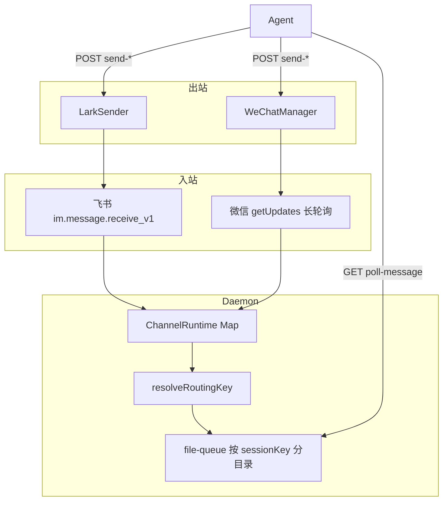
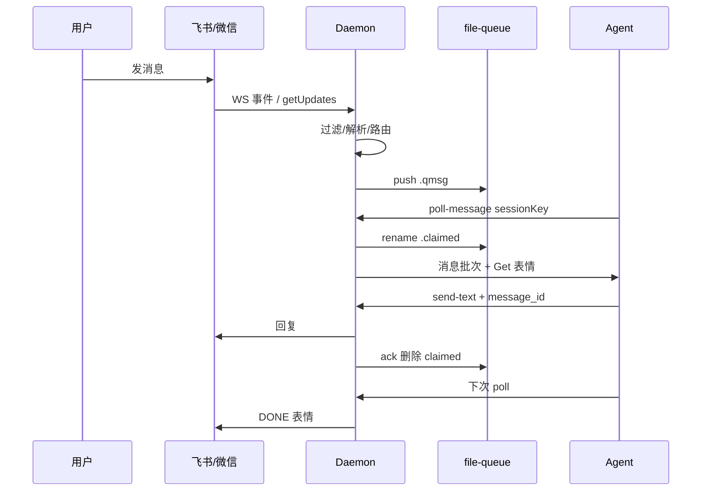
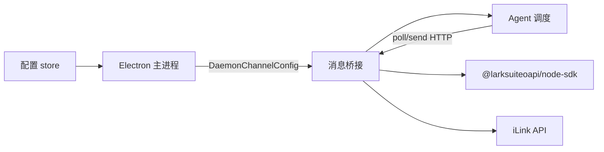

# 消息桥接 · 概览

## 一、模块定位与边界

消息桥接是 Daemon 的**外部消息入口与出口**：飞书 WebSocket 长连接、微信 iLink 长轮询接收用户消息，经 file-queue 投递 Agent；Agent 通过 `send-*` API 与 MCP 工具回写对应通道。

**边界**：凭据与通道配置在 Electron `MessageChannel`；Agent 资源绑定在 `agentResourceId`；工作流/定时任务/指令系统在入队前拦截或走独立队列（`.fcmd`），细节见 Agent 调度域。

## 二、整体架构

## 三、核心状态机/主流程

## 四、子模块清单

| 子模块 | 文档 | 职责 |
|--------|------|------|
| 飞书通道 | [02-飞书通道.md](./02-飞书通道.md) | WebSocket、LarkSender、权限与消息解析 |
| 微信通道 | [03-微信通道.md](./03-微信通道.md) | iLink API、扫码登录、ClawBot 长轮询 |
| 队列与路由 | [04-消息队列与路由.md](./04-消息队列与路由.md) | file-queue、session_key、双通道并存 |

## 五、关键约束

- 多通道：`channels: Map<channelId, ChannelRuntime>`，飞书与微信可同时运行。
- 全局聊天 ID：`chatKey = channelId + "|" + rawChatId`（`makeChatKey`）。
- 会话键：`sessionKey = chatKey` 或 `chatKey::workspaceDir`（主私聊默认带工作目录）。
- 飞书群聊须 @ 本机器人；微信按 `group_id` 判群聊（无 @ 机制）。
- `poll-message` 必须携带 `sessionKey`，否则 400。
- 媒体缓存目录 `os.tmpdir()/cursor-claw-images`，24h 定时清理。

## 六、术语表

| 术语 | 含义 |
|------|------|
| chatKey | 含 `ch_` 前缀的全局聊天标识 |
| sessionKey | Agent 会话键，可含 `::workspaceDir` 后缀 |
| ChannelRuntime | 单通道 Daemon 运行态（sender/wechat/botOpenId 等） |
| context_token | 微信 iLink 发消息必需的会话上下文 |
| get_updates_buf | 微信长轮询同步游标，持久化于 `wechat-sync.txt` |
| MessageChannel | Electron 侧通道配置（含 agent/model/主用户等） |

## 七、依赖关系

## 八、全局非功能与可观测

- 启动前 `stripProxyEnv()` 清理代理环境变量（飞书 WS）。
- 微信连续失败 3 次退避 30s；会话过期 errcode -14 休眠 1h。
- 日志前缀 `[Daemon]` / `[通道名]`；微信 QR/状态经 stdout `__WECHAT_QR__` / `__WECHAT_STATUS__` 上报 Electron。
- SSE `/api/queue-events` 广播队列变更；`/api/status` 汇总通道连接态。

## 九、全局已知限制

- DONE/Get 表情反应仅飞书支持；微信无等价能力。
- 微信首条私聊仅建立 `context_token`，不入队（见 `daemon.ts`）。
- 旧格式 chatId（无 `ch_` 前缀）靠 `oc_` / `wxid_` 等启发式匹配通道。
- 群聊 @ 过滤依赖 `botOpenId`；获取失败时宽松模式（任意 mention 通过）。

## 十、文档入口

1. [02-飞书通道.md](./02-飞书通道.md)
2. [03-微信通道.md](./03-微信通道.md)
3. [04-消息队列与路由.md](./04-消息队列与路由.md)

## 十一、变更记录

2026-06-27：kb-sync 初始建立。
