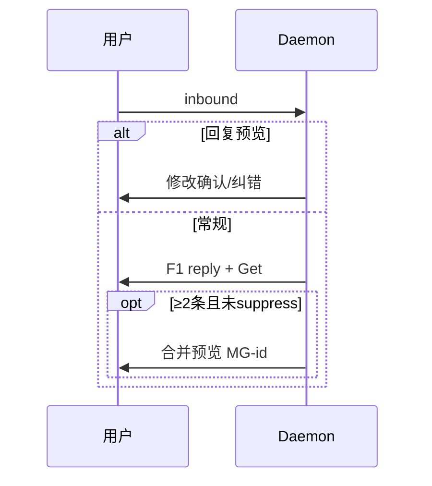

# 飞书通道

## 一、能力范围

**负责**：飞书 WS 收消息、`LarkSender` 出站（文本/媒体/表情/CardKit 流式）、群 @ 过滤、入队 reply、Get/DONE、**私聊合并预览（F2）**、**回复预览修改（F3）**。

**不负责**：凭据 UI、三态 compose（session-dispatcher）、微信/群聊合并预览。

## 二、设计决策与取舍

- **长连接**：`WSClient` + `im.message.receive_v1`（`lark-core.ts`）。
- **流式首选 CardKit**：创建卡片 → 流式更新 → `closeStreamingCardMode`；失败降级 PATCH/分段。
- **预览门控**：仅 p2p + `isStreamTextEligible`；debounce 500ms；待领取 ≥2 触发。
- **F4 抑制**：phase=processing、存在 `.claimed` 或流式活跃时仅 F1，不发预览。
- **Get 时序**：入队确认打 Get；poll 时 `sessionGetReactedIds` 去重。

## 三、服务端规则

- **私聊**：首条可绑定主用户；**群聊**须 @ 机器人，不支持流式/预览。
- **F1**：daemon `replyToMessage` 按 Agent 阶段 + 排队数（见 [04-消息队列与路由.md](./04-消息队列与路由.md)）。
- **F3 拦截**：入队前 `tryHandleMergePreviewReply(parentId)` — 命中 `mergePreviewRegistry` 则修改路径不入队；已领取回复「无法修改」。
- **F2 预览**：header `【合并预览 · ID：MG-{profile}-{ts}】` + `【消息 N】` 正文 + 引导「回复本条消息…」；批次 MG-id 不变，更新加「· 已更新」；registry 登记全部 outbound id（含分条续页）。
- **超长（NF4）**：约 30KB 上限，超出按段落分条，续条标注「（合并预览续 N/M）」。
- **完成**：ack 后下次 poll 打 DONE。

## 四、客户端流程

## 五、接口

| 能力 | 位置 |
|------|------|
| CardKit 流式 | `createStreamingCardEntity` / `updateStreamingCardText` / `closeStreamingCardMode` |
| 表情 | `addReaction(Get\|DONE)` |
| 合并预览 | `sendMergePreview` / `scheduleMergePreview` |
| F3 | `tryHandleMergePreviewReply`（`parentId` 来自 lark-core） |

## 六、数据

- 凭据：`MessageChannel.larkAppId/Secret`。
- 流式 state：`cardId`、`elementId`、`cardSequence`、`streamCardKitMode` 等。
- 预览 state：`MergePreviewState`（mergeId、mergedText、previewMessageIds）；`mergePreviewRegistry`：`messageId→{sessionKey,mergeId}`。

## 七、非功能与可观测

- CardKit/PATCH 失败 INFO 降级；流式节流首包/`final` 跳过。
- F3 失败纠错超长未分条，可能触达单条上限。

## 八、推送

无；入站 WS，出站 IM/CardKit REST。

## 九、已知限制与 TODO

- CardKit 需权限与客户端 7.20+。
- 预览/F3 仅飞书私聊主用户。
- F3 失败纠错超长未分条（04-review suggestion）。

## 十、变更记录

2026-06-27：合并预览、F3 修改、F4 抑制（archive 20260627150041）。
2026-06-27 Rev1：CardKit 流式首选。
2026-06-28：入队 Get、stream-text。
