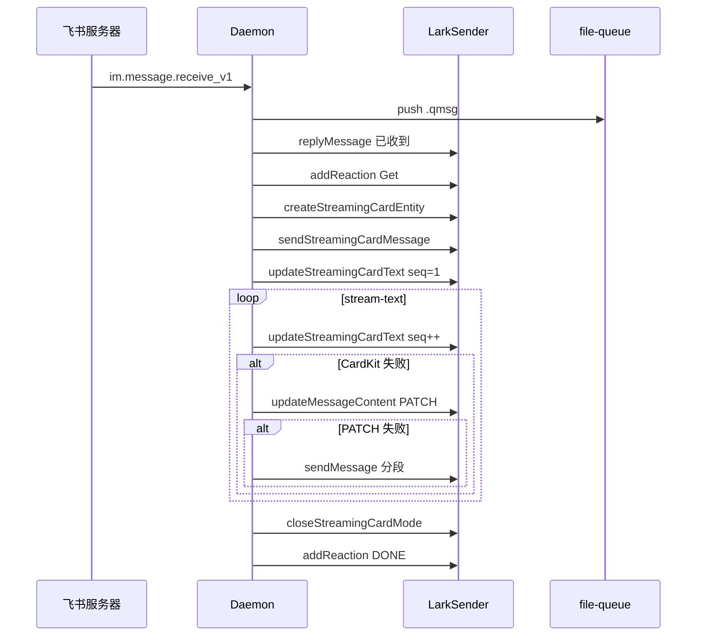

# 飞书通道

## 一、能力范围

**负责**：飞书自建应用 WebSocket 收消息、`LarkSender` 发送文本/图片/文件/表情，解析多种 msg_type 与卡片结构，群 @ 过滤，入队确认 reply、Get/DONE 表情、**流式 outbound**（CardKit 流式卡片首选，失败降级 PATCH 或分段）。

**不负责**：开放平台凭据录入 UI、Agent 三态文案 compose（session-dispatcher → send-text）。

## 二、设计决策与取舍

- **长连接模式**：`WSClient.start` + `EventDispatcher` 订阅 `im.message.receive_v1`（`lark-core.ts`）。
- **出站格式**：无 `<at user_id=` 时用 schema 2.0 interactive 卡片；含 @ 标签用 `text` 类型（`formatForSend`）。
- **流式首选 CardKit**：`createStreamingCardEntity` → `sendStreamingCardMessage` → `updateStreamingCardText`（`sequence++`）；`final` 时 `closeStreamingCardMode`。
- **降级链**：CardKit 失败 → `sendStreamMessage` + PATCH → 段落 `sendMessage` 分段。
- **权限**：`cardkit:card:write`；飞书客户端 7.20+。
- **Get 时序**：入队确认时对 inbound 打 Get；poll 领取时 `sessionGetReactedIds` 去重，避免重复表情。

## 三、服务端规则

- **私聊**：`bindArmed` 时首条绑定主用户；无 `sender.chatId` 时自动绑定当前 chatId。
- **群聊**：须 @ 机器人；流式与 stream-text **不支持**群聊。
- **入队确认**：daemon `replyToMessage(messageId, text)` reply 原消息，与 Agent 最终回复路径分离。
- **进行中**：入队确认后 Get 表情；文本三态经 send-text 独立发送，与表情并存。
- **完成**：Agent ack 后延迟至**下次 poll** 打 DONE（`pendingDoneReactions`）；ack 时清除 Get 去重记录。

## 四、客户端流程

## 五、接口

| 能力 | 实现位置 |
|------|----------|
| 创建流式卡片 | `createStreamingCardEntity(title?)` → `{ cardId, elementId }` |
| 发卡片消息 | `sendStreamingCardMessage(chatId, cardId)` → message_id |
| 流式更新文本 | `updateStreamingCardText(cardId, elementId, text, sequence)` |
| 关闭流式模式 | `closeStreamingCardMode(cardId, sequence)` |
| 表情 | `addReaction(messageId, Get\|DONE)` |

## 六、数据

- 凭据：`MessageChannel.larkAppId/larkAppSecret` → `DaemonChannelConfig`。
- 运行时：`ChannelRuntime.botOpenId`、`feishuConnected`、`sender.chatId`。
- 流式 state：`outboundMessageId`、`streamPatchMode`、`cardId`、`elementId`、`cardSequence`、`streamCardKitMode`。

## 七、非功能与可观测

- `messageId` 以 `internal_` 开头时不走 reply 链，直接 create。
- CardKit/PATCH 失败 INFO 降级；`STREAM_TEXT_THROTTLE_MS` 节流（首包/`final` 跳过）。
- 含 @ 时 CardKit 更新 false，降级 PATCH/分段。

## 八、推送

无；入站依赖 WS 事件，出站调用 IM / CardKit REST API。

## 九、已知限制与 TODO

- CardKit 依赖应用权限与客户端版本；未开通时走 PATCH fallback。
- 卡片 exotic 组件解析可能丢失。
- reply 失败时 send-image/file 退避 chat_id 直发。

## 十、变更记录

2026-06-27 Rev1：CardKit 流式卡片首选，降级 PATCH/分段。
2026-06-28：入队 Get、poll 去重、stream-text 链路。
2026-06-27：kb-sync 初始建立。
