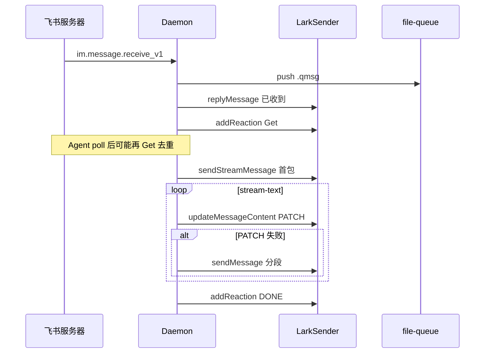

# 飞书通道

## 一、能力范围

**负责**：飞书自建应用 WebSocket 收消息、`LarkSender` 发送文本/图片/文件/表情，解析多种 msg_type 与卡片结构，群 @ 过滤，入队确认 reply、Get/DONE 表情、**流式 outbound**（PATCH 或分段降级）。

**不负责**：开放平台凭据录入 UI、Agent 三态文案 compose（session-dispatcher → send-text）。

## 二、设计决策与取舍

- **长连接模式**：`WSClient.start` + `EventDispatcher` 订阅 `im.message.receive_v1`（`lark-core.ts`）。
- **出站格式**：无 `<at user_id=` 时用 schema 2.0 interactive 卡片；含 @ 标签用 `text` 类型（`formatForSend`）。
- **流式首包**：`sendStreamMessage` 发带 `update_multi:true` 的 interactive 卡片，供 PATCH 更新（F4.2）。
- **PATCH 降级**：`updateMessageContent` 失败时 daemon 改按段落 `sendMessage` 分段 outbound（F4.3）。
- **Get 时序**：入队确认时对 inbound 打 Get；poll 领取时 `sessionGetReactedIds` 去重，避免重复表情（F5.3）。

## 三、服务端规则

- **私聊**：`bindArmed` 时首条绑定主用户；无 `sender.chatId` 时自动绑定当前 chatId。
- **群聊**：须 @ 机器人；流式与 stream-text **不支持**群聊（F4.4）。
- **入队确认**：daemon `replyToMessage(messageId, text)` reply 原消息，与 Agent 最终回复路径分离。
- **进行中**：入队确认后 Get 表情；文本三态（已收到/处理中）经 send-text 独立发送，与表情并存、文本为主。
- **完成**：Agent ack 后延迟至**下次 poll** 打 DONE（`pendingDoneReactions`）；ack 时清除 Get 去重记录。

## 四、客户端流程

## 五、接口

| 能力 | 实现位置 |
|------|----------|
| 发文本 | `sendMessage` / `replyMessage` |
| 流式首包 | `sendStreamMessage(text, chatId, title?)` → message_id |
| 流式更新 | `updateMessageContent(messageId, text, title?)` — interactive PATCH 或 text update |
| 表情 | `addReaction(messageId, Get\|DONE)` |

## 六、数据

- 凭据：`MessageChannel.larkAppId/larkAppSecret` → `DaemonChannelConfig`。
- 运行时：`ChannelRuntime.botOpenId`、`feishuConnected`、`sender.chatId`。
- 流式 state：`SessionProgressState.outboundMessageId`、`streamPatchMode`（daemon 内存）。

## 七、非功能与可观测

- `messageId` 以 `internal_` 开头时不走 reply 链，直接 create。
- PATCH 失败打 INFO 并降级分段；节流见 daemon `STREAM_TEXT_THROTTLE_MS`。
- 图片下载失败仍入队并标注 `[图片下载失败: key]`。

## 八、推送

无；入站依赖 WS 事件，出站调用 IM REST API。

## 九、已知限制与 TODO

- PATCH 可行性与限流依赖飞书 API，须联调 POC 确认默认策略。
- 卡片 exotic 组件解析可能丢失。
- reply 失败时 send-image/file 退避 chat_id 直发。

## 十、变更记录

2026-06-28：入队 Get、poll 去重、sendStreamMessage/updateMessageContent 流式链路。
2026-06-27：kb-sync 初始建立。
