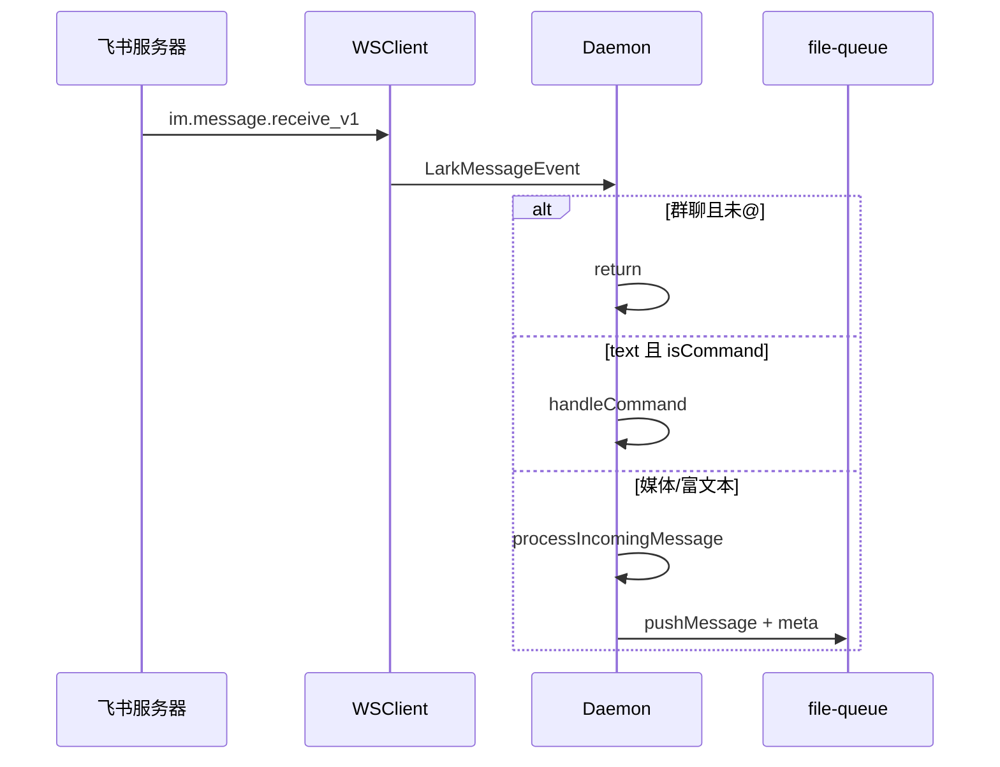

# 飞书通道

## 一、能力范围

**负责**：飞书自建应用 WebSocket 收消息、`LarkSender` 发送文本/图片/文件/表情，解析多种 msg_type 与卡片结构，群 @ 过滤与 mention 占位符还原，引用消息拉取。

**不负责**：开放平台凭据录入 UI、权限/事件订阅开通步骤（见根目录 `README.md`「飞书」）、Agent 模型与 SDK 选择。

## 二、设计决策与取舍

- **长连接模式**：`WSClient.start` + `EventDispatcher` 订阅 `im.message.receive_v1`，无需公网回调 URL（`lark-core.ts:startConnection`）。
- **出站格式**：正文无 `<at user_id=` 时用 schema 2.0 interactive 卡片（markdown）；含 @ 标签时必须用 `text` 类型才能触发真实 mention（`LarkSender.formatForSend`）。
- **群消息过滤**：未 @ 本 bot 则丢弃；`botOpenId` 未知时，有任意 mention 即通过（`isBotMentioned`）。
- **加密**：可选 `encryptKey`，经环境变量 `LARK_ENCRYPT_KEY` 传入 EventDispatcher。
- **消息前缀**：`LARK_MESSAGE_PREFIX` 拼接到所有出站文本。

## 三、服务端规则

- **私聊**：`bindArmed` 时首条消息绑定主用户；无 `sender.chatId` 时自动绑定当前 chatId。
- **群聊**：须 @ 机器人；`resolveMentionTags` 将 `@_user_N` 转为 `@名字(open_id=ou_xxx)`，@自己则删除。
- **引用**：存在 `parentId` 时 `fetchMessageContent` 拉原文写入 `meta.quotedContent`。
- **协作**：群消息 `meta.botRoster` 注入同 Daemon 其他飞书 bot 的 `名称=open_id` 列表。
- **senderType**：`app` 表示其他机器人发送，meta 标记为 `bot`。
- **入站解析**：`parseMessageContent` 支持 text/image/post/interactive/file/folder/audio/video/media/sticker/share/merge_forward/system/hongbao/calendar/location/video_chat/todo/vote 等；图片自动下载到 `MEDIA_CACHE_DIR`。

## 四、客户端流程

## 五、接口

| 能力 | 实现位置 |
|------|----------|
| 创建客户端 | `createLarkClient(appId, appSecret)` SelfBuild + Domain.Feishu |
| 发文本 | `sendMessage` / `replyMessage`（receive_id_type=chat_id） |
| 发图片/文件 | `im.image.create` + `im.file.create` 后 reply/create |
| 表情 | `im.messageReaction.create`，Get=已领取、DONE=已完成 |
| Bot 信息 | 启动时 `GET /open-apis/bot/v3/info` 取 open_id/app_name |

**开放平台权限**（README）：`im:message`、`im:message.p2p_msg:readonly`、`im:message.group_at_msg:readonly`、`im:resource`、`im:chat:read`、`contact:contact.base:readonly`。事件：`im.message.receive_v1`（长连接模式）。

## 六、数据

- 凭据：`MessageChannel.larkAppId/larkAppSecret` → `DaemonChannelConfig.appId/appSecret`。
- 运行时：`ChannelRuntime.botOpenId`、`botName`、`feishuConnected`、`sender.chatId`。
- 媒体：下载路径 `{MEDIA_CACHE_DIR}/{imageKey}.png`；与微信共用缓存目录。

## 七、非功能与可观测

- SDK `loggerLevel: error`；连接成功/失败打 INFO/ERROR 日志。
- 图片下载失败仍入队并标注 `[图片下载失败: key]`。
- `messageId` 以 `internal_` 开头时不走 reply 链，直接 create。
- 启动通道前 Daemon 已运行，否则飞书无法验证 WS（README 提示）。

## 八、推送

无服务端主动推送；入站依赖 WS 事件，出站调用 IM REST API。

## 九、已知限制与 TODO

- 未识别 msg_type fallback 为 `[不支持的消息类型]` 或原始 content。
- 卡片解析覆盖常见 tag， exotic 组件可能丢失（待确认）。
- 飞书 reply 失败时 send-image/file 会退避到 chat_id 直发。

## 十、变更记录

2026-06-27：kb-sync 初始建立。
