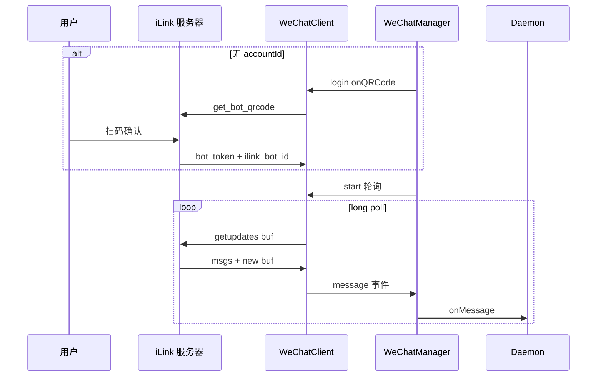

# 微信通道

## 一、能力范围

**负责**：微信 iLink（ClawBot）HTTP API 封装、Token/扫码登录、长轮询收消息、文本与媒体收发、typing 状态、sync buf 与 context_token 持久化、入站媒体 CDN 解密下载。

**不负责**：iLink Token 申请流程、Electron 二维码展示 UI、微信群 @ 路由（微信无 @ 过滤）。

## 二、设计决策与取舍

- **长轮询**：`ILinkApi.getUpdates(buf, timeout)` 默认 35s，Abort 超时返回空 msgs 保持 buf（`api.ts`）。
- **双登录模式**：有 `wechatAccountId` 时 Token 直连；否则 QR 扫码补全 `ilink_bot_id` 并换取 `bot_token`（`wechat-manager.ts:start`）。
- **首条私聊不入队**：Daemon 侧首条 p2p 仅完成 context 绑定并打日志，避免无 token 时发送失败（`daemon.ts:initWeChatChannel`）。
- **CDN 加解密**：AES-128-ECB；`aes_key` 支持 base64(16B) 或 base64(32 字符 hex) 两种格式（`crypto.ts:parseAesKey`）。
- **ClawBot**：README 称通道基于微信 ClawBot；`channel_version=standalone-0.1.0`。

## 三、服务端规则

- **过滤丢弃**：`message_type===2`（BOT 自身）、`message_state` 存在且非 FINISH(2)、发送者等于本账号 `selfAccountId`。
- **群聊判定**：`group_id` 非空 → `chatType=group`，chatId 取 group_id；否则 p2p，chatId=from_user_id。
- **去重**：同一 `message_id` 60s 窗口内跳过（`WeChatManager.DEDUP_WINDOW`）。
- **messageId 前缀**：入队 ID 格式 `wx_{message_id}` 或随机 fallback。
- **发送依赖**：`sendText/sendMedia` 必须有目标用户的 `context_token`（收消息时更新并持久化）。
- **accountId 规范化**：`normalizeAccountId` 小写，将 `@`、`.` 替换为 `-`。

## 四、客户端流程

## 五、接口

| iLink 端点 | 用途 |
|------------|------|
| `ilink/bot/getupdates` | 长轮询收消息 |
| `ilink/bot/sendmessage` | 发送文本/媒体 item_list |
| `ilink/bot/getuploadurl` | 获取 CDN 上传参数 |
| `ilink/bot/getconfig` | 获取 typing_ticket |
| `ilink/bot/sendtyping` | typing / cancel |
| `ilink/bot/get_bot_qrcode` | 获取二维码（bot_type 默认 3） |
| `ilink/bot/get_qrcode_status` | 轮询扫码状态 |

认证：`Bearer {token}` + `AuthorizationType: ilink_bot_token`。默认 API `ilinkai.weixin.qq.com`，CDN `novac2c.cdn.weixin.qq.com/c2c`。

## 六、数据

- 凭据：`MessageChannel.wechatToken` / `wechatAccountId` → Daemon 配置。
- 持久化目录 `APP_DATA_DIR/wechat-data/{channelId}/`：
  - `wechat-sync.txt` — get_updates_buf
  - `wechat-ctx-tokens.json` — 各用户 context_token
  - `state.json` — lastP2pChatId
- 入站媒体写入共用 `MEDIA_CACHE_DIR`，文件名 `wx_{ts}_{rand}{ext}`。

## 七、非功能与可观测

- 状态机：`disconnected → qr_pending → logging_in → connected | error`。
- stdout 事件：`__WECHAT_QR__:{channelId}:{dataUrl}`、`__WECHAT_STATUS__:{channelId}:{status}` 供 Electron 展示。
- 连续 API 失败 3 次退避 30s；errcode/ret -14 会话过期 emit `sessionExpired` 并休眠 1h。
- 收消息即 `startTypingForUser`；发送前 `ensureTyping`，发送后 `cancelTyping`。
- 文本换行：出站 `\n` → `\r\n`。

## 八、推送

无；纯 iLink HTTP 长轮询，无 WebSocket。

## 九、已知限制与 TODO

- 语音消息优先取 `voice_item.text`（若有），否则下载 mp3。
- 群聊无 @ 过滤，所有 FINISH 用户消息均入队（与飞书行为不同）。
- `routeTag` 支持多环境路由（待确认）。
- QR 默认超时 480s，最多刷新 3 次。

## 十、变更记录

2026-06-27：kb-sync 初始建立。
