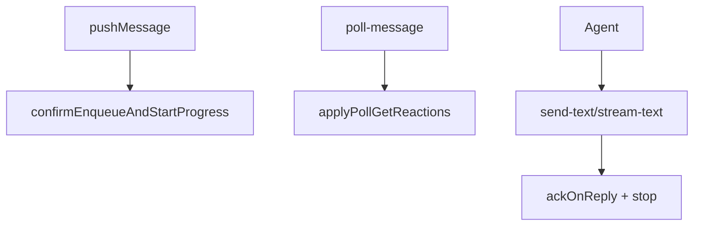

# 消息队列与路由

## 一、能力范围

**负责**：file-queue 跨进程队列、sessionKey 隔离、至少一次投递与 ack、入队即时确认、会话进度状态、stream-text API、双通道出站、SSE 广播。

**不负责**：Agent resume、`.fcmd` 指令队列、三态文案 compose（session-dispatcher）。

## 二、设计决策与取舍

- **原子入队**：write tmp + rename；领取 rename `.qmsg→.claimed`。
- **入队即反馈**：写入成功后 `replyToMessage`，不等待 poll。
- **排队计数**：`getSessionPendingCount` = `.qmsg`+`.claimed`（非 `getQueueLength`）。
- **进度 Map 不持久化**：`sessionProgressMap` 进程级内存。

## 三、服务端规则

- **入队确认**：`pushToFileQueue` 成功且 messageId 非 `internal_*` →「已收到，正在处理」；`pending>1` 附加排队提示。
- **进行中**：微信 `startProgressTyping`；飞书 inbound Get + `sessionGetReactedIds`。
- **停止**：`ackOnReply`、`stop_progress:true`、stream `final`（无 message_id 仅 stop）。
- **流式**：`isStreamTextEligible` — 主用户 p2p；与 agent-sdk `f41Eligible` 对齐。
- **飞书 CardKit 路径**（`handleStreamText`）：首包创建卡片并发消息，state 记 `cardId`/`elementId`/`cardSequence=1`/`streamCardKitMode=true`；后续 `updateStreamingCardText`（`cardSequence++`）；`final` 时 `closeStreamingCardMode` 再 stop/ack。任一步失败 → `streamCardKitMode=false`，降级 PATCH（`streamPatchMode`）或 `sendStreamSegments` 分段。
- **指令**：`isCommand` → `.fcmd`，无入队确认。

## 四、客户端流程

## 五、接口

| HTTP / 函数 | 说明 |
|-------------|------|
| `GET /api/poll-message?sessionKey=` | 必填 sessionKey |
| `POST /api/send-text` | `{text, message_id?, session_key?, stop_progress?}` |
| `POST /api/stream-text` | `{session_key, text, stream_id?, outbound_message_id?, message_id?, final?}` |
| `getSessionPendingCount(sessionKey)` | `.qmsg`+`.claimed` 条数 |
| `ackMessages(messageId, sessionKey?)` | 删 ≤ 目标时间的 `.claimed` |

## 六、数据

- 文件：`.qmsg` → `.claimed` → 删；`.tmp` 5min 清理。
- 内存：`sessionProgressMap`（含 `cardId`/`elementId`/`cardSequence`/`streamCardKitMode`）、`sessionGetReactedIds`、`pendingDoneReactions`（DONE 延迟至下次 poll）。

## 七、非功能与可观测

- poll 前 `terminateSession` 防幽灵连接。
- poll Get 按 messageId 去重。
- `STREAM_TEXT_THROTTLE_MS` 500–1500，默认 1000；首包/`final` 不受节流跳过。

## 八、推送

无；Agent blocking poll + SSE queue-update。

## 九、已知限制与 TODO

- SDK stream final 未传 message_id 时 `.claimed` 可能滞留。
- 微信 send-text 不返回 message_id。
- `claimNextMessage` 语义不同于 poll（CLI drain）。

## 十、变更记录

2026-06-27 Rev1：stream-text 飞书 CardKit 路径与 state 字段。
2026-06-28：入队确认、getSessionPendingCount、stream-text、进度 Map 与 poll Get 去重。
2026-06-27：kb-sync 初始建立。
