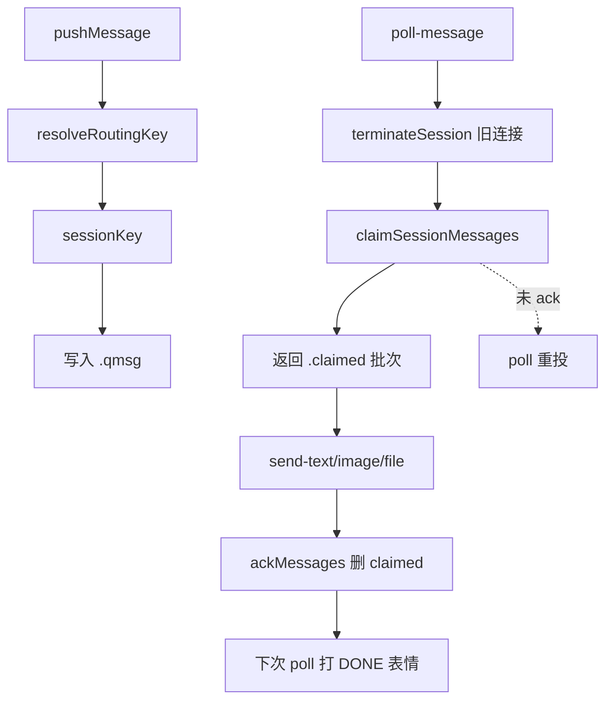

# 消息队列与路由

## 一、能力范围

**负责**：`APP_DATA_DIR/file-queue` 跨进程文件队列、按 sessionKey 隔离、至少一次投递与 ack 确认、chatKey/sessionKey 路由、双通道（飞书+微信）出站解析、SSE 队列事件广播。

**不负责**：Agent resume（Agent 调度域）、`claimNextMessage` 即时消费、`.fcmd` 指令队列。

## 二、设计决策与取舍

- **文件队列**：write tmp + rename 原子入队；领取用 rename `.qmsg→.claimed`（`file-queue.ts`）。
- **至少一次投递**：poll 领取不删除；Agent `send-*` 带 `message_id` 触发 `ackMessages` 才删；未 ack 的消息下次 poll 重投。
- **session 子目录**：`md5(sessionKey).slice(0,16)` 避免路径过长与特殊字符。
- **chatKey 前缀**：`ch_{hex}|{rawChatId}` 使多通道同 chatId 不冲突（`channel-types.ts`）。
- **messageId 去重**：同 session 目录内相同 safeId 的 `.qmsg`/`.claimed` 拒绝重复入队。

## 三、服务端规则

- **入队路由**：`resolveRoutingKey(chatId, replyMessageId)` — 优先 messageId→sessionKey 映射（跨通道不一致则忽略）；其次 `activeSessionMap`；fallback chatId。
- **私聊默认 session**：p2p 且无 `::` 后缀时，自动 `chatKey::workspaceDir` 并 `setActiveSession`。
- **出站路由**：`resolveChannel(session_key)` — 解析 chatKey 中 channelId → 对应 ChannelRuntime；旧格式按 chatId 形态启发式匹配；兜底第一个有默认私聊目标的已连接通道。
- **连接判定**：飞书 `feishuConnected && sender`；微信 `wechat.isConnected()`。
- **指令拦截**：`isCommand` 命中则 `handleCommand` 写 `.fcmd`，不进 `.qmsg`。

## 四、客户端流程

## 五、接口

| HTTP / 函数 | 说明 |
|-------------|------|
| `GET /api/poll-message?sessionKey=` | 必填 sessionKey；长阻塞 25min；instant 有消息立即返回 |
| `POST /api/send-text` | `{text, message_id?, session_key?}` |
| `POST /api/send-image` | `{image_path, message_id?, session_key?}` |
| `POST /api/send-file` | `{file_path, message_id?, session_key?}` |
| `POST /api/active-session` | `{chatId, sessionKey}` 更新路由映射 |
| `GET /api/queue-events` | SSE queue-update |
| `ackMessages(messageId, sessionKey?)` | 删时间戳 ≤ 目标的全部 `.claimed` |

队列 JSON 字段：`text, messageId, timestamp, source, sessionKey, meta?`（meta 含 chatType/senderOpenId/botOpenId/botName/botRoster/quotedContent）。

## 六、数据

- 文件状态：`.qmsg`（待投递）→ `.claimed`（已投递待 ack）→ 删除；`.tmp` 孤儿 5min 清理。
- 内存映射：`activeSessionMap`、`messageSessionMap`(≤5000)、`sessionToChatMap`、`sessionLastReplyAt`、`pendingDoneReactions`（DONE 延迟 10min 超时自动打）。

## 七、非功能与可观测

- 新 poll 前 `terminateSession` 销毁同 session 旧长连接，防幽灵连接占消息。
- 首次投递的消息打 Get 表情（仅飞书）；DONE 延迟到 Agent **下次** poll 时打，表示任务真正完成。
- pendingDone 10min 无 poll 则定时任务自动打 DONE。
- 缺 sessionKey 的 poll 返回 400；跨通道 messageId 映射打 INFO 并忽略。

## 八、推送

无；Agent 侧 blocking HTTP poll。Electron 可通过 SSE 感知队列变更以触发调度（具体绑定见 Agent 调度域）。

## 九、已知限制与 TODO

- `claimNextMessage`（领取即删）仅用于 electron 本地 CLI drain，与 poll-message 语义不同。
- poll 超时返回空数组（非错误）；Agent 断开时 claimed 消息保持待重投。
- 兼容旧队列字段 `chatId`（等同 sessionKey）。
- 微信 send-text API 不返回 message_id，无法建立 messageId 回路由映射。

## 十、变更记录

2026-06-27：kb-sync 初始建立。
