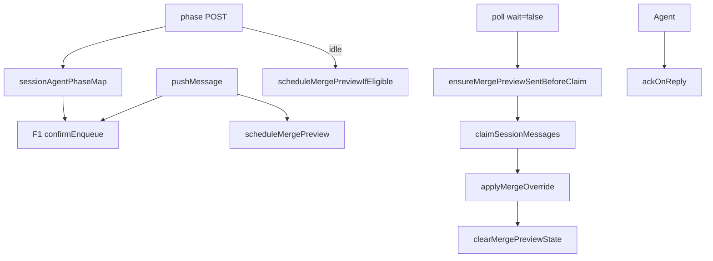

# 消息队列与路由

## 一、能力范围

**负责**：file-queue 跨进程队列、sessionKey 隔离、至少一次投递与 ack、入队 F1 阶段文案、Agent 阶段快照、合并预览 poll override、会话进度、stream-text、双通道出站、SSE。

**不负责**：Agent resume、`.fcmd` 指令、三态 compose（session-dispatcher）、飞书预览发送与 F3 拦截（见 [02-飞书通道.md](./02-飞书通道.md)）。

## 二、设计决策与取舍

- **原子入队**：write tmp + rename；领取 `.qmsg→.claimed`。
- **入队即反馈**：`buildEnqueueStatusText` + `replyToMessage`。
- **计数**：`getSessionPendingCount` = `.qmsg`+`.claimed`；`getSessionUnclaimedCount` 仅 `.qmsg`。
- **Phase 不持久化**：electron `POST /api/session-agent-phase`；缺失时 `.claimed>0` 兜底 processing。
- **进度 Map 不持久化**：`sessionProgressMap`；F4 抑制预览时读流式字段。

## 三、服务端规则

- **F1 入队确认**：`buildEnqueueStatusText` — starting→「正在启动」；processing→「正在处理上一条」；idle 且 pending≤1→「等待领取」；idle 且 pending>1→「已加入队列」；pending>1 附加排队数。
- **进行中**：微信 typing；飞书 Get + `sessionGetReactedIds`。
- **override 交付**：poll 后 `applyMergeOverrideForPoll` — 用户修改后的 `mergedText` 以单条交付 Agent。
- **预览清理**：poll 领取或 `ackOnReply` 时 `clearMergePreviewState`。
- **idle 补偿（T-FIX-01）**：`POST /api/session-agent-phase` 转 `idle` 删 Map 后调用 `scheduleMergePreviewIfEligible` — processing 期间 F4 跳过的 debounce 不会自动重跑，须在 unclaimed≥2 且未 suppress 时补调度预览。
- **instant poll 守卫（T-FIX-01）**：`blocking=false` 的 poll 在 `claimSessionMessages` **前** `await ensureMergePreviewSentBeforeClaim`；应发预览且 debounce 未落盘时 flush 并 `sendMergePreview`；`shouldSuppressMergePreview===true` 时 no-op，仍可直接 claim。
- **停止**：`ackOnReply`、`stop_progress:true`、stream `final`。
- **流式**：`isStreamTextEligible` 主用户 p2p；活跃流式时 F4 抑制预览。
- **CardKit**（`handleStreamText`）：首包建卡 → 流式更新 → `final` 关流；失败降级 PATCH/分段。
- **指令**：`isCommand` → `.fcmd`，无入队确认。

## 四、客户端流程

## 五、接口

| HTTP / 函数 | 说明 |
|-------------|------|
| `GET /api/poll-message?sessionKey=` | 领取前 apply override |
| `POST /api/session-agent-phase` | `{session_key, phase}`；idle 删条目 |
| `POST /api/send-text` / `stream-text` | 既有契约 |
| `getSessionPendingCount` | `.qmsg`+`.claimed` |
| `getSessionUnclaimedCount` | 仅 `.qmsg` |
| `listUnclaimedMessages` | timestamp 升序 |
| `replaceSessionUnclaimedMessages` | 删全部 `.qmsg` 写单条 override |
| `scheduleMergePreviewIfEligible` | idle 补偿；unclaimed≥2 且未 suppress 时 schedule |
| `ensureMergePreviewSentBeforeClaim` | instant poll claim 前 flush debounce 并确保预览 outbound |
| `ackMessages` | 删 ≤ 目标时间的 `.claimed` |

## 六、数据

- 文件：`.qmsg`→`.claimed`→删；F3 override 用 `merge_override_{ts}` messageId。
- 内存：`sessionAgentPhaseMap`、`mergePreviewBySession`/`mergePreviewRegistry`、`sessionProgressMap`、`sessionGetReactedIds`。

## 七、非功能与可观测

- poll 前 `terminateSession`；Get 按 messageId 去重。
- `STREAM_TEXT_THROTTLE_MS` 500–1500；首包/`final` 不节流。
- phase 丢失时 F1 靠 `.claimed` 兜底。

## 八、推送

无；blocking poll + SSE queue-update。

## 九、已知限制与 TODO

- SDK stream final 未传 message_id 时 `.claimed` 可能滞留。
- 合并预览/F3 仅飞书私聊。
- `blocking=true` poll 路径尚无预览守卫（T-FIX-01 范围外；主用户 SDK 走 instant）。
- debounce 与 ensure 极端并发可能重复发预览（低优先级债务）。

## 十、变更记录

2026-06-27 T-FIX-01：idle 补偿调度 + instant poll 预览守卫（archive 20260627150041）。
2026-06-27：F1 阶段文案、unclaimed 计数、phase API、merge override（archive 20260627150041）。
2026-06-27 Rev1：CardKit 流式路径。
2026-06-28：入队确认、stream-text、进度 Map。
