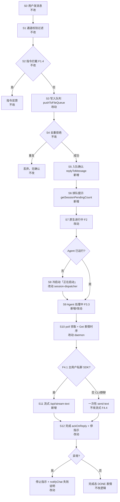
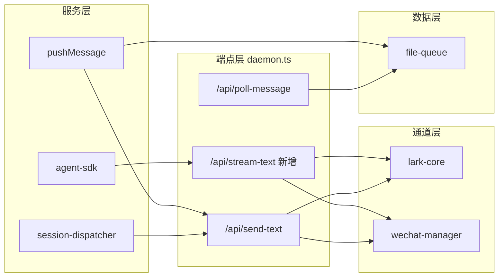

# 消息通道即时响应与流式输出 - 实现设计

> **业务 PRD**：见同目录 01-proposal.md（验收标准以 01 为准）

## 一、业务流程与改动范围

### （一）业务流程图



**图例**：`不改` = 现有逻辑保持不变；`改动` = 在既有节点调整行为或时序；`新增` = 新增能力或 API；`删除` = 本期无删除项。

### （二）流程步骤与改动对照

| 步骤 ID | 业务含义 | 改动 | 落点（模块/文件） | 01 验收关联 |
|---------|----------|------|-------------------|-------------|
| S0 | 用户经飞书/微信发送消息 | 不改 | 通道 WebSocket/长轮询入口 | — |
| S1 | 通道校验、@ 过滤、空消息丢弃 | 不改 | `src/daemon.ts` 通道回调 | — |
| S2 | 指令系统拦截，不入常规定义队列 | 不改 | `src/daemon.ts` `isCommand` / `pushCommandToQueue` | F1.4、验收 8 |
| S3 | 校验通过后写入 `.qmsg` 队列 | 改动 | `src/daemon.ts` `pushMessage`；`src/file-queue.ts` `pushToFileQueue` | F1.1、NF1 |
| S4 | 重复 messageId 去重拒绝入队 | 不改 | `src/file-queue.ts` dedup 逻辑 | 验收 10 |
| S5 | 入队成功后 ≤3s 发送「已收到，正在处理」 | 新增 | `src/daemon.ts` `pushMessage` → `replyToMessage`；过滤 `internal_*` messageId | F1.1–F1.2、验收 1 |
| S6 | 同会话排队数 >1 时附加「前面还有 N 条待处理」 | 新增 | `src/file-queue.ts` `getSessionPendingCount`；`pushMessage` 组文案 | F1.3、验收 2 |
| S7 | 入队确认后触发通道原生进行中指示 | 改动 | `src/daemon.ts` 进度状态机；`src/wechat-manager.ts` typing 生命周期；`src/shared/lark-core.ts` 表情 | F2.1–F2.3、验收 5 |
| S8 | Agent 冷启动期间展示「正在启动」 | 改动 | `electron/session-dispatcher.ts` L578 替换「正在启动Agent，请稍等...」 | F3.2、F5.2、验收 3 |
| S9 | Agent 真正进入处理后发送「Agent 处理中…」 | 新增/改动 | `electron/session-dispatcher.ts` `launchSessionAgent` 成功回调；`electron/agent-sdk.ts` `launchSdkAgent` 启动后 | F3.3、F5.2、验收 3–4 |
| S10 | Agent poll 领取消息；飞书 Get 表情时序调整 | 改动 | `src/daemon.ts` `/api/poll-message`、`addReactionToMessages`；文本状态优先于表情 F5.3 | F5.3、验收 5 |
| S11 | SDK 主用户私聊流式输出 | 新增 | `electron/agent-sdk.ts` `handleSdkEvent` → `/api/stream-text`；`src/daemon.ts` 新端点 | F4.1–F4.3、NF2/NF6、验收 6–7 |
| S11b | CLI/群聊不实现单条流式 | 不改流式 | 沿用 `/api/send-text` 一次性发送 | F4.4、验收 8 |
| S12 | 任务完成或异常：停止进行中指示、确认队列 | 改动 | `src/daemon.ts` `ackOnReply`；`src/wechat-manager.ts` 解耦 `sendText` 内 `cancelTyping`；SDK 错误 `notifyChat` | F2.2、F3.5、NF3、验收 9 |

### （三）改动汇总

**改动**

- `pushMessage`：入队成功后 hook 入队确认与原生进行中指示（S3/S5/S7）
- `session-dispatcher.ts`：冷启动文案「正在启动」+ 启动成功后「Agent 处理中…」（S8/S9）
- `/api/poll-message`：Get 表情与三态文本并存，文本为主（S10）
- `wechat-manager.ts`：typing 生命周期独立于每次 `sendText`（S7/S12）
- `ackOnReply` 完成路径：停止 Session 进行中状态（S12）

**新增**

- `getSessionPendingCount(sessionKey)`：统计 `.qmsg` + `.claimed` 待处理条数（S6）
- `SessionProgressState` 内存 Map：会话级进度与 outbound 消息 ID 追踪（S7/S11）
- `POST /api/stream-text`：流式/分段更新 outbound 消息（S11）
- `agent-sdk.ts`：`handleSdkEvent` assistant delta 桥接到 stream API（S11）
- SDK 流处理异常时 `notifyChat` 用户可见失败说明（S12）

**不改**

- 指令拦截、去重拒绝、队列路由、会话隔离核心规则（S0–S2、S4）
- CLI 模式与群聊的单条消息持续更新（F4.4）
- `/api/send-text` 对 CLI 的最终回复契约
- 数据库与持久化层

## 二、整体思路

**根因**：入队到 Agent 领取之间存在反馈空窗；冷启动提示与入队确认语义重叠；SDK 流式产出未桥接到消息通道。

**方案要点**：在既有 `pushMessage` 写入成功分支挂入队确认；用会话级内存状态机驱动三态 + 原生指示；SDK assistant delta 经新 `/api/stream-text` 更新 outbound 消息；冷启动/处理中文案分层，避免双条近义通知。

**与 01 追溯**：F1→S5/S6；F2→S7；F3→S8/S9；F4→S11；F5→S8/S9/S10。

**Ponytail 最小方案三问**：

1. **复用既有 API 而非新建抽象层？** 是。入队确认走 `replyToMessage`；三态/冷启动/错误走 `notifyChat`→`/api/send-text`；流式走 `streamRunEvents`/`handleSdkEvent` 桥接新端点；完成走既有 `ackOnReply` + `pendingDoneReactions`。
2. **`/api/stream-text` 是否 01 要求？** 是。F4.2 要求同一条 outbound 持续更新；代码库无单条 edit API，需专用端点承载 PATCH/分段降级与节流（F4.3、NF6）。不引入通用 MessageStateMachine trait（YAGNI）。
3. **合并到 daemon.ts/agent-sdk.ts？** 是。通道发送、表情、typing 已在 daemon；SDK 事件已在 agent-sdk；不预建跨端通用进度框架。

## 三、分层设计

| 层 | 职责 | 落点 |
|----|------|------|
| 端点层 | HTTP API：send-text（既有）、stream-text（新增）、poll-message（时序调整） | `src/daemon.ts` |
| 服务层 | 入队确认、进度状态机、流式桥接、Agent 生命周期通知 | `src/daemon.ts`、`electron/session-dispatcher.ts`、`electron/agent-sdk.ts` |
| 通道适配层 | 飞书表情/消息、微信 typing 独立控制 | `src/shared/lark-core.ts`、`src/wechat-manager.ts` |
| 数据层 | 文件队列读写、会话待处理计数 | `src/file-queue.ts` |



## 四、接口设计

**pushMessage 副作用扩展（内部）**：触发条件为 `pushToFileQueue(...) === true` 且 `messageId` 存在且不以 `internal_` 开头。行为：计算 `pending = getSessionPendingCount(routedId)`；组文案「已收到，正在处理」+ 可选排队后缀；`replyToMessage(messageId, text, chatId)`；初始化/更新 `SessionProgressState` 并触发 S7 原生指示。

**POST /api/stream-text（新增）**：

| 字段 | 类型 | 必填 | 说明 |
|------|------|------|------|
| `session_key` | string | 是 | 会话路由键 |
| `text` | string | 是 | 当前累积全文或增量片段（实现统一为全文覆盖） |
| `stream_id` | string | 否 | 流实例 ID，首包可省略由服务端生成 |
| `outbound_message_id` | string | 否 | 首包创建后回传，后续更新同一条 |
| `final` | boolean | 否 | true 时标记流结束，停止进行中指示 |

响应 `{ ok, stream_id?, outbound_message_id? }`；通道不支持 PATCH 时按段落 + 节流分段 `sendMessage`（F4.3）；400 缺参；通道不可达返回 `{ ok: false, error }`。

**POST /api/send-text（既有，不变）**：CLI/群聊最终回复、三态文本通知（「正在启动」「Agent 处理中…」继续使用；`message_id` 可选用于 reply 链。

**replyToMessage（内部，入队确认）**：入参 `messageId, text, chatId?`；飞书 reply 原消息、微信 `sendText` 至会话；与 Agent 最终回复路径分离，不触发 `ackOnReply`。

## 五、数据结构

**SessionProgressState（内存 Map，daemon 进程级）**

```typescript
interface SessionProgressState {
  typingActive: boolean;
  outboundMessageId?: string;  // 流式首选 outbound
  streamId?: string;
}
// Map<sessionKey, SessionProgressState>
```

- 任务完成/失败/超时：清除 `typingActive`，调用通道 stop typing / 不再发进行中表情。
- 不持久化，进程重启后仅依赖新消息重建状态。

**getSessionPendingCount（file-queue 新增）**

- **语义**：指定 `sessionKey` 目录下 `.qmsg`（待领取）+ `.claimed`（已领取待 ack）文件数之和。
- **区别于** `getQueueLength`：后者仅计 `.qmsg`，不足以反映「前面还有 N 条待处理」。

**数据库**：无变更。

## 六、实现步骤

1. **S6 基础**：`file-queue.ts` 实现 `getSessionPendingCount`；单测/手动验证计数含 claimed。
2. **S5/S7 入队确认**：`pushMessage` 在 `written===true` 分支发送确认；过滤 `internal_*`；启动 `SessionProgressState` 与微信 typing / 飞书进行中反馈。
3. **S8/S9 文案整合**：`session-dispatcher.ts` L578 改为「正在启动」；`launchSessionAgent`/`launchSdkAgent` 成功入口发送「Agent 处理中…」；启动失败走 `notifyChat` 错误文案。
4. **S10 Get 时序**：评估 poll 时 `addReactionToMessages(Get)` 与三态文本并存；必要时延后或仅对新消息打 Get，文本状态优先（F5.3）。
5. **S11 流式 API**：daemon 新增 `/api/stream-text`；实现 Feishu PATCH POC 与分段降级 + 节流配置项。
6. **S11 SDK 桥接**：`handleSdkEvent` assistant text delta 在 `f41Eligible`（`isMainUser && p2p && resource.type==='sdk'`）时 POST stream-text；首包创建 outbound，后续带 `outbound_message_id`。
7. **S12 完成/异常**：`ackOnReply` 与 stream `final` 时停止进行中指示；微信 `sendText` 解耦自动 `cancelTyping`，改由进度状态机统一 stop；SDK `streamRunEvents` catch 与 status ERROR 时 `notifyChat`（对齐 `handleSessionClosed`）。
8. **验收**：按 01 验收 1–10 与 §八·（二）工程补充项执行。

## 七、参考实现

| 符号 | 路径 | 用途 |
|------|------|------|
| `pushMessage` | `src/daemon.ts:493` | 入队入口，挂 S5/S6/S7 |
| `replyToMessage` | `src/daemon.ts:687` | 入队确认回复 |
| `notifyChat` | `electron/session-dispatcher.ts:40` | 三态/错误文本通知 |
| `streamRunEvents` | `electron/agent-sdk.ts:107` | SDK 事件流 |
| `handleSdkEvent` | `electron/agent-sdk.ts:126` | assistant delta 桥接点 |
| `addReactionToMessages` | `src/daemon.ts:430` | 飞书 Get/DONE 表情 |
| `pendingDoneReactions` | `src/daemon.ts:289` | 延迟 DONE |
| `getQueueLength` | `src/file-queue.ts:299` | 对比参考，非排队计数 |
| `launchSdkAgent` | `electron/agent-sdk.ts:198` | SDK 启动 → S9 |
| `isMainUser` | `electron/session-dispatcher.ts:77` | F4.1  eligibility |
| `ackOnReply` | `src/daemon.ts:444` | 完成确认 S12 |
| `pushToFileQueue` | `src/file-queue.ts:45` | 去重写入 S3/S4 |
| `WeChatManager.sendText/cancelTyping` | `src/wechat-manager.ts:151–209` | typing 解耦 S7/S12 |
| `handleSessionClosed` | `electron/session-dispatcher.ts:100` | SDK 错误 notify 模式参考 |

## 八、技术影响

### （一）影响范围

- **daemon**：pushMessage、HTTP 路由、进度 Map、stream-text 端点、poll Get 时序。
- **file-queue**：新增计数函数，无文件格式变更。
- **session-dispatcher**：冷启动/处理中文案、启动失败通知。
- **agent-sdk**：handleSdkEvent 流式桥接、错误 notify。
- **wechat-manager**：typing 生命周期 API 暴露（start/stop 独立于 sendText）。
- **lark-core / LarkSender**：stream-text 内 PATCH 或分段发送。
- **无 DB / proto / Electron UI** 变更。

### （二）工程补充验收项

1. **Feishu PATCH POC**：验证单条消息 content PATCH 可行性与限流；不可行则确认 F4.3 分段策略默认开启。
2. **WeChat GENERATING probe**：确认 `MessageState.GENERATING` 与独立 typing ticket 生命周期；完成/异常 5s 内 cancel。
3. **节流配置**：流式更新间隔可配置（建议默认 500–1500ms），NF6 不刷屏。
4. **SDK error notify**：模拟 stream 异常与 status ERROR，用户收到可理解说明且进行中指示停止（对齐 handleSessionClosed）。

## 九、知识库影响

- `knowledge/业务域/消息桥接/01-概览.md` — 三态状态机、主流程图
- `knowledge/业务域/消息桥接/02-飞书通道.md` — 表情时序、流式/PATCH
- `knowledge/业务域/消息桥接/03-微信通道.md` — typing 生命周期
- `knowledge/业务域/消息桥接/04-消息队列与路由.md` — 入队确认、pending 计数
- `knowledge/工程平台/` 下 Agent/SDK 相关子模块（若已文档化 session-dispatcher / agent-sdk）

## 十、知识库更新计划

### （一）必须更新

- `04-消息队列与路由.md`：入队确认 SLA、排队计数、`getSessionPendingCount` 语义
- `02-飞书通道.md`：三态进度、Get/DONE 与文本并存策略、流式降级
- `03-微信通道.md`：typing 与 sendText 解耦、完成态停止规则
- `01-概览.md`：核心状态机/主流程 mermaid 同步三态 + 流式分支

### （二）可能更新

- Agent 运行时/SDK 子模块文档：stream-text 桥接、`f41Eligible` 条件
- `00-README.md`：阅读路径若新增流式章节

### （三）不需要更新

- 指令系统、工作流引擎、Electron 设置 UI 相关文档
- Proto 协议（无变更）
- 其他业务域（账户、房间等）
