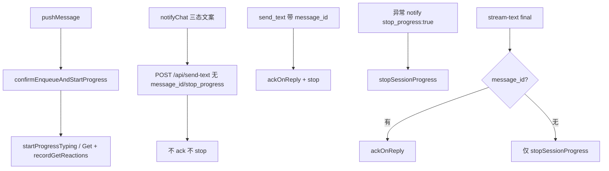

# 消息通道即时响应与流式输出 - 代码评审报告（复评）

## 1、审查范围

- **变更类型**: apply 产出的未提交变更（相对初评后的 T-FIX-01/02/03 修复 diff）
- **评审等级**: full-review（复评，聚焦 R1–R4 闭环与 03 验收）
- **涉及文件**: 8 个实现文件 + `src/AGENTS.md`、`electron/AGENTS.md`
- **设计文档**: `02-design.md`（对照基准）
- **评审方式**: 全量 `git diff` + 关键符号定点复核（`stopSessionProgress`、`ackOnReply`、`idsNeedingPollGetReaction`、`handleStreamText` final 分支）

## 2、严重（必须处理）

无

## 3、警告（建议处理）

1. **SDK 与 daemon 双层流式节流叠加**
   - 位置: `electron/agent-sdk.ts:41`（400ms）、`src/daemon.ts:305-310`（500–1500ms 可配置）
   - 说明: `shrink:` SDK 侧定时与 daemon NF6 节流双重限流，联调时首段延迟可能高于预期；可后续合并为单点配置。`net: -30 lines possible`。评分约 55，不阻断归档。

## 4、设计偏差

无（初评 T8 send-text 无条件 stop 已按设计收窄）

## 5、验收标准检查

| 任务 | 验收条件 | 状态 |
|------|---------|------|
| T1 | `.qmsg` + `.claimed` 计数正确 | ✅ `getSessionPendingCount` 实现符合 |
| T1 | 空/无效 sessionKey 返回 0 | ✅ |
| T2 | start/stopProgressTyping 独立生命周期 | ✅ |
| T2 | sendText 默认 skipTyping | ✅ `skipTyping !== false` 默认 true |
| T3 | 冷启动「正在启动」文案 | ✅ |
| T3 | 处理中「Agent 处理中…」 | ✅ SDK/CLI 成功路径均有 |
| T3 | 无近义双条 | ✅ 入队确认与处理中语义分离 |
| T4 | 入队确认 ≤3s 文案 | ✅ 逻辑正确（需联调实测 NF1） |
| T4 | 排队提示 pending>1 | ✅ |
| T4 | 去重/指令/internal 跳过 | ✅ |
| T4 | 入队后原生指示启动 | ✅ R1 修复后不再被进度 notify 误杀 |
| T5 | poll 不重复 Get | ✅ `sessionGetReactedIds` 按 messageId 去重 |
| T6 | stream-text 端点与 PATCH 降级 | ✅ |
| T6 | 节流可配置 NF6 | ✅ |
| T6 | 非 eligible 拒绝 | ✅ |
| T7 | f41Eligible 桥接 stream-text | ✅ |
| T7 | SDK 错误 notify | ✅ `stop_progress: true` 于失败路径 |
| T8 | 完成/异常 5s 内 stop | ✅ |
| T8 | send-text 最终回复 stop | ✅ 经 `ackOnReply`（含 stop） |
| T8 | 流式 final stop | ✅ `handleStreamText` final 分支 |
| 01·5 | 处理中可见微信 typing | ✅ 代码路径成立（需联调确认） |
| 01·9 | 异常 stop + 失败说明 | ✅ |
| 01·6-7 | 流式首段 10s | ⚠️ 代码就绪，需联调 |

## 6、调用链与回归风险

| 回归点 | 风险 | 关联 |
|--------|------|------|
| 微信 typing 生命周期 | 低（已修复） | R1 |
| 飞书 Get 重复 | 低 | R2 `sessionGetReactedIds` |
| SDK 流式队列 ack | 中（见 §7） | stream final 无 message_id |
| CLI poll-message + send-text | 低 | 既有契约保持 |

## 7、遗留债务

1. **SDK f41 流式完成时 `agent-sdk` 未向 `stream-text final` 传 inbound `message_id`**
   - 位置: `electron/agent-sdk.ts:78-84`、`113-127`（`StreamTextPayload` 无 `message_id` 字段）
   - 说明: daemon 已在 `handleStreamText` final 支持可选 `message_id` → `ackOnReply`（T-FIX-03）；但 electron 桥接层未传 inbound id，且桥接层不持有 poll 领取的 messageId。`final` 无 `message_id` 时仅 `stopSessionProgress`，`.claimed` 依赖 SDK Agent 另行 MCP `send_text(message_id)` 清理。评分约 65，不阻断本次归档；建议在联调确认后追加 T-FIX-04（daemon final 无 id 时 ack 会话全部 claimed，或 agent-sdk 跟踪 inbound ids）。
2. **`send-image`/`send-file` 成功且带 `session_key` 时无条件 `stopSessionProgress`**（`ackOnReply` 已含 stop，外层重复调用幂等）。评分约 40。

## 8、修复任务建议

| 问题 ID | 建议动作 | 关联任务 |
|---------|----------|----------|
| — | SDK 流式 ack 闭环：联调后若 `.claimed` 滞留，追加 T-FIX-04 | 待定 |

## 9、结论

**通过**，可进入 `/kb-archive`。R1–R4 修复经 diff 复核成立：send-text 仅在 `message_id`/`stop_progress` 时 stop/ack；poll Get 改 `sessionGetReactedIds` 去重；`src/AGENTS.md` 与 T8 语义对齐；stream-text 支持 final + `message_id` ack。无评分 ≥75 的 open 阻断项；SDK 流式 ack 桥接缺口记入 §7 债务，建议归档后联调验证。

### R1–R4 复评摘要

| ID | 初评问题 | 复评结论 |
|----|----------|----------|
| R1 | 进度 notify 误 stop typing | **fixed** — `send-text` 仅 `stop_progress` 时 `stopSessionProgress`；`ackOnReply` 含 stop |
| R2 | poll Get 依赖已清空 map | **fixed** — `sessionGetReactedIds` 独立于 `sessionProgressMap` |
| R3 | stream final 不 ack | **fixed（daemon 契约）** — `handleStreamText` final + `message_id` → `ackOnReply`；桥接层未传 id 见 §7 |
| R4 | AGENTS 表述不一致 | **fixed** — `src/AGENTS.md` 明确完成路径与三态文案边界 |
