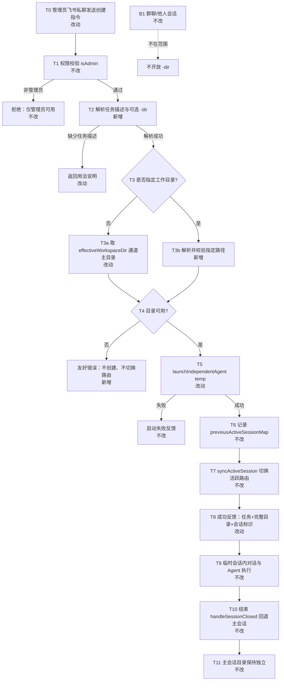
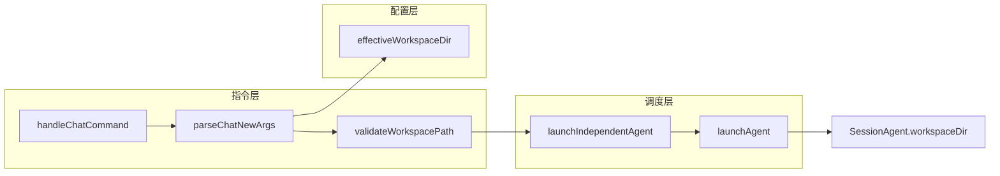

# 飞书临时会话工作目录可选 - 实现设计

> **业务 PRD**：见同目录 `01-proposal.md`（验收标准以 01 为准）

## 一、业务流程与改动范围

> 业务口径以 `01-proposal.md` 用户场景 A–E 与功能需求 F1–F5 为准；创建入口为管理员飞书私聊 `/chat new`（见 `04-远程指令.md`）。

### （一）业务流程图



**图例**：`不改` = 现网行为保持；`改动` = 在既有节点扩展参数或文案；`新增` = 新校验分支或解析逻辑；`删除` = 本期无。

### （二）流程步骤与改动对照

| 步骤 ID | 业务含义 | 改动 | 落点（模块/文件） | 01 验收关联 |
|---------|----------|------|-------------------|-------------|
| T0 | 管理员在飞书私聊发起「创建临时会话」 | 改动 | `electron/daemon-manager.ts` `/chat` 路由；`electron/session-dispatcher.ts` `handleChatCommand` | 场景 A–E |
| T1 | 管理员权限校验 | 不改 | `electron/daemon-manager.ts` `isMainUser` / `denyNonAdmin` | F4.1、验收 6 |
| T2 | 解析任务描述；可选 `-dir <路径>` | 新增 | `electron/session-dispatcher.ts` `parseChatNewArgs`（新建内联函数） | F1.1、交互「单条消息完成创建」 |
| USAGE | 缺任务描述时返回扩展用法 | 改动 | `handleChatCommand` `sub === "new"` 分支 | 验收 8 |
| T3a | 未指定目录：创建时刻主会话工作目录 | 改动 | `electron/config-store.ts` `effectiveWorkspaceDir`；`handleChatCommand` 调用 | F1.2、场景 A/D、验收 1 |
| T3b | 已指定目录：规范化路径 | 新增 | `parseChatNewArgs` + `path.resolve` | F1.3 |
| T4 | 目录存在且可读（及非空） | 新增 | `electron/session-dispatcher.ts` `validateWorkspacePath`（新建内联函数，参考 `src/daemon.ts` `handleWorkspaceAdmin`） | F2.1–F2.4、场景 C、验收 3 |
| ERR | 校验失败：友好中文错误，不创建、不 `syncActiveSession` | 新增 | `handleChatCommand` 校验失败早返回 | F2.2–F2.3、验收 3 |
| T5 | 启动 temp Agent，绑定工作目录 | 改动 | `launchIndependentAgent` 增 `workingDirectory?` → `launchAgent`；**禁止**对指定目录 `mkdirSync`（见 §八风险） | F1.3–F1.4、场景 B、验收 2 |
| FAIL | Agent 启动失败反馈 | 不改 | `handleChatCommand` 既有 `result.ok` 分支 | — |
| T6 | 记录回退目标会话 | 不改 | `previousActiveSessionMap` | F4.1、验收 5 |
| T7 | 切换活跃路由至临时会话 | 不改 | `electron/daemon-client.ts` `syncActiveSession` | F4.1、验收 5 |
| T8 | 成功反馈含任务摘要、**完整**工作目录路径、会话标识 | 改动 | `handleChatCommand` 成功文案（现仅用 `path.basename`，改为全路径 + 任务摘要行） | F3.1–F3.3、验收 4 |
| T9 | 临时会话内消息路由与 Agent 行为 | 不改 | `session-dispatcher` 调度、`agent-launcher` / `agent-sdk` | F4.2–F4.3、验收 5 |
| T10 | 临时结束自动回退主会话 | 不改 | `handleSessionClosed` + `previousActiveSessionMap` | F4.1、验收 5 |
| T11 | 主会话目录与临时目录解耦；主目录后续变更不 retroactive | 不改 | temp `sessionKey` 不含 `::workspace`；主会话 `/workspace` 独立 | F5.1–F5.2、验收 2 |
| B1 | 群聊、他人私聊 | 不改 | `launchAgent` 他人隔离目录分支不触及 | 验收 6 |
| E1 | 连续创建多个 temp，各自目录独立 | 改动 | 每次创建独立 `temp_*` sessionKey + 独立 `workspaceDir` 快照 | 场景 E、验收 7 |
| H1 | `/help`、内置 `/chat` 说明补充可选目录 | 改动 | `src/daemon.ts` 指令说明；`handleChatCommand` 底部用法；`daemon-manager` `/help` | 验收 8 |

### （三）改动汇总

**改动**

- `/chat new` 解析：支持 `-dir <路径>` 可选参数（任务描述与 `-dir` 顺序任意，与 `/task update` 旗标风格一致）
- 默认目录：创建前显式调用 `effectiveWorkspaceDir(channel)` 并校验，再传入 `launchIndependentAgent`
- 成功反馈：展示**完整**工作目录路径与任务摘要，不再仅 `basename`
- 帮助文案：`/chat`、`/help` 说明可选 `-dir` 与默认规则
- `launchIndependentAgent`：透传 `workingDirectory` 至既有 `launchAgent`

**新增**

- `parseChatNewArgs(tokens)`：从 `/chat new` token 列表解析 `{ taskMsg, workingDirectory? }` 或 `{ error }`
- `validateWorkspacePath(dir)`：`trim` → `path.resolve` → `fs.existsSync` + `fs.accessSync(R_OK)` → 用户可理解错误文案
- 校验失败早返回，不调用 `launchIndependentAgent`、不 `syncActiveSession`

**不改（显式列出）**

- 临时会话权限模型、活跃路由切换时机、结束回退（`handleSessionClosed`）
- 群聊/他人会话工作目录隔离策略
- 主会话 `/workspace` 指令与 Settings 主工作目录 UI
- 非飞书通道、临时会话运行中热切换目录
- `sessionKey` 命名规则（仍为 `temp_${Date.now()}`，目录绑定在 `SessionAgent.workspaceDir`）

## 二、整体思路

**根因**：`launchAgent` 对 `temp` 类型走 `isOwnTask` 分支，工作目录固定为 `effectiveWorkspaceDir(channel)`；`handleChatCommand` 创建成功反馈仅展示目录 basename，不满足 PRD 可感知要求。

**方案要点**：在 `/chat new` 单点扩展可选 `-dir` 解析与创建前校验；复用 `launchAgent({ workingDirectory })` 已有参数（工作流 `launchWorkflowAgent` 已使用）；校验置于 `launchIndependentAgent` 之前，失败则不切换路由；成功反馈补齐完整路径。

**与 01 追溯**：F1→T2/T3/T5；F2→T4/ERR；F3→T8；F4→T6–T10；F5→T11。

**Ponytail 最小方案三问**：

1. **能否复用 CodeGraph 已定位模块？** 能。`launchAgent` / `launchIndependentAgent` 已支持 `workingDirectory`；默认目录取 `effectiveWorkspaceDir`；权限与回退走既有 `handleChatCommand` + `previousActiveSessionMap` + `handleSessionClosed`。无需新建会话服务层。
2. **拟新增抽象是否 PRD 要求？** 否。仅增两个文件内联函数（解析 + 校验），不新建 `WorkspaceValidator` 类或共享 npm 包；校验逻辑参考 `src/daemon.ts` `handleWorkspaceAdmin` 的 `existsSync`，补充 `accessSync` 满足 F2.1。
3. **能否合并到已有文件？** 能。改动集中在 `electron/session-dispatcher.ts`；帮助文案小改 `src/daemon.ts`、`electron/daemon-manager.ts`；`launchIndependentAgent` 签名扩展一处。不预建「通用目录解析模块」。

## 三、分层设计

| 层 | 职责 | 落点 |
|----|------|------|
| 端点层 | 飞书消息 → Daemon 指令队列 → Main claim | `src/daemon.ts`（帮助文案） |
| 指令层 | `/chat new` 解析、校验、反馈 | `electron/session-dispatcher.ts` `handleChatCommand` |
| 调度层 | 启动 temp Agent、绑定 workspaceDir | `launchIndependentAgent` → `launchAgent` |
| 配置层 | 主会话默认工作目录 | `electron/config-store.ts` `effectiveWorkspaceDir` |
| 数据层 | 会话级目录快照 | `SessionAgent.workspaceDir`（`electron/agent-launcher.ts` 内存 Map） |



## 四、接口设计

**`/chat new` 指令语法（对外契约）**

```
/chat new <任务描述> [-dir <工作目录路径>]
/chat new -dir <工作目录路径> <任务描述>
```

| 场景 | 行为 |
|------|------|
| 仅任务描述 | 使用 `effectiveWorkspaceDir(通道)` 作为 temp 工作目录 |
| 含 `-dir` | 校验通过后仅绑定本次 temp 会话 |
| 目录无效 | 返回错误文案，不创建会话 |
| 缺少任务描述 | 返回用法说明 |

**错误文案（用户可见，简体中文）**

| 条件 | 文案示例 |
|------|----------|
| 路径不存在 | `目录不存在，请检查路径或省略 -dir 使用当前主会话目录` |
| 无读权限 | `无法访问该目录，请检查权限或改用其他路径` |
| 主目录未配置 | `工作目录未配置，请先在设置中配置主工作目录` |
| 参数不足 | 扩展既有用法行，含 `-dir` 示例 |

**内部函数（非 HTTP）**

- `parseChatNewArgs(tokens: string[]): { ok: true; taskMsg: string; workingDirectory?: string } | { ok: false; error: string }`
- `validateWorkspacePath(dir: string): { ok: true; resolved: string } | { ok: false; error: string }`
- `launchIndependentAgent(..., workingDirectory?: string)` — 新增可选末参

**无新增 HTTP/proto 接口**；Daemon `__IND_LAUNCH__` 与 MCP `handleAgentAdmin` launch 本期不扩展 `-dir`（非 01 飞书管理员主路径；见 §八待确认）。

## 五、数据结构

**无持久化 schema 变更**。

| 字段 | 位置 | 说明 |
|------|------|------|
| `SessionAgent.workspaceDir` | 内存 `sessionAgents` Map | 创建时写入；temp 指定目录后独立于主配置 |
| `previousActiveSessionMap` | `session-dispatcher.ts` | 不改结构 |
| `MessageChannel.workspaceDir` / `AppConfig.workspaceDir` | 配置 | 仅作默认值来源，不被 temp 覆盖 |

temp 会话 `sessionKey` 仍为 `temp_${timestamp}`，**不**采用主私聊 `{chatKey}::{workspaceDir}` 格式（避免与目录 override 语义冲突；目录仅存于 Agent 实例）。

## 六、实现步骤

1. **步骤 1（T2/T3b）**：在 `session-dispatcher.ts` 实现 `parseChatNewArgs`，支持 `-dir` 旗标与任务描述互斥顺序解析。
2. **步骤 2（T4）**：实现 `validateWorkspacePath`（resolve + exists + access）；默认目录分支同样校验。
3. **步骤 3（T5）**：扩展 `launchIndependentAgent` 签名，透传 `workingDirectory`；调整 `launchAgent`：当 `workingDirectory` 显式传入且为 temp 创建路径时**不** `mkdirSync`（与 PRD「目录不存在则不创建」一致；工作流路径保持现行为或单独分支，见风险）。
4. **步骤 4（T0/T8/USAGE/H1）**：改写 `handleChatCommand` `new` 分支：先解析校验 → 失败 `reply(false)` → 成功启动 → 反馈含任务摘要 + 完整 `workspaceDir` + sessionKey。
5. **步骤 5（H1）**：更新 `src/daemon.ts` `/chat` 说明字符串、`handleChatCommand` 底部用法、`daemon-manager` `/help` 中 `/chat` 一行描述。
6. **步骤 6（回归）**：手动验证 01 验收 1–7；确认群聊/他人 `/chat new` 仍仅管理员且不受 `-dir` 影响（B1）。

## 七、参考实现

CodeGraph（`projectPath: /Users/kiki/github/cursor-claw`）命中符号与路径：

| 符号 | 文件 | 与本变更关系 |
|------|------|--------------|
| `handleChatCommand` | `electron/session-dispatcher.ts:429` | **主改动**：`/chat new` 解析、校验、反馈 |
| `launchIndependentAgent` | `electron/session-dispatcher.ts:375` | **改动**：增加 `workingDirectory?` |
| `launchAgent` | `electron/session-dispatcher.ts:303` | **改动**：temp 指定目录时禁止自动 mkdir |
| `launchWorkflowAgent` | `electron/session-dispatcher.ts:386` | **参考**：已传 `workingDirectory` |
| `effectiveWorkspaceDir` | `electron/config-store.ts:207` | **复用**：默认目录 |
| `previousActiveSessionMap` | `electron/session-dispatcher.ts:70` | 不改：回退栈 |
| `handleSessionClosed` | `electron/session-dispatcher.ts:115` | 不改：结束回退 |
| `syncActiveSession` | `electron/daemon-client.ts:57` | 不改：活跃路由 |
| `SessionAgent.workspaceDir` | `electron/agent-launcher.ts:27` | 不改结构：目录快照 |
| `handleWorkspaceAdmin` | `src/daemon.ts:1725` | **参考**：`existsSync` 校验模式 |
| `parseTaskCreateArgs` / `parseTaskUpdateArgs` | `electron/command-handler.ts:190` | **参考**：旗标解析风格 |
| `__IND_LAUNCH__` 处理 | `electron/daemon-manager.ts:576` | 不改（本期） |

知识库：`knowledge/业务域/Agent调度/02-多会话模型.md`（temp 行工作目录）、`04-远程指令.md`（`/chat new` 说明）。

## 八、技术影响

### （一）影响范围

- **涉及模块**：Electron 主进程会话调度（`session-dispatcher`）、指令帮助文案（`daemon.ts`、`daemon-manager.ts`）
- **接口/proto 变更**：无
- **数据变更**：无持久化；运行时 `SessionAgent.workspaceDir` 语义扩展
- **风险**：
  - `launchAgent` L318–320 对任意 `workingDirectory` 会 `mkdirSync`：与 PRD F2.3 冲突，implement 须对 **用户显式指定且校验前已要求存在** 的路径跳过 mkdir；工作流 `launchWorkflowAgent` 若依赖自动建目录需保留原行为（按 `chatType === "workflow"` 区分或仅 temp 禁止 mkdir）
  - `applyWorkspaceSwitch`（主会话 `/workspace set`）不校验存在性，与 temp 校验口径不同——符合 01「主会话错误规范沿用既有」
  - 路径含空格：`-dir` 后取剩余 token join，与 `/workspace set` 一致
  - MCP/Daemon `action=launch` 临时会话入口未带目录参数，若管理员仅通过该路径创建则仍用默认目录（待确认是否纳入本期）

### （二）工程补充验收项

- [ ] 指定 `-dir` 指向文件（非目录）时返回友好错误，不创建会话
- [ ] 校验失败时 `getCurrentActiveSession` 与创建前一致（活跃路由未变）
- [ ] `/chat ls` 与切换会话反馈中 temp 的目录展示与绑定一致（ls 仍可用 basename，切换详情已用全路径）
- [ ] SDK 与 CLI 双资源下 temp 指定目录均能正确传入 `workspaceDir` / `LARK_WORKSPACE_DIR`
- [ ] 工作流 `launchWorkflowAgent` 自动 mkdir 行为无回归

## 九、知识库影响

- `knowledge/业务域/Agent调度/02-多会话模型.md` — temp 行「工作目录：主目录」需改为「默认同主会话，可 `-dir` 覆盖」
- `knowledge/业务域/Agent调度/04-远程指令.md` — `/chat new` 语法与可选 `-dir` 说明
- `knowledge/业务域/Agent调度/01-概览.md` — 若概览三·主流程提及 temp 目录，archive 时核对
- 两级索引：无需改 `知识索引.md`（叶子内容变更，入口不变）

## 十、知识库更新计划

### （一）必须更新

- `knowledge/业务域/Agent调度/02-多会话模型.md` — §三 ChatType 表 temp 工作目录规则；§四 临时会话流程一句
- `knowledge/业务域/Agent调度/04-远程指令.md` — `/chat` 指令表与 §四 临时会话描述

### （二）可能更新（视实现结果）

- `knowledge/业务域/Agent调度/01-概览.md` — 若主流程图含 temp 目录表述
- `knowledge/业务域/Agent调度/00-README.md` — 若 README 摘录 `/chat new` 用法

### （三）不需要更新

- `knowledge/工程平台/` 各端文档（无 UI/打包变更）
- 群聊、微信、工作流子模块正文（行为边界外）
- `knowledge/变更/归档/` 历史变更
