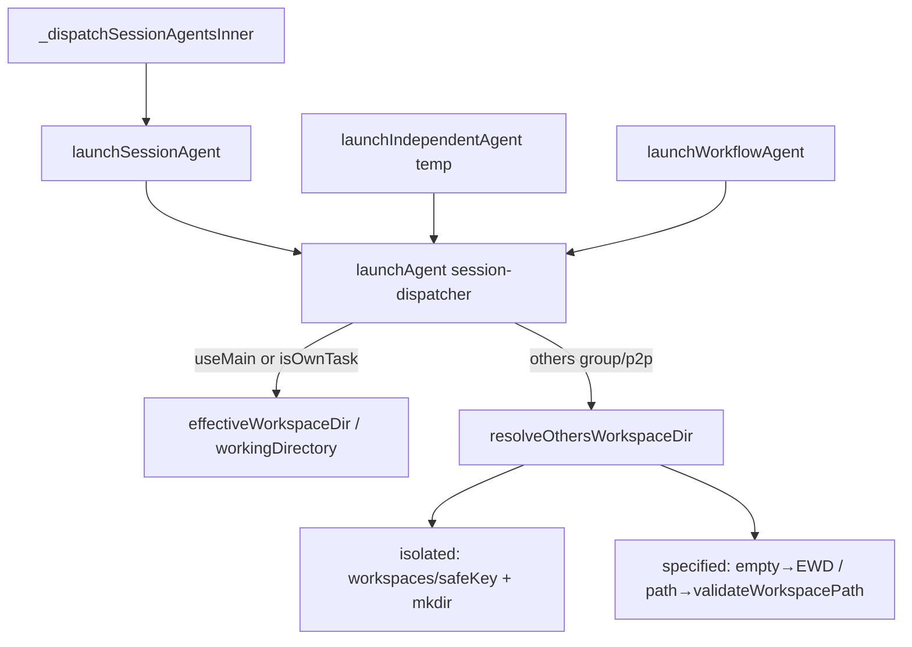

# 飞书临时会话工作目录可选 - 代码评审报告

## 1、审查范围

- **变更类型**: Rev1 增量实现 diff（`/kb-revise-apply`，T-Rev1-01~03）
- **评审等级**: focused-review（Rev1 增量；初版 apply T1–T5 已于前次评审通过）
- **涉及文件**: 7 个代码/文档文件
  - `electron/session-dispatcher.ts`（`resolveOthersWorkspaceDir`、`launchAgent` 他人分支）
  - `electron/config-store.ts`（`getChannels` 迁移兜底）
  - `src/shared/channel-types.ts`、`electron/preload.ts`、`src/renderer/env.d.ts`
  - `src/renderer/components/ChannelPanel.tsx`（`-dir` 说明 + 他人目录模式 UI）
  - `electron/AGENTS.md`（通道字段三处同步约定）
- **设计文档**: `02-design.md` Rev1 节、`03-tasks.md` T-Rev1-01~03、`07-prd-revisions.md` Rev1
- **CodeGraph 复核**: `launchAgent`（session-dispatcher）调用方 4 处（`launchSessionAgent` → `_dispatchSessionAgentsInner` 他人/群聊主路径；`launchIndependentAgent`/`launchWorkflowAgent` 不经他人分支）；`resolveOthersWorkspaceDir` 为模块内私有，仅 `launchAgent` else 分支调用

## 2、严重（必须处理）

无

## 3、警告（建议处理）

1. **指定目录模式未提示多人/多群共用路径的并发写风险**
   - 位置: `ChannelPanel.tsx`「指定目录」helper 文案
   - 设计预期: `02-design.md` Rev1·（五）风险节要求产品文案提示「指定目录模式下多人/多群共用同一路径」
   - 实际实现: UI 说明留空回退与路径选择齐全，但未显式并发冲突提示
   - 影响: 管理员可能将多群指向同一项目目录而不自知风险；启动与校验逻辑正确
   - 评分: 55（产品体验建议，不阻断 Rev1 代码评审）

## 4、设计偏差

无结构性偏差。`resolveOthersWorkspaceDir` 三分支（isolated / specified 留空 / specified 非空校验）与 Rev1·（二）对照表一致；temp `/chat new -dir` 仍走 `workingDirectory` 显式分支，不经他人解析。

## 5、验收标准检查

| 任务 | 验收条件 | 状态 |
|------|---------|------|
| T-Rev1-01 | 旧配置无新字段 → isolated + 隔离目录 | ✅ `getChannels` + `resolveOthersWorkspaceDir` 默认 `"isolated"` |
| T-Rev1-01 | isolated 两 chatKey 路径不同 | ✅ `workspaces/{safeChatId}` 按 sessionKey 隔离 |
| T-Rev1-01 | specified + 留空 → `effectiveWorkspaceDir` | ✅ L499–504 |
| T-Rev1-01 | specified + 有效路径 B → 在 B 运行 | ✅ `validateWorkspacePath` → `check.resolved` |
| T-Rev1-01 | specified + 无效路径 → 友好错误、不启动 | ✅ 早返回 `{ ok: false, error }`；`_dispatchSessionAgentsInner` L698–705 经 `notifyChat` 下发 |
| T-Rev1-01 | temp `/chat new -dir` 无回归 | ✅ 主用户/temp 走 `useMain \|\| isOwnTask` 或 `workingDirectory` 分支 |
| T-Rev1-01 | 三处类型 + getChannels 兜底 | ✅ channel-types / preload / env.d.ts 字段一致 |
| T-Rev1-02 | 配置页可见 `/chat new -dir` 说明 | ✅ 主用户区 `text-xs` 帮助块 |
| T-Rev1-02 | allowOthers 开启可切换模式并持久化 | ✅ segmented + `persistChannels` → `saveConfig` |
| T-Rev1-02 | 指定目录留空 UI 明示等同主会话 | ✅「（与主会话目录一致）」+ helper |
| T-Rev1-02 | 高级「通道工作目录」补充回退关系 | ✅ L701 helper |
| T-Rev1-02 | 全局 Settings 主工作目录无结构性改动 | ✅ 未改 Settings 页 |
| T-Rev1-03 | ChannelPanel reload / emptyChannel 兜底 | ✅ 与 `getChannels` 对称 |
| T-Rev1-03 | 01 验收 1–5、8（Daemon 帮助）仍成立 | ✅ Rev1 未改 session-dispatcher `/chat new` 与 daemon 帮助 |
| T-Rev1-03 | 01 验收 6–9、08 第 1 轮闭合 | ✅ 静态核对通过；运行态由 `/kb-test` 复验 |
| 02 Rev1·（五） | 模式保存重启、三种他人场景、配置页 `-dir` | ⏳ 代码层满足；E2E 待 kb-test |
| Ponytail | 无未批准抽象/新依赖 | ✅ 见 §9 |

## 6、调用链与回归风险

| 风险点 | 等级 | 说明 |
|--------|------|------|
| 他人/群聊启动失败文案 | 低 | `resolveOthersWorkspaceDir` 错误经 `formatAgentLaunchFailure` 下发，不静默 |
| temp / 工作流 / 主用户路径 | 无 | 他人分支仅 `!useMain && !isOwnTask`；workflow mkdir 逻辑未改 |
| 旧通道迁移 | 低 | 读时兜底 isolated/""，与现网 isolated 行为一致 |
| specified 运行时改主目录 | 低 | 已启动会话 `workspaceDir` 快照于 Agent Map，符合 01 F5 |
| 初版 `-dir` 置首含空格路径 | 低 | 继承前次评审 §7 债务，Rev1 未触及 `parseChatNewArgs` |

## 7、遗留债务

1. **指定目录并发写冲突提示缺失**（见 §3）：可在 ChannelPanel「指定目录」helper 补一句，或 archive 后产品迭代。评分 55。
2. **`-dir` 置首 + 含空格路径**（初版 apply 评审遗留）：`/chat new -dir /path/with spaces 任务` 路径截断；workaround 将 `-dir` 置于任务后。评分 50。
3. **MCP/Daemon `action=launch` 无 `-dir`**：02/T5 范围外，非 Rev1 阻塞。

## 8、修复任务建议

| 问题 ID | 建议动作 | 关联任务 |
|---------|----------|----------|
| — | 无 open 阻塞项 | — |
| W-Rev1-01 | 可选：指定目录 helper 补充并发写风险提示 | 非必须，可 post-archive |

## 9、结论

**通过**（Rev1 focused-review）。实现与 `02-design.md` Rev1、`03-tasks.md` T-Rev1-01~03、`07-prd-revisions.md` 一致：配置字段三处贯通、`getChannels` 迁移兜底、`resolveOthersWorkspaceDir` 三分支、`ChannelPanel` 闭合 08 第 1 轮打回项。**可进入 `/kb-test` 复验**（01 验收 6–9 + Rev1·（五）运行态）；**暂不可 `/kb-archive`**，须 kb-test 通过且 stage 回到可归档状态。

**Ponytail 精简检查**（≥3 条）：

1. **复用而非新建层**：他人目录解析为 `session-dispatcher.ts` 单文件内联 `resolveOthersWorkspaceDir`，校验复用既有 `validateWorkspacePath`，无 `WorkspaceResolver` 类或新 npm 包。
2. **配置同步最小面**：仅增两字段 + `getChannels`/ChannelPanel 读时兜底；`electron/AGENTS.md` 文档化三文件同步约定，无独立 migration 脚本。
3. **UI 贴合现网**：模式切换用既有 segmented button；路径选择复用 `selectDirectory` + 清除按钮，与通道工作目录控件同构；切回 isolated 时清空 `othersWorkspaceDir` 避免脏数据。
4. **调用链收敛**：CodeGraph 确认他人路径仅经 `launchSessionAgent` → `launchAgent` else；temp/workflow/主用户分支零交叉。

初版 apply（T1–T5）结论维持：**通过**；Rev1 未引入新的严重项或 ≥75 分阻断警告。
