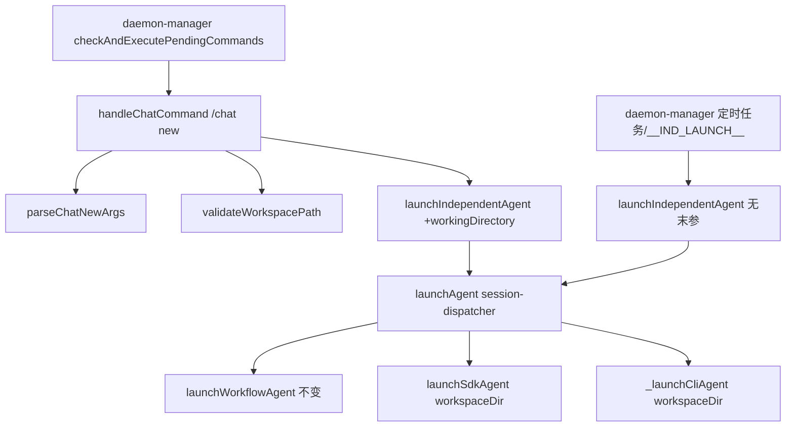

# 飞书临时会话工作目录可选 - 代码评审报告

## 1、审查范围

- **变更类型**: apply 产出的未提交变更（stage=applied）
- **评审等级**: focused-review
- **涉及文件**: 3 个代码文件 + 本评审报告
  - `electron/session-dispatcher.ts`（T1–T3 主改动）
  - `src/daemon.ts`（T4 帮助文案）
  - `electron/daemon-manager.ts`（T4 `/help` 文案）
- **设计文档**: `02-design.md`（对照基准）
- **CodeGraph 复核**: `launchIndependentAgent` 影响 12 符号（主路径 `handleChatCommand`、`daemon-manager` 定时任务/`__IND_LAUNCH__` 等）；`launchAgent`（session-dispatcher）影响 13 符号（含 `launchWorkflowAgent`/`workflow-runner`）；新增 `parseChatNewArgs`/`validateWorkspacePath` 为模块内私有函数，无外部调用方

## 2、严重（必须处理）

无

## 3、警告（建议处理）

无（评分 ≥75 项）

## 4、设计偏差

1. **`-dir` 置首时含空格路径仅取首 token**
   - 设计预期: T1 验收「`-dir` 后多 token 路径 join（含空格目录名）」；02 §四 语法允许 `-dir` 与任务描述顺序任意
   - 实际实现: `parseChatNewArgs` 在 `-dir` 位于首位时 `workingDirectory = after[0]`，仅首 token 为路径；任务在前、`-dir` 在后时 `after.join(" ")` 可正确 join 含空格路径
   - 影响: 用户发送 `/chat new -dir /path/with spaces 任务` 会将路径截断为 `/path/with`； workaround 为将 `-dir` 置于任务描述之后。示例用法均为单 token 路径，常见场景不受影响
   - 评分: 50（边缘场景，不阻断 archive）

## 5、验收标准检查

| 任务 | 验收条件 | 状态 |
|------|---------|------|
| T1 | `parseChatNewArgs` 支持 `-dir` 旗标、双顺序、缺参用法错误 | ✅ 静态核对通过 |
| T1 | `validateWorkspacePath` 不存在/无权限/非目录/有效绝对路径 | ✅ 含 `stat.isDirectory` + `accessSync(R_OK)` |
| T1 | 无未批准新抽象 | ✅ 两内联函数，Ponytail 合规 |
| T2 | `launchIndependentAgent` 透传 `workingDirectory` | ✅ |
| T2 | temp 显式目录跳过 `mkdirSync` | ✅ `chatType !== "temp"` 分支 |
| T2 | workflow 仍自动 mkdir | ✅ 非 temp 保留原逻辑 |
| T2 | 未传目录仍用 `effectiveWorkspaceDir` | ✅ `launchAgent` else 分支未改 |
| T3 | 解析→校验→失败早返回、不 `syncActiveSession` | ✅ L514–520 早返回 |
| T3 | 成功反馈含任务摘要、完整路径、SessionKey | ✅ L535–540 |
| T3 | 默认目录分支校验 `effectiveWorkspaceDir` | ✅ L517–519 |
| T3 | 01 验收 1–7 端到端行为 | ⏳ 代码层满足；运行态由 T5/kb-test 复验 |
| T4 | `/help` 与 `COMMANDS["/chat"]` 三要点 | ✅ 含可选 `-dir`、默认主会话、无效不创建 |
| T4 | 与 T3 底部用法语义一致 | ✅ |
| T5 | 01 验收 1–8 + 02 §8.2 五项 | ⏳ manifest 标记 done；评审仅静态确认，建议 kb-test 留痕 |
| 02 §8.2 | `-dir` 指向文件时友好错误 | ✅ 「指定路径不是目录…」 |
| 02 §8.2 | 校验失败活跃路由不变 | ✅ 未调用 launch/sync |
| 02 §8.2 | `/chat ls` basename、切换全路径 | ✅ ls 仍 basename；切换 L583 全路径 |
| 02 §8.2 | SDK/CLI 双资源 workspaceDir | ✅ 共用 `launchAgent` → `launchSdkAgent`/`_launchCliAgent` |
| 02 §8.2 | 工作流 mkdir 无回归 | ✅ workflow 非 temp 仍 mkdir |

## 6、调用链与回归风险

| 风险点 | 等级 | 说明 |
|--------|------|------|
| `launchWorkflowAgent` mkdir 行为 | 低 | `chatType !== "temp"` 保留 mkdir；CodeGraph 确认 workflow-runner 仍经原路径 |
| 定时任务/`__IND_LAUNCH__` 调用 `launchIndependentAgent` | 低 | 新增末参可选，现有 8 参调用签名兼容 |
| 主会话 `/workspace`、群聊/他人隔离目录 | 无 | 未触及 |
| MCP/Daemon `action=launch` 无 `-dir` | 已知范围外 | 02/T5 已记录，非本期阻塞 |

## 7、遗留债务

1. **`-dir` 置首 + 含空格路径**（见 §4）：若产品需完全对称支持，可在后续将 `-dir` 置首时的路径解析改为「末 token 为任务起点」或文档明确「含空格路径请将 `-dir` 放在任务描述之后」。评分 50，不阻断 archive。
2. **MCP/Daemon `action=launch` 未扩展 `-dir`**：02 明确本期不纳入；管理员若仅经该路径创建 temp 仍用默认主会话目录（待产品确认是否后续统一）。

## 8、修复任务建议

| 问题 ID | 建议动作 | 关联任务 |
|---------|----------|----------|
| — | 无 open 阻塞项 | — |

## 9、结论

**通过**，可进入 `/kb-test` 与 `/kb-archive`。

实现与 `02-design.md`/`03-tasks.md` 一致：解析、校验、调度透传、temp mkdir 修正、帮助文案均已落盘；CodeGraph 影响面收敛于 session-dispatcher 与既有 `launchIndependentAgent` 调用链，无意外跨模块签名破坏。Ponytail：**Lean already. Ship.**（两内联函数、无新依赖/服务层）。§4 边缘解析偏差与 MCP 入口范围外项记入遗留债务，不构成 archive 阻塞。
