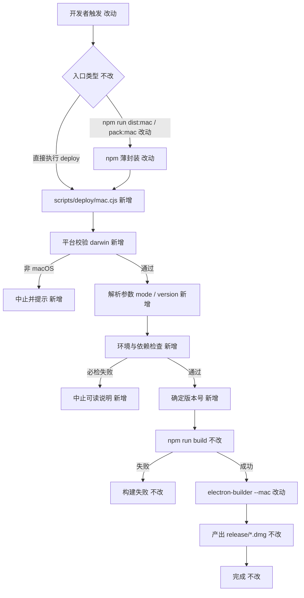
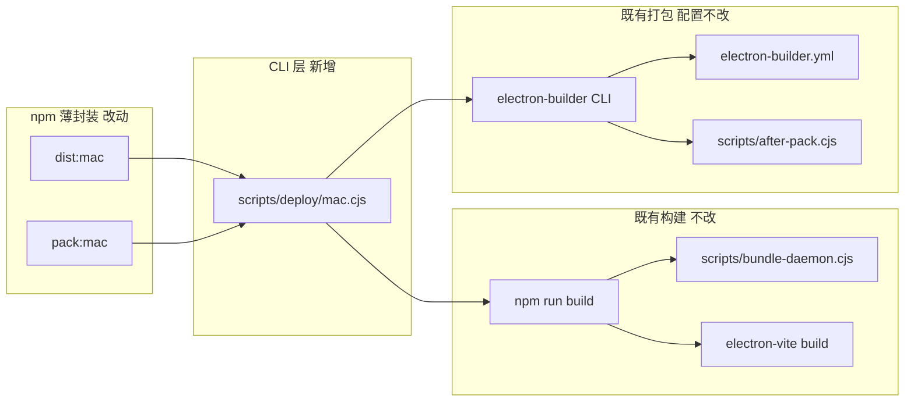

# macOS 本地打包脚本 - 实现设计

> **业务 PRD**：见同目录 `01-proposal.md`（验收标准以 01 为准）

## 一、业务流程与改动范围

> 业务口径以 `01-proposal.md` 用户场景（A～D）与功能需求 F1～F4 为准；01 未单独设「§业务流程」小节，下图按场景与验收步骤展开主流程与关键分支。

### （一）业务流程图



**图例**：`不改` 行为与现网一致；`改动` 需改代码/配置；`新增` 新节点或新分支；`删除` 本变更无删除路径。

### （二）流程步骤与改动对照

| 步骤 ID | 业务含义 | 改动 | 落点（模块/文件） | 01 验收关联 |
|---------|----------|------|-------------------|-------------|
| S0 | 开发者选择触发方式（直接脚本 / npm） | 改动 | `package.json`（`dist:mac`、`pack:mac`） | 验收 5；场景 D |
| S1 | 进入统一 deploy 入口 | 新增 | `scripts/deploy/mac.cjs` | 验收 1；F1.1 |
| S2 | 校验当前为 macOS | 新增 | `scripts/deploy/mac.cjs` | 验收 6（范围） |
| S3 | 解析 CLI：`--mode dist\|pack`、`--version` | 新增 | `scripts/deploy/mac.cjs` | 验收 3、4；F3.1～F3.3 |
| S4 | 环境与依赖必检（Node、依赖、工具、签名态） | 新增 | `scripts/deploy/mac.cjs`（检查逻辑 inline） | 验收 2；F2.1～F2.3；场景 B |
| S5 | 确定本轮版本（默认 package.json / 显式 `--version` 互斥） | 新增 | `scripts/deploy/mac.cjs` | 验收 3、4；场景 C |
| S6 | 执行既有构建链 | 不改 | `package.json` `build` → `scripts/bundle-daemon.cjs` 等 | 验收 1、7；F1.2 |
| S7 | electron-builder mac 打包（dmg 或 dir） | 改动 | `scripts/deploy/mac.cjs` 调用 CLI；配置仍读 `electron-builder.yml` | 验收 1；F1.2、F1.3 |
| S8 | 产物写入 `release/` | 不改 | `electron-builder.yml` `directories.output` | 验收 1 |
| S9 | CI 远程构建 | 不改 | `.github/workflows/build.yml` | 验收 6 |
| S10 | Win/Linux 本地打包 | 不改 | `package.json` `dist:win` 等 | 验收 6 |

### （三）改动汇总

- **改动**：`package.json` 中 `dist:mac`、`pack:mac` 改为调用 deploy 脚本；打包 orchestration 从 shell 拼接迁入 `scripts/deploy/mac.cjs`。
- **新增**：`scripts/deploy/mac.cjs`（统一入口：参数解析、环境检查、版本解析、spawn `npm run build` + `electron-builder`）。
- **不改（显式列出）**：`electron-builder.yml`  mac 目标与 `release/` 输出；`scripts/bundle-daemon.cjs`、`scripts/after-pack.cjs`；`build` / `build:bundle` / `clean` 链路；`.github/workflows/build.yml`；Win/Linux npm scripts；Electron 应用代码与 UI。

## 二、整体思路

**根因**（见 01 背景）：打包入口分散在多条 npm 命令，缺少前置校验与明确的版本指定方式，导致本机出包记忆成本高、失败发现晚。

**方案要点**：

1. 在 `scripts/deploy/` 新增 **单一 CLI 入口** `mac.cjs`，串起「检查 → 版本 → build → electron-builder」，与现网 `dist:mac` / `pack:mac` 行为对齐。
2. **检查在前、构建在后**：必检失败立即 `process.exit(1)`，输出中文可操作说明（对齐 F2.3）。
3. **版本互斥**：未传 `--version` 时使用 `package.json` 的 `version`；传入时校验 semver 并通过 `electron-builder --config.extraMetadata.version=<ver>` 覆盖，不写回 `package.json`。
4. **npm 薄封装**：`dist:mac` → `node scripts/deploy/mac.cjs --mode=dist`；`pack:mac` → `--mode=pack`；禁止再保留独立的 `npm run build && electron-builder` 第二路径。

**最小方案三问**（Ponytail）：

1. **复用现有模块？** 是。构建仍调用 `npm run build`；打包仍调用 `electron-builder --mac`，配置仍读 `electron-builder.yml`；`afterPack` 仍走 `scripts/after-pack.cjs`。不新建 TS 层或 build 抽象。
2. **新增依赖/抽象？** 否。检查用 Node 内置 `fs`/`child_process`/`process.version`；semver 校验复用项目已有 `semver`（`package.json` devDependencies）。不新增 npm 包。
3. **合并 vs 新建文件？** 新建 `scripts/deploy/mac.cjs` 因 01 明确要求目录 `scripts/deploy/` 与统一入口；检查逻辑 inline 于单文件，不预建 `lib/checks.cjs` 通用层（单点需求，YAGNI）。

## 三、分层设计



- **CLI 层（新增）**：参数、环境检查、版本、子进程编排。
- **npm 层（改动）**：仅转发至 deploy 脚本。
- **构建/打包层（不改配置）**：沿用现有脚本与 electron-builder 配置。

## 四、接口设计

### CLI：`node scripts/deploy/mac.cjs [options]`

| 参数 | 必填 | 说明 |
|------|------|------|
| `--mode=dist` | 否，默认 `dist` | `dist`：dmg（等价原 `dist:mac`）；`pack`：目录模式（等价原 `pack:mac`，附加 `--dir`） |
| `--version=<semver>` | 否 | 显式版本；与默认读 `package.json` 互斥（有则覆盖，无则用 package.json） |
| `--help` | 否 | 打印用法 |

**退出码**：`0` 成功；`1` 检查失败、参数错误或子进程非零退出。

**子进程契约**：

1. `npm run build`（cwd = 仓库根）
2. `npx electron-builder --mac [--dir] --publish never --config.extraMetadata.version=<resolvedVersion>`

`--publish never` 与 CI mac 步骤一致（`.github/workflows/build.yml`），避免本地误触发 publish。

npm 薄封装（`package.json` 拟定，implement 阶段落地）：

```json
"dist:mac": "node scripts/deploy/mac.cjs --mode=dist",
"pack:mac": "node scripts/deploy/mac.cjs --mode=pack"
```

## 五、数据结构

无数据库/持久化模型变更。

**运行时读取**：

| 来源 | 字段/用途 |
|------|-----------|
| `package.json` | `version`（默认版本）、`engines.node`（Node 下限，现网 `>=18.0.0`） |
| 环境变量（只读检测） | `CSC_LINK`、`CSC_NAME`、`APPLE_ID`、`APPLE_APP_SPECIFIC_PASSWORD` — 用于签名/公证**就绪提示**，非必检 |

**版本覆盖**：仅通过 electron-builder CLI `extraMetadata.version` 传入，不修改磁盘上的 `package.json`。

## 六、实现步骤

1. **S1**：新建 `scripts/deploy/mac.cjs` — CLI 解析（`--mode`、`--version`、`--help`），非 darwin 立即失败。（对应 S1～S3）
2. **S2**：在同文件实现 `runChecks()` — 见 §八·（二）必检清单；失败打印中文说明并 exit 1。（S4）
3. **S3**：实现 `resolveVersion()` — 无 `--version` 读 `package.json`；有则 `semver.valid()`，非法则失败。（S5）
4. **S4**：`spawn`/`exec` 顺序执行 `npm run build`，再 `npx electron-builder --mac`（`pack` 加 `--dir`），透传 stdio。（S6～S7）
5. **S5**：修改 `package.json` 的 `dist:mac`、`pack:mac` 为 deploy 薄封装。（S0）
6. **S6**（可选，archive 前）：README「打包」小节补充 deploy 入口与 `--version` 示例 — 归 kb-archive 知识库更新，implement 可不改 README。

## 七、参考实现

CodeGraph 对 npm scripts / `.cjs` 辅助脚本索引有限，以下回源码核实：

| 符号/路径 | 作用 | 与流程关系 |
|-----------|------|------------|
| `package.json` `scripts.build` | `clean` → `build:mcp` → `build:bundle` → `electron-vite build` | S6 不改 |
| `package.json` `scripts.dist:mac` / `pack:mac` | 现网：`npm run build && electron-builder --mac [--dir]` | S0 改为薄封装 |
| `scripts/bundle-daemon.cjs` `main()` | esbuild 产出 `dist-bundle/daemon-entry.mjs` | build 链一环，不改 |
| `scripts/after-pack.cjs` `module.exports` | mac/win 写入 `app-update.yml` | electron-builder `afterPack` 钩子，不改 |
| `electron-builder.yml` `mac.target` | dmg，`arch: [x64, arm64]` | S7/S8 产物形态 |
| `electron-builder.yml` `directories.output` | `release` | S8 |
| `.github/workflows/build.yml` mac Package step | `npm run build` + `npx electron-builder --mac --publish never` | S9 不改，对照 publish 行为 |
| `scripts/dev-fresh-setup.cjs` `run()` | `spawn` + `stdio: inherit` 模式 | deploy 子进程编排参考 |

## 八、技术影响

### （一）影响范围

- **涉及模块**：`scripts/deploy/`（新增）、`package.json` scripts（改动）。
- **接口/proto 变更**：无。
- **数据变更**：无。
- **风险**：
  - 版本覆盖仅作用于 electron-builder 元数据，若构建链其他步骤硬编码读 `package.json` 且与 `--version` 不一致，可能出现极少数不一致（现网 `bundle-daemon.cjs` inline 的是构建时 package.json，implement 需在验收 4 核对 dmg 内展示版本）。
  - 无签名本地 dmg 在 Gatekeeper 下需右键打开；检查阶段须明确提示，避免误判为脚本 bug。
  - `dist:mac` 行为从「npm script 内嵌 build」变为 deploy 内 spawn build，总步骤等价，但错误栈可能多一层 wrapper。

### （二）工程补充验收项

- [ ] 在 macOS 上 `node scripts/deploy/mac.cjs` 与 `npm run dist:mac` 产出同名形态 dmg（x64 + arm64），位于 `release/`。
- [ ] `NODE_OPTIONS` 或临时改 PATH 模拟 Node 低于 18 时，脚本在 build 前失败且信息可读。
- [ ] 未配置 CSC/Apple 凭据时，检查输出含「无签名/本地打包」说明且流程可继续（与 01 F2.2 一致）。
- [ ] `npm run pack:mac` 走 `--mode=pack`，产出为 `--dir` 目录结构而非 dmg。
- [ ] CI `build.yml` 未引用 deploy 脚本，PR 不修改 workflow。

## 九、知识库影响

- `knowledge/工程平台/Electron桌面应用/` — 当前无打包/构建子模块；archive 时可在 `01-概览` 或新建 `05-构建与打包.md` 记录本地 mac 出包入口（视 archive 决策）。
- `README.md` — 打包命令仍列 `npm run dist:mac`，可补充 deploy 直接调用说明。
- **两级索引**：若新建工程平台子模块，需更新 `knowledge/工程平台/Electron桌面应用/00-README.md` 与 `knowledge/知识索引.md`（archive 阶段定稿）。

## 十、知识库更新计划

### （一）必须更新

- 无（本阶段仅 design；用户可见文档随 archive 交付）。

### （二）可能更新（视实现结果）

- `knowledge/工程平台/Electron桌面应用/00-README.md` — 增加构建/打包阅读入口。
- 新建 `knowledge/工程平台/Electron桌面应用/05-构建与打包.md` — 十段式记录 deploy 脚本、检查项、版本参数（若单文件超 3000 字再拆）。
- 根 `README.md` — 打包一节补充 `scripts/deploy/mac.cjs` 用法。

### （三）不需要更新

- `knowledge/业务域/**` — 无用户可见行为变更。
- `knowledge/工程平台/Daemon守护进程/**` — 与 Daemon 部署无关。
- `.github/workflows/build.yml` 相关知识 — 本期不改 CI。
