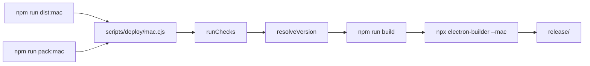

# macOS 本地打包脚本 - 代码评审报告

## 1、审查范围

- **变更类型**: apply 产出的未提交变更（含 untracked `scripts/deploy/`）
- **评审等级**: focused-review（单文件 CLI + npm 薄封装，无 proto/数据/权限/跨端契约变更）
- **涉及文件**: 3 个实现文件 + 1 个规范文件
  - `scripts/deploy/mac.cjs`（新增）
  - `scripts/deploy/AGENTS.md`（新增）
  - `package.json`（`dist:mac` / `pack:mac` 改动）
- **设计文档**: `02-design.md`（对照基准）
- **CodeGraph**: 对 `.cjs` 部署脚本索引有限（与 `02` §七 一致）；已用 `projectPath` 调用 `codegraph_context` / `codegraph_search`，未命中 deploy 符号；评审以源码对照 + 本机 CLI 冒烟为主

## 2、严重（必须处理）

无

## 3、警告（建议处理）

无

## 4、设计偏差

1. **CLI 增加 `-h` 别名**
   - 设计预期: `02` §四 仅列 `--help`
   - 实际实现: `parseArgs` 同时接受 `-h`（`mac.cjs:24`）
   - 影响: 无害扩展，与常见 CLI 习惯一致

2. **新增 `scripts/deploy/AGENTS.md` 未列入 `02` §一·（三）改动汇总**
   - 设计预期: 改动汇总仅列 `mac.cjs` 与 `package.json`
   - 实际实现: 额外新增 deploy 目录编码规范
   - 影响: 正向补充，约束 inline 检查与 spawn 模式，不扩大功能范围

3. **文档笔误（非实现偏差）**
   - `02` §二 写 semver 位于 devDependencies；现网 `semver` 在 `dependencies`（`package.json:49`），实现 `require("semver")` 更稳妥

## 5、验收标准检查

### 01-proposal 验收标准

| 任务/来源 | 验收条件 | 状态 |
|-----------|---------|------|
| 验收 1 | macOS 下 deploy 入口完成 mac 打包，产出 `release/` dmg（x64+arm64） | ⚠️ 逻辑与 `electron-builder.yml` 对齐；完整 dmg 构建未在本评审会话执行（见 §7） |
| 验收 2 | 必检失败在 build 前中止且说明可读 | ✅ `runChecks` Node/node_modules/electron-builder 必检 + 中文错误（`mac.cjs:72-95`）；本机验证 `--mode=foo`、`--version=not-a-version` 均 build 前失败 |
| 验收 3 | 未指定版本时与 `package.json` 一致 | ✅ `resolveVersion` 无参读 `pkg.version`（`mac.cjs:117-119`） |
| 验收 4 | 显式 `--version` 覆盖且合法 semver | ✅ `semver.valid` 校验；`1.2.3-test` 通过；非法值 exit 1 |
| 验收 5 | `dist:mac` / `pack:mac` 与直接调用 deploy 一致 | ✅ `package.json` 薄封装指向同一 CLI（`34-36`） |
| 验收 6 | 无 Win/Linux deploy、不暗示 CI | ✅ 仅 `darwin` 平台校验；`.github/workflows/build.yml` 未改、未引用 deploy |
| 验收 7 | 无用户界面变更 | ✅ 仅 scripts 层变更 |

### 03-tasks 分项

| 任务 | 验收条件 | 状态 |
|------|---------|------|
| T1 | `--help` exit 0；mode 解析；非 darwin 失败；非法 mode 失败 | ✅ 本机 `--help` 通过；`--mode=foo` 可读错误 |
| T2 | Node/node_modules/eb 必检；无签名 warn 可继续 | ✅ 实现完整；无 CSC 时输出「无签名本地打包」+ Gatekeeper 提示 |
| T3 | 版本互斥、不写回 package.json、非法 semver 失败 | ✅ |
| T4 | build → electron-builder 顺序；pack 加 `--dir`；`--publish never`；extraMetadata.version | ✅ `runPipeline`（`mac.cjs:134-151`）与 `02` §四 一致 |
| T5 | npm 薄封装；CI/workflow 不变；Win/Linux 不变 | ✅ diff 仅改 mac 两条 script |

### 02 §八·（二）工程补充验收项

| 项 | 状态 |
|----|------|
| dmg 形态与改前一致 | ⚠️ 待 archive 前本机 `npm run dist:mac` 一次确认 |
| Node&lt;18 build 前失败 | ✅ 逻辑正确（`semver.satisfies` + `engines.node`） |
| 无 CSC 时 warn 且可继续 | ✅ 本机冒烟已见 warn |
| `pack:mac` 产出 dir | ✅ `--dir` 分支已实现 |
| CI 未引用 deploy | ✅ workflow 仍为 `npm run build` + `npx electron-builder --mac --publish never` |

## 6、调用链与回归风险

| 回归点 | 风险 | 说明 |
|--------|------|------|
| `dist:mac` 路径切换 | 低 | 行为从 npm 内联改为 deploy spawn；步骤等价，且统一加 `--publish never`（对齐 CI） |
| `--version` 覆盖 | 低 | 设计已注明 bundle 链可能与 extraMetadata 偶发不一致；现网风险未扩大 |
| Win/Linux scripts | 无 | 未改动 |
| CI mac 步骤 | 无 | 仍不经过 deploy 脚本 |
| 子进程错误信息 | 低 | `run` 失败仅报 `npm exit N` / `npx exit N`，可后续 polish，不阻断 |

## 7、遗留债务

1. **完整打包 E2E**：`02` §八·（二）第 1、4 项及 01 验收 1 需在本机 macOS 跑一次 `node scripts/deploy/mac.cjs` 与 `npm run dist:mac` / `pack:mac`，确认 `release/` 产物形态；属 archive 前人工确认，非代码缺陷。
2. **Ponytail**：实现符合 `02` §二 最小方案（单文件 inline、无 lib/、无新依赖）。**Lean already. Ship.**

## 8、修复任务建议

| 问题 ID | 建议动作 | 关联任务 |
|---------|----------|----------|
| — | 无 open 问题 | — |

## 9、结论

**通过**，可进入 `/kb-archive`。

实现与 `02-design.md`、`03-tasks.md` 高度一致：统一 deploy 入口、检查前置、版本互斥、npm 薄封装、CI 隔离均到位。CodeGraph 对 `.cjs` 索引不足已在设计阶段预期；源码与 CLI 冒烟验证无评分 ≥75 的阻断项。archive 阶段按 `02` §九/§十 补充 README/工程平台文档，并建议归档前完成一次本机 dmg/dir 产出确认。
