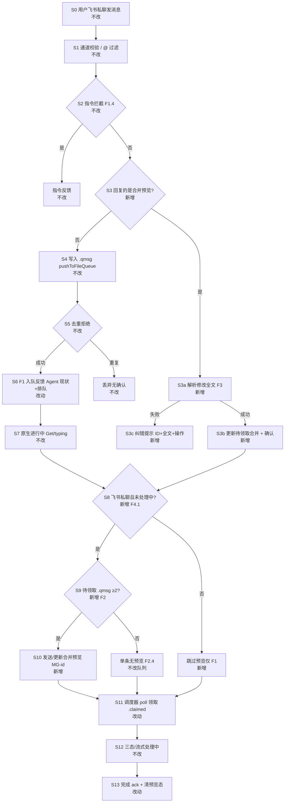
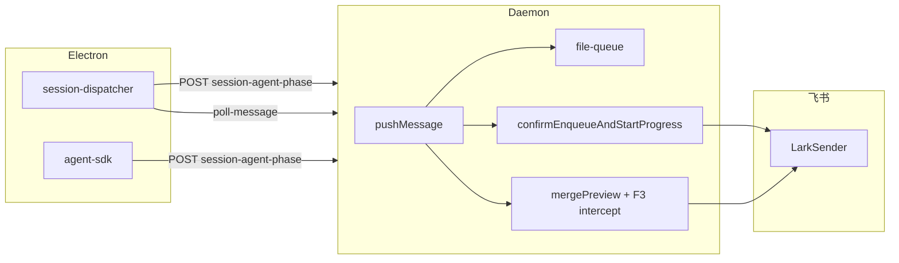

# 飞书排队消息状态反馈与合并预览 - 实现设计

> **业务 PRD**：见同目录 `01-proposal.md`（验收标准以 01 为准）

## 一、业务流程与改动范围

> 业务口径以 `01-proposal.md` 功能需求 F1–F4 与验收标准为准；下图覆盖主流程与关键分支。

### （一）业务流程图



**图例**：`不改` = 现网行为保持；`改动` = 在既有节点调整；`新增` = 新分支或能力；`删除` = 本期无删除项。

### （二）流程步骤与改动对照

| 步骤 ID | 业务含义 | 改动 | 落点（模块/文件） | 01 验收关联 |
|---------|----------|------|-------------------|-------------|
| S0 | 用户经飞书私聊发送消息 | 不改 | `src/shared/lark-core.ts` WS 收消息 | — |
| S1 | 通道校验、群 @ 过滤、空消息丢弃 | 不改 | `src/daemon.ts` `startFeishuChannel` | — |
| S2 | 指令拦截，不入常规队列 | 不改 | `src/daemon.ts` `isCommand` / `handleCommand` | F1.4 |
| S3 | 判断 inbound 是否回复合并预览（`parentId`） | 新增 | `src/daemon.ts` `tryHandleMergePreviewReply`；飞书 `parentId` 传入 | F3.1–F3.6 |
| S3a | 用户回复预览提交新全文，替换待领取合并 | 新增 | `src/daemon.ts` + `src/file-queue.ts` `replaceSessionUnclaimedMessages` | 验收 6–8 |
| S3b/c | 修改成功确认 / 失败纠错（含 ID+全文+操作说明） | 新增 | `src/daemon.ts` `replyToMessage` | 验收 7–8 |
| S4 | 校验通过后写入 `.qmsg` | 不改 | `src/file-queue.ts` `pushToFileQueue` | — |
| S5 | 重复 messageId 去重 | 不改 | `src/file-queue.ts` dedup | — |
| S6 | 入队反馈：Agent 现状 + 排队数（组合一条） | 改动 | `src/daemon.ts` `buildEnqueueStatusText` / `confirmEnqueueAndStartProgress` | F1、验收 1–3 |
| S7 | 入队后原生进行中（Get/typing） | 不改 | `src/daemon.ts` `confirmEnqueueAndStartProgress` | — |
| S8 | Agent 处理中/流式时抑制新预览 | 新增 | `src/daemon.ts` `shouldSuppressMergePreview` | F4.1、验收 10 |
| S9 | 统计待领取 `.qmsg` ≥2 触发预览 | 新增 | `src/file-queue.ts` `getSessionUnclaimedCount`；`listUnclaimedMessages` | F2.1、F2.4、验收 4/9 |
| S10 | 发送/更新合并预览（MG-id、全文、【消息 N】） | 新增 | `src/daemon.ts` `scheduleMergePreview` / `sendMergePreview` | F2、F3 引导、验收 4–5/11 |
| S11 | poll 领取；若有 merge override 则合并为单条交付 Agent | 改动 | `src/file-queue.ts` `claimSessionMessages` 或 daemon 包装 | F2.2、验收 6 |
| S12 | 三态「正在启动/处理中」+ CardKit 流式 | 不改 | `electron/session-dispatcher.ts`、`electron/agent-sdk.ts`、`/api/stream-text` | F4.2–F4.4 |
| S13 | 任务完成/领取后清除预览批次与 phase | 改动 | `src/daemon.ts` `clearMergePreviewState`；`ackOnReply` / poll 钩子 | F2.6 |

### （三）改动汇总

**改动**

- `confirmEnqueueAndStartProgress`：固定「已收到，正在处理」改为按 Agent 阶段（处理中/启动/空闲）+ 排队数组合文案（S6）。
- `claimSessionMessages`（或 poll 前包装）：若存在用户修改后的 merge override，向 Agent 交付 override 全文而非多段原文（S11）。
- `ackOnReply` / poll 领取成功：清除对应 `MergePreviewState`（S13）。

**新增**

- `getSessionUnclaimedCount` / `listUnclaimedMessages`：仅统计/读取 `.qmsg`（待领取，不含 `.claimed`）。
- `sessionAgentPhaseMap` + `POST /api/session-agent-phase`：electron 上报 starting/processing/idle，供 F1 与 F4 判定。
- `MergePreviewState` + `mergePreviewRegistry`：MG-id、预览 outbound messageId、合并全文、debounce 调度。
- `tryHandleMergePreviewReply`：回复预览走修改路径，**不入常规队列**（S3）。
- `scheduleMergePreview` / `sendMergePreview`：飞书私聊专用；超长全文分条发送策略（§五 NF4）。

**不改**

- 入队顺序、sessionKey 路由、`resolveRoutingKey` 对普通消息的语义（S4）。
- 三态进度文案（「正在启动」「Agent 处理中…」）与 stream-text CardKit 链路（S12）。
- 指令系统、微信/群聊合并预览与回复修改（01 验收 12 边界；F1 文案增强可随 S6 共用 daemon 逻辑，但不强制微信验收集）。

## 二、整体思路

**根因**：既有入队确认仅「已收到 + 排队数」，未反映 Agent 正在处理/启动/空闲；多条 `.qmsg` 在 poll 前对用户不可见且不可改；飞书已支持 `parentId` 回复链但未用于合并预览修改。

**方案要点**：

1. **F1**：daemon 入队确认时读取 `sessionAgentPhaseMap`（electron 上报）+ 队列 `.claimed`/`.qmsg` 作兜底，生成 F1.1–F1.3 文案；排队数仍用 `getSessionPendingCount`，前方条数 = `pending - 1`。
2. **F2**：入队成功后 debounce 检查 `getSessionUnclaimedCount ≥ 2` 且 `!shouldSuppressMergePreview`，复用与 `pullMergedMessagesFromQueue` 相同的 `【消息 N】` 拼接规则生成预览；MG-id 在批次首次预览时生成并沿用至领取或批次结束。
3. **F3**：飞书 `parentId` 命中 `mergePreviewRegistry` 时拦截，用 `replaceSessionUnclaimedMessages` 将待领取条数折叠为一条 override `.qmsg`（或内存 override + claim 时合成），回复确认/失败均带 ID+全文。
4. **F4**：`shouldSuppressMergePreview` = phase 为 processing **或** 存在 `.claimed` **或** `sessionProgressMap` 流式 outbound 活跃；此期间仅 S6，不发 S10。

**与 01 追溯**：F1→S6；F2→S9/S10；F3→S3；F4→S8/S12 分工。

**Ponytail 最小方案三问**：

1. **复用既有符号？** 是。入队仍走 `pushMessage`→`confirmEnqueueAndStartProgress`→`replyToMessage`；合并正文格式对齐 `pullMergedMessagesFromQueue`（`electron/session-dispatcher.ts:221–223`）；回复链复用飞书已有 `parentId`→`replyMessageId` 与 `messageSessionMap`/`trackMessageSession` 模式。
2. **新抽象是否 01 要求？** `MergePreviewState` 与 phase Map 为 F2/F3/F4 所必需；不引入跨通道通用 PreviewManager trait。MG-id 生成 inline 于 `sendMergePreview`。
3. **合并文件？** 是。预览/修改/F1 文案均在 `daemon.ts` + `file-queue.ts` 扩展；electron 仅在既有 `notifyChat`/SDK 启动点各加一行 `reportSessionAgentPhase` HTTP 调用，不新建 electron 模块。

## 三、分层设计

| 层 | 职责 | 落点 |
|----|------|------|
| 端点层 | 入队、poll、phase 上报、send-text（既有） | `src/daemon.ts` |
| 调度层 | Agent 拉起、starting/processing 通知 | `electron/session-dispatcher.ts`、`electron/agent-sdk.ts` |
| 通道层 | 飞书 reply 预览/确认、分条发送 | `src/shared/lark-core.ts` `sendMessage`/`replyMessage` |
| 数据层 | `.qmsg`/`.claimed`、待领取计数、override 替换 | `src/file-queue.ts` |



## 四、接口设计

**`buildEnqueueStatusText(sessionKey, pending)`（内部）**

- 输入：`pending = getSessionPendingCount(sessionKey)`；读取 `sessionAgentPhaseMap.get(sessionKey)`，兜底：`.claimed > 0` → processing；否则 idle；phase=starting → F1.2。
- 输出示例见 01 文案表；`pending > 1` 时附加 `（前面还有 ${pending - 1} 条待处理）`。

**`POST /api/session-agent-phase`（新增，electron→daemon 内部）**

| 字段 | 类型 | 必填 | 说明 |
|------|------|------|------|
| `session_key` | string | 是 | 会话路由键 |
| `phase` | `"starting"` \| `"processing"` \| `"idle"` | 是 | Agent 阶段快照 |

响应 `{ ok: true }`。daemon 在 `confirmEnqueueAndStartProgress` 与 `shouldSuppressMergePreview` 读取；`idle` 时 delete 条目。

**上报时机（electron 改动）**

- `NOTIFY_STARTING` 前 → `starting`（`session-dispatcher.ts` `_dispatchSessionAgentsInner` L690 附近）。
- 「Agent 处理中…」/`launchSdkAgent` 成功 → `processing`。
- `handleSessionClosed` / Agent stop → `idle`。

**`tryHandleMergePreviewReply(parentId, text, ...)`（内部）**

- `parentId` 在 `mergePreviewRegistry` 命中 → 校验非空正文；`replaceSessionUnclaimedMessages(sessionKey, text)`；成功/失败 `replyToMessage`；**return true 跳过 pushMessage**。
- 未命中 → return false，走常规 S4。

**`sendMergePreview(sessionKey)`（内部）**

- 飞书私聊 + 主用户场景（与 `isStreamTextEligible` 范围一致，可复用或 inline）。
- 文案模板见 01；`trackMessageSession(previewMessageId, sessionKey)`；registry 记录 `previewMessageId → mergeId`。

**无变更**：`/api/poll-message`、`/api/stream-text`、`/api/send-text` 契约不变；F3 修改确认走 `replyToMessage`，不走 send-text 三态。

## 五、数据结构

**`sessionAgentPhaseMap`（daemon 内存）**

```typescript
type AgentPhase = "starting" | "processing" | "idle";
// Map<sessionKey, AgentPhase> — 仅 starting/processing 常驻；idle 即删除
```

**`MergePreviewState`（daemon 内存，按 sessionKey）**

```typescript
interface MergePreviewState {
  mergeId: string;              // MG-{profile}-{YYYYMMDDHHmmss}，批次内不变
  mergedText: string;         // 当前全文（含【消息 N】或用户 override）
  previewMessageIds: string[]; // 历次预览 outbound id，供 F3 回复关联
  lastPreviewMessageId?: string;
  updated: boolean;           // 是否已发「已更新」版
  debounceTimer?: NodeJS.Timeout;
}
// mergePreviewRegistry: Map<feishuMessageId, { sessionKey, mergeId }>
```

**MG-id 生成规则**

- `profile`：`meta.senderOpenId` 去前缀 `ou_` 取后 8 位，或 `extractChatId(sessionKey)` 末段，sanitize 为 `[a-z0-9-]`、最长 16；缺省 `user`。
- 时间戳：批次**首次**预览时 `formatLocal(YMDHms)`；F2.5 更新不换 ID。
- 碰撞：同会话同秒复用已有 state.mergeId。

**`getSessionUnclaimedCount(sessionKey)`（file-queue 新增）**

- 仅计 `.qmsg`；与 `getSessionPendingCount`（含 `.claimed`）区分；F2 触发与预览正文读取均基于此。

**`replaceSessionUnclaimedMessages(sessionKey, newText)`（file-queue 新增）**

- 删除该会话全部 `.qmsg`；写入单条新 `.qmsg`（新 messageId 可选 internal）；更新 `MergePreviewState.mergedText`；保留原 `mergeId`。

**超长预览（NF4）**

- 单条飞书文本上限约 30KB；超出时按段落拆为连续消息，首条含 ID+引导，后续条首行标注「（合并预览续 N/M）」；registry 仅首条 messageId 入 `mergePreviewRegistry` 主键，续条可选入 alias 表或同一 mergeId 下 `previewMessageIds` 均可回复（实现择一并在 §八·（二）验收）。

**数据库**：无变更。

## 六、实现步骤

1. **S9 基础**：`file-queue.ts` 实现 `getSessionUnclaimedCount`、`listUnclaimedMessages`、`replaceSessionUnclaimedMessages`；单测/手动验证仅计 `.qmsg`。
2. **Phase API**：daemon 新增 `sessionAgentPhaseMap` 与 `POST /api/session-agent-phase`；electron `reportSessionAgentPhase` helper，`session-dispatcher`/`agent-sdk` 三处上报（对应 S12 既有 notify 点）。
3. **S6 F1 文案**：`buildEnqueueStatusText` + 改造 `confirmEnqueueAndStartProgress`；保留 Get/typing 逻辑不变。
4. **S8 F4 守卫**：`shouldSuppressMergePreview(sessionKey)` 读 phase + `.claimed` + `sessionProgressMap` 流式字段。
5. **S10 预览核心**：`MergePreviewState`、`formatMergePreviewBody`（对齐 `pullMergedMessagesFromQueue` 拼接）、`scheduleMergePreview`（debounce 500ms，NF2）、`sendMergePreview`；`pushMessage` 成功分支末尾 schedule（飞书 p2p gated）。
6. **S3 F3 拦截**：`tryHandleMergePreviewReply` 在 `startFeishuChannel` enqueue 前调用；成功则不发 F1 二次确认（修改路径单独确认文案）。
7. **S11 override 交付**：poll 返回前或 `claimSessionMessages` 包装：若 `MergePreviewState.mergedText` 为 override 且仅一条 unclaimed，向 Agent 返回 override 全文；多 messageId ack 语义与现网「整批 ack」一致。
8. **S13 清理**：poll 领取（`.qmsg→.claimed`）后 `clearMergePreviewState`；`ackOnReply` 兜底清理。
9. **文档与验收**：按 01 验收 1–12 与 §八·（二）执行；范围标注飞书私聊。

## 七、参考实现

| 符号 | 路径 | 用途 |
|------|------|------|
| `confirmEnqueueAndStartProgress` | `src/daemon.ts:593` | S6 入队确认挂点 |
| `getSessionPendingCount` | `src/file-queue.ts:174` | 排队总数（含 claimed） |
| `pushMessage` | `src/daemon.ts:850` | 入队 + schedule 预览 |
| `replyToMessage` | `src/daemon.ts:1049` | F1/F3 回复 |
| `trackMessageSession` | `src/daemon.ts:750` | 预览 messageId 注册 |
| `resolveRoutingKey` | `src/daemon.ts:812` | 普通 reply 路由（F3 在其前拦截） |
| `startFeishuChannel` | `src/daemon.ts:939` | `parentId` 传入 pushMessage |
| `pullMergedMessagesFromQueue` | `electron/session-dispatcher.ts:201` | 【消息 N】拼接 SSOT |
| `claimSessionMessages` | `src/file-queue.ts:192` | poll 领取 .qmsg→.claimed |
| `isSessionAgentRunning` | `electron/session-dispatcher.ts:68` | 调度器 Agent 是否运行 |
| `NOTIFY_STARTING` / `notifyChat` | `electron/session-dispatcher.ts:40` | phase starting 上报点 |
| `handleSdkEvent` / stream-text | `electron/agent-sdk.ts:126` | 流式活跃 → F4 抑制预览 |
| `SessionProgressState` | `src/daemon.ts:291` | 流式 outbound 判定 |
| `LarkMessageEvent.parentId` | `src/shared/lark-core.ts:657` | F3 回复预览关联 |

## 八、技术影响

### （一）影响范围

- **daemon**：F1 文案、merge preview 状态机、F3 拦截、phase API、poll/ack 清理钩子；`daemon.ts` 为主要改动面。
- **file-queue**：三个新函数；无 `.qmsg` 文件格式变更。
- **electron**：`session-dispatcher.ts`、`agent-sdk.ts` 各增加 phase HTTP 上报（约 3 调用点）；无 UI 变更。
- **lark-core**：无 API 变更；预览发送复用 `sendMessage`。
- **风险**：phase 上报丢失时 F1 靠 `.claimed` 兜底可能误判「空闲」；debounce 窗口内连发可能导致预览延迟（NF2 P95≤5s）；超长合并分条需验收全文完整性；与并行变更 `20260627162620` 阶段 2 控制层可能重复——本期按 01 在 daemon 实现，archive 时再评估 absorb。

### （二）工程补充验收项

- [ ] `POST /api/session-agent-phase`：starting→processing→idle 全链路后 F1 文案与 01 表一致。
- [ ] phase 未上报 + 仅有 `.claimed`：F1 显示「正在处理上一条」不误报空闲。
- [ ] 预览 debounce：连发 4 条 ≤5s 内收到 1 次预览且含 4 段【消息 N】。
- [ ] 回复**旧版**预览 messageId（F2.5 更新后）：仍能关联同一 mergeId 并修改成功。
- [ ] 超长合并（>15KB 测试串）：分条后用户可见完整全文且无截断（NF4）。
- [ ] Agent 流式进行中连发：无合并预览插入、无第二条「处理中」类 send-text（NF6）。

## 九、知识库影响

- `knowledge/业务域/消息桥接/04-消息队列与路由.md` — 待领取计数、merge override、入队 F1 文案规则。
- `knowledge/业务域/消息桥接/02-飞书通道.md` — 合并预览、回复修改、与三态/流式协调。
- `knowledge/业务域/消息桥接/01-概览.md` — 主流程图增加预览/修改分支。
- `src/AGENTS.md` — session progress 与 merge preview 边界（若实现触及进度 Map 交互）。

## 十、知识库更新计划

### （一）必须更新

- `04-消息队列与路由.md`：`getSessionUnclaimedCount`、merge override、`sessionAgentPhaseMap` 与 F1 关系。
- `02-飞书通道.md`：合并预览格式、MG-id、回复修改、F4 抑制规则。
- `01-概览.md`：核心流程 mermaid 增加 S3/S10 分支。

### （二）可能更新

- `electron/AGENTS.md`：`reportSessionAgentPhase` 上报约定。
- `src/AGENTS.md`：merge preview 与 `sessionProgressMap` 分工。
- 变更 `20260627162620` 相关文档：若阶段 2 吸收本能力，合并重复段落。

### （三）不需要更新

- 微信通道产品文档（本期不验收 F2/F3）。
- Proto、Electron 设置 UI、指令系统子模块。
- 其他业务域。
