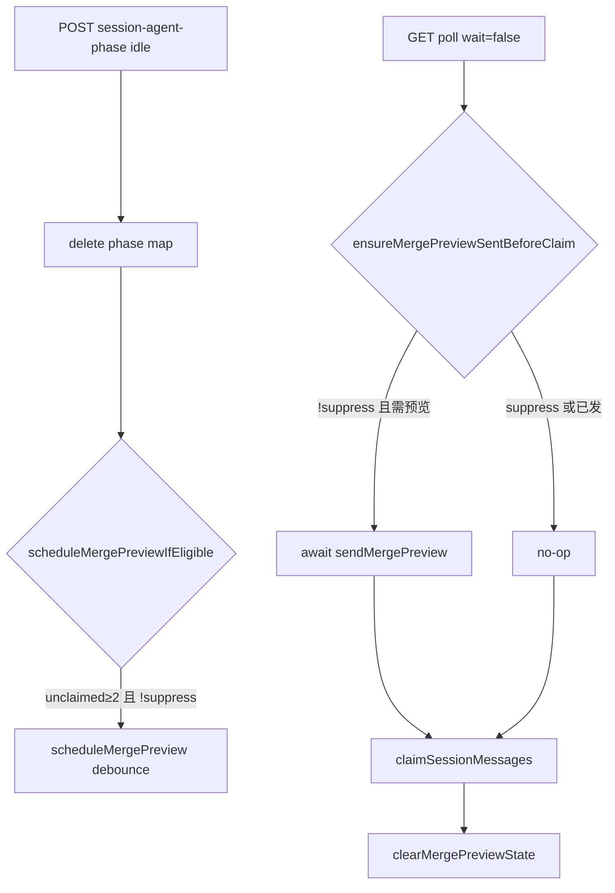

# 飞书排队消息状态反馈与合并预览 - 代码评审报告

## 1、审查范围

- **变更类型**: apply 产出的未提交变更（`git diff`，+519/-13 行）
- **评审等级**: focused-review（daemon + electron 联动、无 proto/DB/权限变更；跨端但范围可收敛）
- **涉及文件**: 5 个实现文件 + `src/AGENTS.md`、`electron/AGENTS.md`
- **设计文档**: `02-design.md`、`03-tasks.md`（对照基准）
- **评审方式**: 全量 `git diff` + CodeGraph（`projectPath` 指定仓库根）+ 关键符号定点复核

## 2、严重（必须处理）

无

## 3、警告（建议处理）

1. **F3 纠错回复未做超长分条**
   - 位置: `src/daemon.ts:812-814`（`tryHandleMergePreviewReply` → `failReply`）
   - 说明: 合并预览正文已对 outbound 做 `splitMergePreviewText`（NF4），但失败纠错路径将 `mergeId + 全文` 拼成单条 `replyToMessage`；超长合并时可能触达飞书单条上限导致纠错不完整，弱违反 F3.3/F3.5。建议在失败路径复用分条或截断策略。评分约 65，不阻断归档。

2. **`processing` 阶段重复上报**
   - 位置: `electron/session-dispatcher.ts:364-366`、`electron/agent-sdk.ts:469`
   - 说明: CLI/SDK 成功路径均 POST `processing`；`launchAgent` 与 `launchSdkAgent` 串联时可能双报，功能无害但多余 HTTP。`shrink:` 可保留 dispatcher 单点上报。评分约 50。

## 4、设计偏差

无实质性偏差。实现与 `02-design.md` 分层、接口、数据结构一致：

- F1 → `buildEnqueueStatusText` + phase/`.claimed` 兜底
- F2/F3 → `scheduleMergePreview` / `sendMergePreview` / `tryHandleMergePreviewReply` / registry 多 messageId 登记（含分条续页，满足旧预览回复）
- F4 → `shouldSuppressMergePreview`（processing + `.claimed` + 流式字段）
- S11/S13 → `applyMergeOverrideForPoll` + poll/ack 清理

文案用词：预览引导为「回复本条消息」，失败提示为「回复合并预览消息」，与 01 示例「回复本条预览消息」略有差异，语义等价，不构成验收失败。

## 5、验收标准检查

### 03 任务验收

| 任务 | 验收条件 | 状态 |
|------|---------|------|
| T1 | `.qmsg` 仅计 unclaimed；replace 折叠为单条 | ✅ |
| T1 | 空会话/无效输入不抛异常 | ✅ |
| T2 | `POST /api/session-agent-phase` 校验与 idle 删除 | ✅ |
| T2 | 不影响既有 poll/send/stream 路由 | ✅ |
| T3 | starting/processing/idle 三处上报；失败 WARN | ✅ |
| T3 | 不重复 F1 近义 send-text | ✅ |
| T4 | F1.1–F1.3 文案 + 排队数组合 | ✅ |
| T4 | phase 缺失 + `.claimed` 兜底 processing | ✅ |
| T5 | processing/claimed/流式时 suppress | ✅ |
| T6 | debounce 500ms；≥2 触发；MG-id 沿用；已更新标记 | ✅ |
| T6 | p2p + `isStreamTextEligible` 门控 | ✅ |
| T6 | 超长分条 + 续页 registry | ✅ 代码就绪 |
| T7 | parentId 拦截；成功/失败 ID+全文+操作说明 | ✅ |
| T7 | 已领取不可改文案 | ✅ |
| T8 | poll override 交付；领取/ack 清理 preview 态 | ✅ |
| T8 | 未改 electron poll 消费端（最小范围） | ✅ |
| T-FIX-01 | idle 补偿 + instant poll 守卫；F4 不变 | ✅ |
| T-FIX-01 | 08 关联验收 4/10/11 代码路径闭合 | ✅ 需 08 第 2 轮复验 |

### 01 核心验收（12 条）

| # | 验收项 | 状态 |
|---|--------|------|
| 1 | Agent 忙连发：入队反馈含「正在处理上一条」+ 排队数 | ✅ 代码路径成立 |
| 2 | Agent 空闲连发：不误报处理中 | ✅ idle 分支 |
| 3 | 冷启动：「正在启动」+ 排队 | ✅ starting 分支 |
| 4 | 连发 3 条：领取前 1 次预览含【消息 1】～【消息 3】 | ✅ T-FIX-01 闭合，需 08 复验 |
| 5 | MG-id 格式与批次内一致 | ✅ `buildMergeId` |
| 6 | 回复预览修改成功 → Agent 领新全文 | ✅ replace + poll 单条交付 |
| 7 | 引导/失败含 ID + 全文 + 回复操作 | ✅ |
| 8 | 无效修改纠错含 ID + 全文 + 操作 | ⚠️ 超长全文见 §3 警告 |
| 9 | 单条无预览 | ✅ unclaimed < 2 不发 |
| 10 | 流式进行中不插预览、无重复「处理中」 | ✅ suppress + ensure no-op |
| 11 | 预览更新沿用 ID +「已更新」 | ✅ ensure 强制更新路径 |
| 12 | 范围：飞书私聊；微信/群聊不要求 | ✅ p2p + mainUser gated |

### 02 §八·（二）工程补充验收

| 项 | 状态 |
|----|------|
| phase 全链路 F1 文案 | ⚠️ 需联调 |
| phase 缺失 + `.claimed` 兜底 | ✅ |
| debounce 4 条 ≤5s 一次预览 | ⚠️ 需联调 |
| 回复旧版 preview messageId | ✅ registry 全量登记 |
| 超长分条全文可见 | ⚠️ 需联调 |
| 流式连发无预览插入 | ✅ 代码路径成立 |

## 6、调用链与回归风险

```mermaid
flowchart TD
  IN[飞书 inbound] --> F3{回复预览?}
  F3 -->|是| MOD[tryHandleMergePreviewReply]
  F3 -->|否| PM[pushMessage]
  PM --> F1[confirmEnqueueAndStartProgress / buildEnqueueStatusText]
  PM --> SCH[scheduleMergePreview debounce]
  SCH --> SUP{shouldSuppressMergePreview?}
  SUP -->|否| PRE[sendMergePreview]
  EP[electron phase POST] --> MAP[sessionAgentPhaseMap]
  MAP --> F1
  MAP --> SUP
  POLL[/api/poll-message] --> OVR[applyMergeOverrideForPoll]
  OVR --> CLR[clearMergePreviewState]
  ACK[ackOnReply] --> CLR
```

| 回归点 | 风险 | 说明 |
|--------|------|------|
| poll 契约 | 低 | 响应 shape 未变，仅 poll 前 transform |
| 三态/流式 | 低 | F1 与 notify 语义分工保持；suppress 读 `sessionProgressMap` |
| 队列 ack 语义 | 低 | override 保留末条 messageId，整批 ack 不变 |
| phase 上报丢失 | 中 | `.claimed` 兜底 processing；冷启动窗口可能短暂 idle 文案 |
| 并行变更 20260627162620 | 低 | 本期 daemon 内聚；archive 时再评估 absorb |

## 7、遗留债务

1. **NF1/NF2/NF4 与 01 验收 4/6/8 依赖飞书联调**，代码逻辑就绪，评审阶段未执行端到端脚本。
2. **F3 失败纠错超长全文**（见 §3 警告 #1），归档后可按需 T-FIX-01 补分条。
3. **知识库未同步**（`02` §十 列出的 `04-消息队列与路由.md`、`02-飞书通道.md` 等）——属 `/kb-archive` 职责，非本次 apply 范围。

## 8、修复任务建议

| 问题 ID | 建议动作 | 关联任务 |
|---------|----------|----------|
| — | 无 open 阻断项；联调通过后可直接 archive | — |
| （可选） | F3 failReply 超长分条 | T-FIX-01 |

## 9、结论

**通过**（T-FIX-01 代码修复），建议 08 第 2 轮复验后再 `/kb-archive`。

T1–T8 + T-FIX-01 实现与 `02-design`/`03-tasks` 对齐；08 主因（idle 补偿 + instant poll 绕过预览）已在 daemon 侧闭合。无评分 ≥75 的功能性阻断项。§3 R1/R2 仍为体验债务；§7 飞书端到端联调（R3）须在 archive 前复验验收 4/10/11。`tsc --noEmit` 通过。

---

## T-FIX-01 复评（R-FIX）

> **触发**：08 第 1 轮打回（`reason=code`）后 T-FIX-01 完成；评审范围 = `git diff src/daemon.ts src/AGENTS.md`（+48 行）。

### R-FIX-1、审查范围

- **变更类型**：T-FIX-01 修复 diff（idle 补偿 + instant poll 守卫）
- **评审等级**：focused-review（单文件 daemon 时序补丁 + AGENTS 文档）
- **涉及文件**：`src/daemon.ts`、`src/AGENTS.md`
- **对照基准**：`03-tasks.md` T-FIX-01、`08-verify-issue.md` 关联项 4/10/11

### R-FIX-2、严重（必须处理）

无

### R-FIX-3、警告（建议处理）

1. **debounce 回调与 `ensureMergePreviewSentBeforeClaim` 并发可能重复发预览**
   - 位置: `src/daemon.ts:828-834`（debounce 回调 fire-and-forget `sendMergePreview`）与 `:782-802`（ensure 同步 await）
   - 说明: debounce 触发后、首个 `sendMergePreview` 完成注册 `lastPreviewMessageId` 之前，instant poll 可能进入 ensure 并再次 `sendMergePreview`，极端时序下用户可见两条预览。Node 单线程下窗口极窄，08 主场景（suppress 后 idle 再 poll）不经过并发 debounce。评分约 65，不阻断。

2. **预览发送失败仍继续 claim**
   - 位置: `src/daemon.ts:798-802`
   - 说明: `sendMergePreview` 抛错仅 WARN，claim 仍执行——避免 Agent 永久卡住，但用户可能仍看不到预览。与 T6 debounce 路径一致，属可接受降级。评分约 55。

### R-FIX-4、设计偏差

无。实现与 T-FIX-01 实现范围一致：

| 要点 | 设计预期 | 实际 |
|------|----------|------|
| idle 补偿 | unclaimed≥2 且 `!shouldSuppressMergePreview` 且 p2p 时 schedule | `scheduleMergePreviewIfEligible` 于 `:2179` 挂接，四重守卫齐全 |
| instant poll 守卫 | claim 前 await ensure；suppress 时 no-op | `:2346` await；ensure 首两行复用 suppress/unclaimed 检查 |
| F4 不变 | processing/claimed/流式时 suppress，instant poll 不阻塞 | suppress=true → ensure 直接 return → claim 照常 |
| 清理时序 | claim 后 clear | `:2350` 仍在 claim 成功且有消息时 clear |
| 抽象度 | 可 inline，行为等价即可 | 3 个内部函数（`resolveMergePreviewContext` / `scheduleMergePreviewIfEligible` / `ensureMergePreviewSentBeforeClaim`），无新模块或 trait |

### R-FIX-5、T-FIX-01 验收标准检查

| 验收项 | 条件 | 代码层状态 |
|--------|------|------------|
| 08·4 | processing 连发 ≥3 条 → idle 后领取前 1 次预览 | ✅ idle 补偿 + ensure 双路径闭合 08 根因 |
| 08·10 | processing/流式连发无预览；suppress 时 instant poll 不阻塞 | ✅ ensure 首行 suppress 检查；F4 逻辑未改 |
| 08·11 | 预览发出后再发第 4 条：同一 MG-id +「已更新」 | ✅ ensure 在 `previewSent && previewPending` 时强制 `sendMergePreview` 更新 |
| idle 补偿边界 | unclaimed<2 或 suppress 不 schedule | ✅ `:775-776` |
| instant poll | 应发预览时 claim 前用户可见预览 | ✅ await ensure → sendMergePreview |
| 验收 9 回归 | 单条 unclaimed 无预览 | ✅ ensure `:783` unclaimed<2 早退 |
| Ponytail | 无过度抽象 | ✅ |

### R-FIX-6、调用链（补丁后）



| 回归点 | 风险 | 说明 |
|--------|------|------|
| blocking poll 无守卫 | 低 | T-FIX-01 范围仅 `wait=false`；SDK 保活与 08 复现场景均走 instant 路径 |
| debounce 取消 | 低 | ensure 内 `clearTimeout` 后再 await send，避免 claim 前状态被清 |
| F4 processing 路径 | 无 | suppress 未弱化；idle 补偿仅在 delete phase 后且 !suppress |
| race 重复预览 | 低 | 见 R-FIX-3 警告 #1 |

### R-FIX-7、遗留债务

1. **R3 飞书私聊端到端**（F1/F2/F3/F4、NF1/NF2/NF4）——T-FIX-01 闭合代码路径后须复验 08 场景。
2. **R1 F3 失败纠错超长分条**——与 T-FIX-01 无关，仍 accepted_debt。
3. **blocking poll 预览守卫**——未纳入 T-FIX-01；CLI legacy blocking 路径理论上仍可先 claim，当前主用户 SDK 路径不受影响。

### R-FIX-8、修复任务建议

| 问题 ID | 建议动作 | 关联任务 |
|---------|----------|----------|
| — | 无 open 阻断项 | — |
| R-FIX-W1（可选） | debounce 与 ensure 互斥锁或 in-flight Promise 去重 | 未来 T-FIX-02 |

### R-FIX-9、结论

**通过**。T-FIX-01 正确补齐 idle 后预览补偿与 instant poll 预览窗口守卫，对齐 08 根因分析；F4 抑制语义保持；race 与发送失败降级为低优先级警告。建议执行 08 第 2 轮或 `/kb-test` 复验验收 4/10/11 后再 archive。

---

## T-FIX-02 复评（R-FIX-02）

> **触发**：08 第 2 轮打回（`reason=code`）后 T-FIX-02 完成；评审范围 = `git diff src/file-queue.ts src/daemon.ts src/AGENTS.md`（+40/-9 行）。

### R-FIX-02-1、审查范围

- **变更类型**：T-FIX-02 冷启动 orphan claimed 回收 + F1 phase/排队口径修正
- **评审等级**：lite-review（3 文件、逻辑收敛、无新 API）
- **涉及文件**：`src/file-queue.ts`、`src/daemon.ts`、`src/AGENTS.md`
- **对照基准**：`03-tasks.md` T-FIX-02、`08-verify-issue.md` 第 2 轮根因链

### R-FIX-02-2、严重（必须处理）

无

### R-FIX-02-3、警告（建议处理）

1. **daemon 独立重启时 reclaim 可能与 live Agent 重复投递**
   - 位置: `src/file-queue.ts:512-534`（`cleanupOrphanClaimedOnColdStart`）、`src/daemon.ts:1958-1964`（`initQueue`）
   - 说明: 回收策略假设「全应用冷启动、无 live Agent」。若仅 daemon 进程重启而 Electron 侧 Agent 仍在处理并已 claim 消息，会将 live `.claimed` 还原为 `.qmsg`，可能造成至少一次重复投递。当前 Electron 与 daemon 同生命周期重启，主路径风险低。评分约 55，不阻断 archive。

2. **移除 claimed→processing fallback 后存在 phase 上报延迟窗口**
   - 位置: `src/daemon.ts:1688-1690`（`buildEnqueueStatusText`）
   - 说明: T4 原「phase 缺失 + `.claimed` → processing」兜底已移除；同进程 live 处理中若 electron 尚未 POST `processing`，短暂窗口内 F1 可能走 idle 文案而非 F1.1。冷启动误报已修复；验收 1 依赖 phase 上报及时性。评分约 50，与 T-FIX-02 设计取舍一致，accepted_debt。

### R-FIX-02-4、设计偏差

**无实质性偏差**（相对 T-FIX-02 任务范围）。相对 T4 原设计为**有意收窄**：

| 要点 | T-FIX-02 预期 | 实际 |
|------|-------------|------|
| 冷启动 reclaim | `initQueue` 调用 `cleanupOrphanClaimedOnColdStart` | `:1961-1964` 于 `cleanupStaleMessages` 之后执行，有回收条数日志 |
| F1 排队数 | `getSessionUnclaimedCount`（仅 `.qmsg`） | `confirmEnqueueAndStartProgress` `:1754` |
| phase fallback | 缺失默认 `idle`，不用磁盘 `.claimed` 推断 | `buildEnqueueStatusText` `:1690` |
| 至少一次语义 | claimed→qmsg 还原而非删除 | `renameSync`；dest 已存在时删孤儿 claimed |
| 文档 | AGENTS 记录口径 | `src/AGENTS.md` 已补充 |

**说明**：回收后 orphan 变为 `.qmsg`，若磁盘仍有多条遗留，首条入队 F1 仍可能显示「前面还有 N 条」——口径正确（确有待领取积压），与 08 第 2 轮「虚假 processing」根因不同；idle 主文案不再误报 F1.1。

### R-FIX-02-5、T-FIX-02 验收标准检查

| 验收项 | 条件 | 代码层状态 |
|--------|------|------------|
| 08·2 重启首条 | 不误报 processing | ✅ phase 默认 idle；claimed 不计入 pending |
| 排队数 | 不含 stale claimed | ✅ `getSessionUnclaimedCount` |
| 冷启动回收 | 遗留 claimed→qmsg + 日志 | ✅ `cleanupOrphanClaimedOnColdStart` |
| 验收 1 回归 | live processing + phase=processing → F1.1 | ✅ `phase === "processing"` 分支未改 |
| tsc | `--noEmit` 通过 | ✅ manifest test_evidence |

### R-FIX-02-6、回归风险

| 回归点 | 风险 | 说明 |
|--------|------|------|
| F4 / 合并预览抑制 | 低 | orphan reclaim 后无 `.claimed`，不再误 suppress；live claimed 路径仍依赖 phase |
| 重复投递 | 低 | 仅全应用冷启动；daemon 独立重启见 R-FIX-02-3 #1 |
| merge edit / F3 | 无 | `claimed` 检查仍用 `pending-unclaimed`，与 reclaim 前语义一致 |
| blocking poll | 无 | 本任务未改 poll 路径 |

### R-FIX-02-7、遗留债务

1. **R3 飞书端到端**——T-FIX-02 须与 08 第 2 轮场景联调确认首条 F1 文案。
2. **R-FIX-02-W1/W2**——见 §R-FIX-02-3，不阻断 archive。

### R-FIX-02-8、修复任务建议

| 问题 ID | 建议动作 | 关联任务 |
|---------|----------|----------|
| — | 无 open 阻断项 | — |
| R-FIX-02-W1（可选） | daemon 独立重启时跳过 reclaim 或协商 live 会话 | 未来维护 |
| R-FIX-02-W2（可选） | phase 延迟窗口：短 TTL 内存 claimed 标记 | 未来维护 |

### R-FIX-02-9、结论

**通过（带债务）**。T-FIX-02 正确闭合 08 第 2 轮根因（stale `.claimed` + phase fallback + pending 口径）；冷启动 reclaim 保留至少一次投递语义；无 critical 项。建议 08 第 2 轮复验验收 2/3 后与 T-FIX-01 一并 `/kb-archive`。
