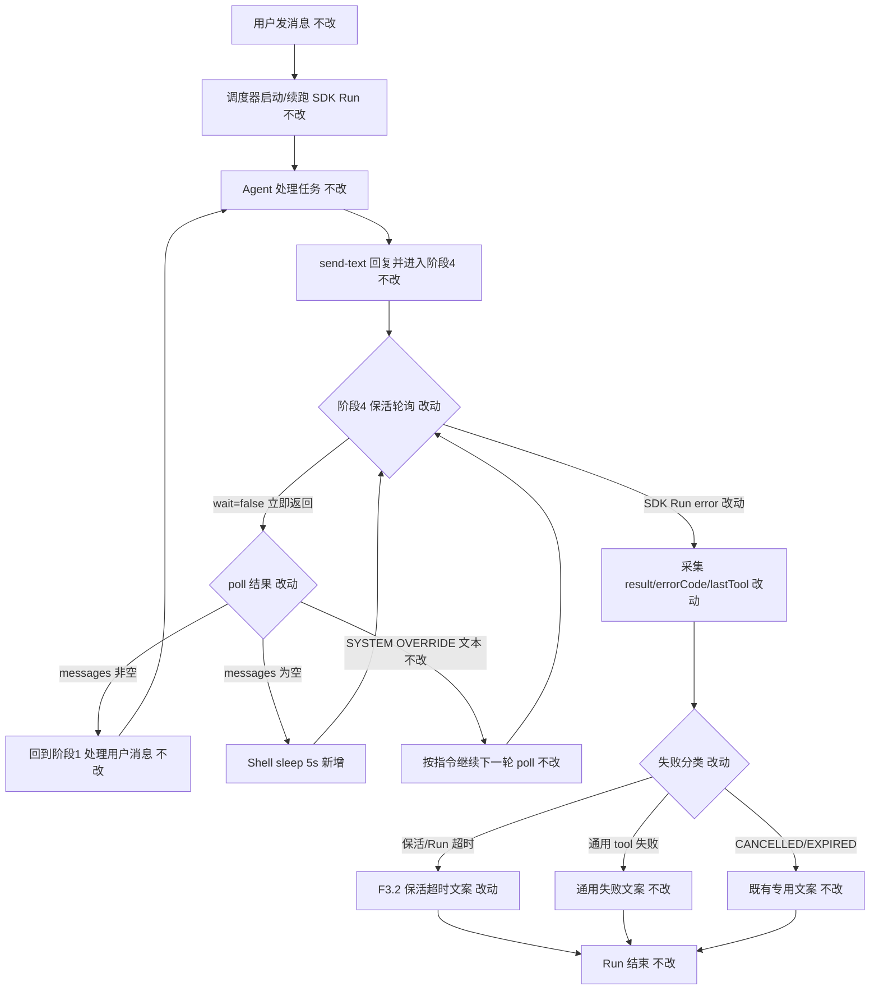

# SDK 保活与 Run 生命周期兼容 - 实现设计

> **业务 PRD**：见同目录 `01-proposal.md`（验收标准以 01 为准）

## 1、业务流程与改动范围

> 业务口径以 `01-proposal.md` 用户场景、功能需求与验收标准为准；下图覆盖主流程与关键分支。

### 1.1 业务流程图



**图例**：`不改` 行为与现网一致；`改动` 需改代码/规则；`新增` 非阻塞循环中的短 sleep 节点；`删除` 无（blocking poll 仍保留于 Daemon/CLI 契约，但 SDK 保活路径不再依赖单次无限 blocking）。

### 1.2 流程步骤与改动对照

| 步骤 ID | 业务含义 | 改动 | 落点（模块/文件） | 01 验收关联 |
|---------|----------|------|-------------------|-------------|
| S1 | 用户消息入队，调度器启动 SDK Run | 不改 | `electron/session-dispatcher.ts`、`electron/agent-sdk.ts` | 验收 9 |
| S2 | Agent 完成任务并 send-text 回复 | 不改 | `resources/template/rule/cursor-claw.mdc` 阶段 3 | — |
| S3 | 阶段 4 保活：由单次 blocking poll 改为非阻塞 poll + sleep 循环 | 改动 | `resources/template/rule/cursor-claw.mdc` 阶段 4；Agent 侧 Shell 行为 | 验收 3、8；F2.1–F2.5 |
| S4 | poll 返回用户消息，重置状态机回到阶段 1 | 不改 | `cursor-claw.mdc`；`src/daemon.ts` `claimSessionMessages` | 验收 4 |
| S5 | poll 返回 SYSTEM OVERRIDE（blocking 25min 超时路径） | 不改（Daemon）；规则仍要求继续 poll | `src/daemon.ts` L1993–2011；`cursor-claw.mdc` | 验收 4；场景 D |
| S6 | 非阻塞路径：无消息时 sleep 后继续 poll（不挂起单条 Shell） | 新增 | `cursor-claw.mdc` 阶段 4 循环描述 | 验收 3；NF1 |
| S7 | SDK Run 以 `status=error` 结束 | 改动 | `electron/agent-sdk.ts` `streamRunEvents` 收尾、`handleSdkEvent`、`formatSdkStreamFailure` | 验收 1、2、5、10；F1 |
| S8 | 向用户下发失败 notify | 改动 | `electron/agent-sdk.ts` `notifySdkFailure`、`formatSdkStreamFailure` | 验收 5、6、7；F3 |
| S9 | 用户主动 stop / 会话 EXPIRED | 不改 | `electron/agent-sdk.ts` `stopSdkSession`、`formatSdkStreamFailure` 既有分支 | 验收 7；F3.3、F3.5 |
| S10 | Daemon poll-message 契约（sessionKey 必填、wait 参数） | 不改 | `src/daemon.ts` `/api/poll-message` | F2.3；NF4 |

### 1.3 改动汇总

- **改动**：
  - `electron/agent-sdk.ts`：跟踪 `lastTool`；error 终态日志增强（`run.result`、errorCode、duration、lastTool）；`formatSdkStreamFailure` 增加保活/Run 超时分类与 F3.2 文案。
  - `resources/template/rule/cursor-claw.mdc`：阶段 4 从「单次 blocking poll 无限挂起」改为「`wait=false` poll → 无消息 sleep → 循环」；保留 SYSTEM OVERRIDE 与 Loop 禁令语义。
  - `package.json` / `package-lock.json`：`@cursor/sdk` 升至 `^1.0.22`（已验证 build）。
- **新增**：保活循环中的短 sleep 步骤（规则层描述 + Agent Shell 执行，无 Electron 新模块）。
- **不改（显式列出）**：
  - `src/daemon.ts` poll-message 阻塞 25min / SYSTEM OVERRIDE 逻辑 — CLI 与其它 blocking 调用方仍可用。
  - 飞书排队/合并/流式（进行中其它变更）— `src/daemon.ts` send-text/stream-text 时序、排队 UI。
  - `electron/session-dispatcher.ts` 调度与 f41 流式桥接逻辑。
  - poll-message `sessionKey` 必填、消息领取/确认语义。

## 2、整体思路

**根因**（见 01 §背景）：SDK Run 对「单条 Shell 长时间 blocking long-poll」容忍度有限（观测约 23min/60min 档），在 Daemon 25min SYSTEM OVERRIDE **之前**即以 `status=error` 终止；且终态缺少可还原字段，用户收到通用「请稍后重试」。

**方案要点**：

1. **F1 可观测性**：在 `SdkSessionAgent` 增加 `lastTool`；`handleSdkEvent` 的 `tool_call` 分支写入；`run.status === "error"` 收尾与 `status` 事件路径统一打结构化日志（含 `run.result`、`run.durationMs`、errorCode、`lastTool`、sessionKey/run 短码），不下发用户。
2. **F2 保活兼容**：阶段 4 改为 **`GET .../poll-message?sessionKey=...&wait=false`** → 若 `messages` 为空则 **`sleep 5`**（设计定参，可调范围 3–10s）→ 重复。单次 Shell 生命周期控制在秒级，避免触发 SDK long-running shell 超时。Daemon blocking + 25min OVERRIDE **保留**供 CLI/legacy；SDK 保活路径不再依赖 blocking。
3. **F3 文案区分**：`formatSdkStreamFailure` 在 `lastTool.name === "shell"` 且 `lastTool.status === "running"`（或等价）且无更安全 message 时，映射 F3.2：「会话在等待下一条消息时已结束（等待超时）。请重新发送消息，我会继续为你处理。」；CANCELLED/EXPIRED/通用失败分支不变。

**验收 3 锁定**（01 待确认项已决）：通过标准为 **Run 不因单次 blocking poll 被 SDK error 终止** —— 实现手段为 **非阻塞 poll + 短 sleep 循环**，而非「Run error 但文案正确」。

**最小方案三问**：

1. **能否复用现有模块？** 能。全部落在 `electron/agent-sdk.ts` 与 `resources/template/rule/cursor-claw.mdc`；Daemon poll 已支持 `wait=false`，无需新服务层。
2. **新增抽象/依赖是否必要？** 否。不新增 trait/helper 文件；`lastTool` 为 `SdkSessionAgent` 内联字段。`@cursor/sdk ^1.0.22` 为既有依赖升级，非新包。
3. **能否合并到已有文件？** 能。不新建文件；保活语义由规则模板驱动 Agent 行为，Electron 仅增强观测与 notify 分类。

## 3、分层设计

- **端点层**：无 HTTP 路由变更；`/api/poll-message` 继续支持 `wait=false` 与 blocking（`src/daemon.ts` L1958–2020）。
- **服务层（Electron）**：`electron/agent-sdk.ts` — SDK 事件流、终态日志、用户 notify 分类。
- **Agent 规则层**：`resources/template/rule/cursor-claw.mdc` — 阶段 4 保活循环语义（非阻塞 + sleep）。
- **数据层**：无持久化 schema 变更；运行时 `SdkSessionAgent` 扩展内存字段 `lastTool?: { name: string; status: string }`。

## 4、接口设计

无新增或变更 HTTP/MCP 接口。

沿用既有契约：

| 接口 | 关键参数 | 本变更用法 |
|------|----------|------------|
| `GET /api/poll-message` | `sessionKey`（必填）、`wait=false` | 保活循环每次调用非阻塞 poll |
| `GET /api/poll-message` | 无 `wait` 或 `wait=true` | blocking + 25min SYSTEM OVERRIDE；**SDK 保活不再使用**，CLI 仍可用 |

## 5、数据结构

### 5.1 SdkSessionAgent 扩展（内存）

```typescript
lastTool?: { name: string; status: string }
```

- 写入点：`handleSdkEvent` → `case "tool_call"`（已有 `[tool] name: status` 日志，同步赋值 `session.lastTool`）。
- 读取点：`run.status === "error"` 收尾日志、`formatSdkStreamFailure` 保活失败判定。

### 5.2 日志字段（UI/开发者日志，非用户 notify）

error 终态单行或相邻日志须包含（有则写、无则省略）：

- `sessionKey`、`agentId`/`run` 标识
- `run.result`、`run.durationMs`
- `errorCode`（从 `run.wait()` 返回值或 `status` 事件解析，SDK 暴露则记录）
- `lastTool.name`、`lastTool.status`
- `lastStatus.status`、`lastStatus.message`

## 6、实现步骤

1. **S7-F1**：在 `SdkSessionAgent` 增加 `lastTool`；`handleSdkEvent` `tool_call` 分支赋值。（对应 S7）
2. **S7-F1**：`streamRunEvents` 收尾 `run.status === "error"` 块扩展日志：合并 `run.wait()`、`run.result`、`durationMs`、`lastTool`、`lastStatus`；解析 errorCode（若 SDK 1.0.22 暴露）。（对应 S7、验收 1/2/10）
3. **S8-F3**：扩展 `formatSdkStreamFailure(status, message, ctx?)` 或在调用处传入 session 上下文，实现保活失败分类 → F3.2 文案；保持 CANCELLED/EXPIRED/通用分支。（对应 S8、验收 5/6/7）
4. **S3-F2**：更新 `cursor-claw.mdc` 阶段 4：默认 curl 带 `wait=false`；`messages` 为空时 `sleep 5` 后重复；收到 SYSTEM OVERRIDE 仍立即下一轮 poll；更新「陷阱一/三」表述以匹配非阻塞循环（不再描述「curl 还挂着」）。（对应 S3、S6、验收 3/8）
5. **回归**：确认 `package.json` `@cursor/sdk` `^1.0.22` 与 lockfile 一致；build 通过。（manifest 已登记）

## 7、参考实现

CodeGraph（`projectPath=/Users/kiki/github/cursor-claw`）命中：

| 符号 | 路径 | 用途 |
|------|------|------|
| `formatSdkStreamFailure` | `electron/agent-sdk.ts:61` | 用户 notify 文案入口，扩展保活分类 |
| `notifySdkFailure` | `electron/agent-sdk.ts:72` | 失败 notify 网关 |
| `handleSdkEvent` | `electron/agent-sdk.ts:282` | `tool_call` / `status` 事件；扩展 lastTool |
| `streamRunEvents` | `electron/agent-sdk.ts:259` | 流结束与 error 收尾 |
| `launchSdkAgent` → `run.wait()` | `electron/agent-sdk.ts:437–451` | 已有 error 详情日志，扩展字段 |
| `/api/poll-message` blocking 分支 | `src/daemon.ts:1958–2020` | `wait=false` 与非阻塞返回；25min OVERRIDE |
| 阶段 4 保活 | `resources/template/rule/cursor-claw.mdc:118–127` | 规则改写目标 |

现网 gap：`handleSdkEvent` 已打 `[tool] name: status` 但未持久 `lastTool`；`formatSdkStreamFailure` 无保活分支；`cursor-claw.mdc` 仍要求 blocking 无限挂起。

## 8、技术影响

### 8.1 影响范围

- **涉及模块**：Electron SDK 会话（`agent-sdk.ts`）、Agent 规则模板（`cursor-claw.mdc`）；Daemon **只读依赖**（poll 契约不变）。
- **接口/proto 变更**：无。
- **数据变更**：无持久化；运行时 session 字段 + 日志增量。
- **风险**：
  - SDK 23min/60min 档位未公开 — 非阻塞策略为观测驱动；若仍 error，F1 日志 + F3.2 兜底。
  - 5s 轮询负载 — 单 idle 会话约 12 次/min GET；NF1 可接受，必要时规则内调至 10s。
  - **CLI 路径**：规则模板共用，CLI Agent 同样改为非阻塞循环；与 blocking poll 契约仍兼容（`wait=false` 已存在），风险低（见 NF4）。
  - SYSTEM OVERRIDE：非阻塞路径通常**不会**触发 Daemon 25min blocking 超时；规则仍保留 OVERRIDE 处理以防 mixed 调用或未来 blocking 回退。

### 8.2 工程补充验收项

- [ ] **验收 3（锁定）**：主用户私聊 SDK Run（同类 `ch_0b1b964e`），Agent 完成回复后 **连续等待 ≥25 分钟** 无新消息，Run **不因** 单次 blocking poll 被 SDK 以 `status=error` 终止 —— 实现为 **非阻塞 poll（`wait=false`）+ sleep 5s 循环**，期间无单次 Shell 阻塞 ≥1min。
- [ ] error 终态 UI 日志含 `run.result`、`lastTool`、`durationMs` 中至少两项，且 `lastTool` 为 `shell` + `running`（保活复现路径）。
- [ ] 保活类 Run error（若 SDK 仍终止）用户 notify 为 F3.2 文案，**非**单独「请稍后重试」。
- [ ] 非保活 tool 失败仍走通用文案，不误触发 F3.2。
- [ ] `cursor-claw.mdc` 新注入工作区阶段 4 描述含 `wait=false` 与 sleep 循环，**不**再将 blocking 无限挂起作为唯一手段。
- [ ] Daemon `/api/poll-message` 无代码 diff；blocking + SYSTEM OVERRIDE 手工用例仍可触发（CLI 或测试 curl 不带 `wait=false`）。

## 9、知识库影响

- `knowledge/工程平台/Daemon守护进程/02-HTTP与MCP服务.md` — 需补充「SDK 保活推荐非阻塞 poll」与 blocking OVERRIDE 适用场景（CLI/legacy）。
- `knowledge/业务域/Agent调度/` — 若存在 SDK 保活/错误 notify 描述，archive 时对齐 F1/F3。
- `knowledge/业务域/消息桥接/04-消息队列与路由.md` — poll 模式说明可能需一句非阻塞保活备注。
- **两级索引**：本变更为工程稳定性，**暂不**改 `知识索引.md`；archive 时视 10.1 实际更新再定。

## 10、知识库更新计划

### 10.1 必须更新

- `knowledge/工程平台/Daemon守护进程/02-HTTP与MCP服务.md` — `wait=false` 与 blocking 适用场景；SYSTEM OVERRIDE 仅 blocking 25min 触发。
- Electron 侧若存在 SDK 错误处理约定 — `electron/AGENTS.md` 补充 lastTool / 保活失败文案（archive 时核对）。

### 10.2 可能更新（视实现结果）

- `knowledge/业务域/Agent调度/03-启动与自动重连.md` — SDK vs CLI 保活策略差异（若实现后仍有差异）。
- 变更 `05-summary.md` / `changelog` — 用户可见稳定性修复（archive 阶段）。

### 10.3 不需要更新

- 飞书排队/合并/流式相关变更文档与业务域正文（本变更显式排除）。
- Proto / 数据库 / 设置页文档。
