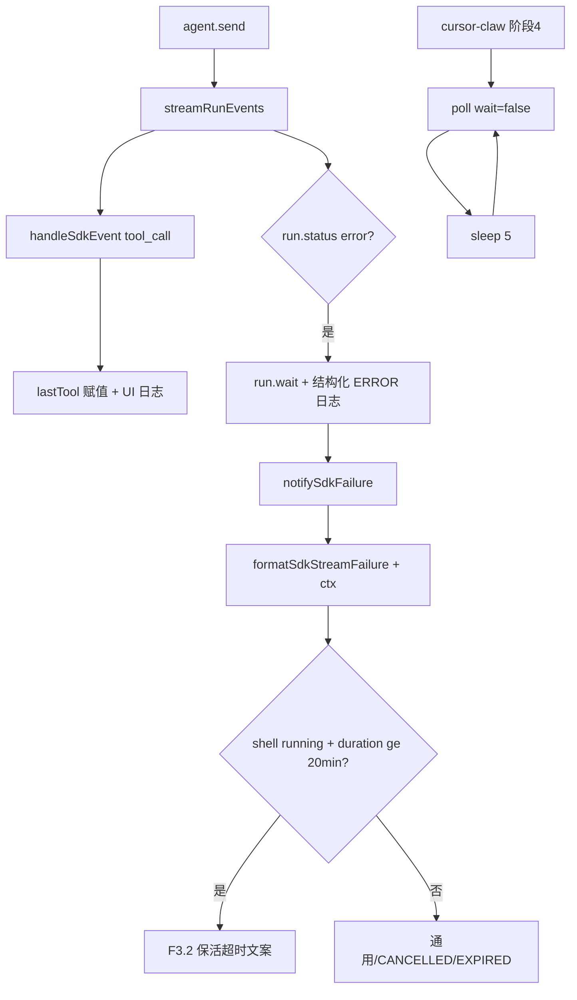

# SDK 保活与 Run 生命周期兼容 - 代码评审报告

## 1、审查范围

- **变更类型**：apply 产出的未提交变更（T1/T2/T3 均 done）
- **评审等级**：full-review（对照 01/02/03 与实现 diff）
- **涉及文件**：`electron/agent-sdk.ts`、`resources/template/rule/cursor-claw.mdc`、`package.json`、`package-lock.json`（共 4 文件，无其它 diff）
- **设计文档**：`02-design.md`（对照基准）
- **任务文档**：`03-tasks.md`（T1/T2/T3 验收清单）
- **评审方式**：全量 `git diff` + 关键符号定点复核（`lastTool`、`formatSdkStreamFailure`、`launchSdkAgent` error 收尾、`cursor-claw.mdc` 阶段 4）

## 2、严重（必须处理）

无

## 3、警告（建议处理）

1. **规则模板前文与阶段 4 语义不一致**
   - 位置：`resources/template/rule/cursor-claw.mdc` L32–37（poll 模式表）、L156（异常恢复）
   - 说明：阶段 4 已改为 `wait=false` + `sleep 5` 短循环，但前文表格仍将「阻塞（保活轮询）」标为保活模式，§156 仍写「poll-message 无限挂起是正常现象」。Agent 可能从表格误读 blocking 仍为 SDK 保活首选。T2 范围仅覆盖阶段 4 与陷阱，未改前文——属文档残留，不阻断核心行为。评分约 55。

2. **F3.2 保活分类依赖 `shell:running` + 时长阈值**
   - 位置：`electron/agent-sdk.ts` L47–48、`L85–91`
   - 说明：分类条件为 `lastTool.name === "shell"`、`status === "running"`、`durationMs >= KEEPALIVE_TIMEOUT_MS`（20min）且无安全 `message`。历史 blocking 失败末条为 `shell:running`（curl 仍挂起）；非阻塞保活下各轮 Shell 秒级结束，SDK 若在 sleep/poll 间隙终止时 `lastTool` 可能为 `completed`，F3.2 可能不触发而回落通用文案。主路径验收 3 锁定为「不因 blocking error」——非阻塞策略为主、F3.2 为兜底；联调若仍见通用失败文案可追加分类放宽。评分约 60。

3. **`electron/AGENTS.md` 未同步 lastTool / 保活失败文案**
   - 位置：`electron/AGENTS.md`「SDK 错误 notify」小节
   - 说明：`02-design` §10.1 列为 archive 必须更新；当前实现已落地 `lastTool` 与 F3.2，AGENTS 仍仅描述通用 notify 约定。评分约 40，归档阶段处理即可。

## 4、设计偏差

| 项 | 设计 | 实现 | 判定 |
|----|------|------|------|
| F3.2 分类条件 | `shell` + `running`，无安全 message | 额外要求 `durationMs >= 20min` | **可接受收窄** — 避免短时 shell 失败误触 F3.2（对齐 F3.4 互斥） |
| error 日志落点 | `streamRunEvents` 收尾 + `launchSdkAgent` | 增强日志仅在 `launchSdkAgent` → `streamRunEvents().then` 的 `run.status === "error"` 分支 | **可接受** — `streamRunEvents` catch 仍 `notifySdkFailure`，主 error 终态经 run.wait 路径 |
| 阶段 4 前文表格 | 未明确要求同步 | 仍描述 blocking 为保活 | **轻微偏差** — 见 §3 W1 |

无阻断性设计偏离。

## 5、验收标准检查

### T1（agent-sdk.ts）

| 验收项 | 状态 | 说明 |
|--------|------|------|
| 01·1 error 终态日志 ≥2 项字段 | ✅ | `sessionKey`、`agentId`、`run.result`、`durationMs`、`errorCode`、`lastTool`、`waitResult` |
| 01·2 末次 shell + running | ✅ | `lastTool` 在 `tool_call` 赋值；日志 `lastTool=name:status` |
| 01·5 保活 error → F3.2 文案 | ✅ | `formatSdkStreamFailure` 返回 F3.2 全文（无单独「请稍后重试」） |
| 01·6 非保活失败不误触 F3.2 | ✅ | 需 `shell:running` + 20min + 不安全 message 三条件 |
| 01·7 CANCELLED/EXPIRED/stop | ✅ | 专用分支优先；`aborted` 不 notify |
| 01·10 可引用 Run 日志片段 | ✅ | 结构化单行日志可对照历史案例 |
| F1.4 技术字段不下发用户 | ✅ | notify 仅 F3.2/通用/CANCELLED/EXPIRED 文案 |
| Ponytail | ✅ | 无新文件/trait；`isUnsafeSdkMessage`/`extractErrorCode` 内联合理 |

### T2（cursor-claw.mdc）

| 验收项 | 状态 | 说明 |
|--------|------|------|
| 01·3 ≥25min 不因 blocking error | ⚠️ 静态通过 | 阶段 4 明确 `wait=false` + `sleep 5` 循环；**需联调实测** |
| 01·4 SYSTEM OVERRIDE 衔接 | ✅ | 规则保留 OVERRIDE → 立即下一轮 poll |
| 01·8 非阻塞短循环保活 | ✅ | 阶段 4 + 陷阱一/三已改写 |
| 01·9 未改飞书相关 | ✅ | diff 无 `src/daemon.ts` / 飞书路径 |
| Daemon poll 无 diff | ✅ | 仅规则模板变更 |
| NF1 / NF4 | ⚠️ | 5s 间隔逻辑在规则层；CLI 共用模板，联调观察负载 |

### T3（package.json / lock）

| 验收项 | 状态 | 说明 |
|--------|------|------|
| `@cursor/sdk` ^1.0.22 | ✅ | `package.json` + lock 解析 1.0.22 |
| build 通过 | ✅ | manifest 登记 builder 预改通过 |
| 无未批准新依赖 | ✅ | lock 变更主要为 SDK 升级及传递依赖收缩（sqlite3 等移除） |

## 6、调用链与回归风险

| 回归点 | 风险 | 关联 |
|--------|------|------|
| SDK 非阻塞保活 25min+ | 低（设计主路径） | T2 规则；需联调 |
| F3.2 兜底误分类 | 低 | 20min 阈值 + running 条件 |
| CLI Agent 保活 | 低 | 共用规则，wait=false 契约已存在 |
| 飞书排队/合并/流式 | 无 | 本变更无相关 diff |
| SDK node >=22.13 | 低 | `@cursor/sdk` 1.0.22 engines 要求；项目 Node 需满足 |

## 7、遗留债务

1. **规则模板 poll 模式表与 §156 与阶段 4 不同步**（见 §3 W1）— archive 或后续 lite 变更统一表述。
2. **非阻塞保活下 F3.2 兜底覆盖**（见 §3 W2）— 联调后若仍见通用失败文案，可放宽为「长时长 + 末次 shell（不限 running）」。
3. **`electron/AGENTS.md` lastTool / F3.2** — `02-design` §10.1 archive 清单项。

## 8、修复任务建议

| 问题 ID | 建议动作 | 关联任务 | 阻断 archive |
|---------|----------|----------|--------------|
| W1 | 同步 mdc L32–37 表格与 §156：保活改为非阻塞循环，blocking 标注 CLI/legacy | T-FIX-01（可选） | 否 |
| W2 | 联调 ≥25min 后若 F3.2 未触发，放宽 `formatSdkStreamFailure` 分类 | T-FIX-02（待定） | 否 |
| W3 | archive 时更新 `electron/AGENTS.md` | kb-archive §10.1 | 否 |

## 9、结论

**通过**，可进入 `/kb-archive`。

T1/T2/T3 实现与 01/02/03 核心契约对齐：F1 `lastTool` 与 error 终态结构化日志已落地；F2 阶段 4 非阻塞 `wait=false` + `sleep 5` 循环替代 blocking 无限挂起；F3 `formatSdkStreamFailure` 保活分类与 F3.2 文案已实现；diff 范围最小（4 文件），未触及飞书/ daemon poll 契约。无评分 ≥75 的 open 阻断项；§3 警告与 §7 债务记入 archive 跟进与可选 T-FIX。

### 重点核对摘要

| 核对项 | 结论 |
|--------|------|
| F1 lastTool / error 日志 | ✅ |
| F2 阶段 4 非阻塞保活 | ✅（前文表格残留见 W1） |
| F3 formatSdkStreamFailure | ✅（兜底条件见 W2） |
| 未改飞书相关 | ✅ |
| 最小 diff / Ponytail | ✅ |
