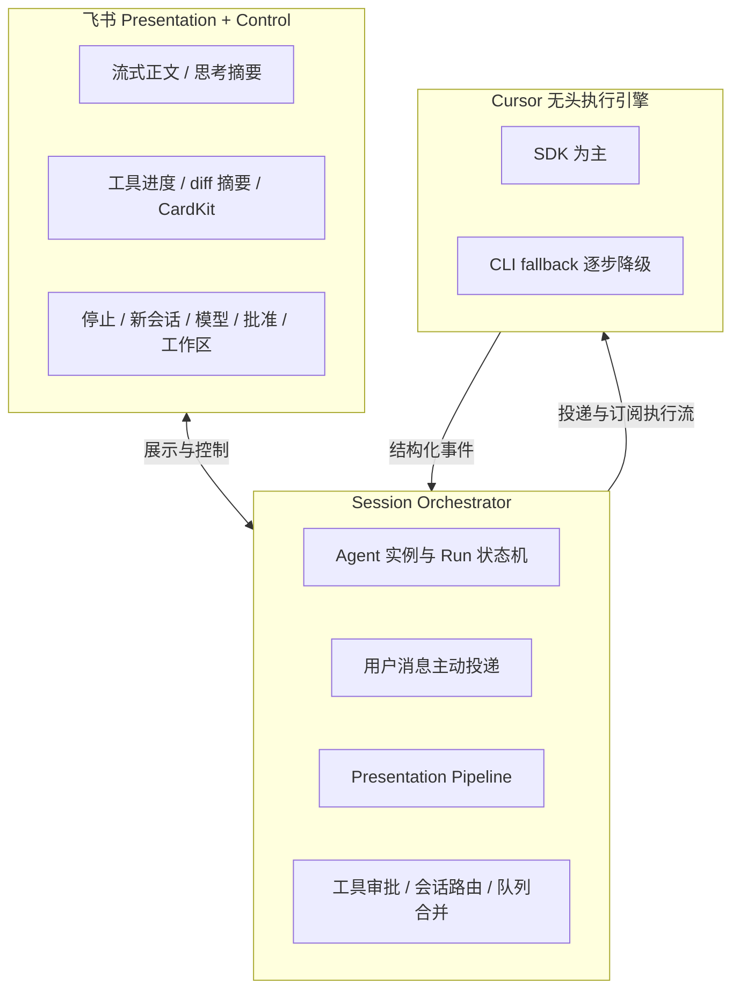

# 飞书作为 Cursor 展示与控制层产品需求文档

> **变更 ID**：`20260627162620-飞书作为Cursor展示与控制层`
> **来源**：kb-propose
> **类型**：架构演进/体验+能力
> **优先级**：P1
> **外部 PRD**：无
> **Figma 设计图**：无
> **任务记录**：无

## 愿景

cursor-claw 的长期方向是：**飞书承担 Cursor 的展示层与控制层**，用户在飞书中完成对话、进度感知与操作控制；**Cursor SDK / Agent 退居无头执行引擎**，专注改代码、推理与工具调用，不再自行承担通道展示与保活轮询。

## 背景与问题

近期已陆续上线或规划消息通道即时响应、流式输出、排队状态反馈、合并预览、SDK 保活兼容等能力。这些变更在单点体验上有效，但整体架构仍呈现「Agent 自管通道 + 自管保活 + 部分通道才走统一流式」的碎片化形态：

1. **会话驱动方式**：用户新消息往往依赖 Agent 侧阻塞式轮询保活才能被领取；Orchestrator 未主动将合并后的任务投递给已驻留的 Agent。
2. **展示不统一**：流式正文、工具进度、思考摘要等能力主要覆盖主用户私聊 SDK 路径；群聊、CLI 等通道仍大量依赖 Agent 自行发送进度文本，体验与语义不一致。
3. **控制分散**：停止、新会话、切换模型、批准工具、工作区切换等操作分散在斜杠指令与 admin 能力中，缺少飞书侧统一的卡片化控制与指令总线。
4. **Run 生命周期**：一次投递 + 阶段 poll 保活与「长驻 Agent、多条连续投递」的目标模型不匹配，且与 SDK Run 超时等问题相互牵制。

### 现状 vs 目标差距（产品维度）

| 维度 | 现状 | 目标 |
|------|------|------|
| 会话驱动 | Agent 轮询保活 + Agent 自管通道 | Orchestrator 主动投递 + 多轮连续投递 |
| 展示 | 仅部分通道走流式正文 | 统一 Presentation Pipeline 出站飞书 |
| 控制 | 斜杠指令 + admin 能力 | 飞书卡片回调 + 指令总线 |
| Run | 一次投递 + 阶段 poll 保活 | 长驻 Agent + 多条投递 |
| 用户消息 | 调度层不传完整任务，靠 poll 领取 | Orchestrator 合并后主动投递 |

## 目标与非目标

### 目标

1. **确立三层产品架构**：飞书（展示 + 控制）、Session Orchestrator（Electron + Daemon）、Cursor 无头执行引擎（SDK 为主），并在 PRD 层明确各层职责边界。
2. **统一展示管道**：结构化执行事件（流式正文、思考摘要、工具进度、diff 摘要、CardKit 卡片等）由 Orchestrator 订阅并渲染到飞书，而非 Agent 自由发送进度文本。
3. **Orchestrator 接管消息投递**：用户消息经合并后主动投递给 active Agent，废弃 SDK 路径下依赖 Agent 侧 poll 保活的模式。
4. **飞书控制层产品化**：停止、新话题、工作区、模型切换、工具批准、合并预览编辑等通过卡片与斜杠接入统一控制面，不依赖 Agent 轮询保活触发。
5. **分阶段可交付**：按阶段 0～3 划分交付边界，每阶段具备可验收的产品要点；MVP 优先验证主用户私聊 SDK 场景下的主动投递与统一展示。

### 非目标

- 本期 PRD **不**定义具体模块落点、接口签名或代码结构（归属 `/kb-design`）。
- **不**在本变更 propose 阶段修改业务代码或 Agent 规则正文。
- **不**承诺一次性废弃 CLI 通道——CLI 可在过渡期保留，逐步降级为 fallback。
- **不**在本期单独重做 Electron 设置页视觉（控制层以飞书卡片与斜杠为主）。
- **不**将微信等非飞书通道纳入 MVP 验收范围（除非后续单独立项扩展统一管道）。

## 用户与场景

### 用户

- **飞书管理员 / 主用户私聊**：MVP 首要验收对象；通过飞书与 Agent 多轮对话、连发消息、控制会话。
- **飞书群聊用户**（后续阶段）：接入统一展示管道，但 MVP 不要求全量验收。
- **运维 / 开发者**：通过日志与结构化事件理解会话状态，而非从 Agent 自由文本推断。

### 场景 A：连发多条消息，Agent 已在运行

用户已在进行中的 SDK 会话里，连续发送 3 条补充说明。Orchestrator 将待处理消息合并后**主动投递**给当前 active Agent，**无需** Agent 进入阻塞 poll 等待；用户通过统一管道看到流式回复与工具进度卡片。

### 场景 B：工具执行需用户批准

Agent 请求执行敏感工具。Orchestrator 将审批请求渲染为飞书卡片；用户点击批准或拒绝后，控制指令经指令总线回传 Orchestrator，再驱动 Agent 继续或中止，**不由** Agent 自行轮询等待。

### 场景 C：用户从飞书切换工作区或模型

用户通过卡片按钮或斜杠指令切换工作目录或模型。Orchestrator 更新会话上下文并反馈结果；**不依赖** Agent 侧保活轮询才能感知配置变更（与临时会话工作目录可选能力在控制层语义上可对齐）。

### 场景 D：用户停止当前任务或开启新话题

用户点击「停止」或「新话题」。Orchestrator 终止当前 Run 或路由到新会话，并通过统一管道向用户确认；展示层文案一致、可预期。

### 场景 E：长时间空闲后再次发消息

Agent 实例仍由 Orchestrator 持有或按策略重建；用户新发消息时走**主动投递**，而非依赖 Agent 在后台无限 blocking 等待。

## 目标架构（三层，产品描述）

### 第一层：飞书（Presentation + Control）

**展示**：流式正文、思考摘要、工具进度、diff 摘要、CardKit 卡片等，均由 Orchestrator 统一渲染，语义一致、可结构化更新。

**控制**：停止、新会话、切换模型、批准工具、合并预览编辑、工作区切换等；通过卡片回调与斜杠指令接入，**不依赖** Agent 轮询保活才能响应。

### 第二层：Session Orchestrator（Electron + Daemon）

- 持有 Agent 实例与 Run 状态机。
- 用户消息 → **主动投递**给 Agent，不再靠 Agent 侧 poll 保活领取任务。
- 订阅执行流 → 经 **Presentation Pipeline** 统一出站至飞书。
- 承担工具审批、会话路由、队列合并等会话级编排。

### 第三层：Cursor 执行引擎（SDK 为主，CLI 逐步降级为 fallback）

- 负责改代码、shell、MCP、多步推理等「执行」职责。
- 不再承担通道展示、进度文案发送、blocking poll 保活等产品职责。

## 设计原则

1. **控制走 Orchestrator，推理走 Agent**：用户操作与会话边界由服务端编排；Agent 专注任务理解与工具执行。
2. **展示 = 结构化事件，不是 Agent 自由 send_text**：进度、摘要、卡片由 Presentation Pipeline 根据执行流生成，避免 Agent 与通道耦合。
3. **会话边界由 Server 定义，不由 Prompt 元数据**：活跃会话、合并批次、工作区与模型上下文以 Orchestrator 状态为准，不依赖 Agent 规则中的隐式约定。

## 分阶段实现路径（产品交付）

### 阶段 0 — 统一展示管道

**交付要点**：

- 扩展 SDK 执行事件处理：**工具相关事件**也经统一管道渲染到飞书（含 CardKit 等结构化卡片）。
- 逐步去掉「仅部分通道 eligible 才走统一出站」的限制；CLI、群聊等通道接入同一 Presentation Pipeline。
- Agent 侧**弱化**手动发送进度文本的路径；普通回复与进度改由 stream / 管道自动生成。

**阶段验收方向**：主用户私聊 SDK 场景下，工具执行过程可在飞书看到结构化进度卡片；同一任务内 Agent 不再重复发送与管道语义重叠的进度文本。

### 阶段 1 — Orchestrator 接管消息投递（架构转折）

**交付要点**：

- 会话调度改为：**确保会话 Agent 就绪 + 提交用户轮次**（产品语义：有 active Agent 则合并后主动投递）。
- 新消息到达 active Agent 时，Orchestrator **合并后主动投递**，废弃 SDK 路径下依赖 Agent poll 保活的领取模式。
- Agent 规则删除 poll / 保活阶段相关约定；通道侧普通回复由 Orchestrator 代发，Agent 侧 send 类能力降级为非主路径。
- 与进行中变更「SDK 保活与 Run 生命周期兼容」的关系：若走本路线，**poll 保活可整体废弃**，或仅在 CLI 过渡路径保留。

**阶段验收方向**：飞书私聊连发 3 条消息，在已有 SDK Agent 运行时，**无** Agent Shell 阻塞 poll 行为，且合并内容仍被正确投递处理。

### 阶段 2 — 飞书控制层产品化

**交付要点**：

- 飞书卡片按钮：**停止、新话题、工作区、模型**等高频控制。
- Daemon 订阅飞书卡片回调，经指令总线驱动 Orchestrator。
- **合并预览可编辑**：与进行中变更「飞书排队消息状态反馈与合并预览」**对齐或合并规划**——预览展示、回复修改、Agent 现状反馈等应在控制层架构下统一，避免重复建设。
- cursor-claw 与 cursor-claw-admin 能力可**合并**，或 admin 能力**迁移至 Daemon** 统一提供。

**阶段验收方向**：用户可通过卡片完成停止与新话题，无需斜杠；合并预览可编辑流程与控制层指令总线协同，无重复通知刷屏。

### 阶段 3 — Cursor 无头化

**交付要点**：

- Agent 标识持久化，跨 Daemon 重启可恢复会话与 Run 关联。
- Electron 退为**托盘 + 配置**角色，会话编排与展示/control 主路径在 Daemon + 飞书。
- **SDK-only** 为主路径，CLI 逐步降级为 fallback。

**阶段验收方向**：Daemon 重启后，主用户私聊会话可恢复或明确引导续聊；用户日常操作不依赖 Electron 主窗口。

## 功能需求

功能需求按交付阶段组织；同一需求若在多个阶段演进，以**最高阶段**的完整语义为准。

### 阶段 0：统一展示管道

| 编号 | 需求描述 |
|------|----------|
| F0.1 | Orchestrator 订阅 SDK 执行流，将**工具开始 / 进行中 / 完成**等事件映射为飞书可展示的进度卡片或等价结构化消息。 |
| F0.2 | 流式正文、思考摘要、diff 摘要等与工具事件走**同一 Presentation Pipeline**，避免多通道多套渲染逻辑。 |
| F0.3 | 逐步取消「仅主用户私聊 SDK eligible」类限制，群聊与 CLI 通道接入统一出站（可分步放量，但产品语义一致）。 |
| F0.4 | Agent 不再将「处理中 / 工具名 / 步骤说明」作为主路径进度手段；此类信息由管道从 stream 自动生成。 |

### 阶段 1：Orchestrator 主动投递

| 编号 | 需求描述 |
|------|----------|
| F1.1 | 用户消息入队后，若会话已有 active SDK Agent，Orchestrator 在合并完成后**主动投递**完整任务，而非等待 Agent poll 领取。 |
| F1.2 | 废弃 SDK Agent 规则中的 poll / 保活阶段；长连接式「随时可发下一条」由 Orchestrator 持有 Agent 生命周期保障。 |
| F1.3 | 普通用户可见回复由 Orchestrator 经 Presentation Pipeline 发送；Agent 侧通道 send 能力降级，仅保留设计阶段明确需要的例外。 |
| F1.4 | 与「SDK 保活与 Run 生命周期兼容」变更协调：本阶段落地后，blocking poll 保活方案**整体废弃或仅 CLI 过渡**（见下文专节）。 |

### 阶段 2：飞书控制层

| 编号 | 需求描述 |
|------|----------|
| F2.1 | 飞书卡片提供**停止、新话题、工作区、模型**等控制按钮；点击后 Daemon 接收回调并转 Orchestrator 指令总线。 |
| F2.2 | 工具批准请求以卡片呈现；用户操作结果回传 Orchestrator 再驱动 Agent。 |
| F2.3 | 合并预览**可编辑**能力与排队状态反馈，与变更「飞书排队消息状态反馈与合并预览」**对齐或合并**，统一由 Orchestrator 触发与更新，而非 Agent 自发。 |
| F2.4 | admin 类能力（会话管理、配置查询等）评估合并至 Daemon 或保留 MCP 过渡，避免用户需在 Agent 与飞书两套控制面之间切换。 |

### 阶段 3：无头化与持久化

| 编号 | 需求描述 |
|------|----------|
| F3.1 | Agent 实例标识与会话状态持久化，Daemon 重启后可恢复或给出明确续聊引导。 |
| F3.2 | Electron 以托盘与配置为主；日常对话与控制以飞书为唯一主界面（配置类操作除外）。 |
| F3.3 | SDK 为默认执行路径；CLI 仅作 fallback，新产品能力不优先绑定 CLI。 |

## 与进行中变更的关系

避免重复建设；下列变更与本 PRD 的依赖 / 替代关系须在 design 阶段进一步细化排期。

### SDK 保活与 Run 生命周期兼容（`20260627150751`）

- **关系**：该变更聚焦 blocking poll 与 SDK Run 超时兼容、错误可观测性；本变更**阶段 1** 若落地 Orchestrator 主动投递，则 **poll 保活可整体废弃**，该变更中的「非阻塞 poll + 短间隔循环」等方案可能**不再需要**，或**仅保留 CLI 过渡**。
- **建议**：design 阶段二选一或分路径——**(A)** 先完成保活兼容再切主动投递；**(B)** 直接以本变更阶段 1 替代 poll 保活，将 `20260627150751` 收窄为 CLI / 可观测性子集或归档。须明确优先级，避免两套保活机制并存。

### 飞书排队消息状态反馈与合并预览（`20260627150041`）

- **关系**：该变更交付入队 Agent 现状、合并预览与回复修改等产品能力；本变更**阶段 2** 的合并预览可编辑、控制层卡片应与该变更**对齐或合并规划**。
- **建议**：统一由 Orchestrator 触发预览与更新；不在 Agent 侧重复发送预览类消息。若 `20260627150041` 先落地，阶段 2 以「接入指令总线 + 与控制卡片协同」为主，避免重写预览语义。

### 飞书临时会话工作目录可选（`20260627132014`）

- **关系**：该变更扩展临时会话创建时的工作目录指定；本变更阶段 2 **工作区切换**控制卡片在语义上应与之兼容（临时会话 vs 主会话目录策略不变，仅控制入口统一到飞书控制层）。
- **建议**：brief 对齐即可；不必在本变更 MVP 中验收临时会话目录，但控制层设计须预留「工作区」与临时会话规则的一致性。

## MVP 验收方向

MVP 范围：**主用户私聊 + SDK 路径**，验证架构转折的最小闭环。

1. **主动投递**：队列中新消息到达时，若已有 active SDK Agent，Orchestrator 合并后**主动投递**；用户无需等待 Agent poll。
2. **工具事件展示**：stream 扩展 tool 事件，在飞书以 CardKit 或等价卡片呈现工具进度。
3. **无 poll 保活**：飞书连发 3 条消息的场景下，验证**无** Agent Shell 阻塞 poll 行为，且三条均被合并或按序正确处理。
4. **展示一致性**：同一轮任务中，用户可见进度来自 Presentation Pipeline，而非 Agent 自发重复进度文本。

## 验收标准

### MVP（阶段 0 + 阶段 1 最小闭环）

1. 主用户私聊 SDK：Agent 运行中连发 3 条消息，系统合并或按产品规则投递，**全程无 blocking poll 保活**。
2. 工具执行期间，飞书出现结构化工具进度展示（CardKit 或等价卡片），且与流式正文不冲突刷屏。
3. Agent 完成任务后用户再发消息，仍走主动投递，**无需**用户因保活失败而收到含糊重试提示（与 `20260627150751` 症状对比应明显改善）。
4. 普通回复由 Orchestrator 管道出站，抽样对话中 Agent **不**再主路径发送与管道重复的进度 / 完成类文本。

### 阶段 0 补充

5. 至少一个非「主用户私聊 SDK only」通道（群聊或 CLI）接入统一 Presentation Pipeline，出站语义与私聊一致（可分步，但验收须点名通道范围）。

### 阶段 1 补充

6. Agent 规则与产品行为一致：**无** poll / 保活阶段用户可见副作用；设计阶段定义的例外路径（如有 CLI fallback）须在验收报告中标注。

### 阶段 2 补充

7. 用户可通过飞书卡片完成停止与新话题，Orchestrator 正确终止或路由会话。
8. 合并预览可编辑与 `20260627150041` 语义一致或已合并，且由 Orchestrator 驱动，无 Agent 侧重复预览。
9. 工具批准卡片闭环：批准 / 拒绝后 Agent 继续或中止，用户收到明确反馈。

### 阶段 3 补充

10. Daemon 重启后会话恢复或续聊引导符合产品设计；Electron 非对话主路径。
11. 新功能默认走 SDK；CLI fallback 行为在验收报告中单独标注范围。

## 非功能需求

| 编号 | 描述 |
|------|------|
| NF1 | 主动投递延迟：在 Agent 已 active 时，合并完成至投递启动 P95 ≤ 3 秒（与既有入队 SLA 协调）。 |
| NF2 | Presentation Pipeline 须避免同一步骤多条语义重叠通知（与排队反馈、三态进度、流式卡片协调）。 |
| NF3 | 控制指令（停止、批准等）须幂等或可识别重复点击，避免重复终止或重复批准。 |
| NF4 | 架构演进分阶段放量；每阶段须可独立回滚或 feature 开关，避免一次性 Big Bang。 |
| NF5 | 可观测性：Orchestrator 须能区分「投递失败 / 展示失败 / Agent 执行失败 / 控制指令失败」，便于运维归因。 |

## 待确认项

1. **与 `20260627150751` 的排期策略**：先保活兼容再主动投递，还是阶段 1 直接替代 poll 保活（影响并行开发与验收顺序）。
2. **与 `20260627150041` 的合并方式**：阶段 2 是否将排队反馈 / 合并预览变更 absorb 为本变更子交付，或保持独立变更仅做接口对齐。
3. **群聊 / CLI 接入统一管道的放量顺序**：阶段 0 是否要求与私聊同批上线，还是私聊先行。
4. **admin MCP 去留**：阶段 2 是完全合并至 Daemon，还是保留 MCP 只读查询过渡。
