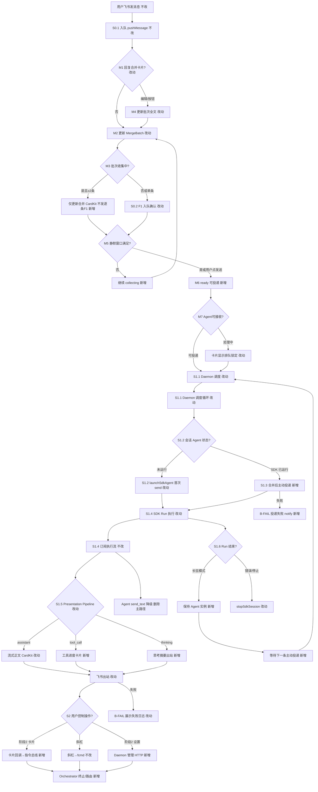
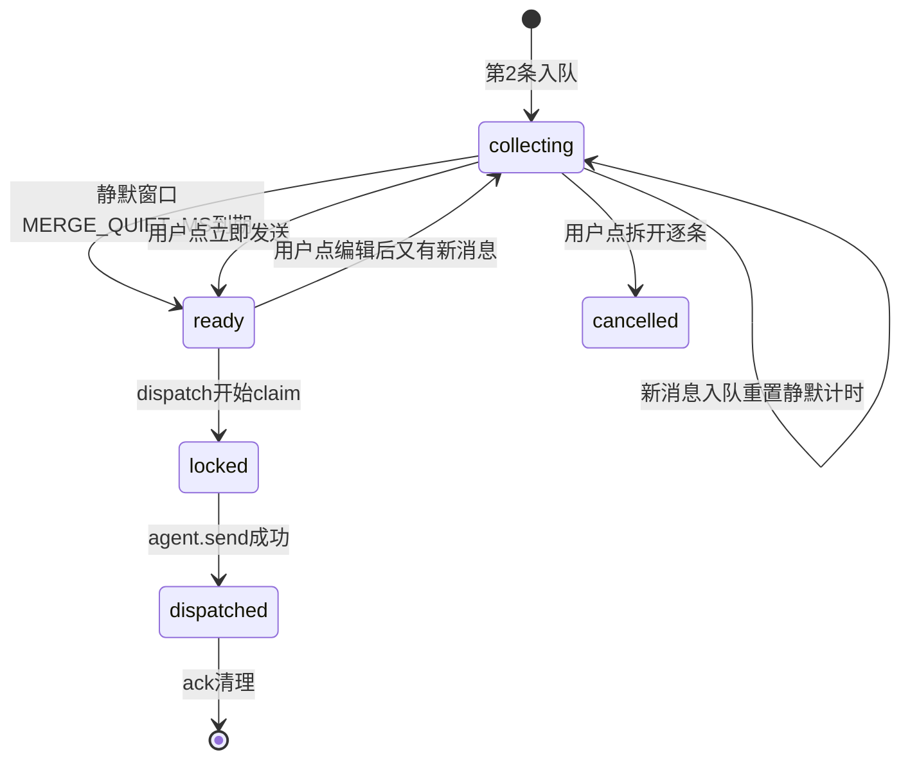
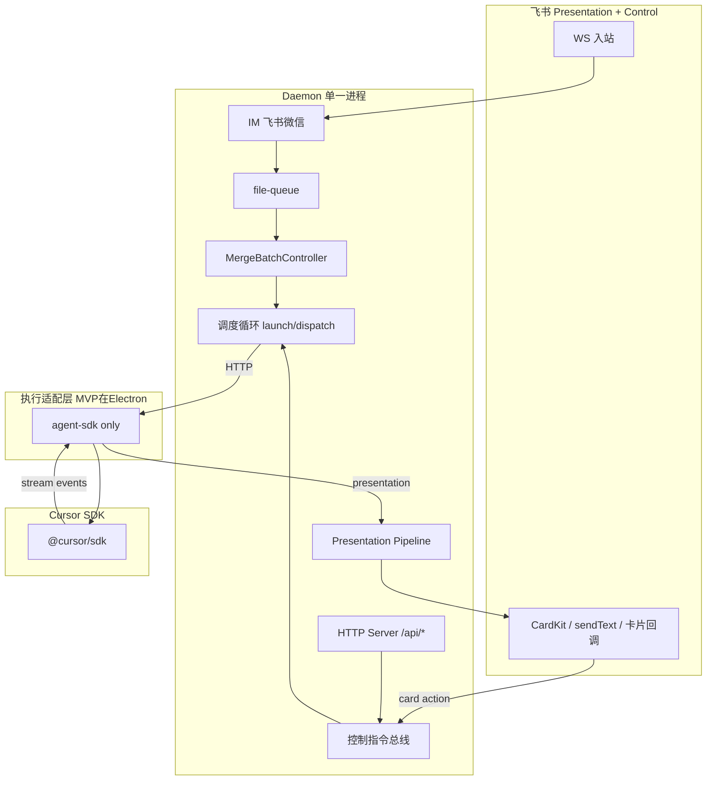

# 飞书作为 Cursor 展示与控制层 - 实现设计

> **业务 PRD**：见同目录 `01-proposal.md`（验收标准以 01 为准）

## 一、业务流程与改动范围

> 业务口径以 `01-proposal.md` 用户场景 A–E、分阶段交付路径与 MVP 验收为准；下图覆盖 **MVP（阶段 0+1）主路径**、关键分支与阶段 2/3 占位分支。

### （一）业务流程图



**图例**：`不改` 行为与现网一致；`改动` 需改代码/配置；`新增` 新节点或新分支；`删除主路径` 原路径降级或移除。

### （二）流程步骤与改动对照

| 步骤 ID | 业务含义 | 改动 | 落点（模块/文件） | 01 验收关联 |
|---------|----------|------|-------------------|-------------|
| S0.0 | 启动后不修改用户 `.cursor`（rules / mcp / skills） | 删除 | 废弃 `electron/workspace-injector.ts` 写入路径；可选一次性清理历史注入残留 | 01 §设计原则；无 Agent 规则依赖 |
| S0.1 | 用户消息原子入队 | 不改 | `src/daemon.ts` `pushMessage`；`src/file-queue.ts` | MVP-1 前置 |
| S0.2 | F1 入队确认 | 改动 | `buildEnqueueStatusText`；**批次收集中且≥2 条时抑制逐条 F1**，改由合并卡片承载 | MVP-1 |
| M1–M7 | **合并批次交互**（见 §二·合并专节） | 改动/新增 | `src/daemon.ts` `MergeBatchController`；`src/shared/lark-core.ts` 合并 CardKit | **MVP-1 体验核心**；01 场景 A；验收 1/4 |
| S0.3 | ~~独立文本预览 F2/F3~~ → 合并 CardKit 单卡更新 | 改动 | 替代 `scheduleMergePreview`/`sendMergePreview` 多消息刷屏 | 01 F2.3；50041 absorb |
| S1.1 | 队列变更触发 **Daemon 内**调度 | 改动 | `src/daemon.ts` dispatch 循环；经 HTTP 调 **`launchSdkAgent` only** | MVP-1 |
| S1.2 | Agent 未运行：**SDK** 首次拉起 | 改动 | `POST /api/agent/launch` → `launchSdkAgent`；**移除** `_launchCliAgent` 分支 | MVP-1 |
| S1.3 | Daemon 在批次 **ready** 后主动投递 | 新增 | `claim-and-merge` 仅在 M6/M7 通过后；**禁止**静默窗口内抢跑 claim | **MVP-1/3** |
| S1.4 | SDK 订阅 Run 执行流 | 改动 | `electron/agent-sdk.ts` `streamRunEvents`、`handleSdkEvent` | MVP-2 |
| S1.5 | 统一 Presentation Pipeline 出站 | 改动 | `electron/agent-sdk.ts` `postStreamText` 扩展；`src/daemon.ts` `handleStreamText` + 新增 `handlePresentationEvent`；`src/shared/lark-core.ts` 工具 CardKit | **MVP-2/4**；01 F0.1–F0.4；验收 2/4 |
| S1.6 | Run 结束：长驻 Agent vs 销毁 | 改动 | `electron/agent-sdk.ts` `streamRunEvents` 收尾（feature flag 控制是否 `close`） | MVP-3；01 §场景 E |
| S1.7 | 废弃 poll / 规则驱动 / **CLI spawn** | 删除 | 删除 `GET /api/poll-message`、`_launchCliAgent`、`cursor-claw.mdc` 产品依赖 | MVP-3；01 验收 1/6 |
| S1.8 | 放宽 stream eligible（**群聊** SDK） | 改动 | `f41Eligible` / `isStreamTextEligible` 扩展群聊 | 01 阶段 0 补充验收 5 |
| B-SDK-ONLY | 通道未绑 SDK 资源则拒绝调度 | 新增 | `launchAgent` 仅 `resource.type === "sdk"`；否则 notify「请配置 SDK 资源」 | 01 F3.3 |
| B-FAIL | 投递/展示/执行失败分类 notify | 新增 | `electron/agent-sdk.ts`；`src/daemon.ts` | 01 NF5 |
| S2.1 | 飞书卡片控制（停止/新话题/工作区/模型） | 新增 | `src/daemon.ts` + `src/shared/lark-core.ts` 卡片回调；`electron/command-handler.ts` 复用 | 01 §阶段 2 验收 7 |
| S2.2 | 工具批准卡片闭环 | 新增 | `electron/agent-sdk.ts` 订阅批准事件；`src/daemon.ts` 批准总线 | 01 §场景 B；验收 9 |
| S2.3 | 合并卡片与控制层统一 | 改动 | 合并卡按钮走 `control-command`；与停止/新话题同 Presentation | 01 验收 8 |
| S2.4 | 废弃 MCP；**不**注入用户级/项目级 cursor 配置 | 删除 | `src/daemon.ts` 移除 `/mcp`、`/mcp-admin`；删除 `workspace-injector` 或改为仅 **只读清理** 历史残留 | 01 F2.4 |
| S3.1 | Agent 标识持久化 / Daemon 重启恢复 | 新增 | `src/daemon.ts` 调度态；`electron/agent-sdk.ts` 或迁入 `src/agent-sdk.ts` | 01 §阶段 3 验收 10 |
| S3.2 | Electron 仅托盘+配置；**Daemon 独立进程**承载 IM+Server+调度 | 改动 | `electron/main.ts` 仅 spawn/monitor daemon；调度逻辑迁入 `src/daemon.ts` | 01 §阶段 3 验收 11 |

### （三）改动汇总

- **改动**：`daemon.ts`（MergeBatchController、调度门控、F1 合并、单一编排中心）、`agent-sdk.ts`、`lark-core.ts`（合并 CardKit + 工具 CardKit）
- **新增**：合并批次状态机、静默窗口、dispatch 循环、`PresentationEvent`、`/api/merge-batch/*`
- **删除**：CLI spawn（`_launchCliAgent`）、`GET /api/poll-message`、poll/预览守卫链、MCP、workspace-injector 写入、`cursor-claw.mdc` 运行时依赖
- **不改（显式列出）**：file-queue 入队与 ack；【消息 N】SSOT；用户 `.cursor` 内容；`agent-launcher` 内 **CLI 登录检测**可保留供设置页，**不参与** IM 调度

## 二、整体思路

见 01 §愿景、§目标架构、§分阶段实现路径。根因是现网 **「单次 Run + Agent Shell poll 领取 + 部分通道 stream-text」** 与产品目标 **「Orchestrator 主动投递 + 统一展示 + 飞书控制面」** 结构性错位（CodeGraph 锚点：`launchSdkAgent` 单次 `agent.send` 且 Run 结束即 `agent.close()`；`dispatchSessionAgents` 对已运行 session `continue`）。

**方案要点**：

1. **分阶段交付 + Feature Flag**（`UNIFIED_PRESENTATION`、`ACTIVE_DISPATCH`、`SDK_RESIDENT_AGENT`），满足 01 NF4 可回滚。
2. **MVP = 阶段 0 + 阶段 1**：主用户私聊 SDK 路径上完成工具事件管道化 + 主动投递 + 废弃 SDK poll 保活。
3. **排期决策（50751）**：策略 B 直接替代 poll；**CLI 移除后** `20260627150751` 整变更可归档，无需 CLI blocking poll 子集。
4. **与 `20260627150041`**：absorb 合并 CardKit 重做（见下节）。
5. **第二通道放量**：阶段 0 私聊 SDK → 阶段 0 补充验收选 **群聊 SDK**（非 CLI）。
6. **MCP / `.cursor`**：启动不污染用户配置；能力在 Daemon。
7. **Daemon 单一进程**：HTTP + IM + 调度。
8. **SDK-only 执行引擎（回应 01 F3.3 / 待确认）**：**移除 IM 调度路径上的 CLI spawn**。理由见下节；收窄 01「CLI 过渡 fallback」——本架构下 CLI 无法接入主动投递、合并 CardKit、工具事件管道与飞书控制层，保留只会维持双轨复杂度。

**为何移除 CLI spawn（相对 SDK）**

| 维度 | SDK | CLI spawn（现网） |
|------|-----|-------------------|
| 执行流 | `run.stream()` → 管道 | 无；靠 Agent 自填 send_text |
| 投递 | Orchestrator `agent.send` | poll-message + 规则阶段 4 |
| 展示 | CardKit 流式 / 工具卡 | 与 Pipeline 分裂 |
| 合并 | MergeBatch + 主动 dispatch | poll claim 时序竞态 |
| 配置 | 不注入 rules/MCP | 依赖 `cursor-claw.mdc` + workspace-injector |
| 长驻多轮 | `Agent.create` 后多次 `agent.send`，**同 Agent 保留上下文**（见 @cursor/sdk 文档）；跨进程用 `Agent.resume(agentId)` | `--resume` 子进程模型 |

**处置**：

- **删除**：`session-dispatcher.launchAgent` 中 `resource.type !== "sdk"` 分支；`stopSessionAgent` 的 CLI 分支；`GET /api/poll-message` 及 blocking 25min SYSTEM OVERRIDE；通道默认 `agentResourceId: "cli"`。
- **迁移**：配置升级——启用 IM 的通道若仍指向 `cli`，启动时 **自动切到首个 SDK 资源**（有 API Key）或 **拒绝调度并 notify**；设置页通道下拉 **仅列 SDK 资源**（CLI 资源条目可隐藏或标「已废弃」）。
- **保留（非 spawn）**：`agent-launcher` 的 **Cursor CLI 登录检测**（`checkCliLogin`）可选保留，供设置页「账号是否可用」探测；与消息调度无关。
- **不回滚**：不保留 `USE_CLI_FALLBACK` feature flag——双引擎回滚成本高于配置迁移。

**SDK 会话模型（回应「能否继续 / 每次 send 是否新开会话」）**

| 概念 | 含义 |
|------|------|
| **Agent** | `Agent.create()` 得到的长驻对象，有 `agentId`；**对话上下文挂在 Agent 上** |
| **Run** | 每次 `agent.send(prompt)` 启动一次执行；**新 Run ≠ 新 Agent** |
| **同进程多轮** | Run 结束后 **不** `close()`，再次 `agent.send("补充…")` 官方文档明确 **保留上下文** |
| **跨进程恢复** | `Agent.resume(agentId, opts)` 接续已有 Agent（阶段 3 持久化用） |

**cursor-claw 现网差距**：`launchSdkAgent` 只 `send` 一次，Run 收尾即 `agent.close()` + 删 session——这是 **产品实现** 导致「每轮像新会话」，不是 SDK 无能力。本变更 **长驻 Agent + active dispatch** 即对齐 SDK 官方「durable with follow-ups」模式。

**合并消息交互（重灾区重做）**

现网（`20260627150041`）痛点：**F1 逐条确认 + 文本预览 debounce + Get + 流式 CardKit** 同屏多轨；**回复预览改全文**认知负担高；`ensureMergePreviewSentBeforeClaim` / idle 补偿 / 主动投递 **三套时序**易竞态；Agent 处理中 suppress 预览但 F1 仍刷屏。

**设计目标**：连发 N 条时用户只感知 **一张会更新的合并卡** + **一条汇总状态**；投递前可编辑；与主动投递、Presentation Pipeline、NF2 去重一致。

**批次状态机**（每 `sessionKey` 至多一个活跃 `MergeBatch`）：



| 状态 | 用户可见 | 系统行为 |
|------|----------|----------|
| **collecting** | 合并 CardKit：「已收到 N 条，M 秒后发送…」可取消倒计时 | 抑制第 2+ 条逐条 F1；**同卡** PATCH 更新条目列表；不 claim |
| **ready** | 卡片：「即将发送」+ [立即发送] [编辑] [拆开逐条] | 满足 M7 则进入 dispatch；否则显示「Agent 处理中，已排队」 |
| **locked** | 卡片只读 + 「发送中…」 | claim + merge override + `agent.send` |
| **dispatched** | 卡片折叠/完成态或删除 | 清 batch；后续消息开新 batch 或单条 |

**关键参数**（可配置，默认保守）：

| 参数 | 默认 | 说明 |
|------|------|------|
| `MERGE_QUIET_MS` | 2500 | 最后一条入队后静默才 `ready`；连打时不会抢跑投递 |
| `MERGE_MIN_COUNT` | 2 | ≥2 才走合并卡；单条仍 F1 + 直接 dispatch |
| `MERGE_CARD_MAX_ITEMS` | 20 | 超出提示「仅展示最近 20 条」 |
| `MERGE_EDIT_MAX_CHARS` | 30000 | 与现网 NF4 一致；卡片内分块展示 |

**合并 CardKit 内容**（单 `outbound_message_id`，全程 PATCH 更新，**不发新消息**）：

- 标题：`待发送 · N 条消息`
- 正文：折叠列表 `1. …` `2. …`（非 【消息 N】 对用户展示；投递 Agent 仍用 SSOT `formatMergeBody`）
- 脚：倒计时 / Agent 状态一行
- 按钮：`merge_send_now` | `merge_edit` | `merge_split`

**编辑路径**（优先级）：

1. **主路径**：点 [编辑] → 卡片切编辑态 / 飞书表单 → 提交后更新 `batch.overrideText`，卡恢复预览态
2. **fallback**：回复合并卡发送**完整**新正文（兼容现 F3 `tryHandleMergePreviewReply`，仅命中 `mergeCardMessageId`）
3. **拆开逐条**：`merge_split` → 取消 batch，每条独立 dispatch（或按序单条 ready）

**与 Agent 状态协作（M7）**：

| Agent phase | 新 batch 行为 |
|-------------|---------------|
| idle / starting | `ready` 后立即 dispatch |
| processing（Run 活跃） | 卡片显示「当前任务完成后发送」；batch 保持 `ready` 排队；Run 转 idle 后 Daemon **自动** dispatch 排队 batch（长驻 Agent 场景 A） |
| processing + 流式 outbound 活跃 | 合并卡仍更新条目，**不**与 stream 卡争首屏：合并卡 pin 在会话底部或使用 thread reply 到首条 inbound（实现时二选一，优先 **reply 链挂在首条用户消息**） |

**F1 合并规则（M3）**：

- 第 1 条：正常 F1 + Get（单条路径）
- 第 2 条起且 batch=collecting：**不发**新 F1 reply，仅更新合并卡 + 可选轻量 emoji reaction
- Agent processing 时新入队：一条短 F1「已收到，已加入待发送批次（N 条）」**最多每 batch 一次**，不逐条

**投递 SSOT**：Agent 收到的仍是 `formatMergeBody(messages)` 或 `overrideText`；与现 `applyMergeOverrideForPoll` 语义一致，触发点改为 **M6 ready + M7 门控**，删除 poll 守卫。

**废弃/降级现网路径**：

- `scheduleMergePreview` debounce → 多文本消息：**删除**
- `ensureMergePreviewSentBeforeClaim`：**删除**（主动投递无 poll）
- `scheduleMergePreviewIfEligible` idle 补偿：**改为** idle 时扫描 `ready` batch 触发 dispatch
- MG-id 长 header 文本：**改为**卡片内短 batchId（调试用，用户不可见为主）

**最小方案三问（合并）**：

1. 复用 `MergePreviewState` 字段 rename 为 `MergeBatch`，复用 `formatMergePreviewBody` → `formatMergeBody`，复用 CardKit PATCH API。
2. 不新建 `MergeService` 包；`MergeBatchController` 为 `daemon.ts` 内聚函数集。
3. 单卡 update-in-place，避免 `splitMergePreviewText` 多消息续页（除非超 CardKit 单卡上限才分块，仍尽量 PATCH 同 entity）。

**最小方案三问（整体）**：

1. **能否复用现有模块？** 是。以 **`src/daemon.ts` 为唯一编排中心** 扩展，不新建 `orchestrator/` 包；MVP 过渡复用 `agent-sdk.ts` 作执行后端，经 Daemon HTTP 驱动。
2. **新增抽象是否 PRD 要求？** `PresentationEvent` 为 daemon 内类型 + 单函数路由；指令总线为 `Map` 内联。不引入用户级 MCP、不注入 rules/skills。
3. **能否合并到已有文件？** 是。调度迁入 `daemon.ts`；废弃 `workspace-injector` 写入路径；`resources/template/rule/cursor-claw.mdc` 仅作历史参考或 CLI 文档，**不参与** SDK 主路径。

## 三、分层设计



- **Daemon（唯一编排中心）**：HTTP 服务、IM 入出站、队列与合并、**Agent 调度**（launch / active dispatch / stop）、Presentation Pipeline、控制总线；**不**向用户 `.cursor` 写入任何内容。
- **执行层**：**仅 SDK**；无 CLI 子进程、无 poll-message。

## 四、接口设计

- **Daemon**：`MergeBatchController` 与 dispatch **同进程**；合并卡走 Presentation Pipeline 的 `kind: "merge_batch"`，与 stream/tool 卡 NF2 协调。

### 阶段 0–1 新增/扩展

| 方法 | 说明 |
|------|------|
| `POST /api/presentation-event` | 含 `kind: "merge_batch"`：创建/更新/关闭合并 CardKit |
| `POST /api/merge-batch/action` | Body: `{ session_key, action: "send_now"\|"edit"\|"split", text? }`；卡片回调与 fallback _reply 统一入口 |
| `POST /api/orchestrator/claim-and-merge` | 仅当 batch.phase=`ready` 且 M7 通过；返回 `{ text, message_ids[] }` |
| `POST /api/agent/launch` / `dispatch` | 消费 claim 结果 |

### 沿用契约

| 方法 | 变更 |
|------|------|
| `GET /api/poll-message` | **整端点删除**（SDK-only 后无消费者） |
| `POST /api/stream-text` | 与 merge 卡并存；同 session 合并卡不抢 stream 首包 |
| `POST /api/session-agent-phase` | idle 时触发 `flushReadyMergeBatches(sessionKey)` |
| `POST /api/send-text` | 单条 F1；batch 收集中不用于第 2+ 条 |
| `~/.cursor/*` | 启动后不写入 |

### MCP 与注入废弃（阶段 1 起生效，阶段 2 删路由）

| 组件 | 处置 |
|------|------|
| `/mcp`、`/mcp-admin` | **删除** |
| `workspace-injector` 写入 | **删除** `injectMcpGlobal`、`injectRulesToDir`、`injectSkillsToDir`；保留可选 **只读清理** |
| `session-dispatcher` 内 `injectWorkspaceToDir` | **删除**调用 |
| `resources/template/rule/cursor-claw.mdc` | **不注入、不维护**；CLI poll 语义随 spawn 删除 |
| `_launchCliAgent` / CLI `sessionAgents` | **删除** IM 调度路径；`agent-launcher` 登录检测可选保留 |

### 阶段 2 新增（设计占位）

| 方法 | 说明 |
|------|------|
| 飞书卡片 callback | `card.action.trigger` → daemon 路由 `{ action: "stop"\|"new_chat"\|"approve_tool"\|"status", ... }`；映射至既有 `/api/agent` 等 |
| `POST /api/control-command` | 内部：卡片与斜杠统一入口，幂等键 `command_id`（01 NF3）；复用 `server-admin.ts` 已调用的 HTTP 契约 |

## 五、数据结构

### MergeBatch（替代 `MergePreviewState`，`src/daemon.ts`）

```typescript
type MergeBatchPhase = "collecting" | "ready" | "locked" | "dispatched" | "cancelled"

interface MergeBatch {
  sessionKey: string
  batchId: string              // 内部 UUID，非 MG- 长 header
  phase: MergeBatchPhase
  messageIds: string[]         // 已入队 .qmsg id 顺序
  overrideText?: string        // 用户编辑后全文；投递 SSOT
  cardEntityId?: string        // CardKit entity
  cardMessageId?: string       // 单卡 outbound id，全程 PATCH
  quietTimer?: NodeJS.Timeout
  quietDeadlineAt?: number     // UI 倒计时
  lastInboundMessageId?: string // reply 链锚点
  createdAt: number
  updatedAt: number
}
```

| 字段 | 说明 |
|------|------|
| `phase` | 见 §二 状态机；`locked` 防双 dispatch |
| `overrideText` | 有值时 Agent 收 override；否则 `formatMergeBody(unclaimed)` |
| `cardMessageId` | 注册到 `mergeCardRegistry` 供 F3 fallback 与按钮回调 |

内存：`mergeBatchBySession: Map<sessionKey, MergeBatch>`；每 session **至多一个** 非 terminal batch。

### PresentationEvent（扩展）

```typescript
type PresentationKind = "assistant" | "thinking" | "tool" | "diff" | "merge_batch"
interface PresentationEvent {
  session_key: string
  kind: PresentationKind
  delta?: string      // assistant/thinking 增量
  tool_name?: string
  tool_status?: "started" | "completed" | "failed"
  final?: boolean
  outbound_message_id?: string  // 续写 CardKit
}
```

### SdkSessionAgent 扩展（`electron/agent-sdk.ts`）

| 字段 | 说明 |
|------|------|
| `residentMode: boolean` | feature flag；true 时 Run 结束不 close |
| `pendingDispatch: boolean` | 防止并发二次 send |
| `presentationOutboundId?: string` | 工具卡片 message_id（更新用） |

### 阶段 3 持久化（可选文件 `~/.cursor-claw/sessions.json`）

| 字段 | 说明 |
|------|------|
| `session_key → { agent_id, workspace_dir, last_run_at }` | Daemon 重启恢复或续聊引导 |

无 DB / proto 变更。

## 六、实现步骤

**阶段 0（展示管道 + 合并卡 MVP）**

0. **S0.0**：移除 workspace-injector 写入
1. **M-impl-1**：`MergeBatch` + `onMessageEnqueued` + `MERGE_QUIET_MS` 静默计时
2. **M-impl-2**：`renderMergeBatchCard` / PATCH 更新（`kind: merge_batch`）；**删除** `sendMergePreview` 新发文本
3. **M-impl-3**：F1 门控（M3）：第 2+ 条 suppress 逐条 F1
4. **S1.5-a～c**：tool/thinking 管道 + NF2 与 merge 卡协调
5. **M-impl-4**：`tryHandleMergePreviewReply` 改为仅认 `cardMessageId`；保留 fallback

**阶段 1（静默窗口 + ready 投递）**

6. **M-impl-5**：`merge_send_now` / phase→ready；`merge_split` / cancelled
7. **M-impl-6**：`claim-and-merge` 门控：仅 `ready|locked`；对接 dispatch
8. **S1.1**：dispatch 循环 **等待 batch ready**，禁止 collecting 抢跑
9. **M-impl-7**：Agent processing 时 batch 排队；phase→idle 时 `flushReadyMergeBatches`
10. **S1.2/S1.6/S1.3**：长驻 Agent + 二次 send
11. **CLI-1**：`launchAgent` 移除 CLI 分支；`config-store` 迁移 `agentResourceId` → SDK
12. **CLI-2**：删除 `GET /api/poll-message`、`waitForSessionMessages`、SYSTEM OVERRIDE
13. **CLI-3**：UI 通道默认/仅 SDK；无 Key 时明确错误
14. **S1.1-b**：调度迁入 daemon

**阶段 2（飞书控制层 — 后续迭代）**

13. **S2.1**：飞书订阅卡片回调；映射至 `command-handler` 现有 `/stop`、`/chat new`、`/model`、`/workspace`
14. **S2.2**：SDK 工具批准事件 → 卡片 → 用户点击 → `control-command` → 回传 SDK
15. **S2.3**：合并卡 `merge_edit` 正式表单态；与 control-command 统一幂等
16. **S2.4-a**：确认 `/api/agent`、`/api/mcp`、`/api/rules`、`/api/skills`、`/api/tasks`、`/api/workspace` 覆盖原 `manage_*` 全部分支；缺口补 HTTP handler（不新建 MCP）
17. **S2.4-b**：飞书卡片/斜杠控制映射至上述 HTTP（如 stop→`/api/agent` action=stop；status→`/api/status`）
18. **S2.4-c**：删除 MCP 路由；删除 injector 写入；文档标注 Daemon-only
19. **S2.4-d**：工作流触发改 Daemon HTTP 或 SDK 内置，**不经** 用户 MCP

**阶段 3（无头化 — 后续迭代）**

20. **S3.1**：`sessions.json` + Daemon 重启恢复
21. **S3.2**：Electron 仅 spawn/monitor Daemon；`agent-sdk` 可选迁入 `src/`

## 七、参考实现

| 符号 | 路径 | 本变更用法 |
|------|------|-----------|
| `launchSdkAgent` | `electron/agent-sdk.ts:395` | 扩展长驻 + 二次 send |
| `handleSdkEvent` | `electron/agent-sdk.ts:313` | 扩展 tool/thinking 管道 |
| `f41Eligible` / `postStreamText` | `electron/agent-sdk.ts:67,119` | 扩展 eligible；新增 presentation POST |
| `dispatchSessionAgents` | `electron/session-dispatcher.ts:650` | 逻辑迁入 `daemon.ts` |
| `injectMcpGlobal` / `injectRulesToDir` | `electron/workspace-injector.ts:68,96` | **删除**写入 |
| `injectWorkspaceToDir` | `electron/workspace-injector.ts:193+` | **删除** launch 时调用 |
| `buildPrompt` | `electron/agent-launcher.ts:145` | Daemon 侧构造任务 Prompt，无 rules 依赖 |
| `pullMergedMessagesFromQueue` | `electron/session-dispatcher.ts:202` | 【消息 N】SSOT |
| `isStreamTextEligible` / `handleStreamText` | `src/daemon.ts:326,409` | 管道门控与 CardKit |
| `formatMergePreviewBody` | `src/daemon.ts:581` | rename → `formatMergeBody` SSOT |
| `MergePreviewState` | `src/daemon.ts:564` | → `MergeBatch` + phase |
| `scheduleMergePreview` / `sendMergePreview` | `src/daemon.ts:805,711` | **替换**为单卡 PATCH |
| `shouldSuppressMergePreview` | `src/daemon.ts:638` | → `shouldDeferDispatch` / 合并卡 UI 态 |
| `ensureMergePreviewSentBeforeClaim` | `src/daemon.ts:782` | **删除** |
| `buildEnqueueStatusText` | `src/daemon.ts:613` | batch 感知 F1 |
| `_launchCliAgent` | `electron/agent-launcher.ts` | **删除** spawn 路径 |
| `GET /api/poll-message` | `src/daemon.ts:2325` | **删除** |
| `createStreamingCardEntity` | `src/shared/lark-core.ts:188` | 工具 CardKit 参考 |
| 阶段 4 poll 保活 | `resources/template/rule/cursor-claw.mdc` | **不注入**；SDK 由 Daemon 代码替代 |
| `createMcpServer` / `createAdminMcpServer` | `src/daemon.ts:1543,1611` | 阶段 2 删除 |
| `registerAdminTools` | `src/server-admin.ts:53` | 逻辑下沉为 HTTP；MCP 注册层删除 |
| MCP 注入 | `electron/workspace-injector.ts` | 删除写入；可选清理 |
| `manage_agent` 等 | `src/server-admin.ts` | 改由控制层直连 `/api/agent` 等 |

## 八、技术影响

### （一）影响范围

- **涉及模块**：`src/daemon.ts`（**主**）、`electron/agent-sdk.ts`、`electron/session-dispatcher.ts`（逐步瘦身）、`electron/daemon-manager.ts`、`electron/workspace-injector.ts`（删除写入）、`electron/main.ts`、`src/shared/lark-core.ts`、`src/file-queue.ts`
- **接口/proto 变更**：Daemon 新增 dispatch/launch API；删除 `/mcp`、`/mcp-admin`；**无**用户 `.cursor` 文件契约变更
- **数据变更**：可选 `sessions.json`（阶段 3）；内存 phase 语义扩展
- **风险**：
  - **中**：Run 结束与下次 send 之间须保持 Agent 实例——现网 `launchSdkAgent` 收尾 `close()` 须改（设计已明确）
  - **高**：主动投递与 poll 双轨若未用 flag 隔离会导致重复 claim（01 §与 50751）
  - **中**：长驻 Agent 下 `sessionAgentPhaseMap` idle/processing 与 F4 抑制逻辑需重新定义
  - **高**：合并卡与 stream CardKit **同 session 争用**——须 pin/reply 策略 + NF2 验收
  - **高**：静默窗口 vs NF1 投递 P95——`MERGE_QUIET_MS` 可配置，默认 2.5s
  - **中**：CardKit 按钮回调依赖飞书权限——MVP 可 fallback 斜杠 `/merge send|edit|split`
  - **低**：僵尸检测 `isZombieAgent` 依赖 send-text 回复——管道代发后需改检测信号
  - **中**：旧配置通道仍指向 `cli`——须迁移脚本 + 设置页引导
  - **低**：历史已注入 mcp/rules 的用户：可选一次性 cleanup，**非**启动时自动改

### （二）工程补充验收项

- [ ] 全通道 IM 调度 **无** CLI 子进程；`poll-message` 404
- [ ] 通道未配置 SDK API Key 时：入队可确认，dispatch 失败 notify 可理解
- [ ] 群聊 SDK 为阶段 0 第二通道验收（替代原「CLI 通道」）
- [ ] `claim-and-merge` 与 ack 语义一致：至少一次投递、reply 后清理 `.claimed`
- [ ] 连发 3 条：用户仅见 **1 张**合并卡更新 + **≤1 条** F1（首条或 batch 汇总），无 3 条预览文本
- [ ] 静默窗口内不 dispatch；点 [立即发送] 或窗口结束后 dispatch；内容与 `formatMergeBody` 一致
- [ ] Agent processing 连发：合并卡显示排队；idle 后自动投递 ready batch
- [ ] 编辑：卡片/回复改全文后投递内容=override
- [ ] [拆开逐条]：取消合并，按单条 dispatch
- [ ] 主动投递 P95 ≤ 3s（自 **ready** 起算，不含 collecting 等待）
- [ ] 日志字段区分 `dispatch_failed` / `presentation_failed` / `agent_failed` / `control_failed`（01 NF5）
- [ ] SDK spike 记录：同 Agent 连续两次 `send` 的行为与 Run 关系（写入 implement 阶段 08-verify）
- [ ] 启动后用户 `~/.cursor/mcp.json` 与项目 `.cursor/rules` **mtime/内容不变**（除非用户主动 cleanup）
- [ ] 单 Daemon 进程：IM 入站 → 调度 → 展示出站闭环，无 Electron 自主 queue 扫描
- [ ] SDK Agent 工作区无 `cursor-claw.mdc` 仍可完成 MVP 验收

## 九、知识库影响

- `knowledge/业务域/消息桥接/01-概览.md` — 三层架构、Orchestrator/Presentation Pipeline 术语、主流程图重写
- `knowledge/业务域/消息桥接/02-飞书通道.md` — **合并 CardKit 专节**（替代 F2 文本预览）
- `knowledge/业务域/消息桥接/04-消息队列与路由.md` — MergeBatch 状态机、ready 门控、F1 抑制
- `knowledge/业务域/Agent调度/01-概览.md` — 调度层从「队列驱动 + Agent poll」→「Orchestrator 持有 + 主动投递」
- `knowledge/业务域/Agent调度/03-启动与自动重连.md` — SDK-only；删除 CLI poll / resume 章节
- `knowledge/业务域/Agent调度/04-远程指令.md` — 斜杠 + 卡片双入口（阶段 2）
- `knowledge/工程平台/Daemon守护进程/02-HTTP与MCP服务.md` — 新端点、poll 角色变更、**删除 MCP 章节**、管理 HTTP 与控制层映射
- `knowledge/工程平台/Daemon守护进程/01-概览.md` — Daemon 单一进程职责（Server + IM + 调度）
- `knowledge/工程平台/Daemon守护进程/03-进程模型与部署.md` — 移除 injectMcp 流程
- `knowledge/工程平台/Electron桌面应用/04-配置与更新.md` — **删除**工作区注入说明，改为 Daemon-only
- `knowledge/业务域/Agent调度/00-README.md` — 移除 workspace-injector 锚点
- `knowledge/业务域/工作流/01-概览.md` — 工作流工具触发路径（若脱离 `/mcp`）
- 两级索引：`knowledge/知识索引.md` 暂不变（无新领域目录）；`消息桥接/00-README.md` 可能补充控制层阅读路径

## 十、知识库更新计划

### （一）必须更新

- `knowledge/业务域/消息桥接/01-概览.md` — archive 阶段 0+1 后同步架构图与术语
- `knowledge/业务域/消息桥接/02-飞书通道.md` — 合并 CardKit、按钮、编辑 fallback
- `knowledge/业务域/消息桥接/04-消息队列与路由.md` — MergeBatch、静默窗口、dispatch 门控
- `knowledge/业务域/Agent调度/03-启动与自动重连.md` — SDK 长驻与废弃 poll 保活
- `knowledge/工程平台/Daemon守护进程/01-概览.md`、`03-进程模型与部署.md` — Daemon 为唯一编排进程
- `knowledge/工程平台/Daemon守护进程/02-HTTP与MCP服务.md` — 新端点、删除 MCP 章节、Daemon-only 调度 API
- `knowledge/工程平台/Electron桌面应用/04-配置与更新.md` — 不再注入 rules/MCP
- `knowledge/业务域/Agent调度/04-远程指令.md` — 控制层替代 admin MCP 的用户路径

### （二）可能更新（视实现结果）

- `knowledge/业务域/消息桥接/02-飞书通道.md` — 工具 CardKit 格式、阶段 2 卡片控制
- `knowledge/业务域/Agent调度/01-概览.md`、`04-远程指令.md` — 控制层产品化后
- `knowledge/业务域/Agent调度/02-多会话模型.md` — 长驻 Agent 与会话边界
- `knowledge/业务域/消息桥接/03-微信通道.md` — 若阶段 0 扩展至微信管道
- `electron/AGENTS.md`、`src/AGENTS.md` — 管道与投递约定

### （三）不需要更新

- `knowledge/业务域/消息桥接/03-微信通道.md` — MVP 未验收微信（01 非目标）
- `knowledge/知识索引.md` — 无新顶级领域
- `knowledge/工程平台/Electron客户端/` — 阶段 3 前 Electron 角色变化不写入用户可见 KB（`04-配置与更新.md` 除外，MCP 注入变更须同步）
