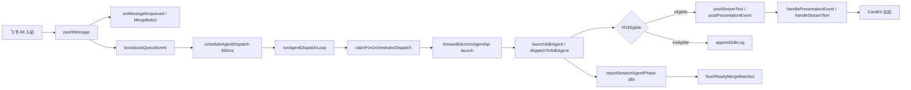

# 飞书作为 Cursor 展示与控制层 - 代码评审报告

## 1、审查范围

- **变更类型**: apply 产出的未提交变更（MVP 阶段 0+1，T1–T7）；**复评 R1**（`f41Eligible` 群聊扩展）
- **评审等级**: focused-review（跨 Daemon/Electron 架构转折，风险可收敛；未达 full-review 六路并行门槛）
- **涉及文件**: 11 个代码/约定文件 + 3 个 KB 文档（`02-design.md`、`03-tasks.md`、本报告）
- **设计文档**: `02-design.md`（对照基准）
- **复评焦点**: `electron/agent-sdk.ts` `f41Eligible` 与 Daemon `isStreamTextEligible` 对齐（R1）
- **范围外**: T8–T12（阶段 2/3）为 **后续迭代，非 blocking**；本报告仅标注遗留，不纳入 MVP 阻断项

## 2、严重（必须处理）

无

## 3、警告（建议处理）

1. **合并 CardKit 按钮未接线，T5 验收入口依赖静默窗口**
   - 位置: `src/shared/lark-core.ts:322-328`（按钮占位）、`src/daemon.ts:2708`（HTTP 已实现）
   - 说明: `merge_send_now` / `merge_split` / `merge_edit` 后端逻辑在 `POST /api/merge-batch/action` 已就绪，但飞书 `card.action.trigger` 回调属 T8；设计允许 MVP fallback 斜杠，斜杠亦未实现。用户仅能通过静默窗口结束或回复卡片编辑（edit fallback 可用）。不阻断主用户私聊 MVP，归档前建议在 `08-verify` 标注验收入口。**后续迭代，非 blocking（T8）**。（manifest R2，info 债务）

2. **dispatch 失败后 claim 消息被 ack，无法自动重投**
   - 位置: `src/daemon.ts:1028-1056`（`dispatchSessionToAgent` 失败分支 `ackMessages`）
   - 说明: `performClaimAndMerge` 先 claim 再调 Electron launch/dispatch；失败时 ack 末条 `.claimed`，合并批次消息从队列移除且 Agent 未执行。符合「notify 可理解」但用户须手动重发。评分约 65，建议后续在失败路径保留 unclaimed 或显式 re-queue。（manifest R3，info 债务）

## 4、设计偏差

1. **合并卡按钮回调延后至 T8（符合设计风险说明）**
   - 设计预期: `02-design.md` §八·（一）「CardKit 按钮回调 MVP 可 fallback 斜杠」
   - 实际实现: HTTP API + 回复编辑 fallback；按钮渲染无 callback 路由
   - 影响: T5「点 [立即发送]/[拆开逐条]」须 HTTP 或等 T8；静默窗口路径可用

无其他与 `02` 已确认决策（移除 inject、MergeBatch、SDK-only、长驻 Agent、Daemon 调度、S1.8 群聊 eligible）相悖的偏差。

**R1 复评（已关闭）**：`f41Eligible` 已扩展为「主用户私聊 **或** 飞书群聊 + `allowOthers`」，与 `isStreamTextEligible` 语义一致；群聊 assistant delta 经 `f41Stream` → `postStreamText` 出站，不再仅 `appendSdkLog`。`electron/AGENTS.md` 约定已同步。

## 5、验收标准检查

### MVP T1–T7（`03-tasks.md`）

| 任务 | 验收条件 | 状态 |
|------|---------|------|
| T1 | launch 不写盘 `~/.cursor` / 项目 rules | ✅ `workspace-injector` no-op；`session-dispatcher` 无 inject 调用 |
| T1 | `launchAgent` 不 await inject | ✅ |
| T1 | Ponytail 无未批准抽象 | ✅ |
| T2 | 连发 3 条仅 1 张合并卡 + ≤1 F1 | ✅ Code：`MergeBatch` + `shouldSendEnqueueF1`；`sendMergePreview` 已删 |
| T2 | collecting 不 claim/dispatch | ✅ `shouldDeferDispatch` |
| T2 | 回复合并卡可改 `overrideText` | ✅ `tryHandleMergePreviewReply` 认 `cardMessageId` |
| T2 | 旧多文本预览路径删除 | ✅ grep 无 `sendMergePreview` |
| T3 | tool 事件 POST `PresentationEvent` | ✅ `handleSdkEvent` → `postPresentationEvent` |
| T3 | thinking 增量 POST | ✅ |
| T3 | 无主路径 notify 工具进度文本 | ✅ tool 走 presentation，非 notify |
| T4 | 工具 CardKit + 流式不刷屏 | ✅ 主用户私聊；NF2 `getPresentationReplyAnchor` |
| T4 | **群聊 SDK 同管道（流式+工具）** | ✅ R1 修复后 SDK/Daemon eligible 一致 |
| T4 | merge 卡共存 NF2 | ✅ |
| T4 | `presentation_failed` 可检索 | ✅ `logPresentationFailed` |
| T5 | 静默窗口不 dispatch；ready 后 dispatch | ✅ |
| T5 | processing 排队 + idle flush | ✅ `flushReadyMergeBatches` + 卡脚本文案 |
| T5 | [拆开逐条] | ⚠️ HTTP `split` ✅；**卡片按钮未接线**（T8，非 blocking） |
| T5 | 编辑后投递 = overrideText | ✅ |
| T5 | claim-and-merge 与 ack 语义 | ✅ |
| T5 | ready→dispatch P95≤3s | ⏳ 须 `08-verify` 实测（代码路径无额外阻塞） |
| T6 | 连发无 poll + 合并投递 | ✅ Daemon dispatch + 长驻 `dispatchToSdkAgent` |
| T6 | Run 结束保留实例 + 二次 send | ✅ `SDK_RESIDENT_AGENT` 默认开 |
| T6 | 同 Agent 连续 send 行为记录 | ⏳ 须 `08-verify` spike（02 §八·（二）第 11 项） |
| T6 | `dispatch_failed` 日志 | ✅ |
| T7 | 无 CLI；`poll-message` 404 | ✅ |
| T7 | 无 SDK Key 时入队可确认、dispatch 失败 notify | ✅ `launchAgent` / `launchSdkAgentFromHttp` 错误文案 |
| T7 | 单 Daemon IM→调度→展示闭环 | ✅ 移除 Electron SSE/queue 扫描 |
| T7 | 无 poll 保活用户可见副作用 | ✅ poll 端点删除 |

### T8–T12（后续迭代，非 blocking）

| 任务 | 说明 | 状态 |
|------|------|------|
| T8 | 卡片控制 + merge 编辑表单 | pending |
| T9 | 工具批准闭环 | pending |
| T10 | 废弃 MCP / admin HTTP | pending |
| T11 | Agent 标识持久化 | pending |
| T12 | Electron 托盘 spawn-only | pending |

### `02-design.md` §八·（二）工程补充验收项（MVP 相关）

| 项 | 状态 |
|----|------|
| 1–2, 4–10, 12–13 | ✅ 或 ⏳ 实测项 |
| 3 群聊 SDK 第二通道 | ✅ R1 修复后代码满足；E2E 待 `08-verify` |
| 11 连续 send spike | ⏳ 08-verify |

## 6、调用链与回归风险

| 回归点 | 风险 | 说明 |
|--------|------|------|
| 移除 poll-message | 中 | CLI/旧 Agent 规则若仍 poll 将 404；符合 SDK-only 决策 |
| claim 先于 dispatch | 中 | dispatch 失败 ack 丢队列（§3 警告 2 / R3） |
| 长驻 Agent 默认开 | 低 | `SDK_RESIDENT_AGENT=0` 可回退 |
| 与 `20260627150751` | 低 | poll 保活路径已删除，保活变更部分能力被本变更替代 |
| Electron 不再扫队列 | 低 | 依赖 Daemon `agent-api-port.json`；Electron 未启动则 dispatch 失败 notify |
| 群聊 f41 扩展 | 低 | 仅 feishu+allowOthers+group；非目标通道仍走 appendSdkLog |

## 7、遗留债务

- **T8–T12**：卡片回调、工具批准、MCP 移除、会话持久化、Electron 瘦身 — **后续迭代，非 blocking**。
- **R2/R3（info）**：合并卡按钮接线（T8）、dispatch 失败 re-queue — 不阻断 MVP archive。
- **08-verify 待跑**：P95 投递延迟、连续 `send` spike、主路径 E2E（连发 3 条、工具 CardKit、群聊流式、无 poll）。
- **KB 同步**：`02-design.md` §十 所列业务域/工程平台文档 — archive 阶段更新，非 review 阻断。

## 8、修复任务建议

| 问题 ID | 建议动作 | 关联任务 | 状态 |
|---------|----------|----------|------|
| R1 | 扩展 `f41Eligible` 对齐 `isStreamTextEligible` | T-FIX-01（depends T4） | **fixed** |
| R2 | T8 接线 `card.action.trigger` → `POST /api/merge-batch/action`；可选补 `/merge send\|split` 斜杠 | T8 | open（info） |
| R3 | dispatch 失败时评估是否 skip ack / re-queue | T-FIX-02（可选，低优） | open（info） |

## 9、结论

**通过**，可进入 `/kb-archive`（MVP T1–T7）。

R1（群聊 SDK 流式正文管道）复评 **已关闭为 fixed**；无 open blocking issues。R2/R3 保留为 info 债务，不阻断 `reviewed`。T8–T12 pending 属后续迭代，不纳入本轮 archive 验收。`08-verify` 实测项建议在 archive 前或 archive 文档中标注待跑清单。
