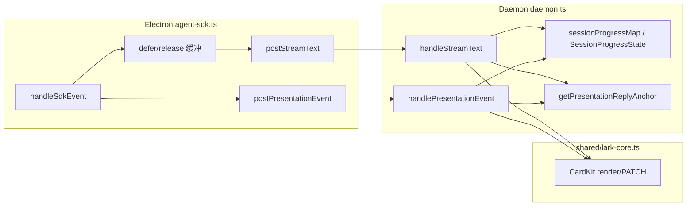

# 飞书 Presentation 展示时序编排 - 实现设计

> **业务 PRD**：见同目录 `01-proposal.md`（验收标准以 01 为准）

## 一、业务流程与改动范围

> 业务口径以 `01-proposal.md` 场景 A–D、方案 A 与验收 1–6 为准；下图覆盖 **MVP（主用户私聊 SDK）** 主路径、纯对话分支、MergeBatch 协同与回滚分支。

### （一）业务流程图

```mermaid
flowchart TD
  startNode["用户私聊发消息 不改"] --> enqueue["S0 入队 + F1 确认 不改"]
  enqueue --> dispatch["S1 Daemon dispatch + SDK Run 不改"]
  dispatch --> sdkStream["S2 SDK run.stream 事件 不改"]

  sdkStream --> flagGate{"S3 PRESENTATION_ORDERING<br/>且主用户私聊?<br/>新增"}
  flagGate -->|否/回滚| legacyPath["S3-L 现网先到先展示 不改"]
  flagGate -->|是| eventRoute{"S4 事件类型分流 改动"}

  eventRoute -->|thinking| thinkProc["S4-T 思考过程卡先发 改动"]
  eventRoute -->|tool running/completed| toolProc["S4-Tool 工具过程卡 改动"]
  eventRoute -->|assistant delta| deferGate{"S5 本 Run 已见过程?<br/>新增"}

  deferGate -->|否且无进行中过程| pureChat["S5-P 纯对话首包建卡 不改"]
  deferGate -->|是或进行中| bufferAssist["S5-D 缓冲 assistant delta<br/>暂不建卡 新增"]

  thinkProc --> latchOn["S6 置 processActive 闩锁 新增"]
  toolProc --> latchOn
  latchOn --> bufferAssist

  bufferAssist --> moreEvents{"S7 更多 SDK 事件 不改"]
  moreEvents --> eventRoute

  pureChat --> streamCreate["S8 首建 assistant CardKit 不改"]
  streamCreate --> streamPatch["S9 流式 PATCH 更新 不改"]

  moreEvents -->|全部过程结束| releaseGate["S10 过程结束判定 新增"]
  releaseGate --> flushAssist["S11 释放缓冲首建 assistant 卡 新增"]
  flushAssist --> streamPatch

  moreEvents -->|Run final| runEnd["S12 Run 结束 flush final 改动"]
  runEnd --> stopProgress["S13 stop/ack 不改"]

  legacyPath --> legacyStream["assistant 首 delta 即建卡 不改"]
  legacyStream --> runEnd

  subgraph mergeSub ["MergeBatch 活跃 不改锚点"]
    mergeAnchor["NF2 replyAnchor=lastInbound 不改"]
  end
  thinkProc --> mergeAnchor
  toolProc --> mergeAnchor
  flushAssist --> mergeAnchor
  pureChat --> mergeAnchor
```

**图例**：`不改` 行为与现网一致；`改动` 需改代码/配置；`新增` 新节点或新分支；`删除` 本期无删除项。

### （二）流程步骤与改动对照

| 步骤 ID | 业务含义 | 改动 | 落点（模块/文件） | 01 验收关联 |
|---------|----------|------|-------------------|-------------|
| S0 | 用户消息入队、F1 确认、Get 表情 | 不改 | `src/daemon.ts` `pushMessage` / `confirmEnqueueAndStartProgress` | 场景 B 前置 |
| S1 | Daemon 调度 → Electron SDK Run | 不改 | `src/daemon.ts` `runAgentDispatchLoop`；`electron/agent-sdk.ts` `launchSdkAgent` / `streamRunEvents` | — |
| S2 | SDK 事件流 assistant / thinking / tool_call | 不改 | `electron/agent-sdk.ts` `handleSdkEvent` | — |
| S3 | Feature 开关 + MVP 范围门控（主用户私聊） | 新增 | `src/daemon.ts` `presentationOrderingEnabled`；`electron/agent-sdk.ts` `presentationOrderingEligible`（与 `f41Eligible` 对齐） | 验收 6；NF2 |
| S3-L | 开关关闭：现网 assistant 首 delta 即 `postStreamText` | 不改 | `electron/agent-sdk.ts` `appendStreamDelta` → `postStreamText` | 验收 6 回滚 |
| S4-T | thinking 事件 → 思考摘要 CardKit | 改动 | `electron/agent-sdk.ts` `postPresentationEvent`；`src/daemon.ts` `handleThinkingPresentationEvent` | 验收 1；F1 |
| S4-Tool | tool_call → 工具进度 CardKit | 改动 | `electron/agent-sdk.ts` `postPresentationEvent`；`src/daemon.ts` `handleToolPresentationEvent` | 验收 1/3；F1/F4 |
| S5-P | **纯对话**：首段 assistant delta 按现网建卡（无额外空窗） | 不改 | `src/daemon.ts` `handleStreamText` `isFirst` 分支 | 验收 2；F3；NF3 |
| S5-D | **含过程**：assistant delta 仅累积，**不**触发首建 CardKit | 新增 | `src/daemon.ts` `SessionProgressState` + `handleStreamText`；`electron/agent-sdk.ts` `SdkSessionAgent` 缓冲/延迟 POST | 验收 1；F1/F2 |
| S6 | 见 thinking 或 tool `running` 置 `processActive` 闩锁 | 新增 | `src/daemon.ts` `SessionProgressState`；`handleToolPresentationEvent` / `handleThinkingPresentationEvent` | 验收 1；待确认 1 |
| S7 | 过程进行中继续 PATCH 既有 tool/thinking 卡 | 不改 | `src/shared/lark-core.ts` `renderToolProgressCard` / `renderThinkingCard` | 验收 3 |
| S8–S9 | assistant CardKit 创建与流式 PATCH | 改动（创建时机） | `src/daemon.ts` `handleStreamText`；`src/shared/lark-core.ts` CardKit API | 验收 1/2；F2 |
| S10 | 过程结束：无 `running` 工具且 thinking 已 `final` | 新增 | `src/daemon.ts` `isPresentationProcessIdle`；`electron/agent-sdk.ts` `maybeReleaseDeferredAssistant` | 验收 1/5 |
| S11 | 释放缓冲：首建 assistant 卡并 PATCH 至当前全文 | 新增 | `src/daemon.ts` `releaseDeferredAssistantStream`；`electron/agent-sdk.ts` `flushDeferredStreamPost` | 验收 1；F2 |
| S12 | Run 结束 `final: true` flush；异常路径仍出结论 | 改动 | `electron/agent-sdk.ts` `streamRunEvents` / `doFlushStreamPost`；`src/daemon.ts` `handleStreamText` `final` | 验收 5 |
| S13 | stopSessionProgress / ackOnReply | 不改 | `src/daemon.ts` `stopSessionProgress` / `ackOnReply` | — |
| M-NF2 | MergeBatch 活跃时首包 reply 锚定 | 不改 | `src/daemon.ts` `getPresentationReplyAnchor`（tool/thinking/deferred assistant 首建均沿用） | 验收 4；F5 |
| M-Merge | 合并批次状态机、F1 抑制、dispatch 门控 | 不改 | `src/daemon.ts` `MergeBatchController` | 验收 4 |
| NF1 | 顺序违规可观测日志 | 新增 | `src/daemon.ts` `logPresentationOrderViolation` | NF1 |
| NF4 | 幂等：同 Run 不重复首建 assistant / 过程卡 | 改动 | `SessionProgressState` 闩锁 + 既有 `toolCards` 分卡逻辑 | NF4 |

### （三）改动汇总

- **改动**：`src/daemon.ts`（`SessionProgressState` 扩展、`handleStreamText` 首建门控、过程结束释放）、`electron/agent-sdk.ts`（`handleSdkEvent` 分流、延迟 POST、`resetSdkRunPresentationState` 清闩锁）
- **新增**：`PRESENTATION_ORDERING` feature 开关、过程活跃闩锁、`deferredAssistantText` 缓冲、NF1 顺序违规日志
- **不改（显式列出）**：MergeBatch 状态机与 `getPresentationReplyAnchor`；tool/thinking CardKit schema；`streamTextThrottleMs` / CardKit 降级链；群聊/CLI eligible 范围（阶段 2）；入队/F1/三态进度；`SDK_RESIDENT_AGENT` 长驻模型

## 二、整体思路

见 01 §方案 A、§功能需求 F1–F6。根因：现网 `handleSdkEvent` 对 assistant delta **立即** `appendStreamDelta` → `postStreamText`，首包即 `handleStreamText` 创建 CardKit 消息；而 `tool_call` / `thinking` 经 `postPresentationEvent` **后建**新消息，飞书时间轴按 message 创建时间排序 → **结论在上、过程在下**（CodeGraph：`electron/agent-sdk.ts:471` `handleSdkEvent`；`src/daemon.ts:471` `handleStreamText` `isFirst`）。

**方案要点（方案 A 落地）**：

1. **延迟 assistant 首建卡**：本 Run 一旦进入「过程活跃」（见 §五），assistant 增量只写入缓冲，过程卡先发；过程 idle 后再首建 assistant CardKit 并流式 PATCH（含 tool 前 preamble，与结论同卡展示）。
2. **纯对话不误伤**：本 Run **从未**出现 thinking 事件且 **从未**出现 tool `running` → 走现网 S5-P，首 delta 即建卡，满足 NF2 P95 ≤ 3s。
3. **thinking 一律视为过程**：任意 thinking delta 即置 `processActive`，assistant 首建延迟至过程结束（回应 01 待确认 1）。
4. **MVP 范围 + 可回滚**：`PRESENTATION_ORDERING` 默认开启，仅 `isMainUserP2pEligible`；`=0/false` 回退 S3-L。
5. **MergeBatch 零回归**：延迟路径仍调用既有 `getPresentationReplyAnchor`；不改动合并卡、dispatch 门控。

**最小方案三问（Ponytail）**：

1. **能否复用现有模块？** 能。编排落在已有 `SessionProgressState`（`src/daemon.ts:294`）与 `SdkSessionAgent`（`electron/agent-sdk.ts:13`），复用 `handleStreamText` / `postStreamText` / `postPresentationEvent` 链路，不新建 Presentation 子系统目录。
2. **新增抽象是否 PRD 要求？** 否。不引入独立 Orchestrator class/trait；仅增 `presentationOrderingEnabled()` 与 3–4 个 inline 状态字段（`processActive` / `deferredAssistantText` / `activeToolNames` / `thinkingOpen`）。YAGNI：单实现布尔闩锁即可，不做可插拔策略框架。
3. **能否合并到已有文件？** 能。改动集中 `src/daemon.ts` + `electron/agent-sdk.ts`；`src/shared/lark-core.ts` 无 schema 变更。新建文件无必要。

## 三、分层设计



- **端点层**：沿用 `POST /api/stream-text`、`POST /api/presentation-event`（`src/daemon.ts` 路由）；无新 HTTP 路由。
- **服务层**：Electron 负责 SDK 事件分类与「是否 POST stream-text」；Daemon 负责 CardKit 首建门控、缓冲释放、MergeBatch reply 锚点。
- **数据层**：内存 `sessionProgressMap` 扩展字段；Run 级闩锁在 `resetSdkRunPresentationState` / 新 Run `startSdkRun` 时清零；无持久化。

## 四、接口设计

无新增 HTTP 路由。既有契约扩展如下：

| 端点 | 变更 | 说明 |
|------|------|------|
| `POST /api/stream-text` | 行为扩展 | 开关开启且 `processActive` 时，非 `final` 请求可返回 `{ ok: true, deferred: true }`（可选字段），**不**创建 `outbound_message_id`；Electron 侧继续累积 `streamBuffer` |
| `POST /api/presentation-event` | 行为扩展 | `tool` `started` 置闩锁；`thinking` 首 delta 置闩锁；响应仍含 `outbound_message_id` |

Electron → Daemon payload **不变**（`StreamTextPayload` / `PresentationEvent`）；门控逻辑在 Daemon 读 `SessionProgressState` 判定。

## 五、数据结构

### SessionProgressState 扩展（`src/daemon.ts`）

| 字段 | 类型 | 说明 |
|------|------|------|
| `presentationProcessActive` | `boolean` | 本 Run 已见过程且尚未 idle；true 时禁止 assistant 首建卡 |
| `activeToolNames` | `Set<string>` | status=`started`/`running` 对应 tool_name；空且 thinking 关闭 → 可释放 |
| `thinkingOpen` | `boolean` | 本 Run 收到 thinking 且未收到 `final` thinking 事件 |
| `deferredAssistantText` | `string` | 延迟期间累积的 assistant 全文（含 preamble） |
| `assistantCardReleased` | `boolean` | 已首建 assistant 卡；防止重复首建 |
| `runPresentationEpoch` | `number` | 与 Electron `runStartedAt` 对齐，防跨 Run 脏状态 |

### SdkSessionAgent 扩展（`electron/agent-sdk.ts`）

| 字段 | 类型 | 说明 |
|------|------|------|
| `presentationDeferStream` | `boolean` | Daemon 曾返回 deferred 或本地已见 tool/thinking → 延迟 POST 首包 |
| `seenProcessEvent` | `boolean` | 本 Run 是否出现过 tool/thinking |

`resetSdkRunPresentationState` 须清零上述字段及 Daemon 侧对应 `sessionProgressMap` 条目中的编排字段。

### 进行中判定与 preamble 策略

| 规则 | 判定 |
|------|------|
| thinking | **一律**过程：首个 thinking delta → `thinkingOpen=true` + `presentationProcessActive=true` |
| tool | `tool_status=started`（SDK `running`）加入 `activeToolNames`；`completed`/`failed` 移除；集合非空 → 过程活跃 |
| assistant preamble（tool 前文字） | tool/thinking **未出现前**的 assistant delta：若随后出现过程事件，则 preamble 并入 `deferredAssistantText`，**不**单独建卡；用户仅在过程结束后与结论同卡可见（01 可接受） |
| 纯对话误延迟防护 | 条件：`!seenProcessEvent && activeToolNames.size===0 && !thinkingOpen` → **不延迟**，首包走现网 `isFirst` 建卡 |
| 过程结束 | `activeToolNames.size===0 && !thinkingOpen` → 调用 `releaseDeferredAssistantStream`；若 `deferredAssistantText` 非空或 Electron `streamBuffer` 非空则首建卡 |
| Run 异常/中止 | `final: true` 强制释放缓冲并建卡（若尚未建），避免「仅有过程、无结论」|

## 六、实现步骤

1. **步骤 S3**：在 `src/daemon.ts` 实现 `presentationOrderingEnabled(sessionKey)`（`PRESENTATION_ORDERING`，默认 true；仅 `isMainUserP2pEligible`）。Electron 侧镜像 `presentationOrderingEligible(session)`（`f41Stream && p2p`）。
2. **步骤 S5-D / S6**：扩展 `SessionProgressState`；在 `handleToolPresentationEvent` / `handleThinkingPresentationEvent` 入口更新闩锁与 `activeToolNames` / `thinkingOpen`。
3. **步骤 S5-D / S8–S11**：改造 `handleStreamText`：`isFirst && presentationOrderingEnabled && presentationProcessActive` → 只更新 `deferredAssistantText` 并返回（不调用 CardKit 创建）；实现 `releaseDeferredAssistantStream` 在过程 idle 时以 `isFirst` 逻辑首建卡并 PATCH。
4. **步骤 S4（Electron）**：`handleSdkEvent` 在 tool/thinking 分支置 `seenProcessEvent`；assistant 分支若 `presentationDeferStream || seenProcessEvent` 则只累积 `streamBuffer`，**不** `scheduleStreamPost` 直至 `maybeReleaseDeferredAssistant`。
5. **步骤 S10–S12**：tool `completed/failed` 与 thinking `final` 后调用 idle 检测；Electron `streamRunEvents` 收尾 `final` 前强制 release；`completeSdkRun` / `resetSdkRunPresentationState` 清编排状态。
6. **步骤 NF1**：实现 `logPresentationOrderViolation`——开关关闭或 debug 模式下，若 assistant `outboundMessageId` 已存在且后续仍首建 tool/thinking 卡，打 WARN（字段：`session_key`, `stream_id`, `assistant_msg_id`, `process_kind`, `process_msg_id`, `ordering_enabled`）。
7. **步骤 M-NF2 回归核对**：确认 `releaseDeferredAssistantStream` 首建仍传 `getPresentationReplyAnchor(sessionKey)`；MergeBatch collecting/ready 期间至少 1 次手工用例（验收 4）。
8. **文档**：同步 `src/AGENTS.md`、`electron/AGENTS.md` Presentation 小节（archive 阶段 §十）。

## 七、参考实现

CodeGraph / 源码锚点：

| 符号 | 路径 | 职责 |
|------|------|------|
| `handleSdkEvent` | `electron/agent-sdk.ts:471` | SDK 事件分流；assistant → `appendStreamDelta`；tool/thinking → `postPresentationEvent` |
| `postStreamText` / `appendStreamDelta` / `flushStreamPost` | `electron/agent-sdk.ts:219–300` | 流式 POST 链；**延迟改造主入口** |
| `postPresentationEvent` | `electron/agent-sdk.ts:187` | tool/thinking 出站 |
| `f41Eligible` / `f41Stream` | `electron/agent-sdk.ts:99–112`, `:644` | MVP eligible 对齐 |
| `resetSdkRunPresentationState` | `electron/agent-sdk.ts:69` | Run 间清缓冲 |
| `handleStreamText` | `src/daemon.ts:471` | CardKit 首建/PATCH；**首建门控主入口** |
| `handlePresentationEvent` | `src/daemon.ts:1321` | kind 路由 |
| `handleToolPresentationEvent` | `src/daemon.ts:1130` | 工具卡；`getPresentationReplyAnchor` |
| `handleThinkingPresentationEvent` | `src/daemon.ts:1196` | 思考卡 |
| `SessionProgressState` | `src/daemon.ts:294` | 流式/工具/思考状态 SSOT |
| `sessionProgressMap` | `src/daemon.ts:616` | 会话级 Map |
| `getPresentationReplyAnchor` | `src/daemon.ts:398` | MergeBatch NF2 reply |
| `isMainUserP2pEligible` | `src/daemon.ts:373` | MVP 范围门控 |

## 八、技术影响

### （一）影响范围

- **涉及模块**：`src/daemon.ts`（核心状态机）、`electron/agent-sdk.ts`（事件侧延迟 POST）；次要：`src/AGENTS.md`、`electron/AGENTS.md`
- **接口/proto 变更**：无；`/api/stream-text` 响应可选增 `deferred: boolean`
- **数据变更**：无持久化；仅内存 Map 字段扩展
- **风险**：
  - preamble 在含 tool Run 中过程期间不可见——符合 01；须在验收 1 明示
  - Electron/Daemon 双端闩锁短暂不一致：以 Daemon `handleStreamText` 为 CardKit 创建 SSOT，Electron 仅控制 POST 频率
  - 并发多 tool：`activeToolNames` Set 已有 `toolCards` 分卡模式可复用
  - CardKit 首建延迟至过程结束：含 tool 场景 conclusion 首字延迟增大——01 NF3 已豁免，与 NF2 纯对话路径分离

### （二）工程补充验收项

- [ ] `PRESENTATION_ORDERING=0` 后，带 tool 任务恢复「assistant 卡先于 tool 卡」现网行为，且无 `deferredAssistantText` 残留导致下一 Run 卡死
- [ ] 同一 Run 内 3+ 串行 tool：assistant 卡仅 **1** 张，位于最后一张过程卡之下
- [ ] `releaseDeferredAssistantStream` 失败时：`presentation_failed` 日志 + 降级 `sendStreamMessage`，不丢缓冲全文
- [ ] 新 Run `startSdkRun` 后 `presentationProcessActive=false`，不继承上一 Run 闩锁
- [ ] UI 日志不含 tool 内部名；NF1 `presentation_order_violation` 仅 WARN、不阻断出站

## 九、知识库影响

- `knowledge/业务域/` 下 IM/Presentation 相关子模块（若已存在飞书展示链路文档）— 须补充「过程优先时序」与开关说明
- `src/AGENTS.md` — `stream-text` / `Presentation` / MergeBatch NF2 小节
- `electron/AGENTS.md` — SDK 流式桥接与 presentation-event 小节
- 两级索引：若业务域尚无 Presentation 专页，archive 时评估是否在 `知识索引.md` 增加条目；否则仅变更记录即可

## 十、知识库更新计划

### （一）必须更新

- `src/AGENTS.md` — 增补 `PRESENTATION_ORDERING`、`SessionProgressState` 编排字段、延迟首建 assistant 规则、MergeBatch 协同不变声明
- `electron/AGENTS.md` — 增补 defer/release 行为、`seenProcessEvent` 与 `postStreamText` 关系

### （二）可能更新（视实现结果）

- 业务域 IM/飞书 Presentation 子模块（若存在）— 用户可见时序 diagram、与 162620 归档变更的增量关系
- `knowledge/变更/归档/20260627162620-飞书作为Cursor展示与控制层/` 相关 KB 正文 — 交叉引用本变更时序规则（由 kb-librarian archive 消费）

### （三）不需要更新

- Proto / 通道类型定义（无 schema 变更）
- MergeBatch 合并 CardKit 交互正文（逻辑不改，仅验证不回归）
- 微信通道、`workflow-store`、Electron 设置 UI
