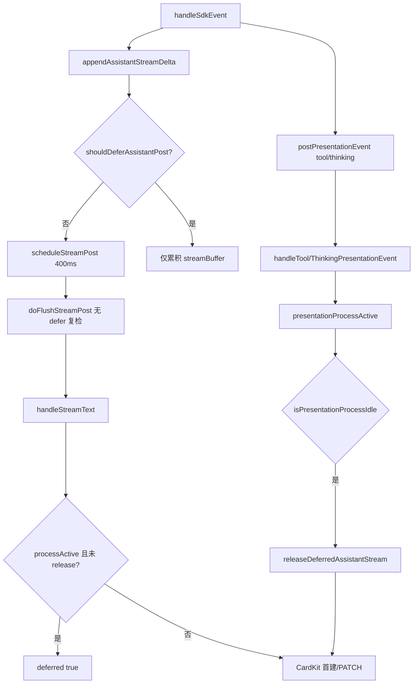

# 飞书 Presentation 展示时序编排 - 代码评审报告

## 1、审查范围

- **变更类型**: apply 产出的未提交变更（T1–T5、T7 已实现；T6 待 `/kb-test`）
- **评审等级**: focused-review（Daemon/Electron 双端 Presentation 编排，风险可收敛；未达 proto/DB/权限级 full-review 门槛）
- **涉及文件**: 4 个实现/约定文件（`src/daemon.ts`、`electron/agent-sdk.ts`、`src/AGENTS.md`、`electron/AGENTS.md`）+ KB 设计/任务文档
- **设计文档**: `02-design.md`（对照基准）
- **评审方式**: git diff + 源码精读；CodeGraph MCP 索引未命中本变更符号（索引滞后），调用链以源码为准
- **范围外**: T6 端到端实测归 `/kb-test`；本报告对 01 验收 1–6 做**代码路径**覆盖度评估，E2E 结论待 T6

## 2、严重（必须处理）

1. **Electron 已调度的 stream POST 不因 defer 取消，可能在 tool 事件后仍首建 assistant 卡**
   - 位置: `electron/agent-sdk.ts:274-290`（`doFlushStreamPost`）、`:301-317`（`scheduleStreamPost`）
   - 说明: `shouldDeferAssistantPost` 仅在 `appendAssistantStreamDelta` 入队时判断；若 preamble 已触发 400ms `streamPostTimer`，后续 `tool_call`/`thinking` 置 `seenProcessEvent`/`presentationDeferStream` **不会** `clearStreamPostTimer`。timer 到期后 `doFlushStreamPost` **无 defer 门控** 仍 POST `/api/stream-text`。与 Daemon 侧 `presentation-event` 处理存在 HTTP 竞态：stream-text 若先到达且 `presentationProcessActive` 仍为 false，将按现网首包建卡 → **复现 01 场景 A 倒置**。修改方向：`doFlushStreamPost` 非 `final` 时校验 `shouldDeferAssistantPost`；见过程事件时 `clearStreamPostTimer`；或过程事件优先于已调度 flush。

2. **assistant preamble 先于 tool/thinking 且无 thinking 事件时，defer 链从未生效**
   - 位置: `electron/agent-sdk.ts:325-334`（`shouldDeferAssistantPost`）、`:331-334`（`appendAssistantStreamDelta`）；`src/daemon.ts:661-664`（`handleStreamText` defer 门控）
   - 说明: 方案 A 要求「本 Run 一旦过程活跃则延迟首建」；当前 Electron 仅在 `seenProcessEvent || presentationDeferStream` 时缓冲，Daemon 仅在 `presentationProcessActive` 时 defer。典型 SDK 顺序为 assistant preamble → tool `running`（01 背景已描述）。preamble 到达时两侧闩锁均为 false → 立即 schedule/首建 CardKit；tool 卡后建 → 时间轴仍「结论在上、过程在下」。thinking 先到的 Run 可部分规避，但**无 thinking 的 shell 类任务**（如「git pull」）仍高风险。修改方向：Electron 在首包 POST 前短窗等待过程事件，或 assistant 首 delta 默认缓冲直至首个 tool/thinking 或 Run 级 idle 信号（与 02 §五 preamble 策略对齐）。

## 3、警告（建议处理）

1. **`thinkingOpen` 可能无法闭合，idle 释放依赖 Run `final`**
   - 位置: `electron/agent-sdk.ts:533-541`（thinking 分支未传 `final`）；`src/daemon.ts:1418-1420`（仅 `event.final` 清 `thinkingOpen`）
   - 说明: Daemon 设计 S10 要求「thinking 已 final + 无 running tool → idle」；Electron `postPresentationEvent` 对 thinking 仅 `{ kind, delta }`，无 `final`。首个 thinking delta 后 `thinkingOpen` 可能恒 true，`isPresentationProcessIdle` 在 tool 全部完成后仍为 false，idle 路径 `releaseDeferredAssistantStream` 不触发。Run 收尾 `streamRunEvents` 强制 flush 可兜底顺序，但 tool 完成后至 Run 结束 assistant 可见性延迟增大。修改方向：SDK thinking 结束信号映射 `final: true`，或在 assistant/tool 开始时闭合 `thinkingOpen`（需与产品规则对齐）。

2. **NF1 违规日志缺少 `process_msg_id`**
   - 位置: `src/daemon.ts:1339-1347`、`1444-1451`（`logPresentationOrderViolation` 调用）
   - 说明: 函数签名支持 `processMsgId`，调用处未传入新建过程卡的 `result.cardMessageId`，日志字段恒为空，联调归因弱于 02 NF1 / T5 验收。

3. **`runPresentationEpoch` 字段未读写（预留未落地）**
   - 位置: `src/daemon.ts:337`、`400-406`
   - 说明: 02 §五 / T2 声明与 Electron `runStartedAt` 对齐防跨 Run 脏状态，实现仅 reset 为 0，无 epoch 校验。当前靠 `!stream_id && !outbound_message_id` reset 可工作，字段为 dead code；可删除或补 epoch 校验（Ponytail shrink 候选）。

## 4、设计偏差

1. **preamble 延迟策略与 02 §五不完全一致**
   - 设计预期: tool/thinking 未出现前的 assistant delta，若随后出现过程事件，应并入 `deferredAssistantText`、过程结束后与结论同卡展示
   - 实际实现: 过程事件到达前 assistant 可走现网首建路径（§2 严重项 1、2）
   - 影响: 01 验收 1 / F1 在「无 thinking、preamble 先于 tool」主复现场景可能失败

2. **S10 thinking final 释放路径 Electron 侧缺失**
   - 设计预期: tool `completed/failed` **与 thinking final** 后 idle 检测并释放
   - 实际实现: Daemon 在 `event.final` 时释放；Electron 未传 thinking `final`，亦未在 thinking 结束后调用 `maybeReleaseDeferredAssistant`
   - 影响: 含 thinking Run 的 idle 释放时序偏晚，依赖 Run 收尾 flush

无 MergeBatch `getPresentationReplyAnchor` 改动偏差；`releaseDeferredAssistantStream` 首建已调用既有锚点（`src/daemon.ts:558`）。

## 5、验收标准检查

### `03-tasks.md` 任务（代码层）

| 任务 | 验收条件 | 状态 |
|------|---------|------|
| T1 | `PRESENTATION_ORDERING` 双端门控 + MVP 范围 | ✅ |
| T1 | 开关 off 不意外改首建逻辑 | ✅（门控外逻辑未改） |
| T2 | 编排字段 + tool/thinking 闩锁 | ✅ |
| T2 | `isPresentationProcessIdle` | ✅（thinking final 依赖见 §3 警告 1） |
| T3 | defer 响应 + `releaseDeferredAssistantStream` | ⚠️ 结构正确；preamble/ timer 竞态见 §2 |
| T3 | 纯对话首 delta 立即建卡 | ✅（`!presentationProcessActive` 路径） |
| T3 | Run `final` 强制 release | ✅ |
| T3 | release 失败 `presentation_failed` + 降级 | ✅ CardKit 失败走 `sendStreamMessage` |
| T3 | MergeBatch reply 锚点不变 | ✅ `getPresentationReplyAnchor` 未改 |
| T4 | Electron defer POST + flush 链 | ⚠️ defer 判定与 timer 见 §2 |
| T4 | 纯对话首包仍 POST | ✅ |
| T4 | Run 收尾强制 flush | ✅ `streamRunEvents:444-448` |
| T4 | reset 清零编排字段 | ✅ |
| T5 | NF1 `presentation_order_violation` | ⚠️ 触发逻辑正确；`process_msg_id` 缺失 |
| T5 | 开关 on defer 不误报 | ✅（代码路径） |
| T5 | Run 间 reset | ✅ |
| T5 | `assistantCardReleased` 幂等 | ✅ |
| T6 | E1–E7 联调 | ⏳ pending → `/kb-test` |
| T7 | AGENTS 文档与代码一致 | ✅ |

### `01-proposal.md` 验收 1–6（代码路径 + T6 待测）

| 编号 | 条件 | 代码评估 | E2E |
|------|------|---------|-----|
| 1 | tool 任务过程在上、结论在下 | ❌ §2 严重项阻断主路径 | ⏳ T6 E1 |
| 2 | 纯对话 P95 ≤ 3s | ✅ 无额外 defer | ⏳ T6 E2 |
| 3 | 多 tool 不重复刷屏 | ✅ 复用 `toolCards` + `activeToolNames` | ⏳ T6 E3 |
| 4 | MergeBatch 不回归 | ✅ 锚点/控制器未改 | ⏳ T6 E4 |
| 5 | 异常/中止仍有结论 | ✅ `final` force release | ⏳ T6 E5 |
| 6 | 开关回滚 | ✅ 门控 off 走 legacy | ⏳ T6 E6 |

### `02-design.md` §八·（二）工程补充项

| 项 | 状态 |
|----|------|
| 1 开关 off 无 defer 残留 | ✅ reset 路径 |
| 2 同 Run 仅 1 张 assistant 卡 | ⚠️ 依赖 defer 成功；preamble 首建破坏 |
| 3 release 失败降级不丢全文 | ✅ |
| 4 新 Run 不继承闩锁 | ✅ |
| 5 NF1 仅 WARN | ✅ |

## 6、调用链与回归风险

| 回归点 | 风险 | 说明 |
|--------|------|------|
| 纯对话路径 | 低 | `!presentationProcessActive` 与现网一致 |
| `PRESENTATION_ORDERING=0` | 低 | 门控 false，编排分支跳过 |
| MergeBatch NF2 | 低 | `getPresentationReplyAnchor` 未改 |
| preamble + tool 主场景 | **高** | §2 严重项；与变更目标直接冲突 |
| 400ms stream timer | **高** | defer 后 stale flush |
| 群聊/CLI | 无 | MVP 门控排除 |
| thinking 长 Run | 中 | idle 释放偏晚，Run final 兜底 |

## 7、遗留债务

- `runPresentationEpoch` 预留未用（§3 警告 3）— 可 shrink 或补实现
- T6 全部 E2E 未执行 — 非代码债务，workflow 待办
- NF1 `process_msg_id` 空值 — 可观测性缺口，不单独阻断若 §2 修复后复测

## 8、修复任务建议

| 问题 ID | 建议动作 | 关联任务 |
|---------|----------|----------|
| R1 | `doFlushStreamPost` 非 final 时校验 `shouldDeferAssistantPost`；tool/thinking 分支 `clearStreamPostTimer` | T-FIX-01 |
| R2 | assistant 首包在见过程事件前不 POST（短窗缓冲或默认 defer 直至 tool/thinking/超时），与 02 §五 preamble 对齐 | T-FIX-01 |
| R3 | thinking 结束闭合 `thinkingOpen`（传 `final` 或等价规则）+ Electron `maybeReleaseDeferredAssistant` | T-FIX-02 |
| R4 | `logPresentationOrderViolation` 传入 `process_msg_id: result.cardMessageId` | T-FIX-03 |

建议修复顺序：R1+R2（同文件 `agent-sdk.ts`，合并为 T-FIX-01）→ 复跑 `/kb-test` T6 E1/E7 → R3/R4 可选跟进。

## 9、结论（初评）

**未通过（阻断）**：存在 2 项评分 ≥ 90 的 defer 链缺陷，方案 A 在「assistant preamble 先于 tool、无 thinking」主复现场景下**无法保证**过程在上、结论在下；须修复 §2 严重项后重新 `/kb-review`。

**工作流**：可并行进入 `/kb-test` 执行 T6 实测以量化问题（预计 E1/E7 高风险失败）；**不可 `/kb-archive`** 直至 T-FIX-01 落地且复评通过。T7 文档与实现对齐，无阻断。

---

## 10、复评（T-FIX-01/02/03 落地后）

### 10.1 审查范围

- **基线**：§2 严重项 R1/R2、§3 警告 R3/R4；对照 T-FIX-01/02/03 修复 diff
- **涉及文件**：`electron/agent-sdk.ts`、`src/daemon.ts`、`electron/AGENTS.md`
- **方式**：源码精读 + git diff；初评调用链图已随实现更新

### 10.2 修复项复检

| ID | 初评问题 | 复检结论 | 依据 |
|----|---------|---------|------|
| R1 | `doFlushStreamPost` 无 defer 复检；timer 不因过程事件取消 | **已关闭** | `doFlushStreamPost` L280 `!final && shouldDeferAssistantPost` 早退；`markProcessEventSeen` / `schedulePreambleRelease` 均 `clearStreamPostTimer` |
| R2 | preamble 先于 tool 时立即 schedule，defer 链未生效 | **已关闭（主路径）** | `isAwaitingFirstProcessEvent` + `schedulePreambleRelease`（400ms 与 `STREAM_POST_INTERVAL_MS` 对齐）；见过程事件后 `shouldDeferAssistantPost` 仅缓冲。残余：preamble 停顿 **>400ms** 且 tool 仍未到时仍可能首 POST（概率低，T6 E1 量化） |
| R3 | thinking 无 final，`thinkingOpen` 不闭合 | **Electron 已关闭；Daemon 残余** | `closeThinkingIfOpen` 本地闭合 + 传 `{ final: true }` + `maybeReleaseDeferredAssistant`；`streamRunEvents` 收尾亦调用。但 `handleThinkingPresentationEvent` L1394 `!event.delta` 早退，**final-only 事件无法清 Daemon `thinkingOpen`**，含 thinking Run 的 idle 释放仍可能偏晚（Run `final` 兜底）→ 降为 §10.4 残余警告 |
| R4 | NF1 缺 `process_msg_id` | **已关闭** | tool/thinking 首建违规日志均传 `processMsgId: result.cardMessageId`（L1369、L1464） |

### 10.3 复评焦点

**纯对话路径（01 验收 2 / F3）**：无 `seenProcessEvent` 时经 `schedulePreambleRelease` 400ms 后 POST，与现网 stream 节流同量级，**无额外 defer 门控劣化**。✅

**01 验收 1 代码路径（preamble → tool、无 thinking）**：

1. assistant delta → `schedulePreambleRelease`（不立即 POST）
2. `tool_call running` → `markProcessEventSeen` 清 timer + `seenProcessEvent`；assistant 仅累积 buffer
3. Daemon tool `started` → `presentationProcessActive`；若 stream-text 到达则 `deferred: true`
4. tool `completed` + `isPresentationProcessIdle` → `releaseDeferredAssistantStream` 首建 assistant 卡

主复现场景代码路径 **通过**；400ms 竞态见 R2 残余。✅（代码层）

**文档**：`electron/AGENTS.md` L16 Presentation 时序编排与实现对齐（preamble 短窗、defer 复检、thinking final、Run 收尾 flush）。✅

### 10.4 残余 open（不阻断 archive 前 `/kb-test`）

| 严重度 | 项 | 说明 |
|--------|-----|------|
| 警告 | R3-Daemon | `handleThinkingPresentationEvent` 对无 `delta` 的 `final: true` 早退，Daemon `thinkingOpen` 可能滞留；含 thinking Run idle 释放偏晚，Run `final` 可兜底 |
| 警告 | preamble 400ms | tool 延迟 >400ms 时仍可能 assistant 先建；需 T6 E1 实测 |
| 信息 | `runPresentationEpoch` | 仍预留未用（初评 §3 警告 3） |
| 待办 | T6 E2E | 全部 E1–E7 仍 pending |

### 10.5 复评结论

**通过（可进入 `/kb-test`）**：R1/R2 严重项已按 T-FIX-01 关闭，01 验收 1 主路径代码评估由 ❌ 升为 ✅；R4 已关闭；R3 Electron 侧达标，Daemon final-only 为残余警告不阻断。

**不可 `/kb-archive`**：T6 端到端未执行；archive 前须 `/kb-test` 通过 E1/E2 等关键用例。

**工作流**：`stage` → `reviewed`；建议 T6 优先 E1（git pull 类 tool 任务）、E2（纯对话 P95）、E7（preamble+tool 顺序）。
