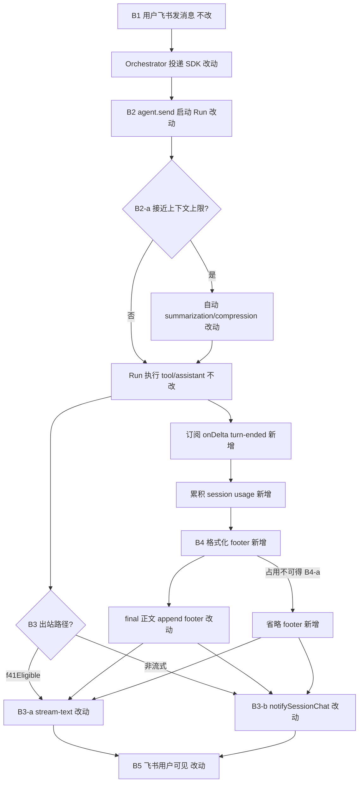
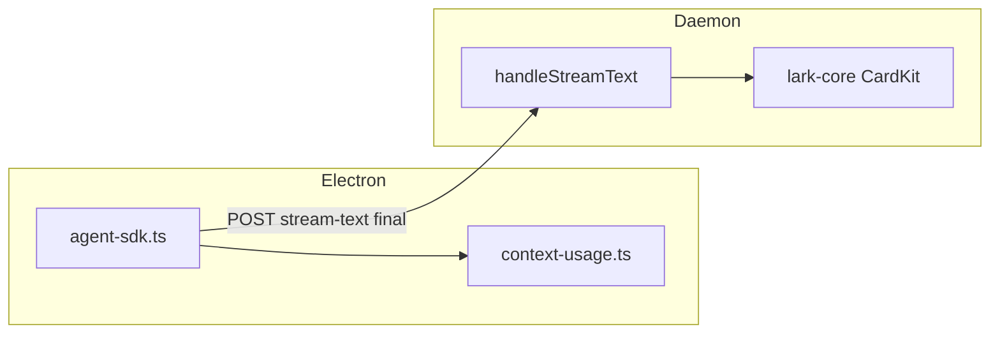

# Agent 自动压缩与上下文占用展示 - 实现设计

> **业务 PRD**：见同目录 `01-proposal.md`（验收标准以 01 为准）

## 一、业务流程与改动范围

> 业务口径以 `01-proposal.md` §业务流程 为准；下图覆盖主流程与关键分支。

### （一）业务流程图



**图例**：`不改` 行为与现网一致；`改动` 需改代码；`新增` 新逻辑或分支。

### （二）流程步骤与改动对照

| 步骤 ID | 业务含义 | 改动 | 落点（模块/文件） | 01 验收关联 |
|---------|----------|------|-------------------|-------------|
| B1 | 用户消息入队与投递 | 不改 | `src/daemon.ts` dispatch；`electron/session-dispatcher.ts` | 前置 |
| B2 | SDK Agent 创建与 send | 改动 | `electron/agent-sdk.ts` `launchSdkAgent` / `dispatchToSdkAgent` — `agent.send` 增加 `onDelta` | 验收 5 |
| B2-a | 接近上限自动压缩 | 改动 | harness 默认行为 + 日志：`summary-started` / `summary-completed`（若 SDK 事件可达） | 验收 5 |
| B2-log | 压缩可观测 | 新增 | `electron/agent-sdk.ts` 或 `electron/context-usage.ts` — UI 日志 | 验收 5；§八·（二） |
| B3-a | 流式 final 出站 | 改动 | `electron/agent-sdk.ts` `doFlushStreamPost` / `flushStreamPost(final=true)` | 验收 1/2/3 |
| B3-b | 非流式终态 notify | 改动 | `electron/agent-sdk.ts` `notifySessionChat` 调用前 append（仅无 stream 路径） | 验收 1/7 |
| B4 | 占用采集与格式化 | 新增 | `electron/context-usage.ts`；session 级 `ContextUsageState` | 验收 1/4/6 |
| B4-a | 占用不可得 | 新增 | `formatContextFooter` 返回 `null` 时跳过 append | 验收 6/7 |
| B5 | 飞书展示 | 不改 | `src/daemon.ts` `handleStreamText`；`src/shared/lark-core.ts` | 验收 1/2 |
| CLI | CLI spawn 回复 | 不改（范围外） | `electron/agent-launcher.ts` — IM 调度 SDK-only，不参与本期验收 | 01 F3 |

### （三）改动汇总

- **改动**：`electron/agent-sdk.ts`（onDelta 挂钩、final flush 前 append、send 选项调研）
- **新增**：`electron/context-usage.ts`（usage 累积、模型上限查表、footer 格式化、压缩事件日志）
- **改动**：`electron/AGENTS.md`（回复 footer 约定）
- **不改（显式列出）**：Daemon stream-text 协议字段；飞书 CardKit 渲染；`src/daemon.ts` 侧 append（**单一落点选在 Electron agent-sdk**，避免双写）；IM 调度路径 CLI spawn

## 二、整体思路

见 01 §目标。根因是 SDK 路径已统一出站但**未暴露** Cursor 产品侧的自动压缩与上下文占用感知，用户仅在 IDE/CLI 内可见类似信息。

**方案要点**：

1. **单一 footer 落点**：在 `electron/agent-sdk.ts` 的 **final 出站前** append（`doFlushStreamPost(..., final=true)` 内对 `session.streamBuffer`；非 f41 路径在 `notifySessionChat` 前）。**不在** daemon 二次拼接，避免 stream PATCH 与 notify 双轨不一致。
2. **usage 来源**：`agent.send(prompt, { onDelta })` 中 `type === "turn-ended"` 的 `usage`（`inputTokens`、`outputTokens`、`cacheReadTokens`、`cacheWriteTokens`）；Run 级 `run.wait()` **不含** usage，不可依赖。
3. **上限来源**：当前 Run 的 `modelSelection.id` → `Cursor.models.list({ apiKey })` 查 `contextWindow` 或等价 metadata（**待 builder 核实** `@cursor/sdk` 返回字段名）；会话级缓存避免每 turn 重复 list。
4. **自动压缩**：`LocalAgentOptions` **无**显式 `autoCompress` 字段（已查 SDK 类型）；优先确认 harness **默认启用**；若需显式开关，调研 `settingSources` / hooks / send 选项，**禁止编造**不存在的 SDK 字段。记录 `summary-started` / `summary-completed`（或等价 delta）至 UI 日志。
5. **CLI 范围**：`electron/AGENTS.md` 约定 IM 调度 **SDK-only**；CLI `launchAgent` 不参与飞书 IM 回复链。本期 **不改造** CLI  stdout 解析；若后续 workflow/独立任务仍走 CLI，单独立项。

**最小方案三问（Ponytail）**：

1. **复用现有模块？** 是。出站仍走 `flushStreamPost` / `notifySessionChat`；模型列表复用 `listSdkModels` 同源 `Cursor.models.list`。
2. **新增抽象是否 PRD 要求？** `electron/context-usage.ts` 因 `agent-sdk.ts` 已 1066 行、仓库单文件 ≤300 行约束而**必须**拆分；非预建通用层，仅封装 usage/footer/上限查表。
3. **能否合并单文件？** 否；合并会违反 300 行限制且加剧 agent-sdk 维护成本。

## 三、分层设计

- **端点层（Electron agent-sdk）**：订阅 onDelta；Run 结束 final flush；错误 notify 可选 footer。
- **helper 层（context-usage.ts）**：纯函数 + 轻量 session 状态；无 HTTP、无飞书依赖。
- **Daemon / 飞书**：消费已含 footer 的 `text` 字段，**不改** PATCH 逻辑。



## 四、接口设计

无新增 HTTP/proto 接口。模块内契约：

```typescript
/** Run 内累积的 token 用量（turn-ended 合并） */
interface ContextUsageState {
  inputTokens: number
  outputTokens: number
  cacheReadTokens: number
  cacheWriteTokens: number
}

/** 合并 turn-ended.usage 到 session 状态 */
function mergeTurnUsage(state: ContextUsageState, usage: TurnUsage): ContextUsageState

/** 查模型上下文上限（tokens）；失败返回 null */
function resolveModelContextLimit(modelId: string, apiKey: string): Promise<number | null>

/** 格式化 footer；不可用时返回 null */
function formatContextFooter(state: ContextUsageState, limitTokens: number | null): string | null

/** 在正文末尾安全 append（已有 footer 则不重复） */
function appendContextFooter(body: string, footer: string | null): string
```

`agent.send` 扩展（伪代码，字段名以 node_modules 为准）：

```typescript
const run = await agent.send(prompt, {
  onDelta: (delta) => {
    if (delta.type === "turn-ended" && delta.usage) mergeTurnUsage(session.contextUsage, delta.usage)
    if (delta.type === "summary-started" || delta.type === "summary-completed") logCompressionEvent(session, delta)
  },
})
```

## 五、数据结构

**SdkSessionAgent 扩展**（`electron/agent-sdk.ts`）：

| 字段 | 类型 | 说明 |
|------|------|------|
| `contextUsage` | `ContextUsageState` | 每 Run 初值清零；`resetSdkRunPresentationState` 时一并清零 |
| `contextLimitTokens` | `number \| undefined` | 首次 send 前按 modelId 解析并缓存至 session 生命周期 |
| `modelId` | `string` | 已有 modelSelection，便于 list 查表 |

**footer 格式**（默认）：

```
\n\n---\n上下文：{percent}% ({usedK}k/{limitK}k)
```

- `used` = input + output + cacheRead + cacheWrite（与 Cursor 展示口径对齐，**待 builder 核实**是否含 cache）
- `percent` = `Math.round(used / limit * 100)`，clamp 0–100
- k 单位：≥1000 用 `{n}k` 整数或一位小数（与项目既有风格对齐）

## 六、实现步骤

1. **S1（B4）** 新建 `electron/context-usage.ts`：类型、merge、format、append；单元逻辑可测。
2. **S2（B2/B2-a）** `launchSdkAgent` / `dispatchToSdkAgent`：`agent.send` 传入 `onDelta`；记录 summary 事件日志；核实 harness 默认压缩（查 SDK 源码/文档，必要时仅加日志不改默认）。
3. **S3（B4）** session 字段与 `resetSdkRunPresentationState` 集成；send 前 `resolveModelContextLimit`。
4. **S4（B3-a）** `doFlushStreamPost` 当 `final===true` 时对 `session.streamBuffer` 调用 `appendContextFooter`。
5. **S5（B3-b）** 非 f41 路径：Run 正常结束且走 `appendSdkLog` 累积全文时，若有独立 notify 终态正文，同样 append（若仅 UI 日志无飞书 notify 则跳过）。
6. **S6（B4-a/B7）** 错误 notify：`notifySdkFailure` 前 optional append（有 usage 才附）。
7. **S7** 更新 `electron/AGENTS.md` 回复与 footer 约定。

## 七、参考实现

CodeGraph / 源码锚点：

| 符号 | 路径 | 用途 |
|------|------|------|
| `launchSdkAgent` | `electron/agent-sdk.ts:700` | Agent.create + agent.send 入口 |
| `dispatchToSdkAgent` | `electron/agent-sdk.ts:804` | 长驻二次 send |
| `doFlushStreamPost` | `electron/agent-sdk.ts:306` | final stream POST |
| `completeSdkRun` | `electron/agent-sdk.ts:532` | Run 收尾；非 footer 落点（footer 在 final flush） |
| `notifySessionChat` | `electron/agent-sdk.ts:417` | 非流式 notify |
| `listSdkModels` | `electron/agent-sdk.ts:1024` | `Cursor.models.list` 先例 |
| `launchAgent` | `electron/session-dispatcher.ts:288` | Daemon 转发 SDK-only |
| `f41Eligible` | `electron/agent-sdk.ts` | 流式 vs 日志分流 |

SDK 依赖：`@cursor/sdk ^1.0.22`（`package.json`）。`RunResult` / `run.wait()` **不含** context limit；优先 onDelta + models.list。

## 八、技术影响

### （一）影响范围

- **涉及模块**：`electron/agent-sdk.ts`、`electron/context-usage.ts`（新建）、`electron/AGENTS.md`
- **接口/proto 变更**：无
- **数据变更**：无持久化；session 内存态 only
- **风险**：
  - SDK 类型与运行时 delta 形状不一致 → 标待核实，缺 usage 时省略 footer
  - models.list 无 contextWindow 字段 → fallback 省略 percent 或仅用绝对值（PRD 优先完整格式，implement 时查 SDK）
  - final flush 重复 append → `appendContextFooter` 须幂等（检测已有 `上下文：` 行）
  - agent-sdk 行数 → 新逻辑 **必须** 进 helper，agent-sdk 仅调用

### （二）工程补充验收项

- [ ] `onDelta` 订阅不阻塞 send；异常仅 WARN 日志
- [ ] `summary-started` / `summary-completed`（或等价）可在 SDK UI 日志检索
- [ ] `resetSdkRunPresentationState` / 新 Run 开始时 usage 清零
- [ ] 单文件 ≤300 行；新增代码含中文注释
- [ ] `npm run build` / tsc 通过

## 九、知识库影响

- `electron/AGENTS.md` — 新增 footer 与压缩日志约定（implement 同步）
- `knowledge/业务域/消息桥接/02-飞书通道.md` — **可能**补充「回复末尾上下文占用」一句（archive 视实现）
- 两级索引：变更局部，**不需要**更新 `知识索引.md`

## 十、知识库更新计划

### （一）必须更新

- `electron/AGENTS.md` — 回复 footer 格式、final-only、占用不可得时省略

### （二）可能更新（视实现结果）

- `knowledge/业务域/消息桥接/02-飞书通道.md` — 用户可见回复形态一句
- `src/AGENTS.md` — 若 daemon 侧有需对齐的说明（预计无）

### （三）不需要更新

- Proto / 工程平台 Electron 十段式子模块全文（无结构性架构变更）
- `knowledge/工程平台/KB工作流/` 正文
