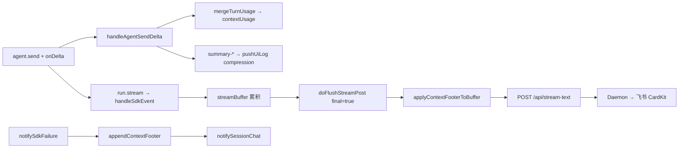

# Agent 自动压缩与上下文占用展示 - 代码评审报告

## 1、审查范围

- **变更类型**: apply 产出的未提交变更（T1–T5 done，stage=applied）
- **评审等级**: focused-review（Electron 单模块增强，无 proto/DB/权限/资金路径；未达 full-review 六路并行门槛）
- **涉及文件**: 3 个实现/约定文件 + KB 文档（`02-design.md`、`03-tasks.md`、本报告）
- **设计文档**: `02-design.md`（对照基准）
- **CodeGraph**: 本次会话索引未加载（MCP 未绑定 workspace）；调用链与影响面已通过 `git diff` + 源码通读 + `grep` 交叉核实

## 2、严重（必须处理）

无

## 3、警告（建议处理）

1. **`models.list` 上限字段依赖运行时探测，footer 可能在部分模型上长期省略**
   - 位置: `electron/context-usage.ts:34-51`、`electron/context-usage.ts:74-88`
   - 说明: `LIMIT_FIELD_CANDIDATES` 遍历 `contextWindow` 等未在 SDK 类型中声明的字段；若运行时 models 条目均不含有效上限，`formatContextFooter` 恒返回 null，飞书用户看不到占用摘要（符合 B4-a 不泄漏 NaN，但偏离 PRD 主路径期望）。建议在 `06-automation-test.md` / `08-verify` 首条用例确认当前 API Key 下至少一种模型能解析到 limit；若 SDK 稳定字段名已知，后续收窄候选列表。（评分 ~70，**不阻断 archive**）

2. **Ponytail 精简轴**
   - `shrink:` 可将 `resolveContextLimitForSession` 与 `resolveModelContextLimit` 合并为单函数以减少一层包装 — 可读性收益有限，可保留。
   - `yagni:` `formatTokensK` / `totalContextTokens` 仅 footer 使用，体量小，保留利于单测与格式一致。
   - **结论**: Lean already. Ship.（`net: 0 lines`，无未批准新依赖）

## 4、设计偏差

1. **B3-b 非 f41 成功 notify 路径未 append footer**
   - 设计预期: `02-design.md` S5 / T4 — 非流式终态 notify 正文末尾 append
   - 实际实现: 成功 Run 的非 f41 路径 assistant 正文仅 `appendSdkLog` 写 UI 日志，**无**经 `notifySessionChat` 下发用户可见终态正文；故无 append 挂点
   - 影响: 与 T4 实现范围「**若有路径**」一致；飞书主路径（主用户私聊 + feishu 群聊 `allowOthers`）均 `f41Stream=true`，footer 经 `doFlushStreamPost(final=true)` 覆盖 PRD 验收 1/2/3。**非偏差**，属既有出站架构约束

无其他与 `02` 已确认决策（单一 footer 落点 agent-sdk、daemon 不二次 append、CLI 范围外、harness 默认压缩）相悖的偏差。

## 5、验收标准检查

### T1–T5（`03-tasks.md`）

| 任务 | 验收条件 | 状态 |
|------|---------|------|
| T1 | 新文件 ≤300 行，可被 import | ✅ `context-usage.ts` 180 行 |
| T1 | `formatContextFooter` 90000/200000 → 含 `45%` 与 `90k/200k` | ✅ 本地 quick check 通过 |
| T1 | limit null → 返回 null | ✅ |
| T1 | `appendContextFooter` 幂等 | ✅ 已含「上下文：」时不重复 |
| T1 | Ponytail 无未批准抽象 | ✅ |
| T2 | 两处 `agent.send` 挂载 onDelta | ✅ `launchSdkAgent` / `dispatchToSdkAgent` |
| T2 | turn-ended 更新 `contextUsage` | ✅ `handleAgentSendDelta` → `mergeTurnUsage` |
| T2 | summary 类事件 UI 日志 `[compression]` | ✅ |
| T2 | 未编造 `autoCompress` 字段 | ✅ 注释说明 harness 默认 |
| T3 | 多 turn usage 单调累积 | ✅ 字段求和 merge |
| T3 | 新 Run usage 清零，limit 可缓存 | ✅ `resetSdkRunPresentationState` |
| T3 | limit 解析失败仍可 send | ✅ catch 静默，footer 省略 |
| T3 | agent-sdk 净增可控 | ✅ +33 行，逻辑拆至 helper |
| T4 | f41 流式仅 final 含 footer | ✅ `doFlushStreamPost` final 分支 |
| T4 | footer 格式符合 F2 | ✅ |
| T4 | 不可得时无 footer/NaN | ✅ |
| T4 | 错误 notify optional append | ✅ `notifySdkFailure` |
| T4 | daemon 无需改动 | ✅ 正文已含 footer |
| T5 | AGENTS 与 T4 一致 | ✅ final-only、格式、省略条件、CLI 范围 |
| T5 | 未声称 daemon append | ✅ |

### T6（可选，非 apply 阻塞）

| 任务 | 验收条件 | 状态 |
|------|---------|------|
| T6 | `npm run build` | ✅ 本次评审执行通过 |
| T6 | `06-automation-test.md` 可执行步骤 | ⏳ pending（`/kb-test`） |

### `01-proposal.md` 验收标准

| # | 条件 | 状态 |
|---|------|------|
| 1–3 | 飞书私聊/群聊流式 final footer | ✅ 代码路径满足；E2E 待 T6 |
| 4 | 短对话仍展示 footer | ✅ used>0 且 limit 可得时输出 |
| 5 | 自动压缩可观测 | ✅ onDelta summary 日志；压缩本身依赖 harness |
| 6 | 占用不可得省略 | ✅ |
| 7 | 错误 notify footer 行为 | ✅ |
| 8 | tsc/build + 单文件规范 | ✅ build 通过；`context-usage.ts` ≤300；`agent-sdk.ts` 仍 >300 为**变更前既有**（见 §7） |

### `02-design.md` §八·（二）工程补充验收项

| 项 | 状态 |
|----|------|
| onDelta 不阻塞 send；异常 WARN | ✅ `createAgentSendOptions` try/catch |
| summary 日志可检索 | ✅ |
| Run 初 usage 清零 | ✅ |
| 单文件 ≤300 / 中文注释 | ✅ 新增文件；agent-sdk 存量见 §7 |
| npm run build | ✅ |

## 6、调用链与回归风险

| 回归点 | 风险 | 说明 |
|--------|------|------|
| final flush 前 mutate streamBuffer | 低 | 仅 `final===true`；`appendContextFooter` 幂等 |
| send 前 await models.list | 低 | 首 send 略增延迟；失败不阻断 Run |
| onDelta 异常 | 低 | WARN 日志，不影响 stream |
| 非 f41 通道 | 无 | 本变更前后均无 IM 终态正文；行为不变 |
| Presentation 时序 | 低 | footer 在 final flush，与 PRESENTATION_ORDERING 后置闩无冲突 |

## 7、遗留债务

1. **`agent-sdk.ts` 行数 1098（>300）**：变更前已 ~1066 行；本期将 footer/usage/onDelta 拆至 `context-usage.ts`，未做全文件模块化重构。符合 `02` Ponytail「必须拆分新逻辑」决策，全量拆分属独立 refactor，**不阻断本变更 archive**。
2. **T6 E2E / `06-automation-test.md`**：apply 阶段 optional；archive 前建议 `/kb-test` 补飞书 footer 与压缩日志用例。
3. **models.list 字段名待 SDK 稳定后收窄**：见 §3 警告 1。

## 8、修复任务建议

| 问题 ID | 建议动作 | 关联任务 |
|---------|----------|----------|
| — | 无 open 阻断项 | — |

若 §3 警告 1 在 E2E 中确认 limit 恒不可得，可追加 `T-FIX-01`：对照 `@cursor/sdk` 运行时 models 条目补全 `extractContextLimitFromModel` 或 fallback 策略（须 design 修订后再 apply）。

## 9、结论

**通过**，可进入 `/kb-archive`。

T1–T5 实现与 `02-design.md`、`03-tasks.md` 一致；流式 final footer、错误 notify footer、onDelta usage 累积与压缩日志均已落盘；`npm run build` 通过。无评分 ≥75 的阻断问题；T6 联调记录与 E2E 为可选后续，不阻止归档。
