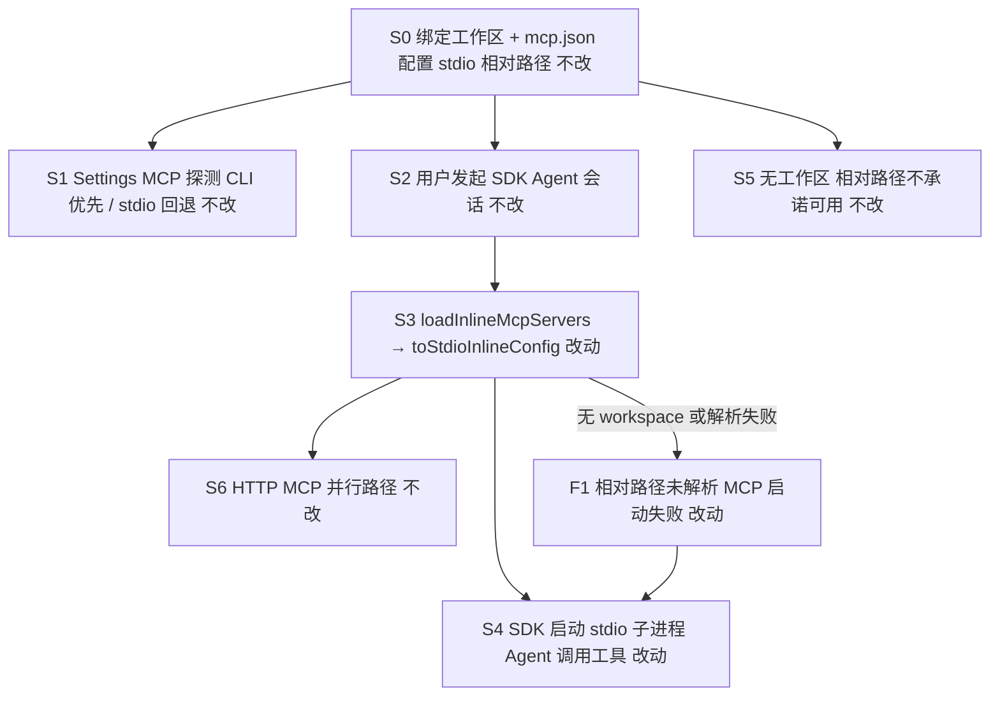
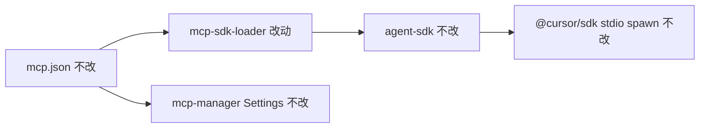

# SDK MCP stdio 相对路径支持 - 实现设计

> **业务 PRD**：见同目录 `01-proposal.md`（验收标准以 01 为准）

## 一、业务流程与改动范围

> 01 无独立「§业务流程」章节；以下从场景 A～D、功能需求 F1～F4 与验收标准提取主流程与关键分支。

### （一）业务流程图

**图例**：`不改` 行为与现网一致；`改动` 需改代码/配置；`新增` 新节点或新分支；`删除` 移除路径。

### （二）流程步骤与改动对照

| 步骤 ID | 业务含义 | 改动 | 落点（模块/文件） | 01 验收关联 |
|---------|----------|------|-------------------|-------------|
| S0 | 用户绑定工作区，在 `.cursor/mcp.json` 配置 stdio MCP（含 `./scripts/...`、`node_modules/.bin/...` 等相对路径 command/args） | 不改 | `electron/config-store`（工作区绑定）；`.cursor/mcp.json`（用户配置） | 01 验收 1、2、3 前置条件 |
| S1 | Settings → MCP 探测工具列表：有 workspace 时 CLI `agent mcp list-tools` 优先，失败回退 stdio 直连（`shell: true` + `cwd`） | 不改 | `electron/mcp-manager.ts`（`getMcpServerTools` ~491-517、`queryToolsViaCli` ~474、`queryToolsViaProtocol` ~366） | 01 验收 3（Settings 侧基准，本变更不触碰） |
| S2 | 用户经 IM/调度发起 SDK Agent 会话：`Agent.create` + 首次 `agent.send`；resident 模式后续 `dispatchToSdkAgent` 再次 `agent.send` | 不改 | `electron/agent-sdk.ts`（`launchSdkAgent` ~837-883、`dispatchToSdkAgent` ~927-929） | 01 验收 1、2、3 |
| S3 | `loadInlineMcpServers(workspaceDir)` 合并 global/project mcp.json，stdio 条目经 `toStdioInlineConfig` 生成 SDK `McpServerConfig`；**相对路径 command/args 须相对 workspace 根解析** | 改动 | `electron/mcp-sdk-loader.ts`（`toStdioInlineConfig` ~48-63；新增同文件私有 helper `resolvePathLikeSegment`） | 01 验收 1、2、3；F1 失败分支 |
| S4 | `@cursor/sdk` 按 inline 配置 spawn stdio MCP 子进程，Agent 列出并调用工具 | 改动 | 间接：`mcp-sdk-loader.ts` 输出已解析的绝对 command/args + `cwd`；`@cursor/sdk` 运行时（无 Claw 侧改动） | 01 验收 1、2、3 |
| S5 | 未绑定工作区：相对路径缺乏解析基准，不承诺可用；不设 `cwd`、不 resolve | 不改 | `mcp-sdk-loader.ts`（`workspaceDir` 为空时保持现网：原样 command/args、无 `cwd`） | 01 验收 5 |
| S6 | HTTP/sse 型 MCP 经 `toHttpInlineConfig` inline 注入，与 stdio 路径并行 | 不改 | `electron/mcp-sdk-loader.ts`（`toHttpInlineConfig` ~66-94）；`agent-sdk.ts` 调用链不变 | 01 验收 4 |
| F1 | 有 workspace 但相对路径未正确解析 → stdio MCP 启动失败或工具不可用（变更前根因；变更后应消除常见 `./`、`node_modules/.bin/` 场景） | 改动 | `electron/mcp-sdk-loader.ts`（`toStdioInlineConfig` 内 resolve 逻辑） | 01 验收 1、2、3（负向→正向）；F4 可选可感知失败 |

### （三）改动汇总

- **改动**：`electron/mcp-sdk-loader.ts` 中 `toStdioInlineConfig`——在 `workspaceDir` 非空时，对路径型相对 `command`/`args` 做 `path.resolve(workspaceDir, segment)`；绝对路径与 bare 命令名（`npx`/`node`/`python` 等无路径分隔符）保持原样；`--flag` 等非路径 arg 不 resolve。
- **新增**：同文件私有 helper `resolvePathLikeSegment(workspaceDir, segment)`（或等价 inline 逻辑），不新建模块/目录。
- **不改（显式列出）**：
  - `electron/agent-sdk.ts`——已正确传入 `workspaceDir` 至 `loadInlineMcpServers` / `appendInlineMcpToSendOptions`；
  - `electron/mcp-manager.ts`——Settings 探测 Path B 已具备 CLI cwd + stdio `shell:true`+`cwd`；
  - `toHttpInlineConfig`、mcp.json schema、HTTP MCP 合并/OAuth 逻辑；
  - 无工作区时不 resolve、不设 `cwd` 的边界行为。

## 二、整体思路

**根因（见 01 §背景与问题、场景 B/C）**：

- **Settings（Path B）**：`mcp-manager.getMcpServerTools` 在已绑定 workspace 时，CLI `agent mcp list-tools` 于 workspace cwd 下由 Cursor 解析相对路径；stdio 回退 `queryToolsViaProtocol` 使用 `shell: true` + `spawnOpts.cwd = workspaceCwd`，相对路径可启动。
- **SDK（Path A）**：`toStdioInlineConfig` 仅设置 `cfg.cwd = workspaceDir`，`command`/`args` 原样传入 `@cursor/sdk`；SDK spawn 无 shell 时，相对路径（尤其 `node_modules/.bin/`、`./scripts/`）无法正确解析，导致 MCP 启动失败或工具不可用。

**方案要点**：在 SDK inline 配置生成阶段（`toStdioInlineConfig`）将路径型相对 segment 解析为绝对路径，使 `@cursor/sdk` 收到的 command/args 可直接 exec，同时保留 `cwd` 供子进程工作目录与 env 依赖。与 IDE/CLI「相对工作区根」语义对齐，不扩展 mcp.json schema。

**最小方案三问**：

1. **复用现有模块？** 是。仅扩展 `mcp-sdk-loader.ts` 已有 `toStdioInlineConfig`，`loadInlineMcpServers` / `appendInlineMcpToSendOptions` 签名与调用方不变。
2. **新增抽象/依赖？** 否。PRD 未要求；使用 Node 内置 `path.resolve`/`path.isAbsolute`，不引入 shell 或第三方路径库。
3. **单文件 vs 预建层？** 单文件 `mcp-sdk-loader.ts` 即可；逻辑局限在 stdio inline 转换，无需 trait 或独立 resolver 包。

## 三、分层设计

- **端点层**：无变更。Settings UI、IM 调度、`Agent.create`/`agent.send` 入口均不改。
- **服务层**：
  - **MCP 配置加载（改动）**：`mcp-sdk-loader.toStdioInlineConfig` 在 workspace 存在时 resolve 相对 command/args。
  - **MCP 探测（不改）**：`mcp-manager.getMcpServerTools` 维持 CLI 优先 + stdio 回退。
  - **SDK 会话（不改）**：`agent-sdk.launchSdkAgent` / `dispatchToSdkAgent` 继续传入 `workspaceDir`。
- **数据层**：无变更。仍读取 `~/.cursor/mcp.json` 与 `<workspace>/.cursor/mcp.json` 合并结果；不新增配置字段。

## 四、接口设计

无新增或变更对外/IPC 接口。

- `loadInlineMcpServers(workspaceDir: string): Record<string, McpServerConfig>` — 签名不变；stdio 条目输出中 command/args 在有效 workspace 下为解析后的绝对路径。
- `appendInlineMcpToSendOptions(sendOptions, workspaceDir?)` — 不变。
- `@cursor/sdk` `McpServerConfig`（stdio）— 仍使用 `{ type: "stdio", command, args?, env?, cwd? }`；无 schema 扩展。

## 五、数据结构

无数据库或持久化模型变更。

**运行时 `McpServerConfig`（stdio）语义扩展（仅 Claw 生成侧）**：

| 字段 | 变更前 | 变更后 |
|------|--------|--------|
| `command` | mcp.json 原值 | workspace 非空且为路径型相对值 → `path.resolve(workspaceDir, command)`；绝对路径 / bare 名不变 |
| `args[]` | mcp.json 原值 | 各元素：路径型相对 → resolve；`--*` flag、 bare 参数不变 |
| `cwd` | `workspaceDir`（非空时） | 不变 |
| `env` | 原样 | 不变 |

**路径型判定（实现约定）**：含 `/` 或 `\` 或以 `./`、`../` 开头的 segment 视为路径型；`npx`、`node`、`python3` 等无分隔符 bare 名不 resolve。

## 六、实现步骤

1. **（对应 S3/F1）** 在 `mcp-sdk-loader.ts` 新增私有函数 `resolvePathLikeSegment(workspaceDir: string, segment: string): string`：`path.isAbsolute(segment)` 或 bare 命令名 → 返回原值；否则 `path.resolve(workspaceDir, segment)`。
2. **（对应 S3）** 在 `toStdioInlineConfig` 中：若 `workspaceDir.trim()` 非空，对 `command` 调用 resolve；对 `args` 逐元素 resolve（跳过以 `--` 开头的 flag）。
3. **（对应 S3/S4）** 保持 `cfg.cwd = workspaceDir`（非空时）；`workspaceDir` 为空时不 resolve、不设置 `cwd`（S5 边界）。
4. **（对应 S6）** 确认 `toHttpInlineConfig` 与 `loadInlineMcpServers` 分支逻辑未改动。
5. **（对应 01 验收 6）** 执行项目构建（`npm run build` 或团队标准命令），确保 TypeScript 编译通过。
6. **（对应 01 验收 1～5）** 按 PRD 场景 A/B/C/D 手工或自动化验收：相对路径脚本、node_modules/.bin、Settings 与 SDK 一致、HTTP 无回归、无工作区边界。

## 七、参考实现

| 符号 / 路径 | 职责 | 本变更 |
|-------------|------|--------|
| `launchSdkAgent` → `Agent.create({ mcpServers: loadInlineMcpServers(workspaceDir) })` | `electron/agent-sdk.ts` ~837-840 | 不改 |
| `agent.send` → `appendInlineMcpToSendOptions(..., workspaceDir)` | `electron/agent-sdk.ts` ~881-883、~927-929 | 不改 |
| `loadInlineMcpServers` / `toStdioInlineConfig` | `electron/mcp-sdk-loader.ts` ~48-63、~101-111 | **改动落点** |
| `toHttpInlineConfig` | `electron/mcp-sdk-loader.ts` ~66-94 | 不改 |
| `getMcpServerTools` → `queryToolsViaCli` / `queryToolsViaProtocol` | `electron/mcp-manager.ts` ~491-517 | 不改（Settings 参考实现：CLI cwd + stdio `shell:true`） |
| 归档变更 `20260627230833-stdio MCP支持` | `knowledge/变更/归档/.../05-summary.md` | Path A/B 背景；本变更为 Path A 相对路径补全 |

## 八、技术影响

### （一）影响范围

- **涉及模块**：`electron/mcp-sdk-loader.ts`（唯一代码改动文件）。
- **接口/proto 变更**：无。
- **数据变更**：无；仅运行时传给 SDK 的 command/args 字符串由相对变为绝对（有 workspace 时）。
- **风险**：
  - **误 resolve 非路径 arg**：须严格区分 bare 命令名与 `--flag`；仅路径型 segment 解析。
  - **回归绝对路径 / 全局命令**：`path.isAbsolute` 与 bare 名判定须覆盖 01 §边界「绝对路径与系统级命令不应回归」。
  - **跨平台**：使用 `path.resolve`/`path.isAbsolute`，Windows `\` 与 `./` 前缀需与判定规则一致。
  - **无 workspace**：保持不 resolve，与 01 验收 5 一致。

### （二）工程补充验收项

- [ ] `toStdioInlineConfig` 单元或集成：给定 workspace + `./scripts/foo`、`node_modules/.bin/bar`、绝对路径、`npx` command，输出符合 resolve 规则。
- [ ] `args` 含 `--config`、`./path/to/config.json` 混合时，仅路径型 arg 被 resolve。
- [ ] `workspaceDir === ""` 时 command/args 与变更前字节级一致（无 `cwd`）。
- [ ] TypeScript 编译通过；`mcp-sdk-loader.ts` 行数仍 ≤300。

## 九、知识库影响

- `electron/AGENTS.md` — 「SDK MCP 内联」段需补充：stdio 相对路径在 loader 内 resolve，与 Settings Path B 行为对齐。
- `knowledge/变更/归档/20260627230833-stdio MCP支持/` — 历史 Path A 仅补 `cwd`；本变更为其体验补全，archive 时可在该域或新归档 summary 交叉引用。
- **两级索引**：若工程平台分区有 Electron/MCP 子模块文档，archive 后视实现更新；`知识索引.md` 通常无需因单文件小改而调整。

## 十、知识库更新计划

### （一）必须更新

- `electron/AGENTS.md` — 更新「SDK MCP 内联」：`toStdioInlineConfig` 相对路径 resolve 规则与 workspace 边界。
- 本变更目录 `05-summary.md`（archive 阶段）— 记录实际改动文件与用户可见摘要。
- 用户可见变更：`package.json` version bump + `changelog/<新版本>.json`（01 验收 6）。

### （二）可能更新（视实现结果）

- `knowledge/工程平台/` 下 Electron 客户端 MCP 相关子模块（若存在独立叶子文档描述 SDK inline 行为）。
- `knowledge/变更/归档/20260627230833-stdio MCP支持/05-summary.md` 或新建交叉链接 — 说明相对路径补全与 stdio MCP 基线关系。

### （三）不需要更新

- `electron/mcp-manager.ts` 对应知识（Settings Path B 未改）。
- mcp.json schema、HTTP MCP、OAuth/`mcp-auth.json` 文档。
- Flutter/Quasar/Rust 等业务域知识文件（无用户可见链路变更）。
