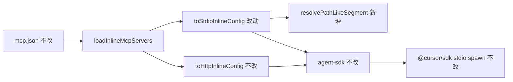

# SDK MCP stdio 相对路径支持 - 代码评审报告

## 1、审查范围

- **变更类型**: apply 产出的未提交变更（T1–T2 done，stage=applied）
- **评审等级**: focused-review（单文件局部实现，无 proto/跨端/DB/权限/资金路径）
- **涉及文件**: 2 个实现/约定文件 + KB 文档（`02-design.md`、`03-tasks.md`、本报告）
- **设计文档**: `02-design.md`（对照基准）
- **CodeGraph**: `toStdioInlineConfig`、`loadInlineMcpServers`、`resolvePathLikeSegment` 调用链已核实；影响面限于 SDK inline stdio 配置生成

## 2、严重（必须处理）

无

## 3、警告（建议处理）

无

**Ponytail 精简轴**：Lean already. Ship.（`net: 0 lines`；仅 Node 内置 `path`，无未批准新依赖或抽象层）

## 4、设计偏差

无

实现与 `02-design.md` §五路径型判定、§六实现步骤 1–4 及 S3/S5/S6 边界一致；未改动 `agent-sdk.ts`、`mcp-manager.ts`、`toHttpInlineConfig`。

## 5、验收标准检查

### T1–T2（`03-tasks.md`）

| 任务 | 验收条件 | 状态 |
|------|---------|------|
| T1 | 01 验收 1：相对路径 `command` resolve + `cwd=workspaceDir` | ✅ 静态（`resolvePathLikeSegment` + `toStdioInlineConfig`） |
| T1 | 01 验收 2：`node_modules/.bin` resolve；bare 名不 resolve | ✅ |
| T1 | 01 验收 3：与 Settings「相对工作区根」语义对齐 | ✅ 代码侧；E2E 待 `/kb-test` |
| T1 | 01 验收 4：HTTP MCP 无回归 | ✅ `toHttpInlineConfig` / `loadInlineMcpServers` 分支未改 |
| T1 | 01 验收 5：无 workspace 时输出与变更前一致 | ✅ `ws` 空时不 resolve、不设 `cwd` |
| T1 | 02 §八·（二）- resolve 规则 | ✅ |
| T1 | 02 §八·（二）- args 混合（`--config` + 路径 arg） | ✅ 路径型 arg resolve；`--*` flag 跳过 |
| T1 | 02 §八·（二）- 编译与行数 ≤300 | ✅ 静态通过 |
| T1 | 01 验收 6：可构建；版本/changelog 留 archive | ✅ 构建留 `/kb-test`/`/kb-archive` |
| T1 | Ponytail：无未批准抽象/依赖 | ✅ |
| T2 | AGENTS 写明 resolve 规则、路径型判定、无 workspace 边界 | ✅ |
| T2 | 未错误声称改 `mcp-manager` / HTTP 逻辑 | ✅ |
| T2 | 01 验收 3 / 5 文档对齐 | ✅ |
| T2 | Ponytail：仅更新既有 AGENTS 段 | ✅ |

### `01-proposal.md` 验收标准

| # | 条件 | 状态 |
|---|------|------|
| 1 | 相对路径脚本 MCP（SDK 会话） | ⏳ 端到端待 `/kb-test` |
| 2 | node_modules/.bin 类 MCP | ⏳ 端到端待 `/kb-test` |
| 3 | Settings 与 SDK 一致 | ⏳ 端到端待 `/kb-test` |
| 4 | HTTP MCP 无回归 | ✅ 静态 |
| 5 | 无工作区边界 | ✅ 静态 |
| 6 | 编译与发布 | ⏳ 构建/changelog 在 `/kb-test` / `/kb-archive` |

## 6、调用链与回归风险

| 回归点 | 风险 | 说明 |
|--------|------|------|
| 绝对路径 / bare 命令名 | 低 | `path.isAbsolute` + 无分隔符判定，原样返回 |
| `--flag` 误 resolve | 低 | 以 `--` 开头的 arg 跳过；整段 `--config=./path` 不 resolve（见 §7） |
| 无 workspace | 低 | 与变更前字节级一致 |
| HTTP/sse MCP | 无 | 分支未触碰 |
| Settings Path B | 无 | `mcp-manager.ts` 未改 |

## 7、遗留债务

1. **`--config=./path` 整段以 `--` 开头不 resolve**：当前实现仅跳过以 `--` 开头的 arg 元素；`--config=./relative` 等形式不会被解析为绝对路径。`02-design.md` §五已约定 `--*` flag 不 resolve；若 MCP 依赖 flag 内嵌相对路径，可依赖 `cwd=workspaceDir` 缓解，或后续单独 design 支持 `key=value` 拆分。（评分 <75，**不阻断 archive**）
2. **`loadInlineMcpServers` 块注释未提 resolve**：T2 已更新 `electron/AGENTS.md`「SDK MCP 内联」段；同文件 `loadInlineMcpServers` 上方块注释仍仅描述合并逻辑，未重复 resolve 规则。可选后续补一行注释，非功能缺口。（评分 <75，**不阻断 archive**）
3. **01 验收 1–3 端到端**：相对路径脚本、node_modules/.bin、Settings 与 SDK 一致场景需在 `/kb-test` 补证据。

## 8、修复任务建议

| 问题 ID | 建议动作 | 关联任务 |
|---------|----------|----------|
| — | 无 open 阻断项 | — |

若 E2E 发现 `--config=./path` 类配置普遍失败，可追加 design + `T-FIX-01` 支持 flag 内路径解析；当前按设计已知限制接受。

## 9、结论

**通过**，可进入 `/kb-test` 与 `/kb-archive`。

T1–T2 实现与 `02-design.md`、`03-tasks.md` 一致；无评分 ≥75 的阻断问题。01 验收 1–3 端到端与构建记录在 `/kb-test` 收口；用户可见 version/changelog 在 `/kb-archive` 处理。
