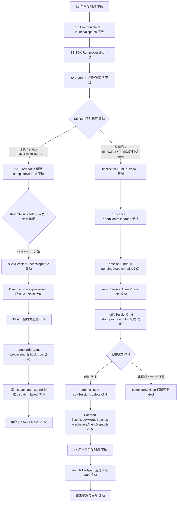
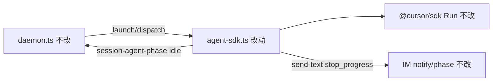

# Agent Run 超时自动停止 - 实现设计

> **业务 PRD**：见同目录 `01-proposal.md`（验收标准以 01 为准）

## 1、业务流程与改动范围

> 业务口径以 `01-proposal.md` 场景 A～C、功能需求 F1～F4 与验收标准为准；下图覆盖 IM 主路径：用户发消息 → Run 处理 → 超时 →（现状失败链 vs 改动后自动收尾）→ 稍后发消息 → 新 Run。

### 1.1 业务流程图



**图例**：`不改` 行为与现网一致；`改动` 需改代码/规则；`新增` 新函数或新分支；`删除` 无（超时路径取消写入 `failedCooldowns`，非删除模块）。

### 1.2 流程步骤与改动对照

| 步骤 ID | 业务含义 | 改动 | 落点（模块/文件） | 01 验收关联 |
|---------|----------|------|-------------------|-------------|
| S1 | 用户经 IM 发送消息，Daemon 入队 | 不改 | `src/daemon.ts` orchestrator | — |
| S2 | claim 后 `POST /api/agent/launch` 或 `dispatch` | 不改 | `src/daemon.ts`；`electron/agent-sdk.ts` `launchSdkAgent` / `dispatchToSdkAgent` | 验收 2 前置 |
| S3 | `startSdkRun`：`notifySessionChat` 处理中 + `reportSessionAgentPhase(processing)` | 不改 | `electron/agent-sdk.ts` `startSdkRun` | 验收 4 |
| S4 | Agent 执行长任务/多步 tool | 不改 | `@cursor/sdk` Run 流 | 验收 1 前置 |
| S5 | SDK 推送 `status ERROR/EXPIRED` 或 Run 终态 `status=error`（含任务执行超时、保活超时等） | 改动 | `electron/agent-sdk.ts` `handleSdkEvent`、`streamRunEvents`、`finalizeSdkRunOnTimeout`（新增） | 验收 1、5；F1 |
| S5a | **现状**：ERROR/EXPIRED 仅写 `lastStatus`，等 `streamRunEvents` 结束才 `completeSdkRun` | 改动（消除 defer-only） | `handleSdkEvent` case `status` | 01 背景 1–4 |
| S5b | **现状**：流未结束 → `session.run` 残留 → `isSdkSessionProcessing` 长期 true | 改动 | `streamRunEvents` + finalizer 清 `session.run` | 验收 1、2；F2 |
| S5c | **改动后**：超时类终态立即 finalizer → cancel/abort → idle + 一次 notify | 新增 | `finalizeSdkRunOnTimeout` | F1、F2、F4 |
| S5d | **改动后**：超时路径不写 `failedCooldowns`（或立即清除） | 改动 | `completeSdkRun` / finalizer 分支 | 验收 2 |
| S5e | **改动后**：长驻模式超时 → `agent.close()` + `sdkSessions.delete`（等同轻量 stop，保留 F4 notify） | 改动 | finalizer resident 分支 | 验收 2；避免 dispatch_failed |
| S6 | 用户 **稍后** 在同会话发新消息（场景 B 核心） | 不改 | Daemon claim 循环 | 验收 2、3 |
| S7 | **现状**：processing 残留时 `launchSdkAgent` 静默 `{ ok: true }` 吞消息 | 改动（依赖 S5c 消除根因；可选防御性日志） | `launchSdkAgent` L793–795 | 验收 2 |
| S8 | **改动后**：idle 上报 → Daemon `flushReadyMergeBatches` + `scheduleAgentDispatch` | 不改 | `src/daemon.ts`（已有） | 验收 2 |
| S9 | 新 Run 正常启动并回复（场景 C） | 改动（由 S5c 达成） | `launchSdkAgent` 重建路径 | 验收 2、3 |
| S10 | 用户主动 Stop / 非超时 error / CANCELLED | 不改 | `stopSdkSession`、`completeSdkRun` 非超时分支、`formatSdkStreamFailure` | 验收 6、7 |

### 1.3 改动汇总

- **改动**：
  - `electron/agent-sdk.ts`：新增 `finalizeSdkRunOnTimeout(session, run, trigger)`（名称实现时可微调）；`handleSdkEvent` 在 ERROR/EXPIRED 时立即调用；`completeSdkRun` 与 finalizer 幂等合并（`runFinalizing` / 已有 `errorNotified`）；超时路径跳过 `failedCooldowns`；长驻模式超时关闭 Agent 并删 session；`streamRunEvents` 循环内已有 `abortController.signal.aborted` 检查，finalizer abort 后确保提前 break。
- **新增**：finalizer 函数及可选 `SdkSessionAgent.runFinalizing?: boolean` 幂等闩。
- **不改（显式列出）**：
  - `src/daemon.ts` M7 claim / phase 逻辑 — idle 上报后既有 flush 足够。
  - 超时阈值（`KEEPALIVE_TIMEOUT_MS` 等）— 本变更不调整。
  - 用户主动 `stopSdkSession`、CANCELLED 既有 notify 时机。
  - 非超时 `completeSdkRun` error 路径（仍写 `failedCooldowns`、resident 保留实例）。
  - CLI / 任务路径、`/stop` / `/reset` 语义。

## 2、整体思路

**根因**（已回代码核实，PRD 口径仍引用 01）：

1. `handleSdkEvent` 收到 `status ERROR/EXPIRED` 仅记 `lastStatus`，**延至** `completeSdkRun` 再 notify；**未**主动 `run.cancel()` 或打断 `streamRunEvents`。
2. `streamRunEvents` → `completeSdkRun` 仅在流结束回调；若超时后流未及时结束，`session.run` 非空 → `isSdkSessionProcessing` true → Daemon `sessionAgentPhaseMap` 长期 `processing`（M7 阻塞 claim）。
3. `completeSdkRun` error 路径设 `failedCooldowns` 30s，可能阻塞 `launchSdkAgent` 重试。
4. 长驻模式 error 后保留 `agent` 实例但可能内部不可用，下次 `dispatchToSdkAgent` → `agent.send` 失败 → Daemon `dispatch_failed`。
5. `launchSdkAgent` 若 `isSdkSessionProcessing(existing)` 直接 `{ ok: true }` 静默返回（processing 残留时消息被吞）。
6. 既有 `formatSdkStreamFailure` F3.2 保活文案（archive 20260627150751）仅改善 notify，**未**解决 Run/phase 收尾。

**方案要点**（最小改动，复用现有符号）：

- **主落点**：`electron/agent-sdk.ts` 内联 `finalizeSdkRunOnTimeout(session, run, trigger)`，在 ERROR/EXPIRED / 判定为 Run·保活超时类的 `run.status===error` 时：
  1. 幂等闩（`runFinalizing` + `errorNotified`）防重复 notify / 双 idle。
  2. `run.cancel()` best-effort + `abortController.abort()` 打断流。
  3. `resetStreamPostChain`；`session.run = null`；`session.pendingDispatch = false`。
  4. `reportSessionAgentPhase(idle)` + `notifySdkFailure` / `notifySessionChat(..., stopProgress=true)`（F4 复用 `formatSdkStreamFailure` 超时文案，一次）。
  5. **长驻模式超时专用**：`agent.close()` 并从 `sdkSessions` 删除；下条消息走 `launchSdkAgent` 重建。
  6. 超时路径 **不** 写入 `failedCooldowns`（或写入后立即清除）。
- `handleSdkEvent` status ERROR/EXPIRED：调用 finalizer（不再仅 defer）。
- `completeSdkRun`：若 `runFinalizing` 或 `session.run === null` 且已 idle 化，跳过重复收尾；error notify 与 cooldown 按是否超时类分支。
- **Daemon 侧不改**。

**与 01 追溯**：F1→S5c；F2→S5c+S8+S9；F3→finalizer 一次 notify + stop_progress；F4→`formatSdkStreamFailure` 保活/超时文案；边界（不含阈值调整、主动取消、非超时失败）→ S10 不改分支。

**最小方案三问**：

1. **复用现有模块？** 是。复用 `completeSdkRun` / `stopSdkSession` 片段逻辑、`formatSdkStreamFailure`、`reportSessionAgentPhase`、`notifySessionChat`、`resetStreamPostChain`；不新建模块目录。
2. **新增抽象/依赖？** 否。不新增第三方依赖；仅内联 finalizer + 可选 `runFinalizing` 布尔。
3. **单文件？** 全部合并进 `electron/agent-sdk.ts`；该文件已超 300 行，finalizer 须紧凑；若 implement 阶段仍膨胀，可提取最小 helper 至同目录 `finalize-sdk-run.ts` 并在 `03-tasks` 登记。

## 3、分层设计

- **端点层**：无 HTTP 路由变更；Daemon `POST /api/agent/launch|dispatch`、`POST /api/session-agent-phase` 契约不变。
- **服务层（Electron）**：`electron/agent-sdk.ts` — Run 事件流、超时终态主动收尾、phase 上报、用户 notify。
- **Daemon 编排层**：不改；依赖 `reportSessionAgentPhase(idle)` 触发既有 `flushReadyMergeBatches` 与 `scheduleAgentDispatch`。
- **数据层**：无持久化 schema 变更；运行时 `SdkSessionAgent` 可选增 `runFinalizing?: boolean`。



## 4、接口设计

无新增或变更对外 HTTP/MCP 接口。

| 符号 | 变更 |
|------|------|
| `launchSdkAgent(opts)` | 签名不变；超时收尾后 processing 不再残留 |
| `dispatchToSdkAgent(sessionKey, text)` | 签名不变；超时后 session 已删除，走 launch 重建 |
| `stopSdkSession(sessionKey)` | 不变；用户主动 Stop 仍走此路径 |
| `POST /api/session-agent-phase` | 不变；finalizer 多一次及时 idle 上报 |

## 5、数据结构

### 5.1 SdkSessionAgent 扩展（内存，可选）

```typescript
/** 本 Run 正在执行超时/终态收尾，防 completeSdkRun 重复 */
runFinalizing?: boolean
```

- 已有字段复用：`errorNotified`、`lastStatus`、`lastTool`、`runStartedAt`、`abortController`。
- 不写持久化；不写 `failedCooldowns`（超时路径）。

### 5.2 超时类判定（逻辑，非新类型）

满足任一即走 finalizer 超时路径（实现时可抽私有 `isRunTimeoutFailure(session, run, lastStatus)`）：

| 条件 | 说明 |
|------|------|
| `lastStatus.status` 为 `ERROR` 或 `EXPIRED` | `handleSdkEvent` 即时触发 |
| `run.status === "error"` 且 `formatSdkStreamFailure` 上下文命中保活超时（`shell:running` + `durationMs ≥ KEEPALIVE_TIMEOUT_MS` + 不安全 message） | 与 archive 20260627150751 F3.2 一致 |
| `run.status === "error"` 且 `durationMs` 达观测 Run 超时档（与 ERROR/EXPIRED 等价的任务执行超时，无更安全 message 时） | 与 01 场景 A 对齐；具体 errorCode/message 实现时从 `run.wait()` / `lastStatus` 读取 |

**非超时类** `run.status === "error"`（工具失败、网络等）仍仅走 `completeSdkRun` 既有路径（含 `failedCooldowns`、resident 保留实例）。

## 6、实现步骤

1. **S5-F1**：在 `SdkSessionAgent` 增加 `runFinalizing?: boolean`；`resetSdkRunPresentationState` 重置为 false。（对应 S5）
2. **S5-F2**：实现 `finalizeSdkRunOnTimeout(session, run, trigger)`：幂等闩 → `run.cancel()` → `abortController.abort()` → `resetStreamPostChain` → 清 `session.run` / `pendingDispatch` → 结构化 UI 日志 → `notifySdkFailure`（F4，`stop_progress` 经 `notifySessionChat` 第三参）→ `reportSessionAgentPhase(idle)` → resident 超时分支 `agent.close()` + `sdkSessions.delete` + `broadcastSdkSessionStatus`。（对应 S5c、S5e、F1–F4）
3. **S5-F3**：`handleSdkEvent` case `status`：`ERROR`/`EXPIRED` 写 `lastStatus` 后立即 `void finalizeSdkRunOnTimeout(session, session.run!, "status")`；`CANCELLED` 保持现网（aborted 除外即时 notify）。（对应 S5a）
4. **S5-F4**：`streamRunEvents`：循环内保留 `abortController.signal.aborted` break；流正常结束后若 `run.status === "error"` 且 `isRunTimeoutFailure`，在 `completeSdkRun` 前若尚未 finalizing 则调用 finalizer（或 `completeSdkRun` 内统一分支）。（对应 S5b）
5. **S5-F5**：`completeSdkRun`：入口若 `runFinalizing` 或 `session.run === null`（已被 finalizer 清理）则仅做幂等日志与 resident 非超时收尾；error 路径 `failedCooldowns.set` 包在 `!isRunTimeoutFailure` 条件内；`errorNotified` 时跳过二次 notify。（对应 S5d、S10）
6. **S7-F6**（可选防御）：`launchSdkAgent` processing 静默返回处增加 UI WARN 日志（不改返回契约），便于回归观测。（对应 S7）
7. **回归**：场景 A/B/C 手工 + 01 验收 6/7 非超时/主动取消用例。（对应 S9、S10）

## 7、参考实现

源码核实（`projectPath=/Users/kiki/github/cursor-claw`；CodeGraph 会话未加载，以下行号以 grep/read 为准）：

| 符号 | 路径 | 用途 |
|------|------|------|
| `formatSdkStreamFailure` | `electron/agent-sdk.ts:183` | F3/F4 用户文案；保活超时 F3.2 |
| `notifySdkFailure` | `electron/agent-sdk.ts:207` | 一次 notify 网关（`errorNotified` 闩） |
| `notifySessionChat` | `electron/agent-sdk.ts:493` | `stopProgress` 第三参 |
| `resetStreamPostChain` | `electron/agent-sdk.ts:344` | 清 stream 链与 timer |
| `streamRunEvents` | `electron/agent-sdk.ts:590` | Run 流循环；L593 aborted break |
| `completeSdkRun` | `electron/agent-sdk.ts:619` | 流结束收尾；L640 `failedCooldowns`；L655 idle |
| `startSdkRun` | `electron/agent-sdk.ts:668` | processing 上报；挂接 stream→complete |
| `handleSdkEvent` | `electron/agent-sdk.ts:677` | L720–726 ERROR/EXPIRED defer 注释处为改动点 |
| `isSdkSessionProcessing` | `electron/agent-sdk.ts:107` | `run !== null \|\| pendingDispatch` |
| `launchSdkAgent` | `electron/agent-sdk.ts:787` | L793–795 processing 静默返回 |
| `dispatchToSdkAgent` | `electron/agent-sdk.ts:901` | L916–917 busy 检查；send 失败 notify |
| `stopSdkSession` | `electron/agent-sdk.ts:1098` | 主动 Stop 参考 cancel/abort/idle |
| `reportSessionAgentPhase` | `electron/daemon-client.ts` | idle 触发 Daemon flush |
| `failedCooldowns` / `FAIL_COOLDOWN_MS` | `electron/agent-sdk.ts:94–95` | 超时路径跳过 |
| `KEEPALIVE_TIMEOUT_MS` | `electron/agent-sdk.ts:100` | 保活超时分类阈值（本变更不改数值） |

现网 gap：`handleSdkEvent` L723 注释明示 ERROR/EXPIRED defer；`completeSdkRun` 依赖流结束才清 `session.run`；resident error 后 L657–660 仍保留可能损坏的 `agent`。

## 8、技术影响

### 8.1 影响范围

- **涉及模块**：仅 `electron/agent-sdk.ts`（主）；`electron/daemon-client.ts` 只读调用；Daemon **无 diff**。
- **接口/proto 变更**：无。
- **数据变更**：无持久化；内存字段 `runFinalizing` + 超时路径 session 删除（resident）。
- **风险**：
  - finalizer 与 `completeSdkRun` 竞态 — 靠 `runFinalizing` + `errorNotified` + `session.run` 空检查幂等。
  - 长驻超时后重建 Agent — 略增下次 launch 延迟，符合 01 F2（可继续对话优先于保实例）。
  - 误判非超时 error 为超时类 — 靠 `isRunTimeoutFailure` 保守判定；验收 7 回归。
  - `agent-sdk.ts` 体量 — 已超 300 行项目约定；finalizer 保持单一函数，必要时同目录最小提取。

### 8.2 工程补充验收项

- [ ] **场景 A**：可复现 Run 超时（长任务或 mock ERROR/EXPIRED）后 **≤5s** 内 UI 日志出现 finalizer 痕迹，`session.run` 已空，`reportSessionAgentPhase(idle)` 已调用（可查 Daemon phase 或日志）。
- [ ] **场景 B（核心）**：超时后 **等待 ≥30s**（覆盖原 `FAIL_COOLDOWN_MS`），**不** Stop/Reset，同会话发新消息 → 新 Run 启动并有回复（或明确非超时失败，但 **不** dispatch_failed / 消息被吞）。
- [ ] **failedCooldowns**：超时路径后 **立即** `launchSdkAgent` 不因冷却拒绝。
- [ ] **resident 超时**：超时后 `sdkSessions` 无该 key；下条消息走 `Agent.create` 重建，**不**出现 `dispatch_failed: no resident agent` 或 send 失败。
- [ ] **F4**：若启用友好提示，仅 **一条** 简体中文超时文案 + `stop_progress`；通道无长期「处理中」。
- [ ] **F3 兜底**：无 stack/内部 error 码；同一超时事件 notify **≤1** 条。
- [ ] **验收 6**：用户主动 Stop 行为不变；finalizer **不**在 aborted 路径误触发。
- [ ] **验收 7**：故意工具失败等非超时 error 仍走通用文案 + `failedCooldowns`；**不**删除 resident session（除非用户 Stop）。

## 9、知识库影响

- `knowledge/业务域/Agent调度/03-启动与自动重连.md` — 须补充 Run 超时自动收尾、resident 超时删实例 vs 正常 error 保留、phase idle 与稍后消息可继续。
- `electron/AGENTS.md` — SDK 错误/长驻小节需对齐 finalizer 与超时 resident 行为（archive 时核对）。
- `knowledge/变更/归档/20260627150751-SDK保活与Run生命周期兼容/` — F3.2 文案与本变更收尾链路的关系（文案已有、状态机未闭环）。
- **两级索引**：用户可见稳定性修复，archive 时视 changelog 再定是否更新 `知识索引.md`。

## 10、知识库更新计划

### 10.1 必须更新

- `knowledge/业务域/Agent调度/03-启动与自动重连.md` — 新增：Run 超时后 `finalizeSdkRunOnTimeout` 主动 cancel/abort、report idle、IM 可继续发消息；长驻模式 **超时** 关闭 Agent 重建 vs **正常** Run 结束保留实例；与 Daemon M7 claim 依赖 `processing`→`idle` 的说明。

### 10.2 可能更新（视实现结果）

- `electron/AGENTS.md` — finalizer、`runFinalizing`、超时跳过 cooldown、resident 超时 close。
- 变更 `05-summary.md` / `changelog/` — 用户可见「超时后无需 Stop+Reset」（archive 阶段，按 kb-archive 规则 bump patch）。

### 10.3 不需要更新

- `src/daemon.ts` 相关 Daemon 文档（无代码变更）。
- 超时阈值、Settings、Figma、CLI 任务路径文档。
- MCP stdio、Presentation 时序等并行变更目录。
