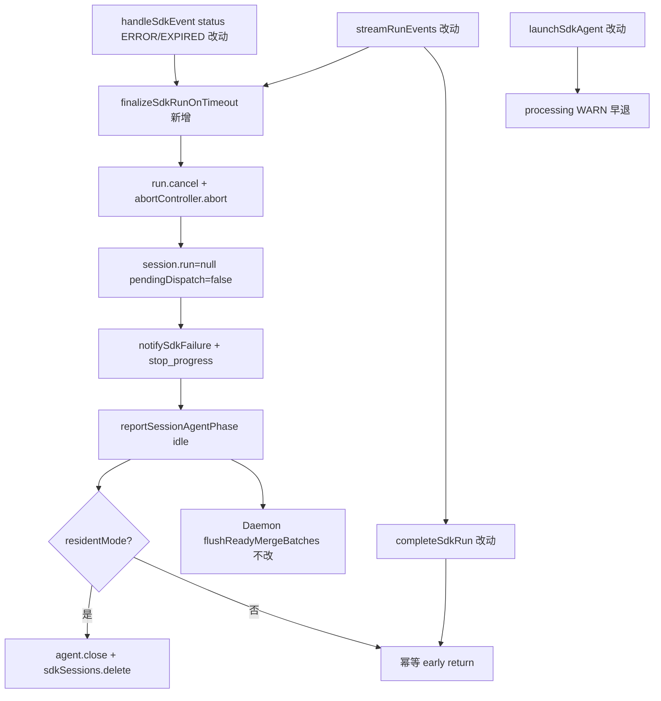

# Agent Run 超时自动停止 - 代码评审报告

## 1、审查范围

- **变更类型**：apply 产出的未提交变更（T1–T3 done，stage=planned）
- **评审等级**：focused-review（单端 Electron SDK 局部实现，无 proto/DB/跨端/权限路径）
- **涉及文件**：`electron/finalize-sdk-run.ts`（新建 144 行）、`electron/agent-sdk.ts`（挂接 diff）、`electron/AGENTS.md`（T3 文档）；KB `02-design.md` / `03-tasks.md` / 本报告
- **排除范围**：`electron/mcp-sdk-loader.ts` 及并行变更「SDK MCP stdio 相对路径支持」——**不纳入本 manifest 评审**；`electron/AGENTS.md` diff 中 MCP stdio 段落为 scope bleed（见 §3 W2）
- **设计文档**：`02-design.md`（对照基准）
- **任务文档**：`03-tasks.md`（T1/T2/T3 验收清单）
- **评审方式**：限定 `git diff` + 关键符号定点复核（`finalizeSdkRunOnTimeout`、`isRunTimeoutFailure`、`completeSdkRun` 幂等、`handleSdkEvent` ERROR/EXPIRED 挂接）

## 2、严重（必须处理）

无（无评分 ≥90 阻断项）

## 3、警告（建议处理）

1. **R1：非长驻模式超时路径未 close/delete session**（评分 **78**）
   - 位置：`electron/finalize-sdk-run.ts` L134–143；`electron/agent-sdk.ts` L664–671、L713–721
   - 说明：`finalizeSdkRunOnTimeout` 仅在 `session.residentMode` 时执行 `agent.close()` + `sdkSessions.delete`；非长驻（`SDK_RESIDENT_AGENT=0`）超时后仅清 `session.run` 并上报 idle。随后 `streamRunEvents` → `completeSdkRun` 因 `runFinalizing || session.run === null` **early return**，跳过非 resident 分支原有的 `agent.close()` + `sdkSessions.delete`（L719–721）。默认长驻模式（`SDK_RESIDENT_AGENT` 未设 0）主路径不受影响；opt-in 非长驻下 agent 实例与 map 条目可能残留，与 02 §1.2 S10「非超时 error 仍走 completeSdkRun 既有路径」的对称性不足。
   - 建议：`T-FIX-01` 在 finalizer 非 resident 分支补 `agent.close()` + delete，或 `completeSdkRun` 幂等入口在 `runFinalizing` 时仍执行非 resident 清理；或 `/kb-test` 在 `SDK_RESIDENT_AGENT=0` 下验收后记 **accepted_debt**（非默认配置）。

2. **R2：ERROR/EXPIRED status 一律视为超时类**（评分 **76**）
   - 位置：`electron/finalize-sdk-run.ts` L54–55；`electron/agent-sdk.ts` L776–781（`handleSdkEvent` 即时 finalizer）
   - 说明：`isRunTimeoutFailure` 条件 (1) 对任意 `lastStatus.status === ERROR|EXPIRED` 返回 true，**不**区分 SDK 超时与其它 ERROR 根因。`handleSdkEvent` 收到 ERROR/EXPIRED 即触发 finalizer → 长驻模式删 session、跳过 `failedCooldowns`。与 01 验收 7「非超时失败不误删 resident、仍写 cooldown」存在**冲突风险**；02 §5.2 将 ERROR/EXPIRED 列为超时触发条件，属**有意收窄**，但依赖 SDK 仅对真超时推送 ERROR/EXPIRED 的假设。
   - 建议：`/kb-test` 验收 7 重点回归；若联调发现非超时 ERROR 误触 finalizer，追加 `T-FIX-02` 收紧判定（message/errorCode 白名单）或文档 **accepted_debt** 注明 SDK 契约前提。

3. **W1：`agent-sdk.ts` 行数超项目约定**（评分 **55**，既有债务）
   - 位置：`electron/agent-sdk.ts`（**1246 行**，AGENTS 约定 ≤300 行/文件）
   - 说明：本变更提取 `finalize-sdk-run.ts`（144 行）部分缓解，主文件仍远超约定；非本变更引入，属存量技术债。
   - 建议：后续 lite 变更继续拆分（presentation、launch/dispatch 等），不阻断本变更。

4. **W2：`electron/AGENTS.md` T3 diff 混入并行 MCP stdio 文档**（评分 **52**，scope bleed）
   - 位置：`electron/AGENTS.md`「SDK MCP 内联」段（`toStdioInlineConfig`、相对路径 resolve 等）
   - 说明：属并行变更「20260628163004-SDK MCP stdio 相对路径支持」，非本 manifest T3 范围；超时/finalizer/resident 段落与 T2 实现一致。
   - 建议：archive 时两变更分别追溯；或 split commit 时 AGENTS 仅保留超时相关 hunk（非功能缺口）。

5. **W3：`isRunTimeoutFailure` 条件 (3) 宽判定**（评分 **58**）
   - 位置：`electron/finalize-sdk-run.ts` L72–78
   - 说明：`run.status === "error"` + `durationMs ≥ 20min` + `isUnsafeSdkMessage` 即 true，**不要求**末次 tool 为 `shell:running`（与 F3.2 条件 (2) 不同）。长时 Run 的通用 tool 失败可能被误判为超时档。02 §8.1 已记「误判非超时 error」风险。
   - 建议：`/kb-test` 验收 7 覆盖；必要时 T-FIX 与 F3.2 对齐增加 lastTool 约束。

**Ponytail 精简轴**：提取 `finalize-sdk-run.ts` 合理，无未批准新依赖/事件总线；挂接内联于既有函数。**Lean already. Ship.**

## 4、设计偏差

| 项 | 设计 | 实现 | 判定 |
|----|------|------|------|
| finalizer 提取 | 02 §2 优先内联；超 300 行可提取同目录 helper | `finalize-sdk-run.ts` + `FinalizerContext` 依赖注入 | **可接受** — 03 T1 可选提取已登记 |
| ERROR/EXPIRED 即时 finalizer | 02 §6 S5-F3；§5.2 条件 (1) | `handleSdkEvent` 即时 `void finalizeSdkRunOnTimeout(..., "status")` | **一致** — R2 为已知契约风险 |
| completeSdkRun 幂等 | 02 §6 S5-F5 | `runFinalizing \|\| session.run === null` early return | **一致** — 副作用见 R1 非 resident |
| 超时跳过 failedCooldowns | 02 §1.2 S5d | `!isRunTimeoutFailure` 才 `failedCooldowns.set` | **一致** |
| resident 超时 close+delete | 02 §1.2 S5e | finalizer L134–143 | **一致**（仅 resident） |
| stream 兜底 finalizer | 02 §6 S5-F4 | `streamRunEvents` 流结束后 `isRunTimeoutFailure` 补调 | **一致** |
| launchSdkAgent WARN | 02 §6 S7-F6 | processing 早退 UI WARN 日志 | **一致** |
| AGENTS 对齐 | 03 T3 | 超时/finalizer/resident/F3.2 已更新；MCP 段为并行 diff | **轻微偏差** — W2 |

无阻断性设计偏离；R1/R2 为实现边界与 SDK 契约假设，非方案推翻。

## 5、验收标准检查

### T1（finalize-sdk-run.ts + agent-sdk 字段）

| 验收项 | 状态 | 说明 |
|--------|------|------|
| `runFinalizing` + reset | ✅ | `SdkSessionAgent` 字段；`resetSdkRunPresentationState` 置 false |
| `isRunTimeoutFailure` 三条件 | ✅ | ERROR/EXPIRED、F3.2、duration 档均已实现 |
| `finalizeSdkRunOnTimeout` 收尾链 | ✅ | cancel/abort → 清 run → notify → idle → resident delete |
| 不写 failedCooldowns | ✅ | finalizer 无 cooldown 写入 |
| 01 验收 7 铺路（非超时 false） | ⚠️ | 纯 `run.status=error` 工具失败静态可 false；ERROR/EXPIRED 见 R2 |
| Ponytail | ✅ | 单文件 helper + ctx 注入，无新目录/依赖 |

### T2（事件流挂接）

| 验收项 | 状态 | 说明 |
|--------|------|------|
| ERROR/EXPIRED 非 defer-only | ✅ | L776–781 即时 finalizer；defer 注释已移除 |
| aborted 不误触发 | ✅ | `!session.abortController.signal.aborted` 门控 |
| streamRunEvents 兜底 | ✅ | 流结束 error + `isRunTimeoutFailure` 补调 `"stream"` |
| completeSdkRun 幂等 + cooldown 分支 | ✅ | early return；超时跳过 cooldown |
| launchSdkAgent WARN | ✅ | processing 早退 WARN |
| 01 验收 1–5 端到端 | ⏳ | 静态通过；待 `/kb-test` |
| **01 验收 2 场景 B（核心）** | ⏳ | 设计对齐；**待 `/kb-test` 手工 ≥30s 后发消息** |
| 01 验收 6/7 | ⏳ | 静态门控成立；R2/R3 风险需联调 |

### T3（electron/AGENTS.md）

| 验收项 | 状态 | 说明 |
|--------|------|------|
| finalizer / runFinalizing / 即时收尾 | ✅ | 「SDK 错误 notify」已写 |
| 超时跳过 cooldown vs 非超时 | ✅ | 「SDK 长驻 Agent」已区分 |
| resident 超时 close vs 非超时保留 | ✅ | 文档与代码一致 |
| F3.2 不再 defer completeSdkRun | ✅ | 保活文案段已更新 |
| 无 MCP 段混入（scope） | ⚠️ | W2：MCP stdio 并行变更同 diff |

### `01-proposal.md` 验收标准

| # | 条件 | 状态 |
|---|------|------|
| 1 | 超时后数秒内自动结束 Run | ⏳ `/kb-test` 场景 A |
| 2 | 稍后发消息可继续（核心） | ⏳ `/kb-test` 场景 B |
| 3 | 无需 Stop+Reset | ⏳ 依赖场景 B |
| 4 | 通道防护 | ✅ 静态（`notifySdkFailure` + `errorNotified`） |
| 5 | F4 友好提示 | ✅ 静态（复用 `formatSdkStreamFailure`） |
| 6 | 主动取消无回归 | ⏳ `/kb-test` |
| 7 | 非超时失败无回归 | ⏳ `/kb-test`；R2/R3 重点关注 |

## 6、调用链与回归风险

| 回归点 | 风险 | 说明 |
|--------|------|------|
| 默认长驻 + ERROR/EXPIRED 超时 | 低 | 主路径；finalizer 删 session + launch 重建 |
| **场景 B 稍后发消息** | 中 | 核心验收；依赖 idle + 无 cooldown + resident 重建；**待 `/kb-test`** |
| 非长驻 `SDK_RESIDENT_AGENT=0` | 中 | R1：agent/session 可能残留 |
| ERROR 非超时误 finalizer | 中 | R2：依赖 SDK 语义；验收 7 回归 |
| 用户主动 Stop / CANCELLED | 低 | aborted 门控；CANCELLED 仍独立 notify |
| Daemon / 飞书流式 | 无 | 本变更无相关 diff |
| MCP stdio 并行 | 无 | 排除评审范围 |

## 7、遗留债务

1. **R1 非长驻超时未 close/delete**（评分 78）— `T-FIX-01` 或 `SDK_RESIDENT_AGENT=0` 下 accepted_debt。
2. **R2 ERROR/EXPIRED 宽判定**（评分 76）— 02 §5.2 有意为之；`/kb-test` 验收 7 + 可选 `T-FIX-02`。
3. **W1 agent-sdk.ts 1246 行** — 存量超 300 行约定；本变更已提取 finalizer。
4. **W2 AGENTS MCP 段 scope bleed** — 并行变更文档；archive 分变更追溯。
5. **W3 duration≥20min 宽超时档** — 02 §8.1 已知；验收 7 联调。
6. **01 验收 1–3 / 场景 B 端到端** — `/kb-test` 收口证据。

## 8、修复任务建议

| 问题 ID | 建议动作 | 关联任务 | 阻断 archive |
|---------|----------|----------|--------------|
| R1 | finalizer 非 resident 补 close+delete，或 completeSdkRun 幂等分支补清理 | T-FIX-01（可选） | 否（非默认配置） |
| R2 | 联调验收 7；若误触则收紧 ERROR/EXPIRED 判定或记 accepted_debt | T-FIX-02（待定） | 否 |
| W1 | 后续 lite 继续拆分 agent-sdk | 技术债 backlog | 否 |
| W2 | split commit / archive 分 manifest 追溯 AGENTS | 流程 | 否 |
| W3 | 联调后可选与 F3.2 对齐 lastTool | T-FIX-03（待定） | 否 |
| — | **场景 B 端到端** | `/kb-test` 必做 | 测试门禁（非 code review 阻断） |

## 9、结论

**通过（有条件）**，可进入 `/kb-test` 后 `/kb-archive`。

T1–T3 核心挂接与 `02-design.md`、`03-tasks.md` 一致：`finalizeSdkRunOnTimeout` 即时 cancel/abort、清 run、idle 上报、一次 notify、resident 超时删 session；`completeSdkRun` 幂等与超时跳过 cooldown 已落地；`handleSdkEvent` 消除 ERROR/EXPIRED defer-only。提取 `finalize-sdk-run.ts` 符合 Ponytail 口径。无评分 ≥90 的 open 阻断项；R1（78）、R2（76）记入 §3 警告，建议 T-FIX 或 accepted_debt，**不阻断**进入测试与归档流程。

### 重点核对摘要

| 核对项 | 结论 |
|--------|------|
| F1 超时自动停止（finalizer） | ✅ 静态 |
| F2 会话 idle + 可继续（场景 B） | ⏳ 待 `/kb-test` |
| F3/F4 notify 防护 | ✅ 静态 |
| resident 超时 close+delete | ✅（默认长驻） |
| 非 resident 超时清理 | ⚠️ R1 |
| 01 验收 7 / 非超时不误触 | ⚠️ R2/R3，待联调 |
| 最小 diff / Ponytail | ✅ |
| AGENTS T3 + scope bleed | ⚠️ W2 |
