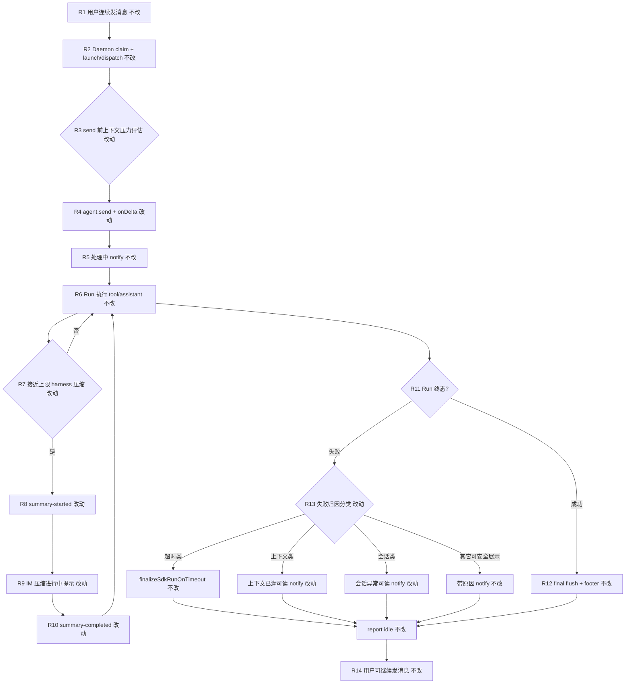
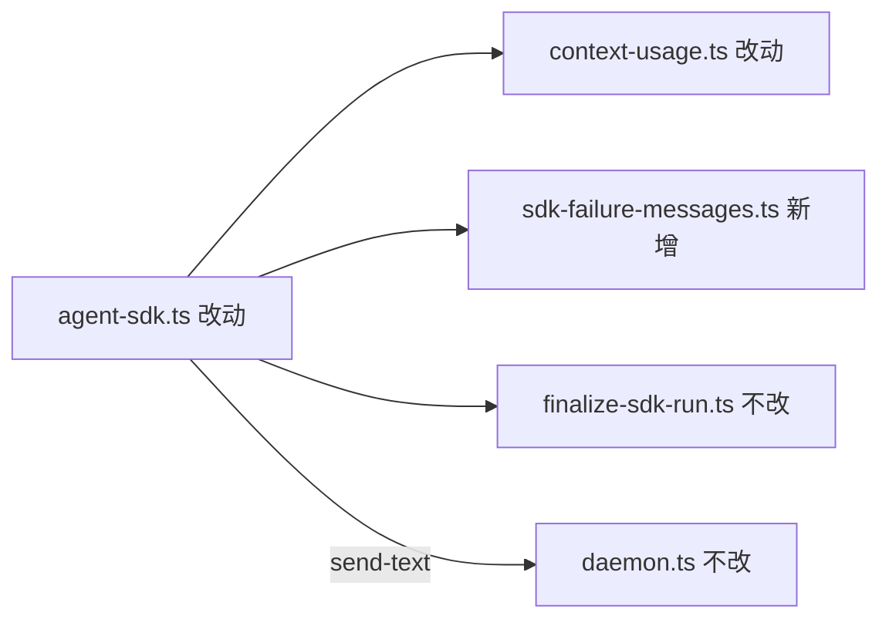

# Agent Run 自动压缩 - 实现设计

> **业务 PRD**：见同目录 `01-proposal.md`（验收标准以 01 为准）

## 一、业务流程与改动范围

> 业务口径以 `01-proposal.md` 场景 A～D、功能需求 F1～F4 与验收标准为准；下图覆盖 IM 主路径：连续多轮 Run → 上下文累积 → 自动压缩 → 继续或可归因失败。

### （一）业务流程图



**图例**：`不改` 行为与现网一致；`改动` 需改代码/配置；`新增` 新节点或新分支；`删除` 无。

### （二）流程步骤与改动对照

| 步骤 ID | 业务含义 | 改动 | 落点（模块/文件） | 01 验收关联 |
|---------|----------|------|-------------------|-------------|
| R1 | 同会话连续多轮用户消息入队 | 不改 | `src/daemon.ts` orchestrator | 验收 1 前置 |
| R2 | claim 后 `launchSdkAgent` / `dispatchToSdkAgent` | 不改 | `electron/agent-sdk.ts`；`electron/session-dispatcher.ts` | 验收 1、4 |
| R3 | send 前评估 session 级 peak/limit，高占用打 `[compression] pre-send` 日志 | 改动 | `electron/context-usage.ts` `evaluatePreSendContextPressure`；`agent-sdk.ts` launch/dispatch 挂接 | 验收 1、2；F1 |
| R4 | `agent.send` 挂载 `createAgentSendOptions` onDelta（turn-ended / summary-*） | 改动 | `electron/context-usage.ts` `createAgentSendOptions` / `handleAgentSendDelta`；`agent-sdk.ts` 两处 send | 验收 2、4；F1 |
| R5 | `startSdkRun` 下发「Agent 处理中…」 | 不改 | `electron/agent-sdk.ts` `NOTIFY_PROCESSING` | F2 边界 |
| R6 | SDK harness 默认 summarization/compression | 不改（依赖产品侧） | `@cursor/sdk` harness | F1 |
| R7 | turn-ended 高水位（≥85% limit）打 `[compression] high-watermark` 可观测日志 | 改动 | `electron/context-usage.ts` `handleAgentSendDelta` | 验收 2；F1 |
| R8 | `summary-started` → UI 日志 `[compression]` | 不改 | `electron/context-usage.ts` L236–238 | 验收 2、7 |
| R9 | `summary-started` → IM「正在压缩上下文…」，每 Run 至多一次 | 改动（增强/回归） | `electron/agent-sdk.ts` `makeCompressionNotify` / `compressionNotified` | 验收 3；F2 |
| R10 | `summary-completed` → 清 peak、Run 继续 | 不改 | `electron/context-usage.ts` `resetContextUsagePeak` | 验收 4；F4 |
| R11 | Run 成功或 `run.status === error` / 流异常 | 改动（error 归因） | `electron/agent-sdk.ts` `completeSdkRun` / `streamRunEvents` catch | 验收 1、5、6 |
| R12 | final flush 前 append footer | 不改 | `electron/agent-sdk.ts` `applyContextFooterToBuffer`；`context-usage-run-end.ts` | 验收 7；F4 |
| R13 | 失败 notify 经分类器输出类别+建议，禁止仅「请稍后重试」 | 改动 | `electron/sdk-failure-messages.ts`（新建）；`formatSdkStreamFailure` 改造 | 验收 1、5、6、8；F3 |
| R13-T | **超时类**失败走 `finalizeSdkRunOnTimeout` + 既有超时文案 | 不改 | `electron/finalize-sdk-run.ts`；`agent-sdk.ts` `isRunTimeoutFailure` | 与超时变更互补；01 非目标 |
| R14 | 压缩后或失败后 session idle，用户可继续发消息 | 不改 | `completeSdkRun` / finalizer → `reportSessionAgentPhase(idle)` | 验收 4、7 |

### （三）改动汇总

- **改动**：
  - `electron/context-usage.ts`：send 前压力评估、turn-ended 高水位日志
  - `electron/agent-sdk.ts`：挂接 pre-send 评估；`formatSdkStreamFailure` 改为委托分类器；`notifySdkFailure` 传入 session 上下文
  - `electron/AGENTS.md`：失败类别与压缩可观测约定
- **新增**：
  - `electron/sdk-failure-messages.ts`：失败归因与 IM 文案映射（上下文已满 / 会话异常 / 超时委托 / 其它）
- **不改（显式列出）**：
  - footer 格式、`formatContextFooter` / `appendContextFooter` 路径（关联变更「上下文占用统计修复」）
  - `finalizeSdkRunOnTimeout`、`isRunTimeoutFailure`、超时阈值（关联变更「Agent Run 超时自动停止」）
  - Daemon / 飞书 CardKit / stream-text 协议
  - `Agent.create` 选项与 MCP inline 加载
  - CLI spawn 路径

## 二、整体思路

**根因**（回代码核实，见 01 §背景）：

1. **基线已交付**（archive `20260627215516`）：harness 默认压缩、`onDelta` 订阅、`[compression]` UI 日志、压缩开始 IM「正在压缩上下文…」、footer。本变更 **不重复建设** 上述机制。
2. **多轮 Run 仍失败**：长驻模式下 SDK Agent 实例跨 Run 保留上下文；第三轮 Run 可能在 harness 触发压缩 **之前** 即触及上限而 `run.status === error`；send 前缺少 session 级 peak/limit 可观测与预警。
3. **失败文案不可读**：`formatSdkStreamFailure`（`agent-sdk.ts:195`）在 SDK message 经 `isUnsafeSdkMessage` 判定不可展示时，**一律** 回退「⚠️ Agent 处理失败，请稍后重试。」，未结合 `errorCode`、`run.result`、上下文占用 peak/limit 做归因（见 01 场景 A、D）。
4. **与超时变更边界**：超时类已由 `finalize-sdk-run.ts` + F3.2 保活文案覆盖；本变更 **扩展非超时路径** 的上下文/会话类归因，分类器须 **先** 调用 `isRunTimeoutFailure`，命中则沿用既有超时文案，避免重复或冲突。

**方案要点**（见 01 F1～F4）：

1. **压缩可靠性（F1）**：无法新增 SDK 不存在的 `autoCompress` 字段；在 `launchSdkAgent` / `dispatchToSdkAgent` send 前调用 `evaluatePreSendContextPressure`，当 `resolveDisplayContextTokens(peak)` / `contextLimitTokens` ≥ 阈值（默认 85%）时写 `[compression] pre-send usage {pct}%`；`turn-ended` 同阈值写 `high-watermark` 日志，便于验收 2 观测「失败前是否曾接近上限/触发压缩」。
2. **IM 可感知（F2）**：保留 `makeCompressionNotify` + `compressionNotified` 每 Run 一次闩；文案维持「正在压缩上下文…」（`NOTIFY_COMPRESSING`），不传 `stop_progress`，与「Agent 处理中…」语义衔接；`summary-completed` **不** 再发 IM 进行中提示。
3. **失败可读（F3）**：新建 `sdk-failure-messages.ts`，按优先级映射：`超时类`（委托 `isRunTimeoutFailure` + 现有分支）→ `上下文已满`（message/errorCode/usage 模式 + peak≥95% limit）→ `会话异常`（EXPIRED 等）→ `可安全展示的 SDK message` → **带类别的兜底句**（如「上下文可能过长，请精简后重发」），**禁止** 在可归因场景仅输出「请稍后重试」。
4. **兼容（F4）**：不修改 `[compression]` / `[context-usage]` 日志前缀与 footer append 落点；`notifySdkFailure` 仍 optional append footer。

**最小方案三问（Ponytail）**：

1. **复用现有模块？** 是。压缩 onDelta、`makeCompressionNotify`、`resolveContextLimitForSession`、`finalizeContextUsageAtRunEnd` 均已存在；失败 notify 仍经 `notifySdkFailure` → `notifySessionChat`。
2. **新增抽象是否 PRD 要求？** 新建 `sdk-failure-messages.ts` 因 `agent-sdk.ts` 已 1271 行、项目单文件 ≤300 行约束，且 F3 要求独立可测的归因表；**非**预建通用框架，仅纯函数 + 常量文案。
3. **能否合并单文件？** 失败分类 **必须** 独立文件；pre-send / high-watermark 合并进已有 `context-usage.ts`（271 行，有余量）。

## 三、分层设计

- **端点层**：无 HTTP 路由变更；Daemon `POST /api/agent/launch|dispatch|send-text` 契约不变。
- **服务层（Electron agent-sdk）**：Run 生命周期、pre-send 挂接、失败 notify 网关。
- **Helper 层**：
  - `context-usage.ts`：用量、压缩 onDelta、pre-send 压力评估
  - `sdk-failure-messages.ts`：失败归因与用户文案
  - `context-usage-run-end.ts`：Run 结束 usage 对照（不改）
  - `finalize-sdk-run.ts`：超时收尾（不改，仅被分类器只读调用）
- **IM 通道**：消费 `notifySessionChat` 下发的已分类文案，不改 CardKit。



## 四、接口设计

无新增 HTTP/proto 接口。模块内契约：

```typescript
/** send 前上下文压力（只读评估 + 日志，不阻断 send） */
export function evaluatePreSendContextPressure(
  session: ContextUsageDisplaySession & { sessionKey: string; contextLimitTokens?: number },
  log: UiLogFn,
  options?: { highWatermarkRatio?: number },
): { ratio: number | null; used: number; limit: number | null }

/** 失败归因输入 */
export interface SdkFailureContext {
  status?: string
  message?: string
  errorCode?: string
  runResult?: string
  lastTool?: { name: string; status: string }
  durationMs?: number
  contextUsed?: number
  contextLimit?: number | null
  isTimeoutFailure: boolean
}

/** 用户可见 IM 文案（简体中文，无 stack/路径） */
export function formatUserSdkFailureMessage(ctx: SdkFailureContext): string
```

`formatSdkStreamFailure` 保留签名，内部改为组装 `SdkFailureContext` 并调用 `formatUserSdkFailureMessage`（`isTimeoutFailure` 由调用方传入 `isRunTimeoutFailure` 结果）。

## 五、数据结构

无持久化 schema 变更。运行时沿用并复用：

| 字段 | 位置 | 本变更用途 |
|------|------|------------|
| `contextUsage` / `contextUsagePeakTokens` | `SdkSessionAgent` | pre-send 压力、失败归因上下文占比 |
| `contextLimitTokens` | `SdkSessionAgent` | 阈值计算 |
| `compressionNotified` | `SdkSessionAgent` | F2 每 Run 一次 IM 压缩提示 |
| `lastStatus` / `lastTool` / `errorCode` | 既有 | 失败分类输入 |

**失败类别枚举**（逻辑常量，非持久化）：

| 类别 | 用户文案要点 | 判定要点 |
|------|--------------|----------|
| `timeout` | 会话因等待超时已退出… / 执行超时请重发 | `isRunTimeoutFailure === true` |
| `context_exhausted` | 上下文已满或压缩后仍无法继续，请精简或新话题 | message/errorCode 含 context/token/limit 等；或 peak≥95% limit 且 error |
| `session_abnormal` | 会话已结束/异常，请重新发送消息 | EXPIRED、resident dispatch 失败等 |
| `safe_sdk_message` | ⚠️ Agent 处理失败：{msg} | message 安全可展示 |
| `fallback_actionable` | 带建议的兜底（非唯一「请稍后重试」） | 以上均未命中 |

## 六、实现步骤

1. **R13-S1**：新建 `electron/sdk-failure-messages.ts`：`isUnsafeSdkMessage` 复用或内联同规则；实现 `formatUserSdkFailureMessage` 与 message/errorCode 模式表；单元可读性自测。（对应 R13、F3）
2. **R3-S2**：在 `context-usage.ts` 增加 `evaluatePreSendContextPressure`、turn-ended 高水位分支（常量 `HIGH_WATERMARK_RATIO=0.85`）。（对应 R3、R7、F1）
3. **R4-S3**：`launchSdkAgent` / `dispatchToSdkAgent` 在 `resolveContextLimitForSession` 之后、`agent.send` 之前调用 `evaluatePreSendContextPressure`。（对应 R3、R4）
4. **R13-S4**：改造 `formatSdkStreamFailure` / `notifySdkFailure`：从 `completeSdkRun` error 路径传入 `errorCode`、`run.result`、peak/limit；先 `isRunTimeoutFailure` 再分类。（对应 R11、R13、验收 5/6）
5. **R9-S5**：回归 `makeCompressionNotify`：`resetSdkRunPresentationState` 重置 `compressionNotified`；确认 `summary-started` 仅一条 IM、无 `stop_progress`。（对应 R9、F2）
6. **R12-S6**：回归 footer / `[compression]` / `[context-usage]` 路径无 diff 行为；超时 finalizer 路径抽样。（对应 R12、R13-T、验收 7/8）
7. **S7**：更新 `electron/AGENTS.md` 失败类别与 pre-send 日志约定。

## 七、参考实现

CodeGraph（`codegraph_context` + `codegraph_explore`，`projectPath=/Users/kiki/github/cursor-claw`）命中符号：

| 符号 | 路径 | 用途 |
|------|------|------|
| `SdkSessionAgent` | `electron/agent-sdk.ts:36` | session 内存态；含 `compressionNotified`、`contextUsagePeakTokens` |
| `formatSdkStreamFailure` | `electron/agent-sdk.ts:195` | **改动点**：现网通用兜底「请稍后重试」 |
| `notifySdkFailure` | `electron/agent-sdk.ts:219` | 失败 notify 网关 + optional footer |
| `makeCompressionNotify` | `electron/agent-sdk.ts:538` | `summary-started` → IM `NOTIFY_COMPRESSING` |
| `NOTIFY_COMPRESSING` | `electron/agent-sdk.ts:107` | 文案「正在压缩上下文…」 |
| `resetSdkRunPresentationState` | `electron/agent-sdk.ts:119` | 重置 `compressionNotified`、usage Run 态 |
| `createAgentSendOptions` | `electron/context-usage.ts:253` | 构造 `onDelta` |
| `handleAgentSendDelta` | `electron/context-usage.ts:224` | turn-ended / summary-* / `[compression]` 日志 |
| `resolveContextLimitForSession` | `electron/context-usage.ts:167` | send 前上限缓存 |
| `resetContextUsagePeak` | `electron/context-usage.ts:120` | 压缩完成清 peak |
| `finalizeContextUsageAtRunEnd` | `electron/context-usage-run-end.ts:28` | Run 结束 `[context-usage]` 对照 |
| `launchSdkAgent` | `electron/agent-sdk.ts:887` | 首次 send + onDelta 挂接 |
| `dispatchToSdkAgent` | `electron/agent-sdk.ts:990` | 长驻二次 send |
| `startSdkRun` | `electron/agent-sdk.ts:748` | processing notify + stream 挂接 |
| `streamRunEvents` | `electron/agent-sdk.ts:648` | Run 流；error 超时兜底 finalizer |
| `completeSdkRun` | `electron/agent-sdk.ts:685` | error → `notifySdkFailure` |
| `isRunTimeoutFailure` | `electron/finalize-sdk-run.ts:51` | **不改**；分类器优先委托 |
| `finalizeSdkRunOnTimeout` | `electron/finalize-sdk-run.ts:83` | **不改**；超时 IM 文案 |

现网 gap：`formatSdkStreamFailure` L216 在不可安全展示 message 时无上下文归因；pre-send 无 peak/limit 评估日志。

## 八、技术影响

### （一）影响范围

- **涉及模块**：`electron/sdk-failure-messages.ts`（新建）、`electron/context-usage.ts`、`electron/agent-sdk.ts`、`electron/AGENTS.md`
- **接口/proto 变更**：无
- **数据变更**：无持久化
- **风险**：
  - SDK errorCode/message 形状随版本变化 → 模式表保守匹配 + 用量兜底 + 可行动 fallback
  - 误判超时为上下文类 → 分类器 **必须先** `isRunTimeoutFailure`
  - pre-send 高占用仅日志、不阻断 send → 避免误拒消息；压缩仍依赖 harness
  - `agent-sdk.ts` 体量 → 新逻辑进 helper 文件

### （二）工程补充验收项

- [ ] 连续三轮 resident dispatch：第三轮 Run 结束前 UI 日志可见 `[compression] pre-send` 或 `[compression] 上下文压缩开始` 至少其一
- [ ] 模拟 `run.status=error` 且 peak≥95% limit、message 不安全 → IM 文案含「上下文」类建议，**非** 仅「请稍后重试」
- [ ] 超时类 error（ERROR/EXPIRED 或 F3.2）→ 仍走 finalizer 超时文案，**不** 出现上下文类文案
- [ ] 同一 Run 压缩 IM notify ≤1；`summary-completed` 无第二条压缩进行中 notify
- [ ] footer、`[compression]`、`[context-usage]` 日志格式与 archive 基线一致
- [ ] 新建/改动文件 ≤300 行；中文注释；`npm run build` 通过

## 九、知识库影响

- `electron/AGENTS.md` — 须补充失败类别、pre-send 压缩可观测、与超时 finalizer 分工
- `knowledge/业务域/Agent调度/` — **可能**补充「多轮 Run 上下文累积与压缩可感知」一句（archive 视实现）
- `knowledge/变更/归档/20260627215516-Agent自动压缩与上下文占用展示/` — 基线能力引用，本变更为增强层
- **两级索引**：局部增强，**不需要**更新 `知识索引.md`

## 十、知识库更新计划

### （一）必须更新

- `electron/AGENTS.md` — 失败归因类别表、pre-send `[compression]` 日志、与 `finalize-sdk-run` 边界

### （二）可能更新（视实现结果）

- `knowledge/业务域/Agent调度/03-启动与自动重连.md` — 多轮 Run 压缩与失败可读性一句
- `knowledge/业务域/消息桥接/02-飞书通道.md` — 压缩进行中与失败 notify 语义（若与现网文档不一致）
- `changelog/` — archive 阶段按 kb-archive 规则（用户可见体验增强 → patch）

### （三）不需要更新

- footer 统计口径文档（`20260627231201-上下文占用统计修复` 范围）
- 超时阈值与 finalizer 细节（`20260628163149` 已归档）
- Daemon / Proto / MCP stdio 独立变更文档
