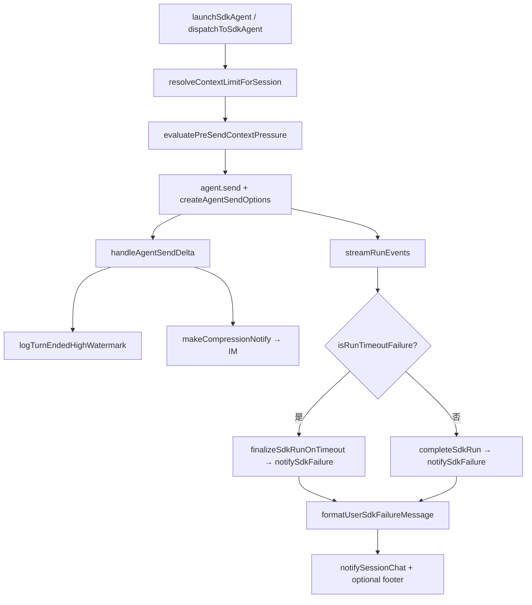

# Agent Run 自动压缩 - 代码评审报告

## 1、审查范围

- **变更类型**: apply 产出的未提交变更
- **评审等级**: focused-review（electron 局部功能增强；pre-send 可观测 + SDK 失败归因）
- **涉及文件**: 7 个（代码 5 + 变更文档 2 已在 manifest；本次新增 `04-review.md`）
- **设计文档**: `02-design.md`（对照基准）
- **代码文件**:
  - 新增: `electron/sdk-failure-messages.ts`、`electron/context-usage-pressure.ts`
  - 修改: `electron/agent-sdk.ts`、`electron/context-usage.ts`、`electron/AGENTS.md`
  - 变更文档: `02-design.md`、`03-tasks.md`、`00-manifest.json`

## 2、严重（必须处理）

无

## 3、警告（建议处理）

1. **上下文模式表可能过宽误匹配**
   - 位置: `electron/sdk-failure-messages.ts:27-41`
   - 说明: `CONTEXT_MESSAGE_PATTERNS` 含 `/token/i`、`/limit/i` 等宽泛规则，OAuth/配额类错误可能被归为「上下文已满」。当前为保守产品文案，影响有限；若线上误报增多可收窄为 context/window/上下文 等组合匹配。
   - 评分: 50

2. **F3.2 保活判定逻辑双处维护**
   - 位置: `electron/sdk-failure-messages.ts:72-82` 与 `electron/finalize-sdk-run.ts:65-71`
   - 说明: `isKeepaliveTimeout` / `KEEPALIVE_TIMEOUT_MS` 与 `isRunTimeoutFailure` 内 F3.2 分支语义一致但重复；后续改阈值须同步两处。可接受为「分类器不 import finalizer」的折中，归档后可抽共享常量。
   - 评分: 50

3. **Ponytail 精简轴（Agent #3）**
   - `shrink:` `context-usage-pressure.ts` 54 行 — 合并回 `context-usage.ts` 会超 300 行约束，拆分合理。
   - `yagni:` 失败分类为纯函数 + 常量表，无多余框架。
   - `native:` pre-send 仅日志、不阻断 send，符合 design 最小方案。
   - **结论**: Lean already. Ship.

## 4、设计偏差

1. **T2 落点文件拆分**
   - 设计预期: `02-design.md` §二 Ponytail 写「pre-send / high-watermark 合并进已有 `context-usage.ts`」；T2 任务范围仅列 `context-usage.ts`。
   - 实际实现: 压力评估核心抽到 `context-usage-pressure.ts`，`context-usage.ts` 做薄封装 re-export；manifest.tasks T2 已登记两文件。
   - 影响: 无行为差异；满足单文件 ≤300 行。属 apply 阶段合理拆分，非范围蔓延。

2. **F1「主动压缩」边界（预期内）**
   - 设计预期: 无法新增 SDK `autoCompress`；pre-send 为只读可观测 + harness 默认压缩。
   - 实际实现: 与 design §二 方案要点一致；**不**在 send 前主动触发压缩 API。
   - 影响: 符合 02 与 01 非目标；PRD F1 依赖产品侧 harness，本变更补齐可观测与失败可读性。

无其它实质性偏差。

## 5、验收标准检查

| 任务 | 验收条件 | 状态 |
|------|---------|------|
| T1 | peak≥95% + 不安全 message → 含「上下文」建议 | ✅ 代码路径 `isContextExhaustedByUsage` + `matchesContextExhaustion` |
| T1 | 不可读 message → 非唯一通用句 | ✅ 兜底为「建议精简输入…」 |
| T1 | 文案无 stack/路径 | ✅ `isUnsafeSdkMessage` 过滤 |
| T1 | `isTimeoutFailure: true` → 超时文案、非上下文类 | ✅ 优先分支 + `formatTimeoutFailureMessage` |
| T1 | 新文件 ≤300 行、中文注释 | ✅ 134 行 |
| T2 | pre-send / high-watermark `[compression]` 日志 | ✅ `evaluatePreSendContextPressureCore` + `logTurnEndedHighWatermark` |
| T2 | limit 缺失 no-op | ✅ `readRatio` 返回 null 不抛错 |
| T2 | `summary-completed` 仍 `resetContextUsagePeak` | ✅ 未改 summary-completed 分支 |
| T2 | `context-usage.ts` ≤300 行 | ✅ 278 行 |
| T3 | launch/dispatch 两处 send 前挂接 | ✅ L977、L1024 |
| T3 | pre-send 不阻断 send | ✅ 仅 `log` 副作用 |
| T4 | `formatSdkStreamFailure` 委托分类器 | ✅ |
| T4 | `notifySdkFailure` 传入 peak/limit/errorCode/run.result | ✅ L236-247 |
| T4 | 压缩 IM 每 Run ≤1 | ✅ `makeCompressionNotify` + `compressionNotified` |
| T4 | 超时仍走 finalizer、非超时走分类器 | ✅ `isRunTimeoutFailure` 先于分类；finalizer 未改 |
| T5 | AGENTS 含失败类别、pre-send、finalizer 边界 | ✅ |
| T5 | `npm run build` 通过 | ✅ 评审时构建成功 |
| 01 验收 1-4 | 连续三轮 E2E / IM 压缩感知 | ⚠️ 代码挂接完整；端到端待 `/kb-test` 或手工飞书验证 |
| 01 验收 7-8 | footer/超时/通道防护无回归 | ✅ 未改 footer/finalizer 实现；notify 闩与 unsafe 规则保留 |

## 6、调用链与回归风险

| 回归点 | 风险 | 缓解 |
|--------|------|------|
| 失败文案变更 | 中 | 分类优先级与 CANCELLED/EXPIRED 分支保留；超时先 `isRunTimeoutFailure` |
| pre-send 日志噪声 | 低 | 仅 ratio≥85% 时 INFO 一条 |
| footer 追加 | 低 | `notifySdkFailure` 仍经 `appendContextFooter`，路径未改 |
| 长驻第三轮上下文 | 中 | peak 跨 Run 保留 + pre-send 可观测；压缩仍依赖 harness |
| `agent-sdk.ts` 体量 | 低 | 本变更净减逻辑（迁出分类器）；文件仍 1280 行属历史债务 |

CodeGraph: 新符号 `formatUserSdkFailureMessage`、`evaluatePreSendContextPressure` 索引滞后（apply 未提交）；人工 diff + 调用点 grep 确认挂接完整。

## 7、遗留债务

- `agent-sdk.ts` 1280 行，超项目 300 行约束 — **变更前已存在**，本变更通过 helper 拆分有所缓解，完整拆分不在本次范围。
- 01 验收 1-4 端到端（连续三轮 IM、压缩 notify）需 `/kb-test` 或手工验证，评审未执行飞书联调。

## 8、修复任务建议

| 问题 ID | 建议动作 | 关联任务 |
|---------|----------|----------|
| — | 无 open ≥75 问题 | — |

可选改进（不阻断 archive）：
- 归档后若误匹配增多，收窄 `CONTEXT_MESSAGE_PATTERNS`（R2-optional）。
- 将 `KEEPALIVE_TIMEOUT_MS` 抽至 `electron/sdk-constants.ts` 供 finalizer 与分类器共用（R2-optional）。

## 9、结论

**通过**，可进入 `/kb-archive`。

- 无评分 ≥75 的阻断问题。
- T1–T5 代码与 `02-design.md` / `03-tasks.md` 一致；构建通过；文件行数与中文注释符合 AGENTS。
- 端到端 IM 场景建议 archive 前或后补一次 `/kb-test` 抽样（01 验收 1-4）。
