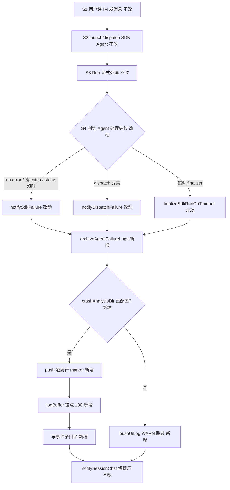
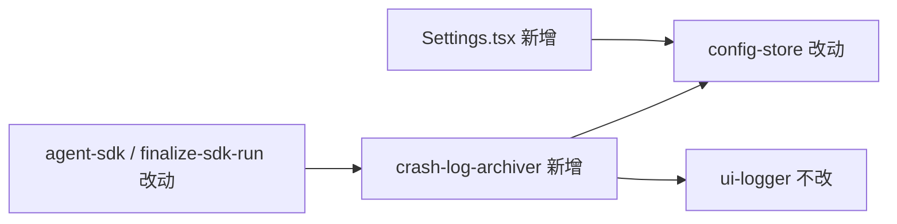

# Agent失败日志崩溃分析归档 - 实现设计

> **业务 PRD**：见同目录 `01-proposal.md`（验收标准以 01 为准）

## 一、业务流程与改动范围

> 业务口径以 01 F1～F5 与验收 1～8 为准；本变更为 Electron 主进程增量能力，不改变 IM 短提示策略。

### （一）业务流程图



**图例**：`不改` 现网行为；`改动` 挂接归档调用；`新增` 新模块/配置/UI。

### （二）流程步骤与改动对照

| 步骤 ID | 业务含义 | 改动 | 落点（模块/文件） | 01 验收关联 |
|---------|----------|------|-------------------|-------------|
| S1 | IM 消息入队、Daemon claim | 不改 | `src/daemon.ts` | — |
| S2 | `launchSdkAgent` / `dispatchToSdkAgent` | 不改 | `electron/agent-sdk.ts` | 验收 1 前置 |
| S3 | `streamRunEvents` / `handleSdkEvent` / `completeSdkRun` | 不改（仅下游挂接） | `electron/agent-sdk.ts` | 验收 1 |
| S4a | Run `status=error` → `agent_failed` + `notifySdkFailure` | 改动 | `completeSdkRun` → `notifySdkFailure` | 验收 1、8；F1 |
| S4b | 流式 catch → `notifySdkFailure` | 改动 | `streamRunEvents` catch | 验收 1；F1 |
| S4c | 超时类 → `finalizeSdkRunOnTimeout` → `notifySdkFailure` | 改动 | `electron/finalize-sdk-run.ts` | 验收 1；F1 |
| S4d | dispatch 异常 → `dispatch_failed` + `notifyDispatchFailure` | 改动 | `dispatchToSdkAgent` catch | 验收 1；F1 |
| S5 | 统一归档入口 `archiveAgentFailureLogs` | 新增 | `electron/crash-log-archiver.ts` | F1、F3、F4；验收 1～4、8 |
| S6 | 触发行 marker + buffer ±30 截取 | 新增 | `crash-log-archiver.ts` + `ui-logger.getLogBuffer` | F4；验收 3、4 |
| S7 | 写 `{crashAnalysisDir}/{ts}/electron-log.txt` + `meta.json` | 新增 | `crash-log-archiver.ts` | F3；验收 2 |
| S8 | 未配置目录：WARN 跳过，不阻断 notify | 新增 | `crash-log-archiver.ts` | F5；验收 6 |
| S9 | Settings 配置 `crashAnalysisDir` | 新增 | `config-store.ts`、`Settings.tsx` | F2；验收 5 |
| S10 | IM 仍仅短提示，无长日志 | 不改 | `notifySessionChat` | 验收 7 |

### （三）改动汇总

- **新增**：`electron/crash-log-archiver.ts`；`AppConfig.crashAnalysisDir`；Settings general 目录选择项。
- **改动**：`notifySdkFailure`、`notifyDispatchFailure` 内调用 `archiveAgentFailureLogs`；`finalizeSdkRunOnTimeout` 在调用 `notifySdkFailure` **之前**调用归档（finalizer 路径上 `agent_failed` 详情行可能尚未写入，触发行 marker 仍可作为锚点）；`SdkSessionAgent` 可选增 `failureArchiveDone?: boolean` 幂等闩。
- **不改**：`daemon.log` 写入、`pushLog`/`logBuffer` 既有逻辑、飞书 notify 文案、Daemon 编排、CLI 失败路径（见九·开放问题）。

## 二、整体思路

**根因**（01 与代码核实）：失败时已有 `notifySdkFailure` / `notifyDispatchFailure` / `finalizeSdkRunOnTimeout` 与 UI 日志（`agent_failed`、`dispatch_failed`），但 **未** 将失败时刻上下文导出到用户可访问目录；`logBuffer` 上限 300 行，排查需手工翻应用内日志或 `daemon.log`。

**方案要点**：

1. **单一入口** `archiveAgentFailureLogs(ctx)`：读配置、幂等、写盘；失败检测路径仅调用此函数，不分散写文件逻辑。
2. **锚点**：归档前 `pushUiLog("Electron", "WARN", "[crash-archive-trigger] ...")`，再从 `getLogBuffer()` 定位 **最后一条** 含 `[crash-archive-trigger]` 的行，取该行及前最多 30、后最多 30 条（不足则取现有全部）。
3. **事件目录**：`{crashAnalysisDir}/{yyyymmddhhmmss}/`（上海时区 14 位）；同秒冲突追加 `-001`、`-002`…
4. **产物**：`electron-log.txt`（UTF-8，行格式与 UI 日志一致）+ `meta.json`（结构化元数据）。
5. **容错**：未配置或不可写 → WARN 一次（同进程同原因可节流），**不** throw、**不** 阻断 `notifySessionChat`。
6. **与 01 追溯**：F1→S5；F2→S9；F3→S7；F4→S6；F5→S8。

## 三、分层设计

| 层 | 职责 | 落点 |
|----|------|------|
| 配置 | 持久化 `crashAnalysisDir` | `electron/config-store.ts` |
| 设置 UI | 目录选择与 autoSave | `src/renderer/pages/Settings.tsx` general tab |
| 日志源 | 内存 ring buffer（300 行） | `electron/ui-logger.ts` `getLogBuffer` |
| 归档服务 | 截取、命名、写盘、幂等 | `electron/crash-log-archiver.ts`（≤300 行） |
| 挂接点 | 失败 notify 同语义路径 | `agent-sdk.ts`、`finalize-sdk-run.ts` |



## 四、接口设计

### （一）主进程 API（新增）

```typescript
/** 失败类型（写入 meta.json.failureType） */
type FailureArchiveType =
  | "sdk_run_error"
  | "sdk_stream_exception"
  | "sdk_timeout"
  | "sdk_cancelled"
  | "dispatch_failed"

interface FailureArchiveContext {
  sessionKey: string
  failureType: FailureArchiveType
  /** 幂等：同一 SdkSession 单次失败只归档一次 */
  session?: { failureArchiveDone?: boolean }
  agentId?: string
  runStatus?: string
  detail?: string
}

/** 同步 best-effort；内部 catch，不向外抛 */
export function archiveAgentFailureLogs(ctx: FailureArchiveContext): void
```

### （二）挂接约定

| 调用点 | 时机 | failureType |
|--------|------|-------------|
| `notifySdkFailure` | `errorNotified` 闩通过之后、`notifySessionChat` 之前 | 由调用方传入（默认 `sdk_run_error`）；CANCELLED 传 `sdk_cancelled` |
| `notifyDispatchFailure` | `pushUiLog dispatch_failed` 之后 | `dispatch_failed` |
| `finalizeSdkRunOnTimeout` | `notifySdkFailure` 之前 | `sdk_timeout` |

**幂等**：若 `ctx.session?.failureArchiveDone === true` 则直接 return；成功后置 `true`。`startSdkRun` / `resetSdkRunPresentationState` 清零。`finalizeSdkRunOnTimeout` 与 `notifySdkFailure` 同次失败只归档一次（finalizer 先 archive 并置闩，notify 内跳过）。

`streamRunEvents` catch 经 `notifySdkFailure` 间接归档，`failureType=sdk_stream_exception`（notify 入参扩展 optional type）。

### （三）Renderer / IPC

- **无新 IPC**：复用 `selectDirectory()`、`getConfig` / `saveConfig`。
- `preload.ts` / `env.d.ts` 的 `AppConfig` 类型同步增 `crashAnalysisDir: string`（与 `workspaceDir` 同模式）。

## 五、数据结构

### （一）AppConfig 扩展

| 字段 | 类型 | 默认 | 说明 |
|------|------|------|------|
| `crashAnalysisDir` | `string` | `""` | 崩溃分析根目录；**空字符串表示未配置**；仅存绝对路径（目录选择器产出） |

### （二）事件目录布局

```
{crashAnalysisDir}/
  {yyyymmddhhmmss}/          # 冲突时 {yyyymmddhhmmss}-001
    electron-log.txt         # buffer 片段（锚点 ±30）
    meta.json                # 元数据
```

### （三）meta.json  schema

```json
{
  "sessionKey": "feishu:xxx",
  "failureType": "sdk_run_error",
  "archivedAt": "2026-06-28T17:00:00+08:00",
  "directoryName": "20260628170000",
  "anchorMarker": "[crash-archive-trigger]",
  "buffer": {
    "totalInSnapshot": 120,
    "anchorIndex": 95,
    "linesBefore": 30,
    "linesAfter": 24,
    "truncatedBefore": false,
    "truncatedAfter": true
  },
  "agentId": "optional",
  "runStatus": "error",
  "detail": "optional short reason"
}
```

### （四）触发行格式

```
{uiTimestamp()} [Electron] WARN [crash-archive-trigger] failureType=sdk_run_error sessionKey=...
```

## 六、实现步骤

1. **T1 配置**：`AppConfig` + `defaults` + preload/env 类型增 `crashAnalysisDir`。
2. **T2 归档模块**：实现 `crash-log-archiver.ts`（上海时区目录名、`-001` 冲突、`getLogBuffer` 截取、写 `electron-log.txt`/`meta.json`、未配置 WARN）。
3. **T3 挂接**：`notifySdkFailure` / `notifyDispatchFailure` / `finalizeSdkRunOnTimeout` 调用 `archiveAgentFailureLogs`；`SdkSessionAgent.failureArchiveDone` + run 重置清零。
4. **T4 Settings UI**：general tab 增「崩溃分析目录」块（文案简体中文），复用 `selectDirectory` + autoSave。
5. **T5 验证**：覆盖 01 验收 1～8（至少 Run error + dispatch 两类场景）。

## 七、参考实现

| 符号 | 路径 | 用途 |
|------|------|------|
| `notifySdkFailure` | `electron/agent-sdk.ts` L215 | SDK 失败 IM 通知；`errorNotified` 幂等 |
| `notifyDispatchFailure` | `electron/agent-sdk.ts` L233 | dispatch 失败 |
| `completeSdkRun` | `electron/agent-sdk.ts` L661 | `agent_failed` 详情日志 |
| `streamRunEvents` | `electron/agent-sdk.ts` L624 | 流 catch → notify |
| `finalizeSdkRunOnTimeout` | `electron/finalize-sdk-run.ts` L88 | 超时收尾 → notify |
| `getLogBuffer` / `LOG_BUFFER_MAX=300` | `electron/ui-logger.ts` L6–82 | buffer 源 |
| `workspaceDir` + `selectDirectory` | `Settings.tsx` L427、L642 | UI 选目录模式 |
| `AppConfig` | `electron/config-store.ts` L22 | 配置模型 |

## 八、技术影响

### （一）影响范围

| 模块 | 影响 |
|------|------|
| `electron/crash-log-archiver.ts` | 新增 |
| `electron/agent-sdk.ts` | 挂接 + 可选 session 字段 |
| `electron/finalize-sdk-run.ts` | 挂接 |
| `electron/config-store.ts` | 配置字段 |
| `src/renderer/pages/Settings.tsx` | UI |
| `electron/preload.ts`、`src/renderer/env.d.ts` | 类型 |
| `electron/ui-logger.ts` | **不改**（直接 `import { getLogBuffer, pushUiLog }`） |

### （二）工程补充验收项

1. 同一次失败经 finalizer → notify 只产生 **一个** 事件目录。
2. 同秒内两次独立失败目录名为 `…-001`、原 timestamp 与 `…` 不覆盖。
3. 未配置 `crashAnalysisDir` 时仅见一条 WARN（含「未配置崩溃分析目录，跳过归档」语义），IM 与现网一致。
4. `electron-log.txt` 行数 ≤ 61；边界 case（buffer < 61、锚点靠首尾）与 01 验收 4 一致。
5. 写盘失败（权限/磁盘）不导致 `notifySdkFailure` reject。

## 九、知识库影响

初评：`electron/AGENTS.md` 需补充「Agent 失败崩溃分析归档」小节（挂接点、目录结构、与 notify 边界）；工程平台 Electron 可观测文档（若存在）可引用本能力。业务域知识 **无** 直接变更。

**开放问题（本阶段定案 / defer）**：

| # | 问题 | 本阶段结论 |
|---|------|------------|
| 1 | 是否归档 `daemon.log` 片段？ | **否**。理由：buffer 已含同期 UI 级日志且与面板一致；读 `daemon.log` 需解析路径/轮转/时间对齐，复杂度高；长会话早期上下文 buffer 已轮转出仍无法靠文件尾部简单补齐。后续迭代可加 `daemon-tail.log`。 |
| 2 | 同秒命名冲突 | **`yyyymmddhhmmss-NNN`**（三位序号，从 `001` 起），检测目标根下已存在目录。 |
| 3 | CLI / 非 notify 链失败 | **本阶段不覆盖**。IM 主路径经 SDK-only（`electron/AGENTS.md`）；`dispatchToSdkAgent` 早退 `no resident agent` 仅 `pushUiLog` 无 `notifyDispatchFailure`，**不**归档。CLI spawn 已移除。 |
| 4 | 相对路径基准 | **不支持**；仅目录选择器绝对路径，与 `workspaceDir` 交互一致。 |
| 5 | 日志保留清理 | **不在范围**（01 非目标）；用户自行管理磁盘。 |
| 6 | `getLogBufferSnapshot` | **不需要**；archiver 直接 `getLogBuffer()`（已返回副本）。 |

## 十、知识库更新计划

### （一）必须更新

- `electron/AGENTS.md`：新增失败归档挂接点、`crashAnalysisDir`、产物结构、与 notify/daemon.log 边界。

### （二）可能更新（视实现结果）

- `knowledge/工程平台/` 下 Electron 可观测/设置相关子模块（若已有对应文件）。

### （三）不需要更新

- 飞书/IM 业务域文档、Daemon 编排文档、changelog（`/kb-archive` 阶段再定）。
