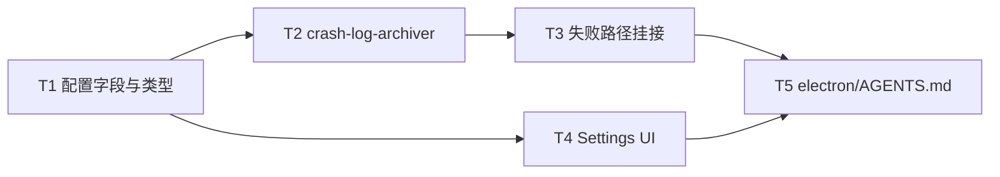

# Agent失败日志崩溃分析归档 - 任务分解

> **来源**：`/kb-plan`（基于 `01-proposal.md`、`02-design.md`）

## 一、执行计划

### （一）依赖图



```
T1 ──→ T2 ──→ T3 ──→ T5
  └──→ T4 ─────────────┘
```

**说明**：T1 为配置 SSOT，T2/T4 可并行；T3 串行依赖 T2（须先存在 `archiveAgentFailureLogs`）；T5 文档对齐 T2–T3 实现，T4 可与 T2/T3 并行但须在 `/kb-test` 前完成。

### （二）分组调度

| 轮次 | 任务 | 说明 |
|------|------|------|
| 第一轮 | T1 | `AppConfig.crashAnalysisDir` + preload/env 类型贯通；**无新 IPC handler** |
| 第二轮（并行） | T2、T4 | T2 归档模块；T4 Settings 目录选择；二者不共文件 |
| 第三轮 | T3 | `agent-sdk.ts` / `finalize-sdk-run.ts` 挂接；**串行**修改 `agent-sdk.ts` |
| 第四轮 | T5 | 沉淀挂接点与产物约定；依赖 T2–T3 落地 |

## 二、任务清单

## T1: config-store + preload + env.d.ts — crashAnalysisDir 配置贯通

### 背景

01 F2 要求 Settings 可配置并持久化「崩溃分析目录」；02 定案字段 `crashAnalysisDir: string` 默认 `""`（空=未配置），仅存绝对路径，**不新增 IPC**，复用既有 `config:get` / `config:save`。本任务在三处 `AppConfig` 定义与 `defaults` 中增字段，使主进程读写与渲染层类型一致。

### 上下文文件

- 必读: `electron/config-store.ts` — `AppConfig`（L22）、`defaults`（L65）、`getConfig`/`saveConfig`（L114–123）
- 必读: `electron/preload.ts` — `AppConfig`（L48）、`getConfig`/`saveConfig`（L213–214）
- 必读: `src/renderer/env.d.ts` — `AppConfig`（L53）、`getConfig`/`saveConfig`（L189–190）
- 参考: `02-design.md` §四·（三）、§五·（一）— 无新 IPC、与 `workspaceDir` 同模式
- 参考: `01-proposal.md` — F2、验收 5

### 实现范围

- 修改: `electron/config-store.ts`
  - `AppConfig` 全局配置区增 `crashAnalysisDir: string`（注释：崩溃分析根目录，空=未配置）
  - `defaults` 增 `crashAnalysisDir: ""`
- 修改: `electron/preload.ts` — `AppConfig` 同步增 `crashAnalysisDir: string`
- 修改: `src/renderer/env.d.ts` — `AppConfig` 同步增 `crashAnalysisDir: string`
- **不改**: IPC handler 注册逻辑（`config:get`/`config:save` 已支持 `Partial<AppConfig>`）；不增 migration 逻辑（新字段走 defaults 即可）

### 接口契约

- `AppConfig.crashAnalysisDir: string` — 默认 `""`；非空时为目录选择器产出的**绝对路径**
- `getConfig(): AppConfig` — 返回值含 `crashAnalysisDir`
- `saveConfig(partial: Partial<AppConfig>)` — 可单独保存 `crashAnalysisDir`
- 渲染层 `window.electronAPI.getConfig()` / `saveConfig({ crashAnalysisDir })` 类型可用，无需新 preload 方法

### 验收标准

- [ ] 三处 `AppConfig`（config-store、preload、env.d.ts）均含 `crashAnalysisDir: string`，字段名一致
- [ ] `defaults.crashAnalysisDir === ""`；旧配置无该键时读 defaults 兜底
- [ ] `npm run build` 或 `tsc --noEmit` 通过，Settings 侧可引用 `config.crashAnalysisDir` 无类型错误
- [ ] **01 验收 5（配置持久化·字段段）**：`saveConfig({ crashAnalysisDir: "/tmp/crash-test" })` 后 `getConfig()` 返回同值（可 devtools/单测验证）
- [ ] **02 §八·（二）项 3 前置**：未配置时字段为空字符串，供 T2 跳过归档逻辑使用

### 依赖

- 前置任务: 无
- 后续任务: T2、T4

---

## T2: electron/crash-log-archiver.ts — archiveAgentFailureLogs 归档模块

### 背景

01 F1/F3/F4/F5 要求 Agent 处理失败时将 logBuffer 上下文导出到用户目录；02 定案单一入口 `archiveAgentFailureLogs(ctx)`：触发行 marker → `getLogBuffer()` 锚点 ±30 → 写 `{crashAnalysisDir}/{yyyymmddhhmmss[-NNN]}/electron-log.txt` + `meta.json`；未配置或写盘失败 best-effort、不 throw。本任务新建独立模块（≤300 行，含注释）。

### 上下文文件

- 必读: `electron/ui-logger.ts` — `getLogBuffer`（L80）、`pushUiLog`（L72）、`LOG_BUFFER_MAX=300`（L6）
- 必读: `electron/config-store.ts` — T1 完成后的 `getConfig().crashAnalysisDir`
- 必读: `knowledge/变更/进行中/20260628165859-Agent失败日志崩溃分析归档/01-proposal.md` — F1、F3、F4、F5；验收 1–4、6、8
- 必读: 同目录 `02-design.md` — §二 方案要点 1–5、§四·（一）API、§五·（二）（三）（四）、§九 开放问题 1–2/4/6
- 参考: `electron/agent-sdk.ts` — `uiTimestamp` 或现有日志行格式（保持与 UI 面板一致）

### 实现范围

- 新增: `electron/crash-log-archiver.ts`（≤300 行）
  - 导出 `FailureArchiveType`、`FailureArchiveContext`、`archiveAgentFailureLogs(ctx): void`
  - 幂等：若 `ctx.session?.failureArchiveDone === true` 则 return；成功后置 `true`
  - 未配置（`crashAnalysisDir.trim() === ""`）：`pushUiLog("Electron", "WARN", "未配置崩溃分析目录，跳过归档")`（同进程同原因可节流），return
  - 归档前 `pushUiLog("Electron", "WARN", "[crash-archive-trigger] failureType=... sessionKey=...")`
  - 从 `getLogBuffer()` 定位**最后一条**含 `[crash-archive-trigger]` 的行作锚点；取锚点及前最多 30、后最多 30 条（不足取全部）
  - 目录名：上海时区 `yyyymmddhhmmss`（14 位）；根下已存在则 `-001`、`-002`…（三位序号）
  - 写 `electron-log.txt`（UTF-8，行格式与 UI 日志一致）+ `meta.json`（schema 见 02 §五·（三））
  - 全程 try/catch，写盘失败 WARN 不向外抛
- **不改**: `ui-logger.ts` 既有 buffer 逻辑；**不**读 `daemon.log`（02 §九·1 定案否）

### 接口契约

```typescript
type FailureArchiveType =
  | "sdk_run_error"
  | "sdk_stream_exception"
  | "sdk_timeout"
  | "sdk_cancelled"
  | "dispatch_failed"

interface FailureArchiveContext {
  sessionKey: string
  failureType: FailureArchiveType
  session?: { failureArchiveDone?: boolean }
  agentId?: string
  runStatus?: string
  detail?: string
}

/** 同步 best-effort；内部 catch，不向外抛 */
export function archiveAgentFailureLogs(ctx: FailureArchiveContext): void
```

- 触发行格式：`{timestamp} [Electron] WARN [crash-archive-trigger] failureType=... sessionKey=...`
- 事件目录：`{crashAnalysisDir}/{directoryName}/electron-log.txt` + `meta.json`
- `meta.json.buffer` 含 `totalInSnapshot`、`anchorIndex`、`linesBefore`、`linesAfter`、`truncatedBefore`、`truncatedAfter`

### 验收标准

- [ ] **01 验收 2**：配置有效目录后，调用归档能在根下创建 `yyyymmddhhmmss` 子目录，含 `electron-log.txt` 与 `meta.json`
- [ ] **01 验收 3**：buffer ≥61 且锚点居中时，`electron-log.txt` 行数 ≤61（锚点 + 前最多 30 + 后最多 30）
- [ ] **01 验收 4**：buffer <61 或锚点靠首尾时，导出全部可用相邻行，无空文件、无 throw
- [ ] **01 验收 6**：`crashAnalysisDir` 为空时仅 WARN 跳过，不创建目录
- [ ] **01 验收 8·同秒冲突**：同秒内两次独立归档目录名为 `…-001` 等，不覆盖
- [ ] **02 §八·（二）项 2**：同秒 `-001` 命名行为符合设计
- [ ] **02 §八·（二）项 3**：未配置时 WARN 含「未配置崩溃分析目录，跳过归档」语义
- [ ] **02 §八·（二）项 4**：`electron-log.txt` 行数边界与 meta 中 truncated 标志一致
- [ ] **02 §八·（二）项 5**：模拟写盘失败（只读目录）不 throw，主流程可继续
- [ ] 文件 ≤300 行；关键分支有中文注释

### 依赖

- 前置任务: T1
- 后续任务: T3

---

## T3: agent-sdk.ts + finalize-sdk-run.ts — 归档挂接与 failureArchiveDone 幂等

### 背景

02 §四·（二）要求在 `notifySdkFailure`、`notifyDispatchFailure`、`finalizeSdkRunOnTimeout` 三处挂接 `archiveAgentFailureLogs`；finalizer 须在 `notifySdkFailure` **之前** archive 并置闩，避免同次失败重复目录。`SdkSessionAgent` 增 `failureArchiveDone`，在 `startSdkRun` / `resetSdkRunPresentationState` 清零。对应 01 F1、验收 1、7、8。

### 上下文文件

- 必读: `electron/agent-sdk.ts` — `SdkSessionAgent`（L35+）、`errorNotified`（L60）、`resetSdkRunPresentationState`（L118）、`notifySdkFailure`（L215）、`notifyDispatchFailure`（L233）、`completeSdkRun`、`streamRunEvents` catch、`dispatchToSdkAgent` catch
- 必读: `electron/finalize-sdk-run.ts` — `finalizeSdkRunOnTimeout`（L88）、L131 `notifySdkFailure` 调用点
- 必读: T2 产出 `electron/crash-log-archiver.ts`
- 必读: `01-proposal.md` — F1、验收 1、7、8
- 必读: 同目录 `02-design.md` — §一·（二）S4a–S4d/S5、§四·（二）挂接约定、§六 步骤 3
- 参考: `electron/AGENTS.md` — SDK 错误 notify 段落（挂接后须 T5 同步）

### 实现范围

- 修改: `electron/agent-sdk.ts`
  - `SdkSessionAgent` 增 `failureArchiveDone?: boolean`
  - `resetSdkRunPresentationState` / `startSdkRun` 入口将 `failureArchiveDone = false`
  - `notifySdkFailure`：在 `errorNotified` 闩通过之后、`notifySessionChat` 之前调用 `archiveAgentFailureLogs`；扩展 optional 入参或上下文传递 `failureType`（默认 `sdk_run_error`；CANCELLED → `sdk_cancelled`）
  - `streamRunEvents` catch → `notifySdkFailure` 路径传 `failureType=sdk_stream_exception`
  - `completeSdkRun` error 路径经 `notifySdkFailure` 间接归档（`sdk_run_error`）
  - `notifyDispatchFailure`：在 `pushUiLog dispatch_failed` 之后、`notifySessionChat` 之前调用 `archiveAgentFailureLogs`（`dispatch_failed`）；dispatch 无 session 对象时 `session` 字段可省略，幂等仅依赖单次 notify 语义
  - **不**归档：`dispatchToSdkAgent` 早退 `no resident agent`（仅 pushUiLog，无 notifyDispatchFailure）
- 修改: `electron/finalize-sdk-run.ts`
  - 在 L131 `await ctx.notifySdkFailure` **之前**调用 `archiveAgentFailureLogs`（`failureType=sdk_timeout`）；notify 内见闩跳过重复归档
- **不改**: `notifySessionChat` 文案与 `stop_progress` 语义；`ui-logger.ts`；CLI 路径（02 §九·3 不覆盖）

### 接口契约

| 调用点 | 时机 | failureType |
|--------|------|-------------|
| `notifySdkFailure` | `errorNotified=true` 后、IM notify 前 | 调用方传入，默认 `sdk_run_error` |
| `streamRunEvents` catch | 经 notify，传 `sdk_stream_exception` | |
| `notifyDispatchFailure` | `dispatch_failed` 日志后、IM notify 前 | `dispatch_failed` |
| `finalizeSdkRunOnTimeout` | `notifySdkFailure` 前 | `sdk_timeout` |

- 幂等：`ctx.session?.failureArchiveDone === true` → archiver return；成功 archive 后置 `true`
- finalizer + notify 同次失败：**一个**事件目录（02 §八·（二）项 1）

### 验收标准

- [ ] **01 验收 1**：Run error 与 dispatch 失败两类场景，配置目录后均产生新时间戳子目录
- [ ] **01 验收 7**：IM 仍仅短提示，无完整 stack/长日志追加
- [ ] **01 验收 8**：单次失败不重复建目录；连续独立失败各有目录
- [ ] **02 §八·（二）项 1**：finalizer → notify 同次失败只产生**一个**事件目录
- [ ] **02 §八·（二）项 5**：写盘失败不导致 `notifySdkFailure` reject / 阻断 IM
- [ ] `failureArchiveDone` 在新 Run（`startSdkRun`）后清零，下一失败可再次归档
- [ ] `no resident agent` 早退路径**不**触发归档
- [ ] 无 02/03 未要求的新抽象层或未批准依赖

### 依赖

- 前置任务: T2
- 后续任务: T5

---

## T4: Settings.tsx general tab — 崩溃分析目录 UI

### 背景

01 F2 与故事 C/D 要求 Settings 提供「崩溃分析目录」配置，简体中文文案，重启后仍生效。02 定案复用 `selectDirectory()` + autoSave，与 `workspaceDir` 交互一致，存绝对路径。本任务仅改 Settings general tab，不新增 IPC。

### 上下文文件

- 必读: `src/renderer/pages/Settings.tsx` — general tab（L640+）、`workspaceDir` 状态与 `selectDir`（L427、L642–647）、autoSave effect（L302 附近）
- 必读: T1 完成后的 `AppConfig.crashAnalysisDir`
- 必读: `01-proposal.md` — F2、故事 D、验收 5
- 必读: 同目录 `02-design.md` — §一 S9、§三 Settings 层、§四·（三）

### 实现范围

- 修改: `src/renderer/pages/Settings.tsx`
  - 增 state `crashAnalysisDir`（或等价命名）
  - `getConfig` 加载 / autoSave 写入 `crashAnalysisDir`
  - general tab「主工作目录」块下方（或同 section）增「崩溃分析目录」：
    - label + 点击选目录 UI（复用 `selectDirectory` 模式，与 workspaceDir 同款样式）
    - 说明文案：Agent 处理失败时将相关日志片段导出到此目录；留空则跳过归档
  - 可选：清空路径方式（选空目录不现实时，可提供「清除」或允许手动删文本——以实现最简单为准，须能置 `""`）
- **不改**: 其它 tab；不新增 preload API

### 接口契约

- UI 绑定 `config.crashAnalysisDir: string`
- 选目录：`window.electronAPI.selectDirectory()` → 非空则 `setCrashAnalysisDir(d)` → autoSave `{ crashAnalysisDir: d.trim() }`
- 空字符串表示未配置，与 T2 跳过语义一致

### 验收标准

- [ ] **01 验收 5**：Settings 可选择目录并保存；重启应用后配置仍有效；新失败写入所配路径（依赖 T2/T3 联调）
- [ ] general tab 可见简体中文「崩溃分析目录」及说明
- [ ] 交互与「主工作目录」一致（FolderOpen + 点击选择）
- [ ] 未选择时显示占位（如「点击选择...」或「未配置（跳过归档）」）
- [ ] autoSave 不破坏既有 `workspaceDir` 等字段保存逻辑
- [ ] `npm run build` 通过

### 依赖

- 前置任务: T1
- 后续任务: T5（文档可引用 Settings 位置）

---

## T5: electron/AGENTS.md — 失败归档约定沉淀

### 背景

02 §十·（一）要求 `electron/AGENTS.md` 必须更新：挂接点、`crashAnalysisDir`、产物结构、与 notify/daemon.log 边界。T2–T3 实现后沉淀约定，供后续变更与 CodeGraph 检索；若实现中有踩坑（幂等闩、finalizer 顺序、触发行锚点），写入文档避免回归。

### 上下文文件

- 必读: T2 产出 `electron/crash-log-archiver.ts`
- 必读: T3 完成后的 `electron/agent-sdk.ts`、`electron/finalize-sdk-run.ts`
- 必读: `electron/AGENTS.md` — 现有「SDK 错误 notify」等段落
- 必读: 同目录 `02-design.md` — §九、§十
- 参考: T4 `Settings.tsx` general 项位置（一句带过即可）

### 实现范围

- 修改: `electron/AGENTS.md`
  - 新增小节（建议标题「Agent 失败崩溃分析归档」或并入「SDK 错误 notify」子节）：
    - 触发语义：与 `notifySdkFailure` / `notifyDispatchFailure` / `finalizeSdkRunOnTimeout` 同路径
    - 配置：`crashAnalysisDir`（Settings general，空=跳过）
    - 入口：`archiveAgentFailureLogs`；`failureArchiveDone` 幂等；finalizer 先于 notify
    - 产物：`{crashAnalysisDir}/{ts}/electron-log.txt` + `meta.json`；同秒 `-NNN`
    - 边界：**不**改 IM 文案；**不**读/复制 `daemon.log`；**不**覆盖 CLI / `no resident agent` 早退
  - 若 T2–T3 有踩坑经验（如 anchor 定位、WARN 节流），简短记入
- **不改**: `knowledge/业务域/**`（archive 阶段 kb-librarian）

### 接口契约

- 无新增代码接口；文档与 T2–T3 行为一致

### 验收标准

- [ ] `electron/AGENTS.md` 含 `archiveAgentFailureLogs`、`crashAnalysisDir`、`failureArchiveDone` 可检索说明
- [ ] 文档明确 finalizer **先于** notify 归档及单次失败单目录
- [ ] 文档明确未配置/写盘失败不阻断 notify
- [ ] 文档与 T3 实际挂接点**无矛盾**
- [ ] 文档写明**不**归档 `daemon.log`（与 02 §九·1 一致）
- [ ] 实现完成后运行 `/kb-test` 覆盖 01 验收 1–8 与 02 §八·（二）

### 依赖

- 前置任务: T2、T3、T4
- 后续任务: 无（`/kb-test` → `/kb-archive`）
