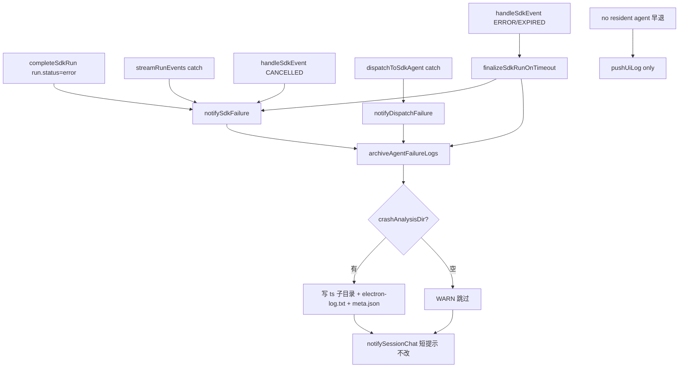

# Agent失败日志崩溃分析归档 - 代码评审报告

## 1、审查范围

- **变更类型**：apply 产出的未提交变更（T1–T4 done，T5 pending；stage=applied）
- **评审等级**：focused-review（单端 Electron 增量能力，无 proto/DB/跨端/权限路径）
- **涉及文件**：`electron/crash-log-archiver.ts`（新建 175 行，当前未 git track）、`electron/agent-sdk.ts`、`electron/finalize-sdk-run.ts`、`electron/config-store.ts`、`electron/preload.ts`、`src/renderer/env.d.ts`、`src/renderer/pages/Settings.tsx`；KB `01-proposal.md` / `02-design.md` / `03-tasks.md`
- **排除范围**：`electron/AGENTS.md`（T5 待办，本评审对照 02 §十 检查缺口）；`daemon.log` 归档（02 §九·1 定案否）
- **设计文档**：`02-design.md`（对照基准）
- **任务文档**：`03-tasks.md`（T1–T5 验收清单）
- **评审方式**：限定 `git diff` + 全量阅读 `crash-log-archiver.ts` + 挂接点定点复核（`notifySdkFailure`、`notifyDispatchFailure`、`finalizeSdkRunOnTimeout`、`failureArchiveDone`）

## 2、严重（必须处理）

无（无评分 ≥90 阻断项）

## 3、警告（建议处理）

1. **W1：T5 `electron/AGENTS.md` 未更新**（评分 **78**）
   - 位置：`03-tasks.md` T5（status=pending）；`02-design.md` §十·（一）
   - 说明：02 要求沉淀 `archiveAgentFailureLogs`、`crashAnalysisDir`、`failureArchiveDone`、finalizer 先于 notify、产物结构及 notify/daemon.log 边界。当前 `electron/AGENTS.md` 无失败归档小节，与 03 T5 验收及 `/kb-test` 前完成要求不符。
   - 建议：完成 T5 后再跑 `/kb-test`；archive 前 manifest T5 须为 done。

2. **W2：写盘失败后可能产生重复事件目录**（评分 **76**）
   - 位置：`electron/crash-log-archiver.ts` L169–174
   - 说明：`failureArchiveDone` 仅在 try 块成功末尾置 `true`；若 `mkdirSync` 成功而 `writeFileSync` 失败进入 catch，闩未置位，同次失败链路上 `finalizeSdkRunOnTimeout` → `notifySdkFailure` 二次调用可能以新时间戳再建目录（02 §八·（二）项 1 同次单目录在写盘失败时可能被打破）。
   - 建议：`T-FIX-01` 在 catch 前或部分成功时仍置闩，或同 session 短窗内复用已建 `eventDir`；或 `/kb-test` 只读目录场景记 **accepted_debt**（低概率）。

3. **W3：`agent-sdk.ts` / `Settings.tsx` 行数超项目约定**（评分 **55**，存量债务）
   - 位置：`electron/agent-sdk.ts`（1271 行）、`src/renderer/pages/Settings.tsx`（1396 行）；AGENTS 约定 ≤300 行/文件
   - 说明：本变更分别 +31 / +21 行；新增逻辑已提取至 `crash-log-archiver.ts`（175 行），主文件债务非本变更引入。
   - 建议：后续 lite 继续拆分，不阻断本变更。

**Ponytail 精简轴**：单一入口 `archiveAgentFailureLogs`、无新 IPC、复用 `selectDirectory`/`getLogBuffer`；WARN 节流与 `-001` 冲突处理为必要最小。**Lean already. Ship.**

## 4、设计偏差

| 项 | 设计 | 实现 | 判定 |
|----|------|------|------|
| 单一归档入口 | 02 §二·1 | `crash-log-archiver.ts` `archiveAgentFailureLogs` | **一致** |
| 挂接 notifySdkFailure / notifyDispatchFailure | 02 §四·（二） | `agent-sdk.ts` L230–236、L254–258 | **一致** |
| finalizer 先于 notify | 02 §四·（二） | `finalize-sdk-run.ts` L133–139 在 `notifySdkFailure` 前 | **一致** |
| failureArchiveDone 幂等 | 02 §四·（二） | archiver L112–113、L169；reset/startSdkRun 清零 | **一致**（写盘失败见 W2） |
| 未配置跳过、不 throw | 02 §五·（一）、§八·（二）项 3 | L114–122 节流 WARN + return | **一致** |
| ±30 截取 | 02 §五·（二） | `CONTEXT_LINES=30`，`extractSnapshot` | **一致** |
| 目录名上海 14 位 + `-NNN` | 02 §五·（二） | `shanghaiDirTimestamp` + `resolveUniqueDirName` | **一致** |
| 产物 electron-log.txt + meta.json | 02 §五·（二）（三） | L138–167 | **轻微偏差** — `meta.buffer.totalInSnapshot` 为导出片段行数，非全 buffer 总长（示例 schema 易歧义，不影响功能） |
| dispatch 早退 no resident agent 不归档 | 02 §九·3 | `dispatchToSdkAgent` L1000–1003 仅 pushUiLog | **一致** |
| stream catch failureType | 02 §四·（二） | `sdk_stream_exception` 显式传入 | **一致** |
| CANCELLED failureType | 02 §四·（二） | handleSdkEvent + notify 双路径传 `sdk_cancelled` | **一致** |
| Settings UI | 02 §六·4 | general tab + 清除按钮 + autoSave | **一致** |
| 三处 AppConfig 类型 | 03 T1 | config-store / preload / env.d.ts | **一致** |
| AGENTS 文档 | 02 §十·（一） | 未实现 | **偏差** — W1 / T5 pending |
| daemon.log 不归档 | 02 §九·1 | 未读 daemon.log | **一致** |

无阻断性方案偏离。

## 5、验收标准检查

### T1（config-store + preload + env.d.ts）

| 验收项 | 状态 | 说明 |
|--------|------|------|
| 三处 AppConfig 含 `crashAnalysisDir` | ✅ | 字段名与注释一致 |
| defaults 空字符串 | ✅ | `crashAnalysisDir: ""` |
| 类型/build | ✅ | diff 静态通过；未跑 tsc |
| 01 验收 5（字段持久化） | ⏳ | 静态；待 `/kb-test` |

### T2（crash-log-archiver.ts）

| 验收项 | 状态 | 说明 |
|--------|------|------|
| 单一入口 API | ✅ | 175 行，≤300，有关键中文注释 |
| 幂等闩 | ✅ | `failureArchiveDone` 检查/置位 |
| 未配置 WARN 节流 | ✅ | 60s 间隔 + 指定文案 |
| 锚点 ±30 | ✅ | `extractSnapshot` |
| 同秒 `-001` | ✅ | `resolveUniqueDirName` |
| 写盘失败不 throw | ✅ | 外层 try/catch + WARN |
| 01 验收 2–4、6、8 | ⏳ | 静态对齐；待 `/kb-test` |

### T3（挂接 + 幂等）

| 验收项 | 状态 | 说明 |
|--------|------|------|
| notifySdkFailure 内 archive | ✅ | errorNotified 后、IM 前 |
| notifyDispatchFailure 内 archive | ✅ | dispatch_failed 日志后 |
| finalize 先于 notify | ✅ | `sdk_timeout` |
| stream catch → sdk_stream_exception | ✅ | L680 |
| completeSdkRun error → notify 间接归档 | ✅ | L721–722 |
| no resident agent 不归档 | ✅ | 无 notifyDispatchFailure |
| finalizer+notify 单目录 | ✅ | 静态闩逻辑；写盘失败见 W2 |
| failureArchiveDone 新 Run 清零 | ✅ | reset + startSdkRun |
| 01 验收 1、7、8 | ⏳ | 待 `/kb-test` |

### T4（Settings UI）

| 验收项 | 状态 | 说明 |
|--------|------|------|
| 简体中文文案 + selectDirectory | ✅ | general tab |
| 清除置空 | ✅ | 「清除」按钮 |
| autoSave 含 crashAnalysisDir | ✅ | effect 依赖已增 |
| 01 验收 5 | ⏳ | 待联调 |

### T5（electron/AGENTS.md）

| 验收项 | 状态 | 说明 |
|--------|------|------|
| 失败归档约定文档 | ❌ | manifest T5 pending |

### `01-proposal.md` 验收标准

| # | 条件 | 状态 |
|---|------|------|
| 1 | 两类失败场景产生时间戳子目录、不重复 | ⏳ 挂接静态 ✅；待 `/kb-test` |
| 2 | 目录结构 electron-log.txt + 可读 | ⏳ 待测 |
| 3 | ±30 边界 | ✅ 静态 |
| 4 | buffer 不足全量、无崩溃 | ✅ 静态（极空 buffer 见 §7） |
| 5 | Settings 持久化 | ⏳ 待测 |
| 6 | 未配置不阻断 notify | ✅ 静态 |
| 7 | IM 无回归 | ✅ archive 在 notifySessionChat 前且不增 IM 消息 |
| 8 | 并发/幂等 | ✅ 静态；W2 写盘失败边缘 |

## 6、调用链与回归风险

| 回归点 | 风险 | 说明 |
|--------|------|------|
| IM 失败文案/条数 | 低 | archive 同步 best-effort，不 await 写盘、不改 notify 文案 |
| 未配置目录 | 低 | 提前 return，notify 正常 |
| 超时 finalizer + completeSdkRun | 低 | `errorNotified` + `failureArchiveDone` 双闩 |
| CANCELLED 双路径 | 低 | `errorNotified` 防重复 notify/archive |
| dispatch 无 session 幂等 | 低 | 单次 notify 语义；无 failureArchiveDone |
| 写盘失败 | 低 | 不 throw；W2 可能重复目录 |
| Settings autoSave | 低 | 仅增字段，不破坏既有字段 |
| 飞书/ Daemon | 无 | 无相关 diff |

## 7、遗留债务

1. **W1 T5 AGENTS.md**（78）— `/kb-test` 前须完成 T5。
2. **W2 写盘失败重复目录**（76）— 可选 `T-FIX-01` 或 accepted_debt。
3. **W3 agent-sdk/Settings 超 300 行**（55）— 存量技术债。
4. **极空 logBuffer** — 锚点 fallback 可能产出空 `electron-log.txt`（极低概率；01 验收 4 边缘）。
5. **01 验收 1–5 端到端** — `/kb-test` 收口。
6. **`crash-log-archiver.ts` 未 git add** — apply 产出待 commit 阶段纳入。

## 8、修复任务建议

| 问题 ID | 建议动作 | 关联任务 | 阻断 archive |
|---------|----------|----------|--------------|
| W1 | 完成 T5 更新 `electron/AGENTS.md` | T5 | 是（文档门禁） |
| W2 | 写盘失败仍置 `failureArchiveDone` 或同次复用 eventDir | T-FIX-01（可选） | 否 |
| W3 | 后续拆分 agent-sdk / Settings | backlog | 否 |
| — | **01 验收 1–8 联调** | `/kb-test` 必做 | 测试门禁 |

## 9、结论

**有条件通过**，可进入 **T5 → `/kb-test`**，测试通过后 `/kb-archive`。

T1–T4 实现与 `02-design.md`、`03-tasks.md` 高度一致：三处 notify 语义挂接完整（Run error、流 catch、dispatch catch、超时 finalizer、CANCELLED）；`failureArchiveDone` + finalizer 先于 notify 满足同次单目录幂等；未配置目录 WARN 跳过且不阻断 `notifySessionChat`；±30 截取与上海时区 `yyyymmddhhmmss[-NNN]` 命名符合设计；`crash-log-archiver.ts` 175 行含中文注释。无评分 ≥90 代码阻断项。W1（T5 文档，78）须在 archive 前关闭；W2（写盘失败重复目录，76）建议测试或可选修复，不阻断进入测试。端到端证据待 `/kb-test` 补齐。

### 重点核对摘要

| 核对项 | 结论 |
|--------|------|
| F1 主失败路径挂接 | ✅ 静态 |
| failureArchiveDone + finalizer 幂等 | ✅（写盘失败见 W2） |
| 未配置不阻断 notify | ✅ |
| ±30 与目录命名 | ✅ |
| 新文件 ≤300 行 + 中文注释 | ✅ |
| 与 02-design 一致性 | ✅（meta 字段语义轻微歧义） |
| T5 AGENTS.md | ❌ pending |
| `/kb-test` | ⏳ 待执行 |
