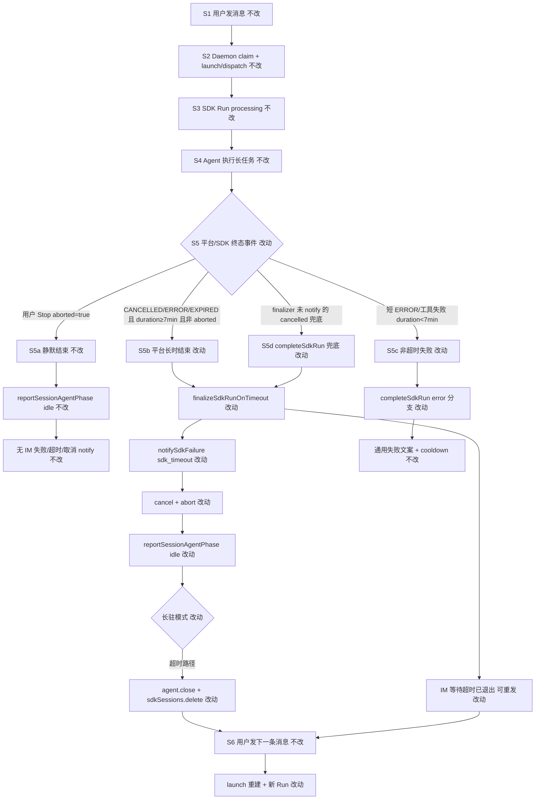
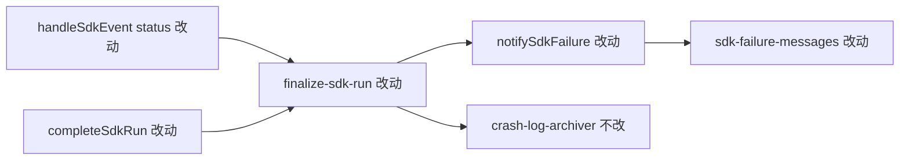

# SDK 平台取消与会话恢复 - 实现设计

> **业务 PRD**：见同目录 `01-proposal.md`（验收标准以 01 为准）

## 1、业务流程与改动范围

> 业务口径以 `01-proposal.md` 场景 A～D、功能需求 F1～F5 与验收标准为准；下图覆盖 IM 主路径：长任务 Run → 平台侧结束 vs 用户 Stop vs 短 ERROR → 收尾与下一条消息。

### 1.1 业务流程图



**图例**：`不改` 行为与现网一致；`改动` 需改代码/规则；`新增` 新常量或判定分支；`删除` 移除「任意 ERROR/EXPIRED 即超时」与「平台 CANCELLED 直出取消文案」路径。

### 1.2 流程步骤与改动对照

| 步骤 ID | 业务含义 | 改动 | 落点（模块/文件） | 01 验收关联 |
|---------|----------|------|-------------------|-------------|
| S1 | 用户经 IM 发送消息 | 不改 | `src/daemon.ts` orchestrator | — |
| S2 | claim 后 launch/dispatch | 不改 | `electron/agent-sdk.ts` `launchSdkAgent` / `dispatchToSdkAgent` | 验收 2、3 前置 |
| S3 | `startSdkRun`：处理中 notify + phase=processing | 不改 | `electron/agent-sdk.ts` `startSdkRun` | F2 收尾同步结束 processing |
| S4 | Agent 执行长任务（约 7～8min 触及平台上限） | 不改 | `@cursor/sdk` Run 流 | 验收 1 前置 |
| S5 | SDK 推送 `status CANCELLED/ERROR/EXPIRED` 或 Run 终态 | 改动 | `electron/agent-sdk.ts` `handleSdkEvent`；`electron/finalize-sdk-run.ts` | F1、F2 |
| S5a | **用户主动 Stop**：`abortController.aborted`，静默、无 IM 失败类 notify、无新增归档 | 不改 | `electron/agent-sdk.ts` `stopSdkSession`；`notifySdkFailure` aborted 门控 | 验收 5；场景 B |
| S5b | **平台长时结束**（非 aborted + durationMs≥`PLATFORM_RUN_LIMIT_MS`）：走超时 finalizer，文案「等待超时已退出」、归档 `sdk_timeout` | 改动 | `finalize-sdk-run.ts` `isRunTimeoutFailure`、`finalizeSdkRunOnTimeout`；`agent-sdk.ts` `handleSdkEvent` | 验收 1–4；F1–F3；场景 A、D |
| S5c | **短 ERROR/非平台长时失败**：不走超时 finalizer；通用失败文案；写 `failedCooldowns` | 改动 | `finalize-sdk-run.ts` `isRunTimeoutFailure`（移除 L56–57 宽判定）；`completeSdkRun` | 验收 6；场景 C；对齐归档 R2 |
| S5d | **cancelled 且未 notify 兜底**：`completeSdkRun` 补判平台长时 + 清理（幂等） | 改动 | `electron/agent-sdk.ts` `completeSdkRun`；`streamRunEvents` 兜底 | F3；场景 D |
| S5e | finalizer **先 notify 再 abort**（或 notify 忽略 finalizer 调用时的 aborted） | 改动 | `finalize-sdk-run.ts`；`agent-sdk.ts` `notifySdkFailure` | F3；修复现网 notify 被 aborted 闩跳过 |
| S6 | 用户在同会话发下一条消息，新 Run 正常启动 | 不改（依赖 S5b 收尾） | Daemon claim；`launchSdkAgent` 重建 | 验收 2、3 |
| S7 | 超时 IM 文案经 `formatUserSdkFailureMessage` 超时分支 | 改动 | `electron/sdk-failure-messages.ts` | F1；验收 1、4 |
| S8 | 用户可见发布：patch bump + changelog | 新增（archive 阶段） | `package.json`；`changelog/<version>.json` | 验收 7；F5 |
| S9 | 非长驻模式超时清理（归档 R1 债务） | 改动（顺带） | `finalize-sdk-run.ts` finalizer 非 resident 分支 | 01 边界；不加剧 R1 |

### 1.3 改动汇总

- **改动**：
  - `electron/finalize-sdk-run.ts`：新增 `PLATFORM_RUN_LIMIT_MS`（7min）；收紧 `isRunTimeoutFailure`；`finalizeSdkRunOnTimeout` 调整 notify/abort 顺序；可选补非 resident `close+delete`（R1）。
  - `electron/agent-sdk.ts`：`handleSdkEvent` 平台 CANCELLED/ERROR/EXPIRED 改走 finalizer 或 `isRunTimeoutFailure` 门控；`completeSdkRun` 增加 cancelled 未 notify 兜底；`notifySdkFailure` 支持 finalizer 路径忽略 aborted（或等价 reorder）。
  - `electron/sdk-failure-messages.ts`：`isTimeoutFailure` 优先于 `CANCELLED` 固定「任务已取消」分支。
  - `electron/AGENTS.md`：平台长时结束、notify 顺序、`sdk_timeout` vs `sdk_cancelled` 边界（implement 阶段 T 文档登记）。
- **新增**：常量 `PLATFORM_RUN_LIMIT_MS = 7 * 60 * 1000`（与观测 7～8min 平台上限对齐，可调）。
- **不改（显式列出）**：
  - 平台 7～8min 上限本身（Cursor SDK 侧策略）。
  - 用户 `stopSdkSession` 静默路径。
  - `KEEPALIVE_TIMEOUT_MS`（20min）F3.2 保活超时语义与阈值。
  - Daemon M7 claim / phase 逻辑。
  - CLI / 非 IM 入口（本变更优先 IM；其它入口不强制对齐）。

## 2、整体思路

**根因**（回代码核实 + 样本 `crash_log/20260628181128`）：

1. **误判 + 误导文案**：平台约 8min 推送 `status ERROR`（样本 L30），但 `handleSdkEvent` 对 `CANCELLED` 仍直调 `notifySdkFailure(..., "sdk_cancelled")` → IM「Agent 任务已取消」（`sdk-failure-messages.ts` L102），与用户主动取消语义混淆（F1）。
2. **F3 通知不可达**：`finalizeSdkRunOnTimeout` 先 `abortController.abort()` 再 `notifySdkFailure`（`finalize-sdk-run.ts` L114–139）；而 `notifySdkFailure` 在 `signal.aborted` 时 early return（`agent-sdk.ts` L223），导致超时类路径用户可能收不到 IM 提示（场景 D）。
3. **R2 宽判定**：`isRunTimeoutFailure` L56–57 任意 `ERROR/EXPIRED` 即 true，短 ERROR（工具失败等）误走超时 finalizer + 长驻删 session（归档变更 R2）。
4. **平台 CANCELLED/ERROR 未完整走超时收尾**：长时平台结束未统一 `failureType=sdk_timeout`、未保证 idle + 长驻重建，会话残留阻塞下一条消息（与归档「Agent Run 超时自动停止」未闭合路径一致）。

**方案要点**（Ponytail 最小 diff，复用既有 finalizer 链）：

- 新增 **平台长时判定**：`!abortController.signal.aborted` 且 `durationMs >= PLATFORM_RUN_LIMIT_MS`（7min）的 `CANCELLED` / `ERROR` / `EXPIRED` / `run.status===error` → `isRunTimeoutFailure === true` → `finalizeSdkRunOnTimeout`。
- **移除** `isRunTimeoutFailure` 开头「任意 ERROR/EXPIRED 即 true」；短 ERROR 仍走 `completeSdkRun` 通用失败 + cooldown。
- **用户 Stop**：`aborted===true` 时不触发 finalizer、不 notify、不归档（保持现网）。
- **finalizer 顺序**：先 `notifySdkFailure`（`failureType` 由 finalizer 前置归档为 `sdk_timeout`），再 `run.cancel()` + `abort()`；或 `notifySdkFailure` 增 `fromFinalizer` 忽略 aborted 闩（二选一，implement 取 diff 更小者）。
- **文案**：超时路径 `formatUserSdkFailureMessage` 在 `isTimeoutFailure` 时输出「会话因等待超时已退出…」，**即使** `lastStatus.status===CANCELLED`。
- **completeSdkRun 兜底**：`run.status==="cancelled"`（或等价）且 `!errorNotified` 时，若 `isRunTimeoutFailure` 则补调 finalizer 或等价 notify+清理；已 `runFinalizing` / `run===null` 仍幂等跳过。
- **archive**：用户可见 → patch bump（当前 `1.8.7` → `1.8.8`）+ `changelog/1.8.8.json`。

**与 01 追溯**：F1→S5b+S7；F2→S5b+S6；F3→S5e+S5d；F4→S5c；F5→S8。

**最小方案三问**：

1. **复用现有模块？** 是。扩展现有 `finalize-sdk-run.ts` / `isRunTimeoutFailure` / `finalizeSdkRunOnTimeout` / `notifySdkFailure` / `formatUserSdkFailureMessage`；不新建模块目录或事件总线。
2. **新增抽象/依赖？** 否。仅新增常量 `PLATFORM_RUN_LIMIT_MS` 与 optional `notifySdkFailure` 布尔参数（或 reorder 三行）；无新 npm 包、无新 IPC。
3. **单文件？** 逻辑优先写入 `finalize-sdk-run.ts`（当前 154 行，扩后仍 <300）；`agent-sdk.ts` 仅改 `handleSdkEvent` / `completeSdkRun` / `notifySdkFailure` 挂接（该文件存量 1281 行为技术债，本变更不整文件拆分，不在此变更范围重构）。

## 3、分层设计

- **端点层**：无 HTTP 路由变更；Daemon `POST /api/agent/launch|dispatch`、`POST /api/send-text` 契约不变。
- **服务层（Electron）**：
  - `finalize-sdk-run.ts` — 平台长时判定 SSOT、`finalizeSdkRunOnTimeout` 收尾链。
  - `agent-sdk.ts` — SDK 事件挂接、notify 组装、`completeSdkRun` 幂等与兜底。
  - `sdk-failure-messages.ts` — 用户可见文案分类（超时 vs 取消 vs 通用失败）。
- **Daemon 编排层**：不改；依赖 `reportSessionAgentPhase(idle)` 触发既有 flush。
- **数据层**：无持久化变更；运行时字段沿用 `runFinalizing`、`errorNotified`、`failureArchiveDone`。



## 4、接口设计

无新增对外 HTTP/IPC 接口。内部函数契约调整：

| 符号 | 变更 |
|------|------|
| `isRunTimeoutFailure(session, run, lastStatus?)` | 移除 ERROR/EXPIRED 无条件 true；增加 `PLATFORM_RUN_LIMIT_MS` + CANCELLED 平台长时分支；保留 F3.2（20min shell:running）与 20min duration 档 |
| `finalizeSdkRunOnTimeout(ctx, session, run, trigger)` | notify 先于 abort；归档 `sdk_timeout` 仍在 notify 前（现网顺序可保留） |
| `notifySdkFailure(session, override?, run?, failureType?, opts?)` | 可选 `opts.ignoreAborted`（finalizer 专用）；或调用方保证 abort 前 notify |
| `formatUserSdkFailureMessage(ctx)` | `isTimeoutFailure` 判定移至 `CANCELLED` 分支之前 |

## 5、数据结构

无表/schema 变更。

**常量（新增）**：

```typescript
/** 平台侧 Run 长时上限观测档（约 7～8min）；与 KEEPALIVE_TIMEOUT_MS(20min) 区分 */
const PLATFORM_RUN_LIMIT_MS = 7 * 60 * 1000
```

**归档 `failureType` 映射（行为变更）**：

| 场景 | failureType | IM 文案 |
|------|-------------|---------|
| 平台长时结束（本变更） | `sdk_timeout` | 等待超时已退出… |
| 用户 Stop | 无归档 | 无 IM |
| 短 ERROR / 工具失败 | `sdk_run_error` | 通用失败 |
| 用户语义 CANCELLED（短且非平台长时，若有） | `sdk_cancelled` | 任务已取消（极少路径） |

## 6、实现步骤

1. **步骤 S5c / R2**：在 `finalize-sdk-run.ts` 删除 `isRunTimeoutFailure` L56–57；实现 `isPlatformLongRunEnd(durationMs, aborted)` 辅助；合并 F3.2 与 `PLATFORM_RUN_LIMIT_MS` 判定树。（回溯 1.2 S5c）
2. **步骤 S5b / S5e**：调整 `finalizeSdkRunOnTimeout` — 清 run 状态与 `runFinalizing` 闩后，**先** `archiveAgentFailureLogs(sdk_timeout)` + `await notifySdkFailure(...)`，**再** `run.cancel()` + `abort()`；长驻 close+delete；顺带非 resident close+delete（R1）。（回溯 S5b、S5e、S9）
3. **步骤 S5b / S7**：`sdk-failure-messages.ts` — `isTimeoutFailure` 优先于 `st==="CANCELLED"` 返回取消句。（回溯 S7、F1）
4. **步骤 S5**：`handleSdkEvent` — `CANCELLED && !aborted` 不再直调 `notifySdkFailure(sdk_cancelled)`；改 `isRunTimeoutFailure` 为 true 时 `void finalizeSdkRunOnTimeout(..., "status")`；`ERROR/EXPIRED` 同样经 `isRunTimeoutFailure` 门控后再 finalizer。（回溯 S5、F1）
5. **步骤 S5d**：`completeSdkRun` — 扩展 cancelled/error 分支：`!errorNotified && isRunTimeoutFailure` 补 notify 或委托 finalizer；维持 `runFinalizing || run===null` 幂等 early return。（回溯 S5d、F3）
6. **步骤 S5d**：`streamRunEvents` 流结束兜底 — 保留现有 `run.status==="error"` + `isRunTimeoutFailure`；补充 `cancelled` 终态同等兜底。（回溯 S5d）
7. **步骤 notify 门控**：`notifySdkFailure` — finalizer 路径允许在 abort 前调用，或增 `ignoreAborted`；确保 `stop_progress: true` 一次下发。（回溯 F3）
8. **文档**：`electron/AGENTS.md` 更新平台长时 / notify 顺序 / R2 收紧说明。（implement 任务登记）
9. **步骤 S8**（archive 阶段，非本 design 代码）：bump `package.json` patch；新建 `changelog/1.8.8.json`；manifest.files 登记。

## 7、参考实现

| 符号 | 路径 | 现网行为 | 本变更 |
|------|------|----------|--------|
| `handleSdkEvent` case `status` | `electron/agent-sdk.ts` L806–821 | CANCELLED→sdk_cancelled notify；ERROR/EXPIRED→无条件 finalizer | 平台长时→finalizer；短 ERROR 不 finalizer |
| `notifySdkFailure` | `electron/agent-sdk.ts` L217–257 | aborted 时 skip | finalizer 先 notify 或 ignoreAborted |
| `isRunTimeoutFailure` | `electron/finalize-sdk-run.ts` L51–84 | L56–57 ERROR/EXPIRED 恒 true | 7min 阈值 + CANCELLED |
| `finalizeSdkRunOnTimeout` | `electron/finalize-sdk-run.ts` L90–152 | abort 先于 notify | notify 先于 abort |
| `completeSdkRun` | `electron/agent-sdk.ts` L692–753 | 主要处理 error；cancelled 弱覆盖 | cancelled 未 notify 兜底 |
| `formatUserSdkFailureMessage` | `electron/sdk-failure-messages.ts` L99–134 | CANCELLED 固定取消句 | 超时优先 |
| `archiveAgentFailureLogs` | `electron/crash-log-archiver.ts` | sdk_timeout / sdk_cancelled | 平台长时统一 sdk_timeout |

**观测样本**：`crash_log/20260628181128` — Run ~8min 后 `status ERROR`，归档误标 `sdk_cancelled`（应对齐 `sdk_timeout` + 超时 IM 文案）。

**关联归档**：`20260628163149-Agent Run 超时自动停止` — R1（非 resident 清理）、R2（ERROR 宽判定）本变更显式收紧/顺带修复。

## 8、技术影响

### 8.1 影响范围

- **涉及模块**：`electron/finalize-sdk-run.ts`、`electron/agent-sdk.ts`、`electron/sdk-failure-messages.ts`、`electron/AGENTS.md`；archive 时 `package.json`、`changelog/`。
- **接口/proto 变更**：无。
- **数据变更**：无。
- **风险**：
  - durationMs 在极早 `status` 事件可能未就绪 → 依赖 `streamRunEvents` / `completeSdkRun` 兜底（S5d）。
  - 7min 阈值与真实平台上限偏差 → 常量集中，便于微调。
  - `agent-sdk.ts` 仍超 300 行（存量 W1），本变更不阻断但 implement 避免继续膨胀。

### 8.2 工程补充验收项

- [ ] finalizer 路径 IM 必达：`notifySdkFailure` 在 abort 后不会被 aborted 闩跳过（单元/联调：mock finalizer 顺序）。
- [ ] 平台长时 ERROR（≥7min，非 aborted）归档 `failureType=sdk_timeout`，**非** `sdk_cancelled`。
- [ ] 短 ERROR（<7min）仍写 `failedCooldowns`，不走 finalizer 删 session。
- [ ] `SDK_RESIDENT_AGENT=0` 下平台长时 finalizer 后 session/agent 已清理（R1 回归）。
- [ ] `formatUserSdkFailureMessage`：`isTimeoutFailure=true` 且 status=CANCELLED 时不输出「任务已取消」。

## 9、知识库影响

- `electron/AGENTS.md` — SDK 错误 notify / 超时 / 平台取消边界需与代码同步（implement 写入）。
- `knowledge/变更/归档/20260628163149-Agent Run 超时自动停止/` — R1/R2 open 项由本变更部分闭合，archive 时可在 05-summary 交叉引用。
- 业务域知识文件 — 无用户可见产品域变更，**不需要**更新 `knowledge/业务域/`。
- 两级索引 — 无新子模块，**不需要**更新 `知识索引.md`。

## 10、知识库更新计划

### 10.1 必须更新

- `electron/AGENTS.md` — 平台长时结束判定、`PLATFORM_RUN_LIMIT_MS`、notify 顺序、`sdk_timeout` vs 用户 Stop 静默、R2 收紧说明。

### 10.2 可能更新（视实现结果）

- 归档变更 `20260628163149` 的 05-summary 或 open 债务标注 — 若 R1/R2 在本变更验收通过则记为 closed。
- `knowledge/工程平台/` 若存在 Electron SDK 生命周期叶子文档 — 视 librarian archive 扫描结果补一句平台长时收尾（当前以 `electron/AGENTS.md` 为主 SSOT）。

### 10.3 不需要更新

- `knowledge/业务域/**` — 无 IM 产品域结构变更。
- Daemon / 前端 Settings — 无配置项新增。
- Proto / 数据库 — 无。
