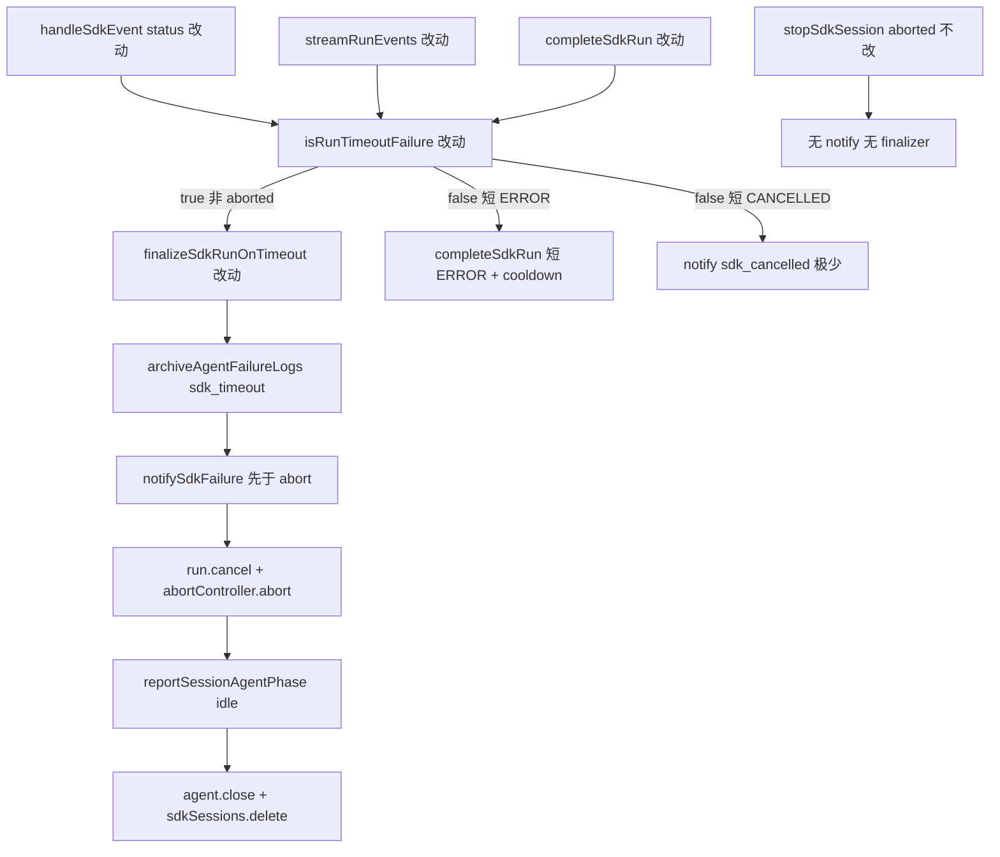

# SDK 平台取消与会话恢复 - 代码评审报告

## 1、审查范围

- **变更类型**：apply 产出未提交变更（T1–T4 done，stage=applied）
- **评审等级**：focused-review（单端 Electron SDK 局部实现，无 proto/DB/跨端路径）
- **涉及文件**：`electron/finalize-sdk-run.ts`、`electron/agent-sdk.ts`、`electron/sdk-failure-messages.ts`、`electron/AGENTS.md`；KB `02-design.md` / `03-tasks.md` / 本报告
- **排除范围**：T5（`package.json` / `changelog/`）— archive 阶段执行，不纳入本次 code review 阻断
- **设计文档**：`02-design.md`（对照基准）
- **任务文档**：`03-tasks.md`（T1–T4 验收清单）
- **回归样本**：`crash_log/20260628181128`（平台 ~8min `status ERROR`，误归档 `sdk_cancelled`）
- **评审方式**：`git diff HEAD` + 关键符号定点复核 + CodeGraph `codegraph_context`（索引对 `isRunTimeoutFailure` 未命中，以 diff/源码为准）

## 2、严重（必须处理）

无（无评分 ≥90 阻断项）

## 3、警告（建议处理）

1. **W1：无 status 事件且 `run.status=cancelled` 的平台长时兜底缺口**（评分 **62**）
   - 位置：`electron/finalize-sdk-run.ts` L66–76；`electron/agent-sdk.ts` L705–712
   - 说明：`isRunTimeoutFailure` 平台长时分支要求 `lastStatus` 为 `CANCELLED/ERROR/EXPIRED` **或** `run.status === "error"`，**未**包含 `run.status === "cancelled"`。若 SDK 仅以 cancelled 终态结束、未推送 `status` 事件，则 `completeSdkRun` / `streamRunEvents` 兜底均可能返回 false，仍走普通收尾而非 finalizer。观测样本以 `status ERROR` 为主路径，风险较低。
   - 建议：`/kb-test` 场景 D 覆盖；若联调复现，在平台长时分支补 `run.status === "cancelled"` 或 `T-FIX-01`。

2. **W2：`agent-sdk.ts` 行数超项目约定**（评分 **55**，存量债务）
   - 位置：`electron/agent-sdk.ts`（**1293 行**，AGENTS 约定 ≤300 行/文件）
   - 说明：本变更挂接 diff 约 +30 行；`finalize-sdk-run.ts` 已承载 SSOT（169 行），主文件仍远超约定。
   - 建议：后续 lite 变更继续拆分，不阻断本变更。

3. **W3：20min duration 宽超时档仍保留**（评分 **58**，继承债务）
   - 位置：`electron/finalize-sdk-run.ts` L91–98
   - 说明：`run.status === "error"` + `durationMs ≥ 20min` + `isUnsafeSdkMessage` 即 true，**不要求** F3.2 的 `shell:running`。长时 Run 的通用 tool 失败仍可能误判为超时档；与归档变更 `20260628163149` W3 一致，本变更未扩大也未收紧。
   - 建议：`/kb-test` 验收 6 回归；必要时后续 T-FIX 与 F3.2 对齐 `lastTool` 约束。

4. **W4：短 EXPIRED（<7min）IM 通知依赖 `completeSdkRun` error 分支**（评分 **52**）
   - 位置：`electron/agent-sdk.ts` L816–830
   - 说明：收紧后短 `EXPIRED` 不在 `handleSdkEvent` 即时 finalizer/notify；若 Run 终态非 `error`，`completeSdkRun` 可能仅打 INFO 日志而不 notify。路径极少，与 02 S5c「短 ERROR 走 completeSdkRun」对称。
   - 建议：联调若发现短 EXPIRED 静默，补 notify 或记 accepted_debt。

5. **W5：01 验收 1–3 / 5–6 端到端**（评分 **—**，测试门禁）
   - 说明：静态 diff 与 02/03 对齐；平台长时文案、会话可继续、用户 Stop 无回归须 `/kb-test` 手工或自动化收口。
   - 建议：`/kb-test` 必做后再 archive。

**Ponytail 精简轴**：复用 finalizer 链 + notify 顺序 reorder + 常量阈值；无新模块/依赖/事件总线。**Lean already. Ship to test.**

## 4、设计偏差

| 项 | 设计 | 实现 | 判定 |
|----|------|------|------|
| `PLATFORM_RUN_LIMIT_MS = 7min` | 02 §5 常量 | `finalize-sdk-run.ts` L12–13 export | **一致** |
| 移除 ERROR/EXPIRED 无条件 true（R2） | 02 S5c / T1 | L66–76 平台长时门控 + F3.2/20min 保留 | **一致** — 闭合归档 R2 |
| finalizer 先 notify 再 abort（F3/S5e） | 02 §6 步骤 2 | L139–153 先 `archiveAgentFailureLogs` + `notifySdkFailure`，再 cancel/abort | **一致** |
| 非长驻超时 close+delete（R1） | 02 S9 | L161–167 统一 `agent.close()` + `sdkSessions.delete`（不再仅 resident） | **一致** — 闭合归档 R1 |
| `handleSdkEvent` CANCELLED 门控 | 02 S5 | L821–829 `isRunTimeoutFailure` → finalizer；短 CANCELLED 极少 `sdk_cancelled` | **一致** |
| `completeSdkRun` cancelled 兜底 | 02 S5d | L705–712 | **一致** |
| `streamRunEvents` cancelled 兜底 | 02 §6 步骤 6 | L672–677 扩展 `cancelled` | **一致** |
| `formatUserSdkFailureMessage` 超时优先 | 02 S7 | L102–105 `isTimeoutFailure` 先于 CANCELLED 固定句 | **一致** |
| `notifySdkFailure` ignoreAborted | 02 二选一 | 采用 reorder，**未**增 `ignoreAborted` 参数 | **可接受** — diff 更小 |
| AGENTS.md SSOT | 03 T4 | 平台长时、`PLATFORM_RUN_LIMIT_MS`、notify 顺序、R2/R1 已更新 | **一致** |
| cancelled-only 终态无 status | 02 未显式 | 平台长时分支未含 `run.status===cancelled` | **轻微缺口** — W1 |

无阻断性设计偏离；W1/W4 为边界路径，非方案推翻。

## 5、验收标准检查

### T1（finalize-sdk-run.ts）

| 验收项 | 状态 | 说明 |
|--------|------|------|
| 短 ERROR（<7min、非 F3.2）返回 false | ✅ | 移除 L56–57 宽判定；须 duration≥7min 或 F3.2/20min |
| 平台长时（≥7min、非 aborted）CANCELLED/ERROR/EXPIRED 返回 true | ✅ | L66–76 |
| finalizer notify 先于 abort | ✅ | L139–153 |
| 归档 `failureType=sdk_timeout` | ✅ | L140–145；`failureArchiveDone` 防 notify 内重复归档 |
| 非长驻 finalizer 后 session/agent 清理 | ✅ | L161–167 统一 close+delete |
| aborted 返回 false | ✅ | L59–60 |
| Ponytail | ✅ | 单文件 169 行，无新依赖 |

### T2（agent-sdk.ts 挂接）

| 验收项 | 状态 | 说明 |
|--------|------|------|
| 平台长时 CANCELLED 走 finalizer，非「任务已取消」 | ✅ | `handleSdkEvent` + `formatUserSdkFailureMessage` 超时优先 |
| 同会话可继续（核心） | ⏳ | 静态：idle + delete + launch 重建链完整；**待 `/kb-test`** |
| 平台长时 IM 一条超时提示 | ⏳ | 静态：notify 先于 abort；**待 `/kb-test`** |
| 用户 Stop 无 notify/归档 | ✅ | `aborted` 门控 + `isRunTimeoutFailure` false |
| 短 ERROR 走 completeSdkRun + cooldown | ✅ | `handleSdkEvent` 短 ERROR 不 finalizer；L735–737 |
| stream/complete 兜底场景 D | ⚠️ | ERROR/cancelled 路径已挂；无 status 且仅 cancelled 终态见 W1 |
| Ponytail | ✅ | 无 ignoreAborted 等新抽象 |

### T3（sdk-failure-messages.ts）

| 验收项 | 状态 | 说明 |
|--------|------|------|
| `isTimeoutFailure=true` + CANCELLED 非取消句 | ✅ | L102–105 |
| 超时文案含等待超时 + 可重发 | ✅ | `formatTimeoutFailureMessage` L87–93 |
| 短 CANCELLED 仍返回取消句 | ✅ | L107 |
| 非超时 ERROR 无回归 | ✅ | 上下文/通用分支未改 |

### T4（electron/AGENTS.md）

| 验收项 | 状态 | 说明 |
|--------|------|------|
| 平台长时 / PLATFORM_RUN_LIMIT_MS / sdk_timeout 边界 | ✅ | diff 与代码一致 |
| 无「CANCELLED 独立取消 notify / 不改 finalizer」过时句 | ✅ | 已移除/修正 |
| 02·十·（一）必须更新项 | ✅ | T4 闭合 |

### `01-proposal.md` 七条验收

| # | 条件 | 状态 |
|---|------|------|
| 1 | 平台长时 IM 超时文案，非「任务已取消」 | ⏳ 静态 ✅；**待 `/kb-test` 复现 ~7–8min** |
| 2 | 结束后同会话新 Run 正常 | ⏳ **待 `/kb-test`** |
| 3 | 长驻可继续，无需 Reset | ⏳ **待 `/kb-test`** |
| 4 | 超时类通知可达、一条、无 stack | ✅ 静态（notify 顺序 + `formatUserSdkFailureMessage`） |
| 5 | 用户 Stop 无回归 | ⏳ 静态门控 ✅；**待 `/kb-test`** |
| 6 | 非超时失败无回归 | ⏳ 静态 R2 收紧 ✅；**待 `/kb-test`** |
| 7 | patch bump + changelog | ⏳ T5 archive 阶段，非 T1–T4 范围 |

### `crash_log/20260628181128` 回归对照

| 观测 | 现网（变更前） | 本变更预期 |
|------|----------------|------------|
| ~8min 后 `[status] ERROR` | 可能 `sdk_cancelled` +「任务已取消」 | `isRunTimeoutFailure` true → `sdk_timeout` + 超时 IM |
| `runStatus=cancelled` | 与 ERROR status 并存时误判取消语义 | `lastStatus=ERROR` + duration≥7min → 超时路径 |
| 会话恢复 | 残留阻塞下一条 | finalizer close+delete → launch 重建 |

## 6、调用链与回归风险

| 回归点 | 风险 | 说明 |
|--------|------|------|
| **crash_log 平台 ~8min ERROR** | 低 | 本变更主修复路径；归档应对齐 `sdk_timeout` |
| 平台长时 CANCELLED + duration≥7min | 低 | finalizer + 超时文案 |
| 用户主动 Stop | 低 | `aborted` 全路径门控 |
| 短 ERROR / 工具失败 | 低 | R2 收紧；cooldown 保留 |
| 场景 D IM 不可达 | 低 | notify 先于 abort 修复 F3 |
| 非长驻 `SDK_RESIDENT_AGENT=0` | 低 | R1 已统一 close+delete |
| 无 status + cancelled 终态 | 中 | W1；待联调 |
| 20min 宽超时误判 | 中 | W3 继承；验收 6 关注 |
| Daemon / 飞书流式 | 无 | 本变更无相关 diff |

## 7、遗留债务

1. **W1** cancelled-only 终态无 status（62）— `/kb-test` 或 `T-FIX-01`。
2. **W2** `agent-sdk.ts` 1293 行 — 存量超 300 行约定。
3. **W3** 20min duration 宽超时档 — 继承自 `20260628163149` W3。
4. **W4** 短 EXPIRED IM — 极少路径，accepted_debt 候选。
5. **W5** 01 验收 1–3 / 5–6 端到端 — `/kb-test` 收口。
6. **T5** changelog / patch bump — archive 阶段。
7. **已闭合（本变更）**：归档 `20260628163149` **R1**（非 resident 超时清理）、**R2**（ERROR/EXPIRED 宽判定）。

## 8、修复任务建议

| 问题 ID | 建议动作 | 关联 | 阻断 archive |
|---------|----------|------|--------------|
| W1 | 平台长时分支补 `run.status === "cancelled"` | T-FIX-01（若联调复现） | 否 |
| W3 | 联调后可选与 F3.2 对齐 lastTool | T-FIX-02（待定） | 否 |
| W4 | 短 EXPIRED notify 补全 | accepted_debt | 否 |
| W5 | **场景 A/B/D + 验收 5/6** | `/kb-test` 必做 | 测试门禁 |
| — | patch + changelog | T5 `/kb-archive` | 验收 7 |

## 9、结论

**通过（有条件）**，`stage=reviewed`，可进入 `/kb-test`。

T1–T4 与 `02-design.md`、`03-tasks.md` 一致：平台长时 SSOT（`PLATFORM_RUN_LIMIT_MS`）、R2 收紧、finalizer **先 notify 再 abort**（修复 F3/场景 D）、R1 非长驻统一清理、文案超时优先于 CANCELLED、`handleSdkEvent`/`completeSdkRun`/`streamRunEvents` 三层挂接与 AGENTS 同步。`crash_log/20260628181128` 主路径（~8min `status ERROR`）静态上应对齐 `sdk_timeout` + 超时 IM，不再误走 `sdk_cancelled`。

无评分 ≥90 的 open 阻断项；W1（62）、W3（58）记入 §3 警告，**不阻断**进入测试。T5（验收 7）留 `/kb-archive`；**须 `/kb-test` 通过后再 archive**。

### 重点核对摘要

| 核对项 | 结论 |
|--------|------|
| F1 平台结束 vs 用户取消文案 | ✅ 静态 |
| F2 平台长时超时收尾 + 会话恢复 | ⏳ 待 `/kb-test` |
| F3 IM 通知可达 | ✅ 静态（notify 顺序） |
| F4 非超时不误触 finalizer | ✅ 静态（R2 收紧） |
| F5 发布物 | ⏳ T5 archive |
| crash_log/20260628181128 回归 | ✅ 静态对齐 |
| 归档 R1/R2 闭合 | ✅ |
| Ponytail / 最小 diff | ✅ |
