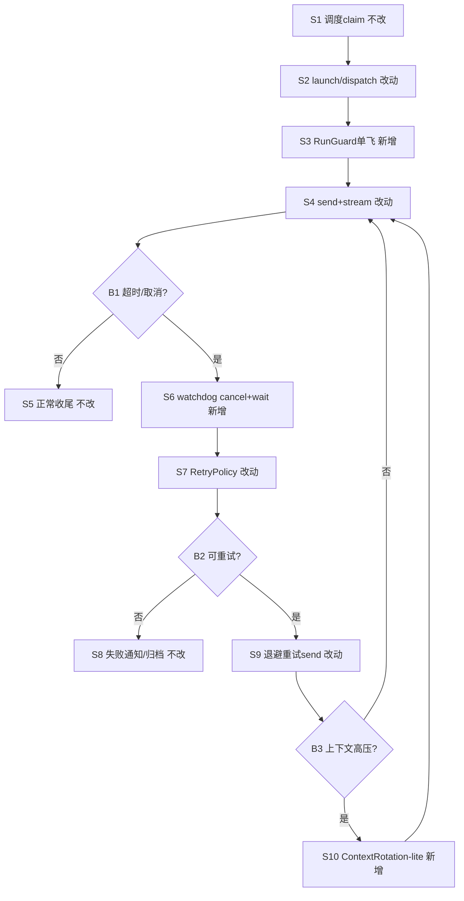

# 多轮调度超上下文与超时取消降故障 - 实现设计

> 业务依据：`01-proposal.md`；仅做 v1.8.8 增量。

## 一、业务流程与改动范围
### （一）业务流程图

图例：`不改/改动/新增/删除`。

### （二）流程步骤与改动对照
| 步骤 ID | 业务含义 | 改动 | 落点（模块/文件） | 01 验收关联 |
|---|---|---|---|---|
| S1 | 多轮调度触发 | 不改 | `src/daemon.ts` | §四.6 |
| S2/S4 | 启动与发送 Run | 改动 | `electron/agent-sdk.ts` | §四.1/2 |
| S3/S6 | 单飞与超时收敛 | 新增 | `electron/agent-run-guard.ts`、`electron/finalize-sdk-run.ts` | §四.1/4 |
| S7/S9 | 可重试退避 | 改动 | `electron/agent-sdk.ts`、`src/daemon.ts` | §四.2/5 |
| S10 | 高压上下文轮转 | 新增 | `electron/context-rotation-lite.ts`、`electron/agent-sdk.ts` | §四.3/5 |
| S5/S8 | 成功/失败通知 | 不改 | `electron/agent-sdk.ts` | §四.4/6 |

### （三）改动汇总
- 改动：`launchSdkAgent`、`dispatchToSdkAgent`、`completeSdkRun` 挂 RunGuard/Retry/Rotation。
- 新增：`agent-run-guard.ts`、`context-rotation-lite.ts`。
- 不改：v1.8.8 的 `finalizeSdkRunOnTimeout` 收尾顺序与失败文案框架。

## 二、整体思路
v1.8.8 已解决超时终态一致；本次补并发重入、busy 抖动、上下文累积。  
方案：RunGuard 单飞+watchdog、RetryPolicy（仅 retryable）、ContextRotation-lite；复用现有模块，不加依赖，不重构。

## 三、分层设计
- 端点层：`src/daemon.ts` 增 `agent_busy` 延后重排。
- 服务/数据层：`agent-sdk.ts` 编排，`finalize-sdk-run.ts` 收敛；session 内存扩展 `runGuardToken/retryState/rotationState`。

## 四、接口设计
新增内部函数：`acquireRunGuard`、`watchRunGuard`、`shouldRetry`、`maybeRotateContext`；外部接口不变。

## 五、数据结构
无持久化变更；仅新增 session 内存字段：`runGuardToken`、`retryState`、`rotationState`。

## 六、实现步骤
1. 新建 `agent-run-guard.ts`，完成单飞 token、watchdog、wait 终态。  
2. `agent-sdk.ts` 三入口统一 guard，并接入 RetryPolicy（仅 `retryable`，`agent_busy` 延后重试）。  
3. 新建 `context-rotation-lite.ts`，阈值触发摘要切会话/重建 agent；send 透传幂等键 `sessionKey+lastInboundId+attempt`。

## 七、参考实现
- CodeGraph `codegraph_context`：`electron/agent-sdk.ts` 命中 `launchSdkAgent`、`dispatchToSdkAgent`、`completeSdkRun`、`notifySdkFailure`。  
- CodeGraph `codegraph_explore`：`src/daemon.ts` 命中 `runAgentDispatchLoop`；`electron/finalize-sdk-run.ts` 命中 `isRunTimeoutFailure`、`finalizeSdkRunOnTimeout`。

## 八、技术影响
### （一）影响范围
- 模块：`electron/agent-sdk.ts`、`electron/finalize-sdk-run.ts`、`electron/sdk-failure-messages.ts`、`src/daemon.ts` + 新增两文件。
- 保守阈值：watchdog `5s` tick、`8min` 超时；cancel 后 wait `15s`；重试 1 次（`1200ms~8000ms`，jitter `20%`）；`agent_busy` 延后 `1500ms`；Rotation `usage>=90%` 连续 2 轮且 `5min` 冷却。
- 风险：单飞过严降吞吐；分类误判；轮转摘要丢语义。

### （二）工程补充验收项
- [ ] 同一 `sessionKey` 无并行 active run。
- [ ] `agent_busy` 不立即失败，重试后可收敛。
- [ ] `crash_log/20260628181128` 回归不再走 `sdk_cancelled` 链路。

## 九、知识库影响
- 影响：本变更目录 `03-tasks.md`、`04-review.md`、`05-summary.md`；可能影响 `electron/AGENTS.md`。索引暂不变。

## 十、知识库更新计划
### （一）必须更新
- `03-tasks.md`、`04-review.md`、`05-summary.md`（标注 v1.8.8 增量）。

### （二）可能更新（视实现结果）
- `electron/AGENTS.md`、工程平台叶子文档。

### （三）不需要更新
- `knowledge/业务域/**`。

