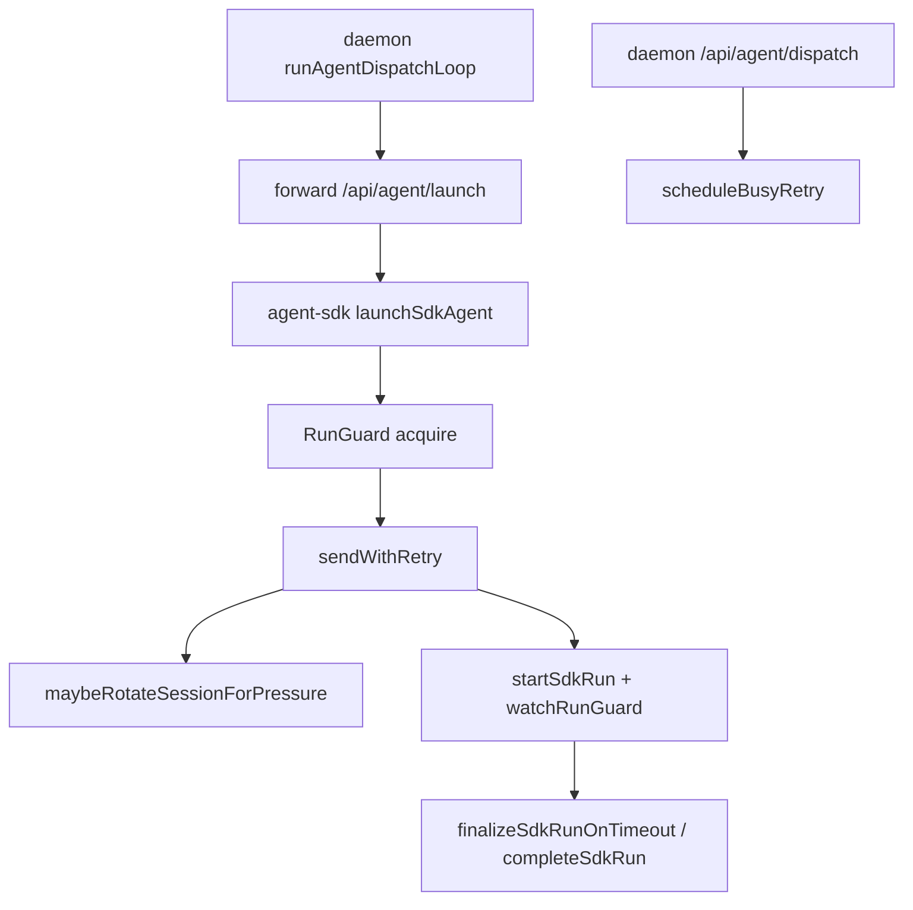

# 多轮调度超上下文与超时取消降故障 - 代码评审报告

## 1、审查范围
- **变更类型**: apply 产出的未提交变更（仅评审本提案指定 7 个代码文件）
- **评审等级**: full-review
- **涉及文件**: 7 个（`electron/agent-sdk.ts`、`electron/finalize-sdk-run.ts`、`electron/sdk-failure-messages.ts`、`src/daemon.ts`、`electron/agent-run-guard.ts`、`electron/retry-policy.ts`、`electron/context-rotation-lite.ts`）
- **设计文档**: `02-design.md`、`03-tasks.md`
- **CodeGraph 说明**: 已先执行 `codegraph_context`、`codegraph_explore` 进行调用链扫描；`codegraph_impact/search` 对本次新增符号未命中（索引未覆盖最新未提交符号），影响面由 diff + 源码交叉复核补齐

## 2、严重（必须处理）
1. **ContextRotation 重建失败后会话可能进入“假存活/真不可用”状态**
   - 位置: `electron/agent-sdk.ts`
   - AGENTS.md: "SDK 长驻 Agent（SDK_RESIDENT_AGENT）... 二次任务走 dispatchToSdkAgent"
   - 说明: `maybeRotateSessionForPressure` 先 `close()` 旧 agent 再 `Agent.create()` 新实例；若新建失败，`dispatchToSdkAgent` 的 catch 仅通知失败并释放 guard，不会重建或删除 session。该 session 之后仍可能被当作可复用长驻会话，导致后续连续 dispatch 失败，破坏“失败后下一轮可继续执行”目标。建议在 rotation 失败时保留旧 agent（延后 close）或失败后显式销毁 session 触发下一轮 launch 重建。

## 3、警告（建议处理）
1. **agent_busy 延后重排未覆盖 orchestrator 主调度 launch 路径**
   - 位置: `src/daemon.ts`
   - 说明: 当前 `scheduleBusyRetry` 仅挂在 `/api/agent/dispatch` HTTP 分支；而主循环 `dispatchSessionToAgent` 走 `/api/agent/launch`，launch 返回 busy 时仍按普通失败处理并 ack，当次消息可能被提前确认，未体现“busy 延后重排”的一致策略。建议在 orchestrator launch 失败分支也复用 `parseBusyRetryDelayMs + scheduleBusyRetry`。

## 4、设计偏差
1. **T2 的 busy 重排能力落点偏窄**
   - 设计预期: `02-design.md` 中 S7/S9 要求 busy 从“立即失败”改为“延后重排”。
   - 实际实现: 仅在 daemon 的 `/api/agent/dispatch` 分支执行 busy 重排，`dispatchSessionToAgent -> /api/agent/launch` 分支未统一。
   - 影响: 多轮主链路在特定并发窗口仍可能立即失败并中断节奏。

## 5、验收标准检查
| 任务 | 验收条件 | 状态 |
|------|---------|------|
| T1 | 同 session 单飞、watchdog 与 timeout 收敛主路径已接入 | ✅ |
| T1 | 新增模块保持轻量、无新依赖 | ✅ |
| T2 | retryable 退避 + busy 分类实现 | ✅ |
| T2 | busy 场景“不立即失败，延后继续推进” | ❌ 未完全满足（主 launch 链路未覆盖） |
| T3 | usage>=90% + 连续命中 + 冷却轮转实现 | ✅ |
| T3 | 轮转/重试幂等键避免重复 run | ✅（键策略已接入） |
| T3 | 轮转异常下会话可持续性 | ❌ 未满足（见严重问题） |
| T4 | crash_log/20260628181128 回归结果 | ⚠ 本次未纳入评审范围 |
| T5 | version/changelog 收尾 | ⚠ 本次未纳入评审范围 |

## 6、调用链与回归风险

- 回归风险 1: rotation 重建失败后 session 生命周期与 resident 复用语义冲突，可能造成连续轮次假成功/真失败。
- 回归风险 2: busy 重排策略在不同入口不一致，可能出现同类错误在主链路仍立即失败。

## 7、遗留债务
1. `electron/agent-sdk.ts` 持续增大（超 300 行规范），本次新增 RunGuard/Retry/Rotation 逻辑后复杂度继续上升；建议后续拆分 `sendWithRetry + rotation` 与 run lifecycle 协调层，降低并发状态耦合。
2. CodeGraph 索引未覆盖本次新增符号，建议在进入 review 前刷新索引，避免 impact 分析盲区。

## 8、修复任务建议
| 问题 ID | 建议动作 | 关联任务 |
|---------|----------|----------|
| R1 | 调整 rotation 顺序为“先建新 agent 成功再切换并关闭旧 agent”，或失败时强制销毁 session 触发下轮 launch 重建 | T-FIX-01 |
| R2 | 在 `dispatchSessionToAgent` 的 launch 失败分支补 `agent_busy` 解析与延后重排，避免直接 ack/终止 | T-FIX-02 |

## 9、结论
**未通过**，需修复后再归档。当前存在 2 个阻断问题（R1 严重、R2 警告），暂不建议进入 `/kb-archive`。

### 复评结论（R1/R2）
- 复评范围：`electron/agent-sdk.ts`、`src/daemon.ts` 及 RunGuard/Retry/Rotation 关联模块。
- R1 结果：**通过**。`maybeRotateSessionForPressure` 已改为“先 `Agent.create` 新实例，成功后再切换并 best-effort 关闭旧实例”；新建失败分支显式保留旧 `session.agent/session.agentId` 并继续发送，不会破坏当前 session 可用性。
- R2 结果：**通过**。`dispatchSessionToAgent` 的 launch 失败分支已复用 `parseBusyRetryDelayMs + scheduleBusyRetry`，在 `agent_busy` 时直接延后重排并返回，不执行失败 notify/ack；与 `/api/agent/dispatch` 分支 busy 策略对齐。
- 本次复评判定：R1/R2 闭环成立，阻断项清零，可进入归档前置阶段（仍需按 T5 完成版本/changelog 收尾）。

### 剩余风险（非阻断）
1. **CodeGraph 索引时效风险**：本轮 `codegraph_search` 对新增符号未命中，复评结论依赖 `CodeGraph context + 源码直读` 交叉核验；建议归档前刷新索引再做一次 impact 扫描。
2. **策略覆盖边界风险**：`agent_busy` 延后重排当前已覆盖 orchestrator launch 主链路与 `/api/agent/dispatch` 分支；若后续新增直调 `/api/agent/launch` 的调用方，需同步接入同策略以避免语义分叉。

