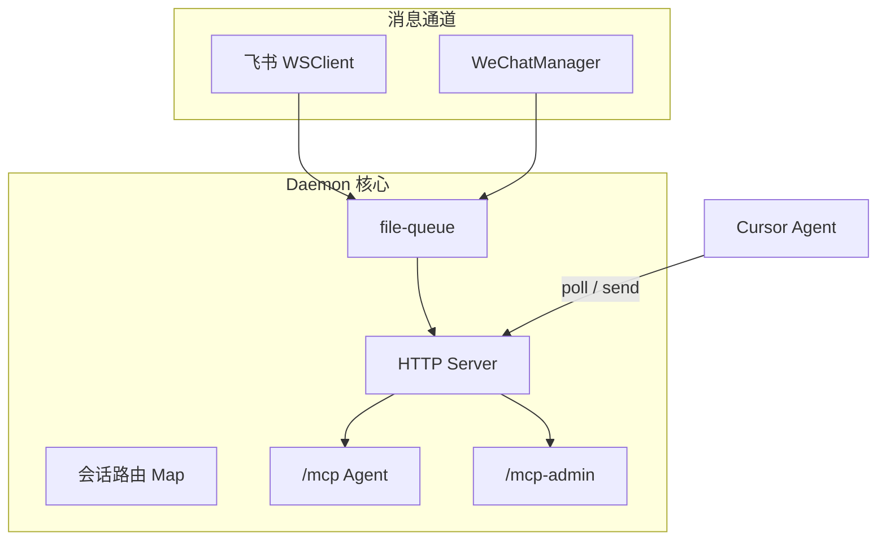
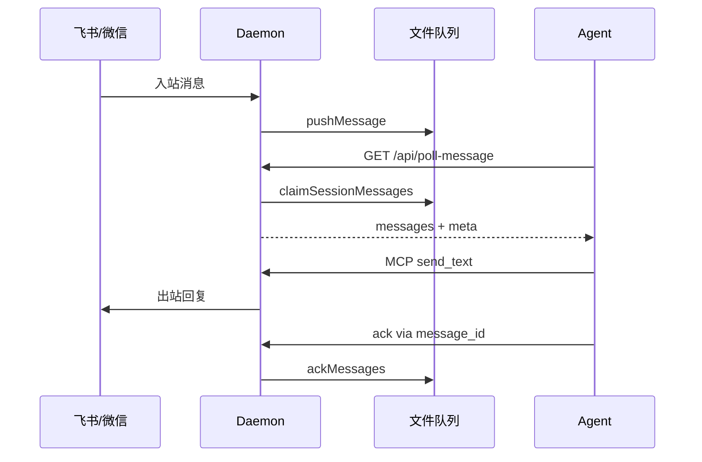

# Daemon 守护进程 · 概览

## 一、模块定位与边界

Daemon 是本机常驻进程，连接飞书 WebSocket 与微信 iLink，维护文件消息队列，暴露 HTTP API 与 StreamableHTTP MCP，供 Cursor Agent 拉取消息（poll-message）与发送回复（send_text 等）。配置由 Electron 经环境变量注入；UI 经 HTTP 查询状态。

## 二、整体架构



## 三、核心状态机/主流程



## 四、子模块清单

| 子模块 | 职责 | 文档 |
|---|---|---|
| HTTP 与 MCP 服务 | REST、MCP 工具、管理 API | [02-HTTP与MCP服务.md](./02-HTTP与MCP服务.md) |
| 进程模型与部署 | spawn、端口、锁文件、日志 | [03-进程模型与部署.md](./03-进程模型与部署.md) |

## 五、关键约束

- 启动时 `CLAW_CHANNELS_JSON` 非空，否则 `process.exit(1)`（`src/daemon.ts`）。
- HTTP 仅绑定 `127.0.0.1`；配置端口占用时回退随机端口。
- poll-message **必须**带 `sessionKey`，防止跨会话误领。
- 代理环境变量在启动时 strip，避免影响本机回环通信。

## 六、术语表

| 术语 | 含义 |
|---|---|
| chatKey | `{channelId}:{rawChatId}`，多通道路由前缀 |
| sessionKey | `{chatKey}::{workspaceDir}`，Agent 会话粒度 |
| lock 文件 | `daemon.lock.json`，含 pid/port/version |
| .fcmd | 飞书/微信斜杠指令的文件队列 |

## 七、依赖关系

```mermaid
flowchart LR
  Electron -->|spawn + env| Daemon
  Daemon --> LarkSDK[@larksuiteoapi]
  Daemon --> MCP_SDK[@modelcontextprotocol/sdk]
  Daemon --> FileQueue[src/file-queue.js]
  AdminMCP[manage_* 工具] -->|HTTP| Daemon
```

## 八、全局非功能与可观测

- 日志：`{APP_DATA_DIR}/daemon.log`，超 2MB 轮转（`src/daemon.ts`）。
- 未捕获异常只记录不退出，避免通道整体掉线。
- MCP 连接数参与 agentRunning 推断。

## 九、全局已知限制

- 指令执行依赖 Electron 侧 Agent 拉取 `.fcmd` 并回传 `/cmd/result`。
- 微信首条私聊用于 context 绑定，默认不入队。

## 十、文档入口

1. [03-进程模型与部署.md](./03-进程模型与部署.md)
2. [02-HTTP与MCP服务.md](./02-HTTP与MCP服务.md)

## 十一、变更记录

- 2026-06-27：kb-sync 初始建立
